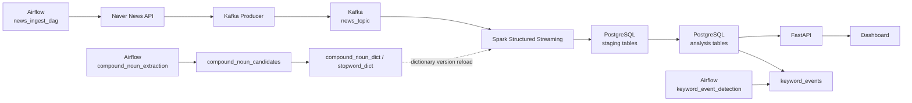

# News Trend Pipeline

도메인별 뉴스 키워드를 수집하고, Kafka-Spark-PostgreSQL 파이프라인으로 처리한 뒤 FastAPI와 Dashboard로 조회하는 뉴스 트렌드 분석 프로젝트입니다.

현재 구현은 다음 범위를 포함합니다.

- Airflow 기반 수집 오케스트레이션
- Naver News API 수집과 Kafka 적재
- Spark Structured Streaming 기반 기사 전처리와 키워드 집계
- PostgreSQL staging + upsert 기반 저장 계층
- 복합명사/불용어 사전 관리와 후보 추천
- 이벤트 탐지 배치
- FastAPI 조회/관리 API
- React + Vite Dashboard

`README_REFACTOR.md`는 중간 정리 초안으로 남아 있으며, 현재 기준 문서는 이 `README.md`와 `docs/design/*`입니다.

## 전체 구조



## 단계별 구성

| 단계 | 현재 상태 | 설명 |
| --- | --- | --- |
| STEP1 Ingestion | 구현 완료 | `query_keywords` 기반 수집, Kafka 발행, dead letter replay |
| STEP2 Processing | 구현 완료 | Spark 스트리밍, 전처리, 키워드/트렌드/연관어 집계 |
| STEP3 Storage | 구현 완료 | PostgreSQL 스키마, staging upsert, 재처리 유틸 |
| STEP4 Analytics | 구현 완료 | `keyword_events` 기반 이벤트 탐지 배치 |
| STEP5 Serving | 구현 완료 | FastAPI API, Dashboard, 사전/검색어 관리 기능 |
| STEP6 Monitoring | 부분 반영 | Health API, Airflow UI, Spark UI, 운영 지표 조회 |

## 핵심 데이터 흐름

### 1. 수집

1. Airflow `news_ingest_dag`가 주기적으로 실행됩니다.
2. 활성화된 검색어를 `query_keywords`에서 읽습니다.
3. Naver News API를 호출해 기사를 수집합니다.
4. `provider + domain + url` 기준으로 중복을 제어합니다.
5. Kafka `news_topic`에 기사 메시지를 발행합니다.
6. 실패 건은 `runtime/state/dead_letter.jsonl`에 기록하고 `auto_replay_dag`가 재처리합니다.

### 2. 처리

1. Spark가 Kafka 메시지를 읽습니다.
2. `title + summary`를 기반으로 `tokenize(text, domain)`를 수행합니다.
3. 복합명사 사전과 불용어 사전을 적용합니다.
4. `keywords`, `keyword_trends`, `keyword_relations`를 계산합니다.
5. 결과를 `stg_*` 테이블에 적재한 뒤 DB upsert 함수로 반영합니다.

### 3. 분석과 서빙

1. Airflow `keyword_event_detection` DAG가 `keyword_trends`를 기반으로 이벤트를 계산합니다.
2. 결과는 `keyword_events`에 저장됩니다.
3. FastAPI가 대시보드 조회 API와 사전/검색어 관리 API를 제공합니다.
4. React Dashboard가 API를 호출해 KPI, 트렌드, 급상승 키워드, 연관어, 기사 목록을 표시합니다.

## 주요 테이블

| 분류 | 테이블 |
| --- | --- |
| 기준 데이터 | `domain_catalog`, `query_keywords`, `query_keyword_audit_logs` |
| 기사/분석 데이터 | `news_raw`, `keywords`, `keyword_trends`, `keyword_relations`, `keyword_events` |
| 사전 데이터 | `compound_noun_dict`, `compound_noun_candidates`, `stopword_dict`, `stopword_candidates`, `dictionary_versions`, `dictionary_audit_logs` |
| 운영 데이터 | `collection_metrics` |
| staging | `stg_news_raw`, `stg_keywords`, `stg_keyword_trends`, `stg_keyword_relations` |

자세한 ERD와 단계 문서는 `docs/design` 아래에 정리되어 있습니다.

## 주요 서비스와 포트

| 서비스 | 포트 | 설명 |
| --- | --- | --- |
| Dashboard | `3000` | React + Vite 개발 서버 |
| FastAPI | `8000` | 조회/관리 API |
| Airflow UI/API | `9080` | DAG 실행과 운영 확인 |
| Spark Master UI | `8080` | Spark 클러스터 상태 |
| Spark History UI | `18080` | Spark 실행 이력 |
| Kafka | `9092` | 로컬 접근용 Kafka 브로커 |
| App PostgreSQL | `5432` | 애플리케이션 DB |

## 디렉터리 구조

```text
news-trend-pipeline-v2/
├─ airflow/
│  └─ dags/                  # news_ingest_dag, auto_replay_dag, compound_noun_extraction, keyword_event_detection
├─ docs/
│  ├─ design/                # 최종 구현 기준 설계 문서
│  └─ develop/               # 설계 변경 이력 / 운영 메모
├─ infra/                    # Airflow, Spark, API Dockerfile과 설정
├─ runtime/
│  ├─ checkpoints/           # Spark checkpoint
│  ├─ logs/                  # Airflow 로그
│  ├─ spark-events/          # Spark event log
│  └─ state/                 # dead letter, replay 상태
├─ scripts/
│  ├─ consumer_check.py
│  └─ run_processing.py
├─ src/
│  ├─ analytics/             # compound extractor, stopword recommender, event detector
│  ├─ api/                   # FastAPI app, schema, service
│  ├─ core/                  # config, schema, domain definition
│  ├─ dashboard/             # React + Vite dashboard
│  ├─ ingestion/             # API client, producer, replay
│  ├─ processing/            # Spark job, preprocessing
│  └─ storage/               # models.sql, db.py
├─ tests/
├─ docker-compose.yml
├─ README.md
└─ README_REFACTOR.md
```

## runtime/state 파일

`runtime/state`는 수집 체크포인트와 Kafka 발행 실패 재처리 상태를 저장하는 로컬 상태 디렉터리입니다. Docker Compose에서는 Airflow 컨테이너의 `/opt/news-trend-pipeline/runtime/state`로 마운트됩니다.

| 파일 | 생성/갱신 주체 | 설명 |
| --- | --- | --- |
| `.gitkeep` | 저장소 | 빈 디렉터리를 Git에 유지하기 위한 파일입니다. |
| `producer_state.json` | `ingestion.producer` | Naver 키워드별 마지막 수집 기준 시각과 최근 발행 URL 캐시를 저장합니다. 전체 호출 이력이 아니라 증분 수집 체크포인트와 중복 발행 방지용 상태입니다. |
| `producer_state.lock` | `ingestion.producer` | 수집 producer가 동시에 실행될 때 `producer_state.json` 경합을 막기 위한 lock 파일입니다. |
| `dead_letter.jsonl` | `ingestion.producer`, `ingestion.replay` | Kafka 발행 실패, validation 실패, Kafka producer 초기화 실패 등 재시도 가능한 메시지를 한 줄 JSON 형식으로 저장합니다. `auto_replay_dag`가 이 파일을 읽어 재발행합니다. |
| `dead_letter_replayed.jsonl` | `ingestion.replay` | Dead Letter 재전송에 성공한 레코드를 누적 기록합니다. 감사와 운영 확인용 이력이며, 재처리 대상 파일은 아닙니다. |
| `dead_letter_permanent.jsonl` | `ingestion.replay` | payload 오류나 최대 재시도 횟수 초과 등 자동 재처리가 어려운 영구 실패 메시지를 저장합니다. 수동 확인과 원인 조치가 필요합니다. |

Dead Letter 처리 흐름은 다음과 같습니다.

```text
Kafka 발행 실패
-> dead_letter.jsonl append
-> auto_replay_dag / python -m ingestion.replay
   ├─ 재전송 성공 -> dead_letter_replayed.jsonl append
   ├─ 재전송 실패 -> dead_letter.jsonl에 남겨 다음 실행에서 재시도
   └─ 재시도 초과 또는 payload 오류 -> dead_letter_permanent.jsonl append
```

`dead_letter.jsonl`은 재처리 실행 후 남은 재시도 대상만 다시 쓰입니다. `dead_letter_replayed.jsonl`과 `dead_letter_permanent.jsonl`은 누적 이력이므로 크기가 커질 수 있습니다.

## 빠른 시작

### 1. 환경 변수 준비

```powershell
Copy-Item .env.example .env
```

최소한 다음 값은 채워야 합니다.

- `NAVER_CLIENT_ID`
- `NAVER_CLIENT_SECRET`

자주 쓰는 설정은 다음과 같습니다.

- `KAFKA_BOOTSTRAP_SERVERS`
- `KAFKA_TOPIC`
- `POSTGRES_DB`
- `POSTGRES_USER`
- `POSTGRES_PASSWORD`
- `SPARK_CHECKPOINT_DIR`
- `KEYWORD_WINDOW_DURATION`
- `RELATION_KEYWORD_LIMIT`
- `DICTIONARY_REFRESH_INTERVAL_SECONDS`

### 2. 전체 스택 실행

```powershell
docker compose up --build -d
```

실행 후 확인 포인트:

- Dashboard: `http://localhost:3000`
- FastAPI: `http://localhost:8000/health`
- Airflow: `http://localhost:9080`
- Spark Master UI: `http://localhost:8080`
- Spark History UI: `http://localhost:18080`

### 3. 로컬 스크립트 실행 예시

```bash
pip install -e .
python scripts/consumer_check.py --max-messages 5
python scripts/run_processing.py
```

수집 producer를 직접 실행하려면:

```bash
python -m ingestion.producer
```

dead letter replay를 직접 실행하려면:

```bash
python -m ingestion.replay
```

## 제공 API 범위

현재 FastAPI는 다음 범위를 제공합니다.

- 대시보드 필터, KPI, 상위 키워드, 트렌드, 급상승 이벤트, 연관어, 기사 목록
- 시스템 상태 조회
- 사전 조회/등록/삭제/도메인 변경
- 복합명사 후보 승인/반려
- 불용어 후보 승인/반려
- 검색어 관리와 수집 메트릭 조회
- 관리자용 추천/자동승인 트리거

기본 health check:

```text
GET /health
GET /api/v1/meta/filters
GET /api/v1/dashboard/overview-window
GET /api/v1/dashboard/system
```

## 문서

### 설계 문서

- `docs/design/ERD.md`
- `docs/design/STEP1_INGESTION.md`
- `docs/design/STEP1-1_AIRFLOW.md`
- `docs/design/STEP1-2_KAFKA.md`
- `docs/design/STEP2_PROCESSING.md`
- `docs/design/STEP2-1_SPARK.md`
- `docs/design/STEP2-2_PREPROCESSING.md`
- `docs/design/STEP2-3_DICTIONARY.md`
- `docs/design/STEP3_STORAGE.md`
- `docs/design/STEP3-1_DATABASE.md`
- `docs/design/STEP4_ANALYTICS.md`
- `docs/design/STEP4-1_EVENT.md`
- `docs/design/STEP5_SERVING.md`
- `docs/design/STEP5-1_FastAPI_구현.md`
- `docs/design/STEP5-1_추가기능구현.md`
- `docs/design/STEP5-2_DASHBOARD.md`
- `docs/design/STEP6_MONITORING.md`

### 변경 이력 / 개발 문서

- `docs/develop/STEP1_DIRECTION_CHANGE_history.md`
- `docs/develop/STEP1_INGESTION_history.md`
- `docs/develop/STEP2_PROCESSING_history.md`
- `docs/develop/STEP3_STORAGE_history.md`
- `docs/develop/STEP1_RECOVERY.md`
- `docs/develop/FULL_RESET_AND_REBOOTSTRAP_GUIDE.md`
- `docs/develop/FINAL_PRODUCTION_IMAGE_TRANSITION_CHECKLIST.md`

## 현재 기준 메모

- 수집 provider는 현재 `naver` 기준입니다.
- 검색어는 코드 하드코딩이 아니라 `query_keywords` 테이블 기준으로 관리됩니다.
- Spark 전처리는 Kiwi와 DB 사전을 함께 사용합니다.
- `docs/design`에는 최종 구현만 기록하고, 변경 과정은 `docs/develop`에 기록합니다.
