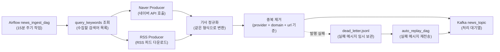
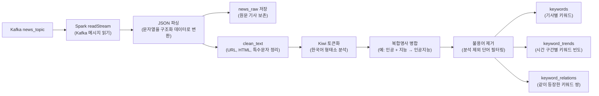
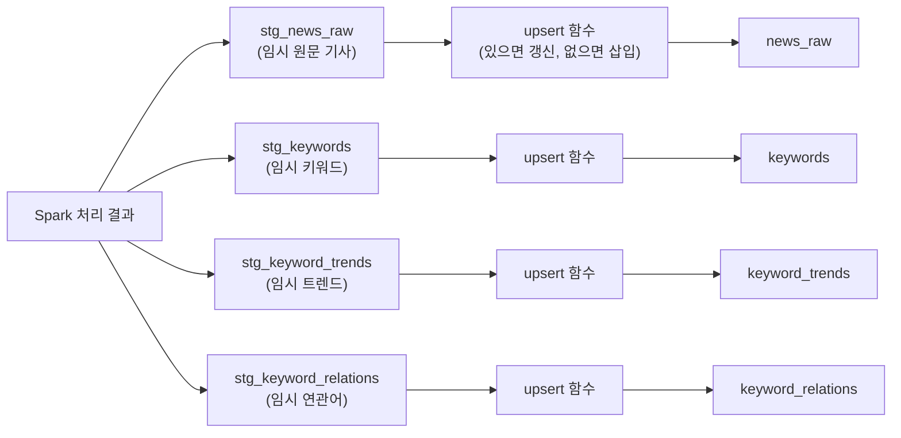
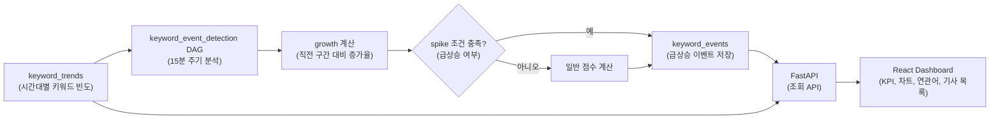

# News Trend Pipeline v2

도메인별 뉴스 데이터를 수집하고, 한국어 키워드와 연관어를 분석해 실시간에 가까운 트렌드 대시보드로 제공하는 데이터 파이프라인입니다.

Kafka(메시지 큐, 데이터를 잠시 쌓아두는 버퍼), Spark Structured Streaming(작은 묶음 단위의 실시간 처리), PostgreSQL(관계형 데이터베이스), FastAPI(API 서버), React Dashboard(웹 화면)를 하나의 Docker Compose(여러 컨테이너를 함께 실행하는 도구) 환경으로 구성합니다.

---

## 목차

1. [프로젝트 개요 및 목적](#프로젝트-개요-및-목적)
2. [전체 아키텍처](#전체-아키텍처)
3. [파이프라인 구조](#파이프라인-구조)
4. [설치 및 실행 방법](#설치-및-실행-방법)
5. [컴포넌트 설명](#컴포넌트-설명)
6. [주요 데이터 모델](#주요-데이터-모델)
7. [기술적 의사 결정 근거](#기술적-의사-결정-근거)
8. [운영 및 튜닝 메모](#운영-및-튜닝-메모)
9. [문서 안내](#문서-안내)

---

## 프로젝트 개요 및 목적

이 프로젝트의 목적은 단순히 뉴스 기사를 많이 모으는 것이 아니라, **분야별로 어떤 키워드가 갑자기 주목받는지**를 빠르게 파악하는 것입니다.

예를 들어 `반도체`, `인공지능`, `금리`, `총선` 같은 단어가 특정 도메인에서 얼마나 자주 등장하는지, 이전 시간대보다 얼마나 증가했는지, 함께 언급되는 연관어가 무엇인지 분석합니다.

### 해결하려는 문제

- 단일 검색어 기반 수집은 특정 분야의 맥락을 놓치기 쉽습니다.
- 한국어 뉴스는 형태소 분석(문장을 의미 단위로 나누는 작업) 품질에 따라 키워드 결과가 크게 달라집니다.
- 트렌드 분석은 늦게 도착한 기사, 중복 기사, 수집 실패, 재처리 상황을 고려해야 합니다.
- 운영자가 검색어, 복합명사, 불용어(분석에서 제외할 단어)를 직접 관리할 수 있어야 합니다.
- 대시보드는 차트 이동과 확대를 빠르게 처리해야 하므로 API 호출을 줄이는 구조가 필요합니다.

### 현재 구현 범위

| 단계 | 상태 | 설명 |
| --- | --- | --- |
| STEP1 Ingestion | 완료 | Naver News API와 RSS 수집, Kafka 발행, dead letter(실패 메시지 보관) 재처리 |
| STEP2 Processing | 완료 | Spark Streaming, Kiwi 한국어 토큰화, 키워드/트렌드/연관어 집계 |
| STEP3 Storage | 완료 | PostgreSQL 스키마, staging upsert(임시 적재 후 반영), 재처리 함수 |
| STEP4 Analytics | 완료 | 급상승 키워드 이벤트 탐지 |
| STEP5 Serving | 완료 | FastAPI와 React Dashboard |
| STEP6 Monitoring | 부분 완료 | Health API, Airflow/Spark UI, 수집 지표, 운영 로그 |

---

## 전체 아키텍처

### 한눈에 보는 전체 흐름

```mermaid
flowchart LR
    subgraph S1["1. 수집(Ingestion, 외부 데이터를 가져오는 단계)"]
        A["Airflow<br/>(작업 스케줄러)"]
        B["Naver News API<br/>(네이버 뉴스 검색 API)"]
        C["RSS Feeds<br/>(언론사 뉴스 피드)"]
        D["Producer<br/>(수집 결과를 메시지로 변환)"]
    end

    subgraph S2["2. 메시지 버퍼"]
        K["Kafka news_topic<br/>(메시지 큐, 처리 전 대기열)"]
    end

    subgraph S3["3. 스트리밍 처리"]
        SP["Spark Structured Streaming<br/>(작은 묶음 단위의 실시간 처리)"]
        PP["전처리와 토큰화<br/>(문장 정리 + Kiwi 형태소 분석)"]
    end

    subgraph S4["4. 저장"]
        STG["PostgreSQL staging<br/>(임시 적재 테이블)"]
        DB["PostgreSQL 운영 테이블<br/>(news_raw, keywords, trends, relations)"]
    end

    subgraph S5["5. 분석"]
        AN["Airflow Analytics DAG<br/>(정기 분석 작업)"]
        EV["keyword_events<br/>(급상승 키워드 결과)"]
    end

    subgraph S6["6. 제공"]
        API["FastAPI<br/>(데이터 조회 API)"]
        UI["React Dashboard<br/>(사용자 화면)"]
    end

    A --> B --> D
    A --> C --> D
    D --> K
    K --> SP --> PP --> STG --> DB
    DB --> AN --> EV
    DB --> API
    EV --> API
    API --> UI
```



### 전체 동작을 쉽게 말하면

Airflow(작업 스케줄러)가 정해진 주기마다 뉴스를 가져오고 Kafka(대기열)에 넣습니다. Spark(분산 처리 엔진)는 Kafka에 쌓인 뉴스를 작은 묶음으로 가져와 문장을 정리하고 키워드를 뽑습니다. PostgreSQL(데이터베이스)은 원문 기사와 키워드 집계를 저장하고, Airflow 분석 작업은 저장된 집계를 다시 읽어 급상승 이벤트를 계산합니다. 마지막으로 FastAPI와 React Dashboard가 결과를 사용자에게 보여줍니다.

---

## 파이프라인 구조

전체 파이프라인은 한 번에 보면 길기 때문에, 실제 운영 관점에서 4개 구간으로 나누어 설명합니다.

### 1. 뉴스 수집 파이프라인



수집 단계에서는 Naver News API와 RSS를 함께 사용합니다. Naver API는 검색어 중심으로 폭넓게 수집하고, RSS는 언론사에서 직접 제공하는 최신 기사 흐름을 보완합니다.

`dead_letter.jsonl`은 Kafka 발행에 실패한 메시지를 임시로 보관하는 파일입니다. 네트워크 문제나 Kafka 일시 장애가 있어도 데이터를 바로 버리지 않고, `auto_replay_dag`가 다시 발행을 시도합니다.

### 2. Spark 처리 파이프라인



Spark는 Kafka의 전체 데이터를 한 번에 처리하지 않고 micro-batch(짧은 주기의 작은 처리 묶음) 단위로 처리합니다. 이 프로젝트에서는 Kafka에서 가져오는 양과 Spark 내부 파티션(작업을 나누는 조각 수)을 조절해 로컬 PC 자원에서도 안정적으로 처리되도록 튜닝합니다.

### 3. 저장 파이프라인



Spark가 운영 테이블에 바로 `upsert`하지 않고 staging table(임시 적재 테이블)을 거치는 이유는 안정성 때문입니다. 여러 Spark 작업자가 동시에 같은 테이블과 인덱스(빠른 조회를 위한 색인)를 건드리면 DB 부하와 잠금 경합(서로 기다리는 상황)이 생길 수 있습니다.

그래서 먼저 임시 테이블에 append(추가 저장)하고, PostgreSQL 함수가 한 번에 정리해 운영 테이블로 반영합니다.

### 4. 분석과 대시보드 제공 파이프라인



급상승 이벤트는 Spark 스트리밍 안에서 바로 확정하지 않고, 별도 Airflow 배치(정기 실행 작업)에서 계산합니다. 늦게 들어온 기사까지 다시 반영하기 위해 최근 24시간 구간을 반복 계산하는 방식입니다.

---

## 설치 및 실행 방법

### 사전 준비

| 도구 | 용도 |
| --- | --- |
| Docker Desktop | PostgreSQL, Kafka, Spark, Airflow, API, Dashboard 컨테이너 실행 |
| Docker Compose v2 | 여러 컨테이너를 한 번에 실행 |
| Naver Open API Key | Naver News API 호출 |
| PowerShell | Windows 로컬 실행 스크립트 사용 |

### 1. 환경 변수 파일 생성

```powershell
Copy-Item .env.example .env
```

`.env` 파일에서 아래 값은 반드시 입력해야 합니다.

```env
NAVER_CLIENT_ID=your_naver_client_id
NAVER_CLIENT_SECRET=your_naver_client_secret
```

로컬 PC 자원이 넉넉하지 않다면 아래 Spark 관련 값을 보수적으로 유지하는 것이 좋습니다.

```env
SPARK_WORKER_CORES=1
SPARK_WORKER_MEMORY=2G
SPARK_MAX_OFFSETS_PER_TRIGGER=150
SPARK_PREPROCESS_PARTITIONS=4
SPARK_SHUFFLE_PARTITIONS=8
SPARK_JDBC_NUM_PARTITIONS=2
SPARK_JDBC_BATCH_SIZE=2000
```

각 값의 의미는 [운영 및 튜닝 메모](#운영-및-튜닝-메모)에 정리되어 있습니다.

### 2. 전체 서비스 실행

```powershell
docker compose up --build -d
```

기본 실행은 로컬 자원 사용을 줄이기 위해 Spark worker 1개와 실행 중인 streaming job만 올립니다.
두 번째 worker와 Spark History UI가 필요할 때는 아래처럼 `spark-extra` profile을 함께 켭니다.

```powershell
docker compose --profile spark-extra up --build -d
```

초기 실행 시 다음 순서로 서비스가 준비됩니다.

1. PostgreSQL(관계형 데이터베이스) 시작
2. Flyway(DB 마이그레이션 도구, SQL 스키마 버전 관리) 실행
3. Kafka topic(메시지를 넣는 논리적 공간) 생성
4. Airflow 메타 DB 초기화
5. Spark master/worker 1개/streaming job 시작
6. FastAPI와 React Dashboard 시작

### 3. 실행 상태 확인
각 컨테이너 로그
ex. 
```powershell
docker compose ps
docker compose logs --no-log-prefix --tail=200 spark-streaming
```

### 4. 주요 접속 주소

| 서비스 | 주소 | 설명 |
| --- | --- | --- |
| Dashboard | http://localhost:3000 | React 대시보드 |
| FastAPI Docs | http://localhost:8000/docs | API 문서 |
| Health Check | http://localhost:8000/health | API 상태 확인 |
| Airflow UI | http://localhost:9080 | 작업 스케줄러 화면, 기본 계정 `airflow / airflow` |
| Spark Master UI | http://localhost:8080 | Spark 클러스터 상태 |
| Spark Streaming UI | http://localhost:4040 | 실행 중인 Spark job 상태 |
| Spark History | http://localhost:18080 | 종료된 Spark job 기록, `spark-extra` profile 사용 시 |
| PostgreSQL | localhost:5432 | 기본 계정 `postgres / postgres` |
| Kafka | localhost:9092 | 내부 메시지 브로커 |

### 5. Airflow DAG 활성화

Airflow UI에서 아래 DAG를 필요에 따라 활성화합니다.

| DAG | 용도 |
| --- | --- |
| `news_ingest_dag` | 뉴스 수집 |
| `auto_replay_dag` | Kafka 발행 실패 메시지 재처리 |
| `keyword_event_detection` | 급상승 키워드 이벤트 계산 |
| `compound_dictionary_dag` | 복합명사 후보 추출 |
| `stopword_recommender_dag` | 불용어 후보 추천 |

### 6. 로컬 확인용 명령

```powershell
# Kafka 메시지 일부 확인
python scripts/consumer_check.py --max-messages 5

# Spark 처리 스크립트 직접 실행
python scripts/run_processing.py

# Producer 직접 실행
python -m ingestion.producer

# dead letter 직접 재처리
python -m ingestion.replay
```

### 7. 전체 초기화

모든 데이터를 비우고 다시 부트스트랩(초기 데이터 적재)하려면:

```powershell
.\scripts\reset_full_rebootstrap.ps1
```

사전 데이터는 유지하고 분석 데이터만 다시 적재하려면:

```powershell
.\scripts\reset_keep_dictionary_rebootstrap.ps1
```

---

## 컴포넌트 설명

### Airflow

Airflow는 작업 스케줄러입니다. 뉴스 수집, 실패 메시지 재처리, 급상승 이벤트 탐지, 사전 후보 추천 같은 주기 작업을 DAG(작업 흐름 그래프)로 관리합니다.

주요 위치:

- `airflow/dags/news_ingest_dag.py`
- `airflow/dags/auto_replay_dag.py`
- `airflow/dags/keyword_event_detection_dag.py`
- `airflow/dags/compound_dictionary_dag.py`
- `airflow/dags/stopword_recommender_dag.py`

### Ingestion

`src/ingestion`은 외부 뉴스 데이터를 가져와 Kafka에 넣는 영역입니다.

| 파일 | 역할 |
| --- | --- |
| `api_client.py` | Naver News API와 RSS 호출 |
| `producer.py` | 검색어 조회, 기사 정규화, 중복 제거, Kafka 발행 |
| `replay.py` | dead letter 재전송 |

수집 기준은 `query_keywords` 테이블에서 관리합니다. 도메인(domain, 뉴스 분야)과 검색어를 분리해 분야별 트렌드를 더 명확하게 볼 수 있습니다.

### Kafka

Kafka는 수집과 처리를 분리하는 버퍼입니다. Producer(데이터를 넣는 쪽)가 빠르게 기사를 넣고, Spark Consumer(데이터를 읽는 쪽)가 자신의 처리 속도에 맞춰 가져갑니다.

이 구조 덕분에 Spark가 잠시 느려져도 수집 결과를 바로 잃지 않습니다. 다만 backlog(아직 처리하지 못하고 쌓인 데이터)가 커지면 Spark batch가 무거워질 수 있으므로 `SPARK_MAX_OFFSETS_PER_TRIGGER`로 한 번에 가져오는 양을 제한합니다.

### Spark Processing

`src/processing/spark_job.py`는 Kafka에서 뉴스를 읽어 키워드, 트렌드, 연관어를 계산합니다.

핵심 처리:

- JSON 파싱(문자열 메시지를 구조화 데이터로 변환)
- 원문 기사 저장
- 한국어 전처리와 Kiwi 토큰화
- 복합명사 병합
- 불용어 제거
- 기사별 키워드 저장
- 시간 구간별 키워드 집계
- 기사 내 키워드 조합 기반 연관어 집계

`src/processing/preprocessing.py`는 한국어 전처리와 토큰화 로직을 담당합니다.

### PostgreSQL Storage

PostgreSQL은 모든 운영 데이터를 저장합니다.

주요 테이블:

- `news_raw`: 원문 기사
- `keywords`: 기사별 키워드
- `keyword_trends`: 시간 구간별 키워드 빈도
- `keyword_relations`: 함께 등장한 키워드 쌍
- `keyword_events`: 급상승 이벤트
- `compound_noun_dict`: 복합명사 사전
- `stopword_dict`: 불용어 사전
- `query_keywords`: 수집 검색어
- `collection_metrics`: 수집 성공/중복/실패 지표

Spark는 먼저 `stg_*` 테이블에 적재하고, PostgreSQL 함수가 운영 테이블에 upsert합니다.

### Analytics

`src/analytics`는 저장된 키워드 집계를 읽어 추가 분석을 수행합니다.

| 파일 | 역할 |
| --- | --- |
| `event_detector.py` | 급상승 키워드 이벤트 계산 |
| `compound_extractor.py` | 복합명사 후보 추출 |
| `compound_auto_reviewer.py` | 복합명사 후보 자동 평가 |
| `stopword_recommender.py` | 불용어 후보 추천 |

급상승 이벤트는 mentions(언급 수), growth(증가율), spike bonus(급상승 가산점)를 조합해 점수화합니다.

### FastAPI

FastAPI는 대시보드와 운영 화면이 조회할 API를 제공합니다.

주요 라우터:

- `src/api/routers/meta.py`: 필터 옵션
- `src/api/routers/dashboard.py`: KPI, 키워드, 트렌드, 급상승, 연관어, 기사 목록
- `src/api/routers/dictionary.py`: 복합명사와 불용어 사전 관리
- `src/api/routers/admin.py`: 검색어, 수집 지표, 운영 작업 트리거

API 문서는 실행 후 `http://localhost:8000/docs`에서 확인할 수 있습니다.

### React Dashboard

`src/dashboard`는 React + Vite + TypeScript 기반 웹 화면입니다.

주요 화면 기능:

- KPI 카드
- 키워드 트렌드 차트
- 급상승 키워드 히트맵
- 연관어 네트워크
- 기사 목록
- 검색어 관리
- 복합명사와 불용어 관리

대시보드는 `overview-window` API를 사용해 현재 화면보다 넓은 시간 구간을 한 번에 받아오고, 브라우저 캐시에서 재집계합니다. 그래서 차트를 드래그하거나 확대할 때 API를 매번 호출하지 않아도 됩니다.

---

## 주요 데이터 모델

| 분류 | 테이블 | 설명 |
| --- | --- | --- |
| 수집 기준 | `domain_catalog`, `query_keywords` | 뉴스 분야와 검색어 |
| 원문 | `news_raw` | 수집된 기사 원문 |
| 키워드 | `keywords` | 기사별 키워드 빈도 |
| 트렌드 | `keyword_trends` | 시간 구간별 키워드 언급 수 |
| 연관어 | `keyword_relations` | 같은 기사에서 함께 나온 키워드 쌍 |
| 이벤트 | `keyword_events` | 급상승 키워드 결과 |
| 사전 | `compound_noun_dict`, `stopword_dict` | 복합명사와 불용어 |
| 후보 | `compound_noun_candidates`, `stopword_candidates` | 운영자가 검토할 추천 후보 |
| 운영 지표 | `collection_metrics` | 수집 성공, 중복, 실패 통계 |
| 임시 적재 | `stg_news_raw`, `stg_keywords`, `stg_keyword_trends`, `stg_keyword_relations` | Spark 결과를 임시로 받는 테이블 |

상세 ERD(테이블 관계도)는 `docs/design_history/STEP3-1_ERD.md`를 참고합니다.

---

## 기술적 의사 결정 근거

### Kafka를 둔 이유

수집과 처리는 속도가 다릅니다. 뉴스 수집은 API 응답에 따라 빠르게 몰릴 수 있고, Spark 처리는 토큰화와 DB 저장 때문에 느려질 수 있습니다.

Kafka를 중간에 두면 두 영역을 분리할 수 있습니다. Spark가 잠시 느려져도 Kafka에 메시지가 남아 있고, Spark가 다시 처리 가능한 상태가 되면 이어서 읽을 수 있습니다.

### Spark Structured Streaming을 선택한 이유

이 프로젝트는 시간 구간별 집계가 중요합니다. Spark Structured Streaming은 window(시간 구간), watermark(늦게 도착한 데이터 허용 시간), checkpoint(재시작 위치 기록)를 기본 기능으로 제공합니다.

또한 PySpark(Python에서 Spark를 사용하는 방식)를 쓰면 Kiwi 같은 Python 기반 한국어 처리 도구와 결합하기 쉽습니다.

### staging upsert 구조를 선택한 이유

Spark 작업자가 운영 테이블에 동시에 upsert하면 DB 인덱스와 잠금 경합이 커질 수 있습니다. 그래서 Spark는 임시 테이블에 빠르게 append하고, PostgreSQL 함수가 한 번에 운영 테이블로 반영합니다.

이 방식은 처리 중간 실패가 생겼을 때도 재처리하기 쉽고, 같은 데이터를 다시 넣어도 결과가 중복되지 않도록 만들기 쉽습니다.

### Kiwi와 DB 기반 사전을 선택한 이유

한국어는 띄어쓰기와 복합명사 문제 때문에 단순 공백 분리만으로는 좋은 키워드를 얻기 어렵습니다. Kiwi는 한국어 형태소 분석에 적합하고, 사용자 사전도 적용할 수 있습니다.

사전을 파일이 아니라 DB로 관리하는 이유는 운영자가 대시보드에서 단어를 추가하거나 제외할 수 있어야 하기 때문입니다. 사전 변경 이력도 DB에 남겨 결과가 바뀐 원인을 추적할 수 있습니다.

### 도메인별 수집 구조를 선택한 이유

같은 키워드라도 분야에 따라 의미가 다릅니다. 예를 들어 `삼성`은 경제, IT, 스포츠 기사에서 서로 다른 맥락으로 등장할 수 있습니다.

그래서 검색어와 결과를 도메인별로 나누어 저장합니다. 이렇게 하면 분야별 급상승 키워드와 연관어를 더 정확하게 볼 수 있습니다.

### 급상승 이벤트를 별도 배치로 계산하는 이유

Spark 스트리밍 안에서 급상승 여부를 바로 확정하면 늦게 들어온 기사 때문에 결과가 자주 흔들릴 수 있습니다.

현재 구조는 `keyword_trends`를 먼저 안정적으로 쌓고, Airflow 분석 작업이 최근 구간을 다시 계산합니다. 이 방식은 약간의 지연은 있지만 결과 보정이 쉽습니다.

### FastAPI와 React Dashboard 구조를 선택한 이유

FastAPI는 Python 분석 코드와 같은 생태계에서 빠르게 API를 만들 수 있고, 자동 API 문서도 제공합니다.

React Dashboard는 차트와 인터랙션이 많은 화면에 적합합니다. 특히 `overview-window` 패턴으로 넓은 시간 범위를 캐시해 차트 이동과 확대를 빠르게 처리합니다.

### Flyway를 사용하는 이유

여러 컨테이너가 동시에 시작될 때 DB 스키마가 아직 준비되지 않으면 장애가 생길 수 있습니다.

Flyway는 SQL 마이그레이션(스키마 변경 이력)을 버전별로 관리합니다. 컨테이너가 올라올 때 같은 순서로 스키마를 적용하므로 개발 환경과 실행 환경의 DB 구조가 일관됩니다.

---

## 운영 및 튜닝 메모

### 현재 로컬 PC 기준 Spark 튜닝 방향

이 프로젝트는 Spark, Kafka, PostgreSQL, Airflow, FastAPI, React가 모두 같은 PC에서 실행됩니다. 따라서 Spark가 너무 큰 batch(처리 묶음)를 가져오면 CPU와 메모리를 오래 점유하고, 다른 서비스까지 느려질 수 있습니다.

현재 튜닝 방향은 다음과 같습니다.

| 설정 | 의미 |
| --- | --- |
| `SPARK_MAX_OFFSETS_PER_TRIGGER` | Kafka에서 한 번에 가져올 최대 메시지 수 |
| `SPARK_PREPROCESS_PARTITIONS` | 토큰화 전후 데이터를 몇 조각으로 나누어 Spark task에 배분할지 결정 |
| `SPARK_SHUFFLE_PARTITIONS` | groupBy, join 같은 shuffle(데이터 재분배) 작업의 기본 조각 수 |
| `SPARK_JDBC_NUM_PARTITIONS` | DB 저장 시 동시에 나누어 쓰는 파티션 수 |
| `SPARK_JDBC_BATCH_SIZE` | DB에 한 번에 묶어서 쓰는 row 수 |

쉽게 말하면, Kafka에서 데이터를 너무 크게 가져오지 않고 Spark 내부 작업도 적당히 쪼개서 워커가 감당 가능한 크기로 처리하게 만드는 것입니다.

### checkpoint란 무엇인가

checkpoint(체크포인트)는 Spark가 어디까지 처리했는지 기록하는 저장소입니다. Spark Streaming이 재시작되면 checkpoint를 보고 Kafka offset(메시지 위치)을 이어서 읽습니다.

파티션 수나 처리 로직이 크게 바뀌면 기존 checkpoint가 이전 실행 계획을 기억하고 있어 문제가 될 수 있습니다. 특히 Kafka source 설정, stateful 집계(window 집계처럼 상태를 저장하는 작업), 출력 경로가 바뀌면 checkpoint reset(기존 기록 삭제 후 새로 시작)을 검토해야 합니다.

단순히 `SPARK_MAX_OFFSETS_PER_TRIGGER`처럼 한 번에 읽는 양만 바꾸는 경우는 보통 checkpoint를 유지할 수 있습니다. 반면 처리 그래프가 바뀌거나 파티션 전략을 크게 바꾸면 테스트 환경에서 checkpoint를 초기화한 뒤 재처리하는 것이 안전합니다.

자세한 병목 분석과 조치 계획은 `docs/develop/SPARK_BOTTLENECK_TUNING.md`를 참고합니다.

### Python UDF 비용

한국어 토큰화는 Python UDF(Spark에서 Python 함수를 호출하는 방식)를 사용하므로 비용이 큽니다. JVM 기반 Spark 실행 엔진과 Python 프로세스 사이에 데이터를 주고받아야 하고, Kiwi 형태소 분석 자체도 CPU를 많이 사용합니다.

기사별 연관어 조합도 비용이 있지만, `RELATION_KEYWORD_LIMIT`로 기사당 상위 N개 키워드만 조합하도록 제한할 수 있습니다. 예를 들어 `RELATION_KEYWORD_LIMIT=2`라면 기사 하나에서 상위 키워드 2개까지만 사용해 조합합니다.

---

## 문서 안내

### 최종 설계 문서

| 문서 | 내용 |
| --- | --- |
| `docs/design_final/FINAL_DEMO_AND_REVIEW.md` | 최종 데모 흐름, 설계 이유, 트레이드오프, 회고, 확장 아이디어 |
| `docs/design_final/Q1_SPARK_PROCESSING.md` | Spark 처리 설계 |
| `docs/design_final/Q2_KAFKA_INGESTION.md` | Kafka 기반 수집 설계 |
| `docs/design_final/Q3_AIRFLOW_DAG.md` | Airflow DAG 설계 |
| `docs/design_final/Q4_LOADTEST.md` | 부하 테스트와 처리량 검토 |
| `docs/design_final/Q5_SERVING.md` | API Serving과 Dashboard 설계 |

### 이전 단계별 설계 기록

| 문서 | 내용 |
| --- | --- |
| `docs/design_history/STEP1_INGESTION.md` | 수집 구조 |
| `docs/design_history/STEP2_PROCESSING.md` | Spark 처리 구조 |
| `docs/design_history/STEP3_STORAGE.md` | 저장 구조 |
| `docs/design_history/STEP3-1_DATABASE.md` | DB 상세 설계 |
| `docs/design_history/STEP3-1_ERD.md` | ERD |
| `docs/design_history/STEP4_ANALYTICS.md` | 이벤트 분석 |
| `docs/design_history/STEP5_SERVING.md` | API와 대시보드 |
| `docs/design_history/STEP6_MONITORING.md` | 모니터링과 운영 |
| `docs/design_history/data-quality-preprocessing.md` | 데이터 품질과 전처리 기준 |

### 개발 및 운영 메모

| 문서 | 내용 |
| --- | --- |
| `docs/develop/PIPELINE_DEVELOPMENT_HISTORY.md` | 단계별 개발 이력 통합본 |
| `docs/develop/SPARK_BOTTLENECK_TUNING.md` | Spark 병목 분석과 튜닝 기록 |
| `docs/develop/RSS_INGESTION_PLAN_RESULT.md` | RSS 수집 추가 배경과 결과 |
| `docs/develop/STEP1_DIRECTION_CHANGE_history.md` | 도메인/검색어 수집 방향 변경 이력 |
| `docs/develop/RECOVERY.md` | 수집 복구와 dead letter 재처리 |
| `docs/develop/PREPROCESSING.md` | 한국어 전처리 상세 메모 |
| `docs/develop/KAFKA_HEALTH_RECOVERY.md` | Kafka 장애 복구 |
| `docs/develop/FULL_RESET_AND_REBOOTSTRAP_GUIDE.md` | 전체 초기화와 재부트스트랩 |
| `docs/develop/FINAL_PRODUCTION_IMAGE_TRANSITION_CHECKLIST.md` | 운영 이미지 전환 체크리스트 |

## 디렉터리 구조

```text
news-trend-pipeline-v2/
├─ airflow/dags/          # Airflow DAG
├─ data/                  # RSS 피드 목록 등 정적 데이터
├─ db/migration/          # Flyway SQL 마이그레이션
├─ docs/design_final/     # 최종 발표/설계 문서
├─ docs/design_history/   # 이전 단계별 설계 기록
├─ docs/develop/          # 개발 이력과 운영 메모
├─ infra/                 # Dockerfile과 인프라 설정
├─ runtime/               # checkpoint, logs, state 파일
├─ scripts/               # 점검, 실행, 초기화 스크립트
├─ src/
│  ├─ analytics/          # 이벤트 탐지와 후보 추천
│  ├─ api/                # FastAPI app과 router
│  ├─ core/               # 설정, 공통 스키마, 로거
│  ├─ dashboard/          # React Dashboard
│  ├─ ingestion/          # 뉴스 수집과 Kafka 발행
│  ├─ processing/         # Spark 처리와 전처리
│  ├─ services/           # API 서비스 로직
│  └─ storage/            # PostgreSQL 접근 계층
├─ tests/                 # 테스트
├─ docker-compose.yml
├─ pyproject.toml
└─ README.md
```
