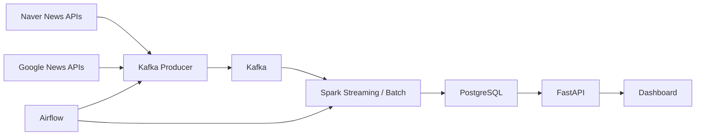

# News Trend Pipeline 

현재 저장소에는 전체 파이프라인 중 1단계인 `뉴스 수집 -> Kafka 적재 -> 적재 확인` 범위까지 구현한 내용이 들어 있습니다.

## 프로젝트 개요

본 프로젝트는 특정 도메인(테마)을 정의하고, 해당 도메인 내에서의 키워드 트렌드를 분석하는 뉴스 트렌드 분석 파이프라인을 구축하는 것을 목표로 합니다.

"전체 뉴스 키워드 분석"이 아닌 **"도메인(테마) 기반 뉴스 트렌드 분석"** 으로, 검색 API 구조의 편향을 의도된 필터로 전환하여 실제 활용 가능한 인사이트를 제공합니다.

도메인별 키워드 집합(Keyword Pool)을 기반으로 뉴스를 수집하고, 스트리밍/배치 처리를 통해 키워드 트렌드와 급상승 이슈를 탐지한 뒤 API와 대시보드로 제공합니다. 프로젝트의 부가적인 의미는 안정적인 데이터 파이프라인 구축을 연습하기 위함입니다.

전체 프로젝트는 아래와 같은 흐름을 목표로 합니다.


## 단계별 진행 현황

| 단계 | 상태 | 내용 |
| --- | --- | --- |
| 1단계 | `완료` | 뉴스 수집과 Kafka 적재 |
| 2단계 | `완료` | Spark 기반 기본 집계 |
| 3단계 | `예정` | 이벤트 분석 |
| 4단계 | `예정` | API 조회 계층 |
| 5단계 | `예정` | 대시보드 완성 |

### 1단계. 뉴스 수집과 Kafka 적재 `완료`

현재 이 저장소에서 구현된 단계입니다.

- Airflow DAG 기반 수집 작업 스케줄링
- Naver News API 테마 키워드 병렬 호출 (STEP1_KAFKA_2)
- Kafka `news_topic` 적재 (partition key = URL)
- 실패 메시지 `runtime/state/dead_letter.jsonl`에 기록
- Auto replay DAG로 자동 재처리 (15분 주기)
- Consumer 스크립트로 Kafka 적재 결과 확인

### 2단계. Spark 기반 기본 집계 `예정`

앞으로 구현할 단계입니다.

- Kafka 메시지를 읽어 기사 스키마로 파싱
- `published_at` 기준 event time 정규화
- 제목/요약/본문 텍스트 정제
- HTML 제거, 불용어 제거, 토큰화 등 전처리
- 공급원별 특성에 맞는 키워드 추출
- Spark 스트리밍에서 10분 단위 윈도우 기본 집계 생성
- 상위 키워드, 키워드 트렌드, 연관 키워드 계산
- PostgreSQL에 기사 원문과 집계 결과 저장

### 3단계. 이벤트 분석 `예정`

앞으로 구현할 단계입니다.

- 급상승 키워드 탐지 로직 구현
- 직전 구간 대비 증가율 계산
- 임계치 기반 이벤트 후보 탐지
- 공급원별 이벤트 비교

### 4단계. API 조회 계층 `예정`

앞으로 구현할 단계입니다.

- FastAPI 조회 API 구현
- 저장된 집계 결과를 10분, 30분, 1시간, 6시간, 12시간, 1일 단위로 재구성해 제공
- 키워드, 트렌드, 이벤트, 관련 기사 조회 API 구성

### 5단계. 대시보드 완성 `예정`

앞으로 구현할 단계입니다.

- FrontEnd 대시보드 구현
- 공급원 선택: 글로벌 뉴스(NewsAPI) / 네이버 뉴스
- 상위 키워드 막대 차트
- 키워드 트렌드 선 차트
- 급상승 키워드 타임라인 차트
- 선택 시간대의 급상승 키워드 목록
- 선택 키워드의 연관 키워드 차트
- 선택 키워드와 시간대에 해당하는 관련 기사 목록 및 원문 링크

## 디렉토리 구조


```text
news-trend-pipeline/
├─ src/                       # dev mount -> /opt/news-trend-pipeline/src
│  └─ news_trend_pipeline/
│     ├─ __init__.py
│     ├─ core/                # 공통 설정, 로거, 유틸
│     ├─ ingestion/           # API client / Kafka producer / replay
│     ├─ processing/          # Spark 집계
│     ├─ analytics/           # 복합명사 / 이벤트 분석
│     ├─ api/                 # FastAPI 조회 계층
│     └─ dashboard/           # FrontEnd 대시보드
├─ airflow/
│  └─ dags/                   # dev mount -> /opt/airflow/dags
├─ infra/
│  └─ airflow/
│     ├─ Dockerfile.airflow   # Airflow 이미지
│     ├─ config/              # dev mount -> /opt/airflow/config
│     └─ plugins/             # dev mount -> /opt/airflow/plugins
├─ runtime/
│  ├─ state/                  # dev mount -> /opt/news-trend-pipeline/runtime/state
│  ├─ checkpoints/            # dev mount -> /opt/news-trend-pipeline/runtime/checkpoints
│  ├─ logs/                   # dev mount -> /opt/airflow/logs
│  └─ spark-events/           # dev mount -> /tmp/spark-events
├─ tests/
│  ├─ unit/
│  └─ integration/
├─ scripts/                   # dev mount -> /opt/news-trend-pipeline/scripts
├─ docs/
│  ├─ DIRECTION.md
│  ├─ DISASTER_RECOVERY.md
│  ├─ FINAL_PRODUCTION_IMAGE_TRANSITION_CHECKLIST.md
│  ├─ FULL_RESET_AND_REBOOTSTRAP_GUIDE.md
│  ├─ STEP1_KAFKA.md
│  ├─ STEP1_KAFKA_2.md
│  ├─ STEP2_PREPROCESSING.md
│  └─ STEP2_SPARK.md
├─ requirements/              # Docker 빌드에서 사용
├─ pyproject.toml             # setuptools src layout 패키지 설정
├─ docker-compose.yml
├─ .env / .env.example
└─ README.md
```

개발용 `docker-compose.yml` 은 전체 프로젝트를 통째로 mount 하지 않고, 서비스별로 필요한 폴더만 부분 mount 합니다.

### 개발용 mount 매핑

| 서비스 그룹 | 실제 컨테이너 | 호스트 디렉터리 | 컨테이너 경로 | 용도 |
| --- | --- | --- | --- | --- |
| Airflow 공통 | `airflow-apiserver`, `airflow-scheduler`, `airflow-dag-processor`, `airflow-triggerer`, `airflow-init` | `./src` | `/opt/news-trend-pipeline/src` | DAG 내부에서 애플리케이션 패키지 import |
| Airflow 공통 | `airflow-apiserver`, `airflow-scheduler`, `airflow-dag-processor`, `airflow-triggerer`, `airflow-init` | `./runtime/state` | `/opt/news-trend-pipeline/runtime/state` | producer 상태, dead letter, replay 상태 파일 유지 |
| Airflow 공통 | `airflow-apiserver`, `airflow-scheduler`, `airflow-dag-processor`, `airflow-triggerer`, `airflow-init` | `./airflow/dags` | `/opt/airflow/dags` | 수집/재처리/사전 추출 DAG 로딩 |
| Airflow 공통 | `airflow-apiserver`, `airflow-scheduler`, `airflow-dag-processor`, `airflow-triggerer`, `airflow-init` | `./runtime/logs` | `/opt/airflow/logs` | Airflow 실행 로그 저장 |
| Airflow 공통 | `airflow-apiserver`, `airflow-scheduler`, `airflow-dag-processor`, `airflow-triggerer`, `airflow-init` | `./infra/airflow/config` | `/opt/airflow/config` | Airflow 설정 파일 제공 |
| Airflow 공통 | `airflow-apiserver`, `airflow-scheduler`, `airflow-dag-processor`, `airflow-triggerer`, `airflow-init` | `./infra/airflow/plugins` | `/opt/airflow/plugins` | Airflow 커스텀 플러그인 로딩 |
| Spark 처리 | `spark-streaming` | `./src` | `/opt/news-trend-pipeline/src` | 스트리밍 애플리케이션 import |
| Spark 처리 | `spark-streaming` | `./scripts` | `/opt/news-trend-pipeline/scripts` | `spark-submit` 진입 스크립트 실행 |
| Spark 처리 | `spark-streaming` | `./runtime/checkpoints` | `/opt/news-trend-pipeline/runtime/checkpoints` | Structured Streaming 체크포인트 유지 |
| Spark 처리 | `spark-streaming` | `./runtime/spark-events` | `/tmp/spark-events` | Spark event log 저장 |
| Spark 클러스터 | `spark-master`, `spark-worker-1`, `spark-worker-2` | `./src` | `/opt/news-trend-pipeline/src` | 공통 코드 참조 및 실행 환경 일치 |
| Spark 클러스터 | `spark-master`, `spark-worker-1`, `spark-worker-2` | `./runtime/spark-events` | `/tmp/spark-events` | Spark event log 공유 |
| Spark UI | `spark-history` | `./runtime/spark-events` | `/tmp/spark-events` | 저장된 event log 기반 History UI 제공 |

정리하면:
- Airflow는 `src`, `dags`, `runtime/state`, `runtime/logs`, `config`, `plugins`만 봅니다.
- `spark-streaming` 은 `src`, `scripts`, `runtime/checkpoints`, `runtime/spark-events`만 봅니다.
- `spark-master`, `spark-worker-*`, `spark-history` 는 클러스터 동작에 필요한 최소 경로만 공유합니다.

컨테이너 내부 import 경로는 `PYTHONPATH=/opt/news-trend-pipeline/src` 기준입니다. 로컬 개발 시에는 `pip install -e .` 를 사용하거나 `PYTHONPATH=src` 환경변수를 설정하세요.

요약:
- 개발 단계에서는 코드 변경을 빠르게 반영하기 위해 필요한 디렉터리만 bind mount 합니다.
- 운영 전환 단계에서는 bind mount 의존을 줄이고 이미지 `COPY` 중심으로 바꾸는 것을 권장합니다.
- 운영 전환 체크리스트는 [`docs/FINAL_PRODUCTION_IMAGE_TRANSITION_CHECKLIST.md`](./docs/FINAL_PRODUCTION_IMAGE_TRANSITION_CHECKLIST.md) 에 정리되어 있습니다.

## Docker 서비스 구성

현재 `docker-compose.yml` 기준으로 아래 서비스들이 함께 올라갑니다.

### 서비스별 역할

| 서비스 | 주요 포트 | 역할 |
| --- | --- | --- |
| `zookeeper` | `2181` | Kafka 브로커 메타데이터 관리 |
| `kafka` | `9092` | 뉴스 메시지 적재용 Kafka 브로커 |
| `kafka-init` | 없음 | 부팅 시 `news_topic` 토픽 생성 보장 |
| `app-postgres` | `5432` | 기사 원문, 키워드, 트렌드, 연관 키워드 저장용 애플리케이션 DB |
| `airflow-postgres` | 내부 전용 | Airflow 메타데이터 DB |
| `spark-master` | `7077`, `8080` | Spark standalone master 및 클러스터 UI |
| `spark-worker-1` | `8081` | Spark worker 1 |
| `spark-worker-2` | `8082` | Spark worker 2 |
| `spark-history` | `18080` | Spark event log 기반 History UI |
| `spark-streaming` | 없음 | Kafka를 읽어 Spark 집계를 수행하고 PostgreSQL에 적재 |
| `airflow-apiserver` | `9080` | Airflow API/UI 제공 |
| `airflow-scheduler` | 내부 전용 | 수집/재처리/사전 추출 DAG 스케줄링 |
| `airflow-dag-processor` | 내부 전용 | DAG 파싱 및 처리 |
| `airflow-triggerer` | 내부 전용 | deferrable task/trigger 처리 |
| `airflow-init` | 없음 | Airflow DB 마이그레이션, 관리자 계정 생성, 초기 디렉터리 준비 |

### 서비스 묶음 관점

- 메시징 계층: `zookeeper`, `kafka`, `kafka-init`
- 저장 계층: `app-postgres`, `airflow-postgres`
- 처리 계층: `spark-master`, `spark-worker-1`, `spark-worker-2`, `spark-history`, `spark-streaming`
- 오케스트레이션 계층: `airflow-apiserver`, `airflow-scheduler`, `airflow-dag-processor`, `airflow-triggerer`, `airflow-init`

구성 흐름 요약:
- Airflow가 뉴스 수집과 재처리 DAG를 실행합니다.
- 수집된 뉴스는 Kafka `news_topic` 으로 들어갑니다.
- `spark-streaming` 이 Kafka를 소비해 PostgreSQL 집계 테이블을 갱신합니다.
- Airflow와 Spark는 서로 다른 역할을 가지며, Airflow는 오케스트레이션, Spark는 스트리밍 처리에 집중합니다.

## 실행

### 1. 환경 파일 준비

- `.env.example`을 복사해 `.env`를 생성합니다.

#### 필수 입력값

- `NAVER_CLIENT_ID`: Naver 검색 API Client ID
- `NAVER_CLIENT_SECRET`: Naver 검색 API Client Secret1

#### 주요 설정값

- `NEWS_PROVIDERS`: 사용할 수집원 목록 (기본값 `naver`, STEP1_KAFKA_2에서 NewsAPI 제거)
- `NAVER_THEME_KEYWORDS`: 병렬 호출 대상 테마 키워드 (콤마 구분)
- `NAVER_MAX_WORKERS`: Naver 병렬 호출 워커 수 (기본 8)
- `NAVER_NEWS_MAX_PAGES`: 키워드당 최대 페이지 수
- `KAFKA_BOOTSTRAP_SERVERS`: Kafka 접속 주소
- `KAFKA_TOPIC`: 정상 메시지 topic
- `STATE_DIR`: 수집 상태/Dead Letter 파일 경로 (기본 `./runtime/state`)
- `DICTIONARY_REFRESH_INTERVAL_SECONDS`: 복합명사/불용어 사전 버전 확인 주기 (기본 60초)

```powershell
Copy-Item .env.example .env
```


### 2. 컨테이너 실행

주의: 아래 명령은 `docker-compose.yml`이 있는 프로젝트 루트에서 실행합니다.

```powershell
docker compose up --build -d
```

### 3. 로컬에서 패키지 실행 (선택)

```bash
pip install -e .
python -m news_trend_pipeline.ingestion.producer          # Kafka로 뉴스 적재
python -m news_trend_pipeline.ingestion.replay            # Dead Letter 재처리
python scripts/consumer_check.py --max-messages 5         # 적재 결과 확인
```

`pip install -e .` 이 여의치 않다면 환경변수로 대체할 수 있습니다.


```bash
export PYTHONPATH="$(pwd)/src"
python -m news_trend_pipeline.ingestion.producer
```


## 문서
- [단계 1: Kafka 수집](./docs/STEP1_KAFKA.md) - 뉴스 API 수집, Kafka 적재, 적재 결과 확인
- [단계 1: Kafka 수집 Rev.2](./docs/STEP1_KAFKA_2.md) - Naver 병렬 호출, URL partition key, src layout 구조 리팩토링
- [단계 1: 장애 대응 및 복구](./docs/STEP1_RECOVERY.md) - Dead Letter 처리, 자동/수동 재처리, 모니터링 가이드
- [단계 1: 방향 전환 배경](./docs/STEP1_DIRECTION_CHANGE.md) - 도메인 기반 뉴스 트렌드 분석으로 방향을 전환한 이유
- [단계 2: Spark 처리 계층](./docs/STEP2_SPARK.md) - Kafka 이후 Spark 처리, 저장소 설계, 실행 코드
- [단계 2: 전처리 상세](./docs/STEP2_PREPROCESSING.md) - 텍스트 정제, 토큰화, 복합명사, 연관 키워드 집계
- [운영 전환 체크리스트](./docs/FINAL_PRODUCTION_IMAGE_TRANSITION_CHECKLIST.md) - bind mount 축소와 이미지 중심 운영 전환 체크리스트
- [전체 초기화/재부트스트랩 가이드](./docs/FULL_RESET_AND_REBOOTSTRAP_GUIDE.md) - 로컬 환경을 처음부터 다시 세팅하는 절차
