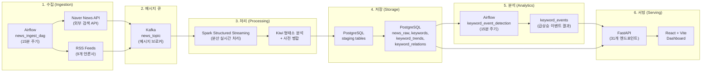
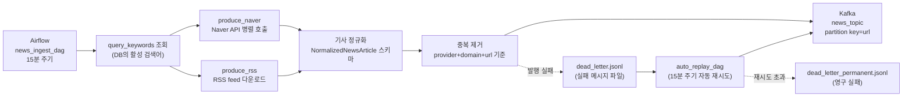
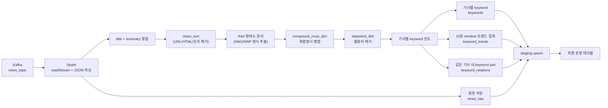
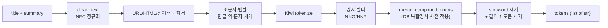
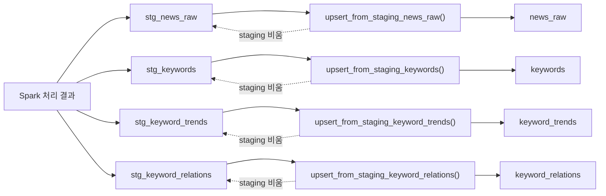
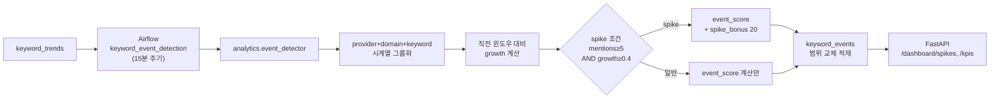
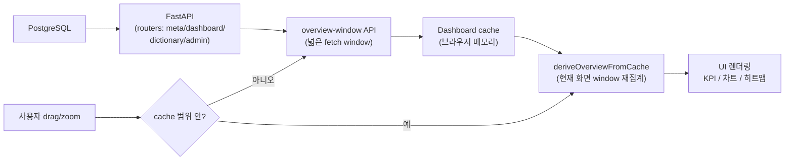
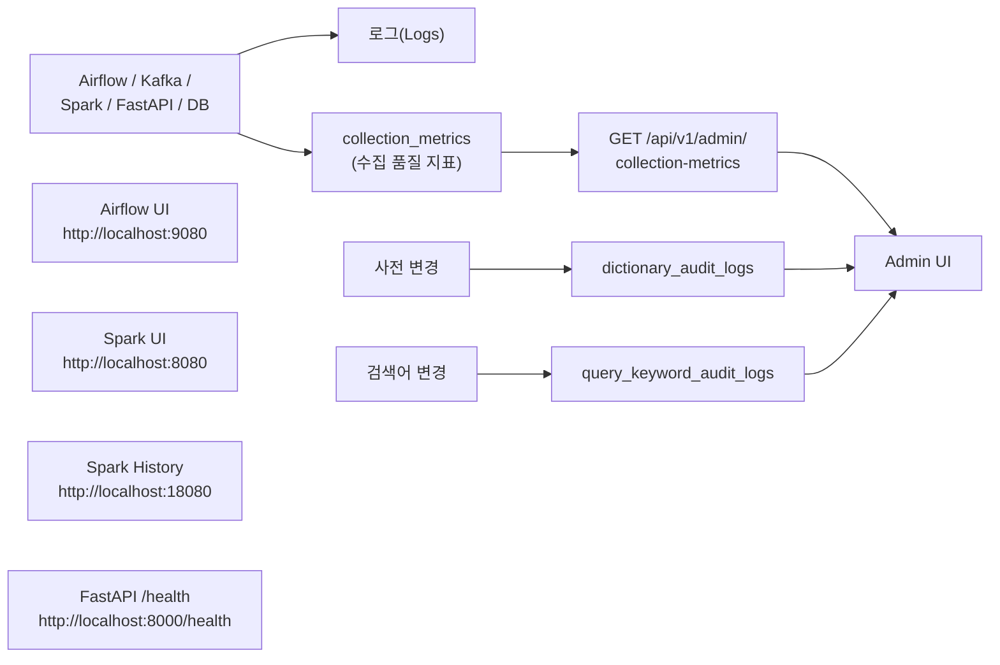

# News Trend Pipeline v2

도메인별 뉴스 키워드를 수집하고, **Kafka(메시지 큐) → Spark(분산 스트리밍 처리) → PostgreSQL(관계형 데이터베이스)** 파이프라인으로 가공한 뒤 **FastAPI(파이썬 REST API 프레임워크)** 와 **React Dashboard** 로 조회하는 한국어 뉴스 트렌드 분석 프로젝트입니다.

---

## 목차

1. [프로젝트 개요 및 목적](#1-프로젝트-개요-및-목적)
2. [전체 아키텍처](#2-전체-아키텍처)
3. [단계별 파이프라인 다이어그램](#3-단계별-파이프라인-다이어그램)
4. [설치 및 실행 방법](#4-설치-및-실행-방법)
5. [컴포넌트 설명](#5-컴포넌트-설명)
6. [주요 데이터 모델](#6-주요-데이터-모델)
7. [API 엔드포인트](#7-api-엔드포인트)
8. [기술적 의사 결정 근거](#8-기술적-의사-결정-근거)
9. [디렉터리 구조](#9-디렉터리-구조)
10. [운영·문서](#10-운영문서)

---

## 1. 프로젝트 개요 및 목적

### 1-1. 한 줄 요약

> 한국어 뉴스를 **도메인 단위로 수집** 하여 **시간 윈도우(time window, 일정 시간 구간)** 별 키워드 트렌드와 급상승 이벤트를 산출하고, 운영자가 사전(辭典)·검색어를 직접 관리할 수 있는 분석 대시보드를 제공합니다.

### 1-2. 풀려는 문제

- 단일 검색어 기반 수집은 **데이터 편중**이 심해 트렌드 분석이 불안정합니다.
- 한국어는 형태소 분석(단어를 의미 최소 단위로 쪼개는 작업) 결과가 분야마다 달라 **도메인별 사전**이 필요합니다.
- 운영 중 키워드/사전이 자주 바뀌므로 **수집 결과가 갑자기 변할 때 원인을 추적**할 수 있어야 합니다.

### 1-3. 주요 기능

| 영역 | 기능 |
| --- | --- |
| 수집 | Naver News API + 다중 RSS(언론사 피드) 동시 수집, dead letter(실패 메시지) 자동 재처리 |
| 처리 | Spark Structured Streaming(스파크 스트리밍 엔진) 기반 한국어 형태소 분석 + 복합명사 병합 |
| 저장 | staging upsert(임시 적재 후 최종 반영) 기반 멱등(idempotent, 같은 입력에 같은 결과) 적재 |
| 분석 | 15분 주기 keyword spike(급상승) 이벤트 탐지 |
| 서빙 | FastAPI 31개 엔드포인트, React + Vite 대시보드 |
| 관리 | 복합명사·불용어(stopword, 분석 시 제외할 단어) 사전, 검색어, 수집 메트릭 관리 UI |

### 1-4. 현재 구현 범위

| 단계 | 상태 | 비고 |
| --- | --- | --- |
| STEP1 Ingestion | 완료 | Airflow 오케스트레이션, Naver + RSS 수집, dead letter replay |
| STEP2 Processing | 완료 | Spark 스트리밍, Kiwi 형태소 분석, 사전 적용 |
| STEP3 Storage | 완료 | PostgreSQL 스키마, staging upsert, 일 단위 재처리 유틸 |
| STEP4 Analytics | 완료 | `keyword_events` 기반 이벤트 탐지 배치 |
| STEP5 Serving | 완료 | FastAPI + React Dashboard |
| STEP6 Monitoring | 부분 | Health API, Airflow/Spark UI, collection_metrics |

---

## 2. 전체 아키텍처

### 2-1. 전체 흐름 (높은 시점)



### 2-2. 동작 원리 한 문장 정리

```text
"Airflow 가 정해진 시간마다 뉴스를 수집해 Kafka 에 던지면,
 Spark 가 이를 실시간으로 받아 한국어 키워드로 쪼개고 집계해 DB 에 쌓고,
 별도 배치가 그 집계 결과로 급상승 이벤트를 뽑아 FastAPI 가 대시보드에 보여준다."
```

---

## 3. 단계별 파이프라인 다이어그램

전체 파이프라인을 6단계로 나누어 각 단계의 입출력을 단계별 mermaid 차트로 정리합니다.

### 3-1. STEP 1 — 수집 (Ingestion)

> **Airflow(워크플로 스케줄러)** 가 주기적으로 Naver News API와 RSS 피드를 호출하여 정규화된 메시지를 **Kafka 토픽** 에 발행합니다.



**핵심 포인트**

- **수집 단위**: `provider(naver/rss) + domain(11개) + query` — 도메인별 80개+ 쿼리를 병렬 처리합니다.
- **체크포인트(checkpoint, 마지막 처리 위치 기록)**: `producer_state.json` 에 `domain::query` 단위로 마지막 수집 시각을 저장합니다.
- **중복 제어**: 최근 발행 URL 캐시(`published_urls`)로 같은 기사 재발행을 막습니다.
- **dead letter**: Kafka 발행 실패 시 한 줄 JSON 파일로 떨어뜨리고, 별도 DAG가 자동으로 다시 보냅니다.

### 3-2. STEP 2 — 처리 (Processing)

> **Spark Structured Streaming(스파크의 실시간 스트리밍 처리 엔진)** 이 Kafka 메시지를 micro-batch(작은 묶음 단위)로 읽어 한국어 키워드를 추출하고 시간 윈도우별로 집계합니다.



**핵심 포인트**

- **window(시간 윈도우, 집계 기준 시간 구간)**: 기본 10분 (`KEYWORD_WINDOW_DURATION`).
- **event_time(이벤트 발생 시각)**: 기사 `published_at` 을 사용 — 늦게 도착한 데이터도 올바른 시간대로 집계됩니다.
- **Kiwi**: 한국어 형태소 분석기. `NNG`(일반명사) + `NNP`(고유명사) 만 추출합니다.
- **복합명사 병합**: "인공지능" → ["인공", "지능"] 으로 쪼개지면 다시 "인공지능" 하나로 합칩니다.
- **연관어**: 같은 기사에 함께 등장한 키워드 쌍을 window 단위로 누적합니다.

### 3-3. STEP 2-1 — 한국어 전처리 상세



**핵심 포인트**

- 숫자·영문은 모두 제거됩니다 — 한국어 키워드만 분석 대상으로 삼습니다.
- 사전이 변경되면 `dictionary_versions` 테이블이 증가하여 Spark 의 캐시(자주 쓰는 데이터의 임시 저장본)가 자동 갱신됩니다.
- Kiwi 가 없는 환경에서는 공백 분리 fallback(예비 동작)으로 작동합니다.

### 3-4. STEP 3 — 저장 (Storage)

> Spark 결과는 운영 테이블에 직접 쓰지 않고 **staging 테이블(중간 임시 테이블)** 에 먼저 적재한 뒤, DB 함수가 **upsert(있으면 갱신, 없으면 삽입)** 로 최종 반영합니다.



**핵심 포인트**

- **멱등성(idempotency)**: `provider + domain + url` 같은 unique key 로 같은 데이터를 두 번 넣어도 한 행만 남습니다.
- **staging 의 목적**: Spark executor 가 최종 테이블에 동시에 upsert 하면 unique index 락 경합(여러 작업이 동시에 같은 자원에 접근)이 생기므로 완충 계층으로 분리.
- **재처리(replay) 지원**: `rebuild_keywords_for_date()`, `rebuild_keyword_trends_for_date()` 등으로 일 단위 재계산이 가능합니다.

### 3-5. STEP 4 — 분석 (Analytics)

> 15분 주기 Airflow DAG 가 `keyword_trends` 의 시간 변화량을 비교하여 **급상승 이벤트(spike)** 를 산출합니다.



**핵심 포인트**

- **growth(증가율)**: `(현재 - 직전) / 직전` — 직전이 0 이고 현재가 양수면 1.0 으로 처리합니다.
- **event_score**: `min(100, growth*45 + sqrt(mentions)*6 + spike_bonus)` 휴리스틱(경험적 계산식).
- **lookback(되돌아보는 시간)**: 24시간 — 늦게 도착한 데이터까지 다시 계산해 보정합니다.
- **재실행 안전성**: 동일 시간대 결과를 삭제 후 재삽입(`replace_keyword_events`)하므로 중복 누적이 없습니다.

### 3-6. STEP 5 — 서빙 (Serving)

> FastAPI 가 분석 결과를 REST API 로 제공하고, React + Vite 대시보드가 캐시 기반으로 빠르게 시각화합니다.



**핵심 포인트**

- **overview-window 패턴**: 서버는 현재 화면보다 넓은 시간 범위의 bucket(시간 단위로 묶은 작은 묶음) 데이터를 한 번에 내려주고, 프론트는 화면 이동 시 다시 호출하지 않고 캐시에서 재집계합니다.
- 차트 drag/pan/zoom 시 매번 API 를 호출하지 않아 **인터랙션 응답성** 이 향상됩니다.
- 사전·검색어 관리 화면도 같은 FastAPI 라우터에서 제공합니다.

### 3-7. STEP 6 — 모니터링



---

## 4. 설치 및 실행 방법

### 4-1. 사전 준비물

| 도구 | 용도 |
| --- | --- |
| Docker Desktop | 모든 컨테이너(격리된 실행 단위) 실행 |
| Docker Compose v2 | 여러 컨테이너 묶음 실행 |
| Naver Open API 키 | 뉴스 수집 (`Client ID`, `Client Secret`) |
| (선택) Python 3.10+ | 로컬 스크립트 실행 |

### 4-2. 환경 변수 준비

```powershell
# Windows PowerShell
Copy-Item .env.example .env
```

`.env` 에서 **반드시 채워야 할 값**:

```env
NAVER_CLIENT_ID=your_naver_client_id
NAVER_CLIENT_SECRET=your_naver_client_secret
```

자주 조정하는 값:

| 변수 | 기본값 | 의미 |
| --- | --- | --- |
| `NEWS_PROVIDERS` | `naver,rss` | 활성 수집원 (콤마 구분) |
| `NAVER_MAX_WORKERS` | `4` | Naver API 병렬 호출 워커 수 |
| `NAVER_PAGE_REQUEST_DELAY_SECONDS` | `0.75` | 같은 키워드 페이지 사이 대기 시간 |
| `NAVER_QUERY_STAGGER_SECONDS` | `0.15` | 키워드별 시작 시점 간격 |
| `KEYWORD_WINDOW_DURATION` | `10 minutes` | 트렌드 집계 시간 단위 |
| `RELATION_KEYWORD_LIMIT` | `4` | 기사당 연관어 추출 상위 N |
| `SPARK_SHUFFLE_PARTITIONS` | `8` | Spark shuffle(데이터 재배치) 파티션 수 |

### 4-3. 전체 스택 실행

```powershell
docker compose up --build -d
```

처음 실행 시 다음 순서로 자동 진행됩니다.

1. **app-postgres** PostgreSQL 부팅 → 헬스체크
2. **app-postgres-init** Airflow 용 role/DB 생성
3. **flyway** `db/migration/V*.sql` 마이그레이션 적용
4. **kafka-init** `news_topic` 토픽(파티션 2) 생성
5. **airflow-init** Airflow 메타DB 마이그레이션 + 기본 사용자 생성
6. **spark-master/worker/streaming** Spark 클러스터 부팅 + streaming job 시작
7. **api-server / frontend-server** API 와 React 개발 서버 실행

### 4-4. 접속 포트

| 서비스 | URL | 비고 |
| --- | --- | --- |
| Dashboard | http://localhost:3000 | React + Vite 개발 서버 |
| FastAPI | http://localhost:8000/docs | OpenAPI 문서 (Swagger UI) |
| Health Check | http://localhost:8000/health | API 상태 |
| Airflow UI | http://localhost:9080 | id/pw: `airflow / airflow` |
| Spark Master UI | http://localhost:8080 | 클러스터 상태 |
| Spark Streaming UI | http://localhost:4040 | 실행 중 job |
| Spark History | http://localhost:18080 | 종료된 job 이력 |
| Kafka | localhost:9092 | 외부에서 접속 시 |
| PostgreSQL | localhost:5432 | id: `postgres` / pw: `postgres` |

### 4-5. 첫 실행 후 해야 할 일

1. **Airflow UI** 접속 → `news_ingest_dag` 와 `keyword_event_detection` 의 일시정지를 해제(Unpause).
2. 5–10분 후 **Dashboard** 에 KPI/키워드/스파이크가 표시되는지 확인.
3. 데이터가 비어있으면 **Spark Streaming UI(4040)** 에서 batch 가 돌고 있는지 확인.

### 4-6. 로컬 스크립트 실행 (개발용)

```bash
# 패키지 설치
pip install -e .

# Kafka 메시지 5건 빠르게 확인
python scripts/consumer_check.py --max-messages 5

# 로컬에서 Spark job 직접 실행
python scripts/run_processing.py

# Producer 직접 호출 (Airflow 우회)
python -m ingestion.producer

# Dead letter 수동 재처리
python -m ingestion.replay
```

### 4-7. 전체 초기화

데이터를 모두 비우고 다시 부팅하려면:

```powershell
.\scripts\reset_full_rebootstrap.ps1
```

사전 데이터만 보존하고 재부팅하려면:

```powershell
.\scripts\reset_keep_dictionary_rebootstrap.ps1
```

---

## 5. 컴포넌트 설명

### 5-1. Ingestion (`src/ingestion/`)

| 파일 | 역할 |
| --- | --- |
| [api_client.py](src/ingestion/api_client.py) | `NaverNewsClient` (Open API 병렬 호출) + `RssNewsClient` (RSS 파싱) |
| [producer.py](src/ingestion/producer.py) | DB 검색어 조회 → 기사 수집 → 정규화 → Kafka 발행 |
| [replay.py](src/ingestion/replay.py) | dead letter 파일 읽어 재발행 |

**Naver API 호출 정책**: 80개+ 쿼리 동시 호출이 `429 Too Many Requests` 를 유발하므로 3-축(워커 수 / 페이지 간격 / 쿼리 시작 간격)을 함께 제어합니다. 자세한 측정 결과는 `docs/develop/STEP1_DIRECTION_CHANGE_history.md` 6절 참고.

### 5-2. Processing (`src/processing/`)

| 파일 | 역할 |
| --- | --- |
| [spark_job.py](src/processing/spark_job.py) | Structured Streaming 메인. Kafka → JSON 파싱 → 토큰화 → 집계 → staging |
| [preprocessing.py](src/processing/preprocessing.py) | `clean_text`, `tokenize`, Kiwi 인스턴스 캐시 |
| [spark_job_annotated_ko.py](src/processing/spark_job_annotated_ko.py) | 학습용 한글 주석 버전 |

### 5-3. Analytics (`src/analytics/`)

| 파일 | 역할 |
| --- | --- |
| [event_detector.py](src/analytics/event_detector.py) | growth 계산, spike 판정, `keyword_events` 적재 |
| [compound_extractor.py](src/analytics/compound_extractor.py) | `news_raw` 에서 복합명사 후보 추출 |
| [compound_auto_reviewer.py](src/analytics/compound_auto_reviewer.py) | Naver Web Search API 근거로 후보 자동 평가 |
| [compound_auto_approver.py](src/analytics/compound_auto_approver.py) | (deprecated) 과거 자동 승인 로직 |
| [stopword_recommender.py](src/analytics/stopword_recommender.py) | 빈도/문서 비율 기반 불용어 후보 추천 |

### 5-4. Storage (`src/storage/`)

| 파일 | 역할 |
| --- | --- |
| [db.py](src/storage/db.py) | `psycopg2` 연결 풀, `safe_initialize_database`, 도메인 카탈로그 |
| [news_db.py](src/storage/news_db.py) | 기사·키워드·트렌드·이벤트 쿼리 |
| [dict_db.py](src/storage/dict_db.py) | 복합명사·불용어 사전 쿼리 |
| [admin_db.py](src/storage/admin_db.py) | 검색어·수집 메트릭 쿼리 |
| `db/migration/V*.sql` | Flyway(SQL 마이그레이션 도구) 적용 스키마 |

### 5-5. API (`src/api/` + `src/services/`)

```text
src/api/app.py          # FastAPI 앱, CORS, 라우터 등록, /health
src/api/schemas.py      # Pydantic(파이썬 데이터 검증) 요청/응답 모델
src/api/routers/
  meta.py               # /api/v1/meta/filters
  dashboard.py          # /api/v1/dashboard/* (10개)
  dictionary.py         # /api/v1/dictionary/* (14개)
  admin.py              # /api/v1/admin/* (7개)

src/services/           # 비즈니스 로직 (라우터에서 호출)
  dashboard.py          # 집계·재집계 로직
  dictionary.py         # 사전 등록/삭제/도메인 변경
  admin.py              # 검색어 / 메트릭 / DAG 트리거
  _utils.py             # 공통 상수, 에러 클래스, 시간 범위 계산
```

### 5-6. Dashboard (`src/dashboard/`)

```text
src/dashboard/src/
  app.tsx     # 화면 상태, API 호출, cache 재집계, interaction 제어
  data.ts     # API client + 응답 타입
  charts.tsx  # 트렌드 라인, spike 히트맵, 연관어 네트워크
  ui.tsx      # 공통 UI 컴포넌트
```

기술 스택: **React + Vite + TypeScript**.

### 5-7. Airflow DAGs (`airflow/dags/`)

| DAG | 주기 | 역할 |
| --- | --- | --- |
| `news_ingest_dag` | 15분 | Naver + RSS 수집 → Kafka |
| `auto_replay_dag` | 15분 | dead letter 자동 재발행 |
| `keyword_event_detection` | 15분 | 급상승 이벤트 탐지 |
| `compound_dictionary_dag` | 일배치 | 복합명사 후보 추출 |
| `compound_candidate_auto_review_dag` | 일배치 | 외부 API 기반 자동 평가 |
| `compound_keyword_backfill_dag` | 수동 | 복합명사 적용 후 과거 키워드 재계산 |
| `stopword_recommender_dag` | 일배치 | 불용어 후보 추천 |
| `kafka_recovery_dag` | 수동 | Kafka 장애 후 복구 |
| `partition_maintenance_dag` | 일배치 | PostgreSQL 파티션 관리 |

---

## 6. 주요 데이터 모델

| 분류 | 테이블 | 비고 |
| --- | --- | --- |
| 기준 데이터 | `domain_catalog`, `query_keywords`, `query_keyword_audit_logs` | 도메인 11종 + 검색어 |
| 기사·분석 | `news_raw`, `keywords`, `keyword_trends`, `keyword_relations`, `keyword_events` | 멱등 키 = `provider + domain + ...` |
| 사전 | `compound_noun_dict`, `compound_noun_candidates`, `stopword_dict`, `stopword_candidates`, `dictionary_versions`, `dictionary_audit_logs` | 사전 변경 시 trigger 가 `dictionary_versions` 증가 |
| 운영 | `collection_metrics` | 수집 성공·중복·실패 카운트 |
| staging | `stg_news_raw`, `stg_keywords`, `stg_keyword_trends`, `stg_keyword_relations` | upsert 후 비워짐 |

ERD 와 인덱스 설계 상세는 [`docs/design/STEP3-1_DATABASE.md`](docs/design/STEP3-1_DATABASE.md) 와 [`docs/design/STEP3-1_ERD.md`](docs/design/STEP3-1_ERD.md) 참고.

---

## 7. API 엔드포인트

총 **31개 REST 엔드포인트** 제공. 자세한 query parameter 와 응답은 `http://localhost:8000/docs` (Swagger UI, OpenAPI 자동 생성 문서).

| 그룹 | 메서드 | 경로 | 설명 |
| --- | --- | --- | --- |
| Meta | GET | `/health` | 헬스체크 |
| Meta | GET | `/api/v1/meta/filters` | 필터 옵션 (도메인·기간·정렬) |
| Dashboard | GET | `/api/v1/dashboard/kpis` | KPI 집계 |
| Dashboard | GET | `/api/v1/dashboard/keywords` | 상위 키워드 목록 |
| Dashboard | GET | `/api/v1/dashboard/overview-window` | 통합 조회 (KPI+키워드+spike+cache) |
| Dashboard | GET | `/api/v1/dashboard/trend` | 키워드 트렌드 시계열 |
| Dashboard | GET | `/api/v1/dashboard/trend-window` | 시간 창 기반 트렌드 |
| Dashboard | GET | `/api/v1/dashboard/spikes` | 급상승 이벤트 |
| Dashboard | GET | `/api/v1/dashboard/related` | 연관 키워드 |
| Dashboard | GET | `/api/v1/dashboard/theme-distribution` | 테마 분포 |
| Dashboard | GET | `/api/v1/dashboard/articles` | 기사 목록 |
| Dashboard | GET | `/api/v1/dashboard/system` | 시스템 상태 |
| Dictionary | GET/POST/PATCH/DELETE | `/api/v1/dictionary/compound-nouns[/...]` | 복합명사 CRUD |
| Dictionary | GET/POST | `/api/v1/dictionary/compound-candidates[/{id}/review]` | 복합명사 후보 승인/반려 |
| Dictionary | GET/POST/PATCH/DELETE | `/api/v1/dictionary/stopwords[/...]` | 불용어 CRUD |
| Dictionary | GET/POST | `/api/v1/dictionary/stopword-candidates[/{id}/...]` | 불용어 후보 승인/반려 |
| Admin | GET/POST/PUT/DELETE | `/api/v1/admin/query-keywords[/...]` | 검색어 CRUD |
| Admin | GET | `/api/v1/admin/collection-metrics` | 수집 메트릭 |
| Admin | POST | `/api/v1/admin/run-stopword-recommender` | 불용어 추천 트리거 |
| Admin | POST | `/api/v1/admin/run-compound-auto-approve` | 복합명사 자동 승인 (deprecated) |
| Admin | POST | `/api/v1/admin/compound-keyword-backfill` | 키워드 백필 DAG 트리거 |

---

## 8. 기술적 의사 결정 근거

각 선택에 대해 **고민했던 대안** → **선택한 이유** → **얻은 이점/감수한 비용** 을 정리합니다.

### 8-1. 왜 Kafka 인가? (메시지 큐 선택)

- **대안**: 직접 DB INSERT, RabbitMQ, AWS SQS
- **선택 이유**: 수집(Producer) 과 처리(Spark Consumer) 의 처리 속도 차이를 흡수해야 하고, **장애 시 메시지 재생(replay)** 이 필요했습니다. Kafka 는 offset(메시지 위치 표시) 기반 재처리가 기본이고 Spark Structured Streaming 과 1급 통합됩니다.
- **이점**: Spark 가 멈춰도 Kafka 가 메시지를 보관 → 복구 후 누락 없이 처리.
- **비용**: ZooKeeper + Kafka broker 운영 부담. 본 프로젝트는 단일 노드 1 partition 2 로 단순화.

### 8-2. 왜 Spark Structured Streaming 인가?

- **대안**: Kafka Streams, Apache Flink, 단순 Python consumer
- **선택 이유**:
  - 윈도우 집계(window aggregation), event_time 기반 처리, watermark(늦게 도착한 데이터 허용 시간) 등 **시간 윈도우 분석이 표준화** 되어 있습니다.
  - **Python(PySpark)** 사용이 가능해 형태소 분석기(Kiwi) 와 결합이 쉽습니다.
  - `foreachBatch` 로 micro-batch 마다 PostgreSQL JDBC 적재가 자연스럽습니다.
- **이점**: window/watermark/checkpoint 로 정확히 한 번(at-least-once + idempotent upsert ≈ effectively-once) 처리.
- **비용**: JVM(자바 가상 머신) 기반 클러스터 운영. 메모리 튜닝 필요 (`SPARK_WORKER_MEMORY`, `SPARK_SHUFFLE_PARTITIONS`).

### 8-3. 왜 staging upsert 인가? (직접 적재 대신)

- **대안**: Spark 가 최종 테이블에 바로 upsert
- **선택 이유**: 여러 Spark executor(작업자) 가 같은 unique index 에 동시에 쓰면 **락 경합 / 데드락(서로 기다려서 멈추는 상태)** 위험이 있습니다. 또한 외부 데이터는 중복·누락이 섞여 있어 **검증 단계** 가 필요합니다.
- **이점**: append-only(추가만 하는) staging → DB 함수 1개가 직렬화하여 upsert → 락 경합 최소화 + 멱등성 확보.
- **비용**: 테이블 2배 (`stg_*` + 운영 테이블), upsert SQL 함수 유지보수.

### 8-4. 왜 Kiwi 형태소 분석기인가?

- **대안**: KoNLPy(Mecab/Komoran/Hannanum), 공백 토큰화
- **선택 이유**: Kiwi 는 **사용자 사전(`add_user_word`) 추가가 가벼우며** 동의어/복합명사 처리 품질이 좋고, 순수 C++/Python 으로 Java 의존성이 없습니다.
- **이점**: 운영 중 `compound_noun_dict` 갱신 시 Kiwi 인스턴스를 가볍게 재구축할 수 있습니다.
- **비용**: KoNLPy 보다 사용자 풀이 작음 → 학습 자료가 상대적으로 적음.

### 8-5. 왜 도메인 단위로 쪼갰나?

- **대안**: 단일 키워드 풀로 한 번에 수집·집계
- **선택 이유**: 분야가 섞이면 **노이즈가 키워드 트렌드를 가립니다** (예: "삼성" 이 반도체 + 정치 + 스포츠로 흩어져 의미가 사라짐). 11개 도메인으로 분리하여 도메인별 사전과 트렌드를 독립 운영합니다.
- **이점**: domain 별로 spike threshold 와 사전 정책을 따로 둘 수 있음.
- **비용**: 검색어 80개+ 관리 부담 → DB `query_keywords` 테이블로 외주화.

### 8-6. 왜 사전을 DB 에 두었나? (파일 사전 대신)

- **대안**: `data/*.txt` 정적 파일
- **선택 이유**: 운영자가 대시보드에서 단어를 추가/삭제할 때 **재배포 없이 즉시 반영** 되어야 합니다.
- **이점**:
  - `dictionary_versions` 트리거(자동 실행 SQL) → Spark 가 polling(주기적 확인) 으로 캐시 갱신.
  - 변경 이력(`dictionary_audit_logs`) 자동 적재 → "왜 키워드 결과가 갑자기 바뀌었는가" 추적 가능.
- **비용**: DB 라운드트립 1회 추가, lru_cache(자주 쓴 결과 메모리에 보관) 로 완화.

### 8-7. 왜 overview-window + 프론트 재집계 패턴인가?

- **대안**: 차트 drag/zoom 마다 API 재호출
- **선택 이유**: 사용자 인터랙션마다 5–6개 API 를 호출하면 **네트워크 지연** 으로 차트 조작이 무거워집니다.
- **이점**: 서버는 화면보다 넓은 fetch window 의 bucket 데이터를 한 번에 내려주고, 프론트의 `deriveOverviewFromCache()` 가 즉시 재집계 → drag/pan/zoom 이 0ms 에 반응합니다.
- **비용**: 캐시 일관성을 위해 `bucketMin`, `dataStartAt`, `dataEndAt` 같은 메타데이터를 별도 관리. cache 범위 가장자리 접근 시 자동 재호출 로직 필요.

### 8-8. 왜 staging 적재 후 별도 배치로 이벤트를 뽑나? (스트리밍에서 바로 spike 판정 안 하는 이유)

- **대안**: Spark structured streaming 안에서 spike 판정까지
- **선택 이유**: spike 판정은 **직전 윈도우 비교**가 필요한데, 늦게 도착한 데이터(예: 10분 전 기사) 가 들어오면 직전 윈도우 값이 변할 수 있습니다. 별도 배치(`keyword_event_detection` 15분 주기 + 24시간 lookback) 가 매번 다시 계산하면 **late-arriving data 보정** 이 자연스럽습니다.
- **이점**: streaming/batch 책임 분리, 임계치 변경 시 `keyword_trends` 재처리만으로 이벤트 재산출 가능.
- **비용**: 이벤트 결과가 최소 15분 지연.

### 8-9. 왜 RSS 까지 추가했나?

- **대안**: Naver API 만 사용
- **선택 이유**: Naver 검색 API 는 **검색어 매칭 기반** 이라 검색어에 안 잡히는 기사가 누락됩니다. RSS 는 언론사가 직접 발행하는 피드라 **수집 누락이 적고 도메인 분류가 명확** 합니다.
- **이점**: 9개 언론사 × 도메인 단위 RSS 로 커버리지 보강.
- **비용**: RSS 포맷이 표준이 아니라 언론사별 파싱 분기 필요. CSV(`data/rss_feeds.csv`) 로 카탈로그화하여 코드 수정 없이 URL 변경.

### 8-10. 왜 Flyway 인가? (마이그레이션 관리)

- **대안**: 애플리케이션 시작 시 `models.sql` 직접 실행 (이전 방식)
- **선택 이유**: 여러 컨테이너(API, Spark, Airflow) 가 동시에 부팅될 때 **스키마 초기화가 race condition(경쟁 상태)** 을 일으켰습니다.
- **이점**: `db/migration/V*__*.sql` 의 버전 순 적용 → 단일 진실 출처(SSOT, single source of truth) 확립. `app-postgres-init` 1곳에서만 실행.
- **비용**: 마이그레이션 파일 명명 규칙 준수 필요 (`V1__init.sql` 등).

---

## 9. 디렉터리 구조

```text
news-trend-pipeline-v2/
├─ airflow/dags/                # Airflow DAG (수집·재시도·이벤트·사전·백필)
├─ data/
│  └─ rss_feeds.csv             # 언론사 RSS 카탈로그 (CSV 편집으로 수집 변경)
├─ db/migration/                # Flyway SQL 마이그레이션
├─ docs/
│  ├─ design/                   # 최종 설계 문서 (단계별 STEP*.md)
│  └─ develop/                  # 개발 이력 / 운영 메모 / 튜닝 기록
├─ infra/                       # Airflow / Spark / API / PostgreSQL Dockerfile
├─ runtime/
│  ├─ checkpoints/              # Spark checkpoint
│  ├─ logs/                     # Airflow 로그
│  ├─ spark-events/             # Spark History 이벤트 로그
│  └─ state/                    # producer_state, dead_letter*.jsonl
├─ scripts/
│  ├─ consumer_check.py         # Kafka 메시지 빠른 점검
│  ├─ run_processing.py         # Spark job 로컬 실행 진입점
│  ├─ kafka_monitor.py          # broker / lag 모니터
│  ├─ load_test.py              # producer 부하 테스트
│  ├─ reset_full_rebootstrap.ps1
│  └─ reset_keep_dictionary_rebootstrap.ps1
├─ src/
│  ├─ analytics/                # event_detector, compound_*, stopword_recommender
│  ├─ api/                      # FastAPI app + routers + schemas
│  ├─ services/                 # 비즈니스 로직 (dashboard / dictionary / admin)
│  ├─ core/                     # config, schemas, domains, logger
│  ├─ dashboard/                # React + Vite frontend
│  ├─ ingestion/                # api_client, producer, replay
│  ├─ processing/               # Spark job + Kiwi 전처리
│  └─ storage/                  # psycopg2 기반 DB 접근 레이어
├─ tests/                       # unit / integration tests
├─ docker-compose.yml
├─ pyproject.toml
└─ README.md
```

### 9-1. `runtime/state/` 파일 의미

| 파일 | 생성 주체 | 설명 |
| --- | --- | --- |
| `producer_state.json` | `ingestion.producer` | 키워드별 마지막 수집 시각 + 최근 발행 URL 캐시 |
| `producer_state.lock` | `ingestion.producer` | 동시 실행 시 race condition(동시 접근 충돌) 방지 |
| `dead_letter.jsonl` | producer / replay | 발행 실패 메시지 (한 줄 = 한 JSON) |
| `dead_letter_replayed.jsonl` | replay | 재발행 성공 이력 (감사용) |
| `dead_letter_permanent.jsonl` | replay | 재시도 초과 / payload 오류 (수동 확인 필요) |

### 9-2. dead letter 처리 흐름

```text
Kafka 발행 실패
  └─ dead_letter.jsonl 에 append
       └─ auto_replay_dag (15분 주기) 또는 python -m ingestion.replay
            ├─ 재전송 성공  → dead_letter_replayed.jsonl 누적
            ├─ 재전송 실패  → dead_letter.jsonl 에 남겨 다음 사이클에서 재시도
            └─ 재시도 초과  → dead_letter_permanent.jsonl 이동
```

---

## 10. 운영·문서

### 10-1. 설계 문서 (최종 구현 기준)

- [STEP1_INGESTION.md](docs/design/STEP1_INGESTION.md) — 수집 개요
  - [STEP1-1_AIRFLOW.md](docs/design/STEP1-1_AIRFLOW.md) — Airflow DAG
  - [STEP1-2_KAFKA.md](docs/design/STEP1-2_KAFKA.md) — Kafka producer 상세
- [STEP2_PROCESSING.md](docs/design/STEP2_PROCESSING.md) — 처리 개요
  - [STEP2-1_SPARK.md](docs/design/STEP2-1_SPARK.md) — Spark Streaming
  - [STEP2-2_PREPROCESSING.md](docs/design/STEP2-2_PREPROCESSING.md) — Kiwi 전처리
  - [STEP2-3_DICTIONARY.md](docs/design/STEP2-3_DICTIONARY.md) — 사전 관리
  - [STEP2-4_COMPOUND_AUTO_REVIEW.md](docs/design/STEP2-4_COMPOUND_AUTO_REVIEW.md) — 복합명사 자동 평가
- [STEP3_STORAGE.md](docs/design/STEP3_STORAGE.md) — 저장 개요
  - [STEP3-1_DATABASE.md](docs/design/STEP3-1_DATABASE.md) — DB 구조
  - [STEP3-1_ERD.md](docs/design/STEP3-1_ERD.md) — ERD
- [STEP4_ANALYTICS.md](docs/design/STEP4_ANALYTICS.md) — 이벤트 탐지
  - [STEP4-1_EVENT.md](docs/design/STEP4-1_EVENT.md) — `keyword_events` 저장 구조
- [STEP5_SERVING.md](docs/design/STEP5_SERVING.md) — 서빙 개요
  - [STEP5-1_API.md](docs/design/STEP5-1_API.md) — FastAPI 엔드포인트
  - [STEP5-2_DASHBOARD.md](docs/design/STEP5-2_DASHBOARD.md) — Dashboard UI
- [STEP6_MONITORING.md](docs/design/STEP6_MONITORING.md) — 모니터링·감사 로그
- [data-quality-preprocessing.md](docs/design/data-quality-preprocessing.md) — 데이터 품질 기준

### 10-2. 개발 이력 / 운영 메모

- [STEP1_DIRECTION_CHANGE_history.md](docs/develop/STEP1_DIRECTION_CHANGE_history.md) — 단일 → 다중 도메인 전환, Naver throttle 튜닝 측정값
- [RSS_INGESTION_PLAN_RESULT.md](docs/develop/RSS_INGESTION_PLAN_RESULT.md) — RSS 추가 작업계획·결과
- [SPARK_BOTTLENECK_TUNING.md](docs/develop/SPARK_BOTTLENECK_TUNING.md) — Spark 병목 분석 / 튜닝
- [KEYWORD_RELATIONS_GROWTH_AND_QUERY.md](docs/develop/KEYWORD_RELATIONS_GROWTH_AND_QUERY.md) — 연관어 폭증 대응
- [KAFKA_HEALTH_RECOVERY.md](docs/develop/KAFKA_HEALTH_RECOVERY.md) — Kafka 장애 복구 절차
- [FULL_RESET_AND_REBOOTSTRAP_GUIDE.md](docs/develop/FULL_RESET_AND_REBOOTSTRAP_GUIDE.md) — 전체 초기화 가이드
- [FINAL_PRODUCTION_IMAGE_TRANSITION_CHECKLIST.md](docs/develop/FINAL_PRODUCTION_IMAGE_TRANSITION_CHECKLIST.md) — 운영 전환 체크리스트
- [Q1_SPARK_PROCESSING.md](docs/develop/Q1_SPARK_PROCESSING.md), [Q2_KAFKA_INGESTION.md](docs/develop/Q2_KAFKA_INGESTION.md), [Q3_AIRFLOW_DAG.md](docs/develop/Q3_AIRFLOW_DAG.md), [Q4_LOADTEST.md](docs/develop/Q4_LOADTEST.md), [Q5_SERVING.md](docs/develop/Q5_SERVING.md) — 단계별 Q&A 형식 학습 노트

### 10-3. 자주 마주치는 운영 시나리오

| 상황 | 확인 순서 |
| --- | --- |
| 대시보드가 비어 있다 | Airflow `news_ingest_dag` 활성화 → Kafka `consumer_check.py` → Spark `4040` UI |
| spike 가 안 나온다 | `keyword_event_detection` DAG 활성화 → `keyword_trends` row 수 → threshold |
| 키워드 결과가 갑자기 바뀌었다 | `dictionary_audit_logs` → 어느 사전이 언제 변경됐는지 확인 |
| Naver `429` 발생 | `NAVER_MAX_WORKERS` 줄이기 + `NAVER_QUERY_STAGGER_SECONDS` 늘리기 |
| dead letter 누적 | `runtime/state/dead_letter.jsonl` 크기 확인 → `auto_replay_dag` 로그 |

---

## 라이선스 / 기여

내부 학습·실험용 프로젝트입니다. 이슈/개선 제안은 docs/develop 하위에 메모해 주세요.
