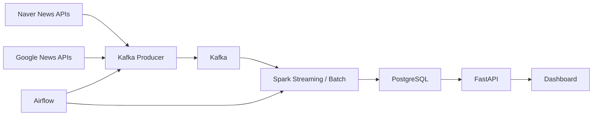

# News Trend Pipeline 

현재 저장소에는 전체 파이프라인 중 1단계인 `뉴스 수집 -> Kafka 적재 -> 적재 확인` 범위까지 구현한 내용이 들어 있습니다.

## 프로젝트 개요

본 프로젝트는 특정 도메인(테마)을 정의하고, 해당 도메인 내에서의 키워드 트렌드를 분석하는 뉴스 트렌드 분석 파이프라인을 구축하는 것을 목표로 합니다.

"전체 뉴스 키워드 분석"이 아닌 **"도메인(테마) 기반 뉴스 트렌드 분석"** 으로, 검색 API 구조의 편향을 의도된 필터로 전환하여 실제 활용 가능한 인사이트를 제공합니다.

도메인별 키워드 집합(Keyword Pool)을 기반으로 뉴스를 수집하고, 스트리밍/배치 처리를 통해 키워드 트렌드와 급상승 이슈를 탐지한 뒤 API와 대시보드로 제공합니다. 프로젝트의 부가적인 의미는 안정적인 데이터 파이프라인 구축을 연습하기 위함입니다.

> 방향 전환 배경은 [`docs/DIRECTION.md`](./docs/DIRECTION.md)에 정리되어 있습니다.

전체 프로젝트는 아래와 같은 흐름을 목표로 합니다.



## 단계별 진행 현황

| 단계 | 상태 | 내용 |
| --- | --- | --- |
| 1단계 | `완료` | 뉴스 수집과 Kafka 적재 |
| 2단계 | `예정` | Spark 기반 기본 집계 |
| 3단계 | `예정` | 이벤트 분석 |
| 4단계 | `예정` | API 조회 계층 |
| 5단계 | `예정` | 대시보드 완성 |

### 1단계. 뉴스 수집과 Kafka 적재 `완료`

현재 이 저장소에서 구현된 단계입니다.

- Airflow DAG 기반 수집 작업 스케줄링
- Naver News API 테마 키워드 병렬 호출 (STEP1_KAFKA_2)
- Kafka `news_topic` 적재 (partition key = URL)
- 실패 메시지 `runtime/state/dead_letter.jsonl`에 기록
- Auto replay DAG로 자동 재처리 (15분 주기)
- Consumer 스크립트로 Kafka 적재 결과 확인

### 2단계. Spark 기반 기본 집계 `예정`

앞으로 구현할 단계입니다.

- Kafka 메시지를 읽어 기사 스키마로 파싱
- `published_at` 기준 event time 정규화
- 제목/요약/본문 텍스트 정제
- HTML 제거, 불용어 제거, 토큰화 등 전처리
- 공급원별 특성에 맞는 키워드 추출
- Spark 스트리밍에서 10분 단위 윈도우 기본 집계 생성
- 상위 키워드, 키워드 트렌드, 연관 키워드 계산
- PostgreSQL에 기사 원문과 집계 결과 저장

### 3단계. 이벤트 분석 `예정`

앞으로 구현할 단계입니다.

- 급상승 키워드 탐지 로직 구현
- 직전 구간 대비 증가율 계산
- 임계치 기반 이벤트 후보 탐지
- 공급원별 이벤트 비교

### 4단계. API 조회 계층 `예정`

앞으로 구현할 단계입니다.

- FastAPI 조회 API 구현
- 저장된 집계 결과를 10분, 30분, 1시간, 6시간, 12시간, 1일 단위로 재구성해 제공
- 키워드, 트렌드, 이벤트, 관련 기사 조회 API 구성

### 5단계. 대시보드 완성 `예정`

앞으로 구현할 단계입니다.

- Streamlit 대시보드 구현
- 공급원 선택: 글로벌 뉴스(NewsAPI) / 네이버 뉴스
- 상위 키워드 막대 차트
- 키워드 트렌드 선 차트
- 급상승 키워드 타임라인 차트
- 선택 시간대의 급상승 키워드 목록
- 선택 키워드의 연관 키워드 차트
- 선택 키워드와 시간대에 해당하는 관련 기사 목록 및 원문 링크

## 디렉토리 구조

src layout으로 리팩토링되었습니다. 애플리케이션 코드는 `src/news_trend_pipeline/` 패키지 안으로 모으고, Airflow DAG/Docker 설정/런타임 산출물을 각각 별도 최상위 폴더로 분리했습니다.

```text
news-trend-pipeline/
├─ src/
│  └─ news_trend_pipeline/
│     ├─ __init__.py
│     ├─ core/                # 공통 설정, 로거, 유틸 (구 common/)
│     ├─ ingestion/           # API client / Kafka producer / replay
│     ├─ processing/          # (예정) Spark 집계
│     ├─ analytics/           # (예정) 이벤트 분석
│     ├─ api/                 # (예정) FastAPI 조회 계층
│     └─ dashboard/           # (예정) Streamlit 대시보드
├─ airflow/
│  └─ dags/                   # Airflow DAG 정의 (구 batch/dags/)
├─ infra/
│  └─ airflow/
│     ├─ Dockerfile.airflow   # Airflow 이미지
│     ├─ config/              # airflow.cfg
│     └─ plugins/             # Airflow plugins
├─ runtime/
│  ├─ state/                  # 수집 상태, dead_letter.jsonl 등 (구 state/)
│  └─ logs/                   # Airflow 로그 (구 airflow-docker/logs/)
├─ tests/
│  ├─ unit/
│  └─ integration/
├─ scripts/                   # Kafka consumer 확인 스크립트 등
├─ docs/
│  ├─ DIRECTION.md
│  ├─ STEP1_KAFKA.md
│  ├─ STEP1_KAFKA_2.md        # Naver 병렬 호출 + URL partition key + 구조 리팩토링
│  └─ DISASTER_RECOVERY.md
├─ requirements/              # 레거시 requirements (Docker 빌드에서 사용)
├─ pyproject.toml             # setuptools src layout 패키지 설정
├─ docker-compose.yml
├─ .env / .env.example
└─ README.md
```

컨테이너 안에서는 프로젝트 루트를 `/opt/news-trend-pipeline` 에 마운트하며, `PYTHONPATH=/opt/news-trend-pipeline/src` 로 `news_trend_pipeline` 패키지를 import할 수 있도록 구성되어 있습니다. 로컬 개발 시에는 `pip install -e .` 로 editable 설치를 사용하거나 `PYTHONPATH=src` 환경변수를 설정하세요.

## 실행

### 1. 환경 파일 준비

- `.env.example`을 복사해 `.env`를 생성합니다.

#### 필수 입력값

- `NAVER_CLIENT_ID`: Naver 검색 API Client ID
- `NAVER_CLIENT_SECRET`: Naver 검색 API Client Secret

#### 주요 설정값

- `NEWS_PROVIDERS`: 사용할 수집원 목록 (기본값 `naver`, STEP1_KAFKA_2에서 NewsAPI 제거)
- `NAVER_THEME_KEYWORDS`: 병렬 호출 대상 테마 키워드 (콤마 구분)
- `NAVER_MAX_WORKERS`: Naver 병렬 호출 워커 수 (기본 8)
- `NAVER_NEWS_MAX_PAGES`: 키워드당 최대 페이지 수
- `KAFKA_BOOTSTRAP_SERVERS`: Kafka 접속 주소
- `KAFKA_TOPIC`: 정상 메시지 topic
- `STATE_DIR`: 수집 상태/Dead Letter 파일 경로 (기본 `./runtime/state`)

```powershell
Copy-Item .env.example .env
```

### 2. 컨테이너 실행

주의: 아래 명령은 `docker-compose.yml`이 있는 프로젝트 루트에서 실행합니다.

```powershell
docker compose up --build -d
```

### 3. 로컬에서 패키지 실행 (선택)

```bash
pip install -e .
python -m news_trend_pipeline.ingestion.producer          # Kafka로 뉴스 적재
python -m news_trend_pipeline.ingestion.replay            # Dead Letter 재처리
python scripts/consumer_check.py --max-messages 5         # 적재 결과 확인
```

`pip install -e .` 이 여의치 않다면 환경변수로 대체할 수 있습니다.

```bash
export PYTHONPATH="$(pwd)/src"
python -m news_trend_pipeline.ingestion.producer
```

## 문서

- [단계 1: Kafka 수집](./docs/STEP1_KAFKA.md) - 뉴스 API 수집, Kafka 적재, 적재 결과 확인
- [단계 1: Kafka 수집 Rev.2](./docs/STEP1_KAFKA_2.md) - Naver 병렬 호출, URL partition key, src layout 구조 리팩토링
- [단계 1: 장애 대응 및 복구](./docs/DISASTER_RECOVERY.md) - Dead Letter 처리, 자동/수동 재처리, 모니터링 가이드