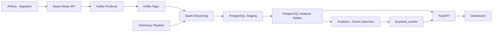

# News Trend Pipeline

뉴스 데이터를 수집하고 Kafka, Spark, PostgreSQL 기반으로 도메인별 키워드 트렌드를 분석하는 **end-to-end 데이터 파이프라인 프로젝트**입니다.

이 프로젝트는 단순 크롤러가 아니라 **데이터 수집 → 스트리밍 처리 → 분석 → 서빙 → 대시보드**까지 전체 흐름을 구현하는 것을 목표로 합니다.

---

# 1. 핵심 목표

```text
뉴스 수집
→ Kafka 적재
→ Spark 처리
→ PostgreSQL 저장
→ 이벤트 분석
→ FastAPI 제공
→ Dashboard 시각화
```

---

# 2. 전체 파이프라인 아키텍처



---

# 3. STEP 기반 구조

## STEP 1. Ingestion
- Airflow DAG 기반 뉴스 수집
- 도메인별 query keyword 사용
- Kafka publish

## STEP 2. Processing
- Spark Structured Streaming
- 텍스트 전처리 + 키워드 추출
- keyword_trends / keyword_relations 생성

## STEP 3. Storage
- PostgreSQL staging → analysis upsert 구조
- provider + domain 기준 데이터 분리

## STEP 4. Analytics
- keyword_trends 기반 이벤트 분석
- growth 계산
- spike 탐지
- keyword_events 생성

## STEP 5. Serving

### STEP5-1 API (FastAPI)
- PostgreSQL 조회
- overview-window API 제공
- bucket 기반 데이터 반환

### STEP5-2 Dashboard (Frontend)
- KPI / Keywords / Trend / Spikes UI
- cache 기반 재집계
- drag / zoom 시 API 호출 최소화

---

# 4. Serving 아키텍처 (핵심)

```text
Backend (FastAPI)
→ 넓은 범위 bucket 데이터 제공

Frontend (Dashboard)
→ 현재 window 기준 재집계
→ UI 즉시 반응
```

👉 Hybrid Aggregation 구조

---

# 5. 주요 기술 스택

| 영역 | 기술 |
| --- | --- |
| Orchestration | Airflow |
| Messaging | Kafka |
| Processing | Spark Structured Streaming |
| Storage | PostgreSQL |
| API | FastAPI |
| Dashboard | React + Vite |
| NLP | Kiwi |
| Infra | Docker Compose |

---

# 6. 데이터 흐름 요약

## 6-1. 수집

- Airflow → Naver API → Kafka

## 6-2. 처리

- Spark → 전처리 → 키워드 추출

## 6-3. 저장

- staging → upsert → analysis tables

## 6-4. 분석

- keyword_trends → keyword_events

## 6-5. 서빙

- FastAPI → Dashboard

---

# 7. 핵심 테이블

- news_raw
- keywords
- keyword_trends
- keyword_relations
- keyword_events
- dictionary tables
- collection_metrics

---

# 8. 디렉토리 구조

```text
src/
├─ ingestion/
├─ processing/
├─ analytics/
├─ storage/
├─ api/
└─ dashboard/
```

---

# 9. 실행

```bash
docker compose up --build -d
```

---

# 10. 설계 문서

```text
docs/design/
├─ STEP1_INGESTION.md
├─ STEP2_PROCESSING.md
├─ STEP3_STORAGE.md
├─ STEP4_ANALYTICS.md
├─ STEP5_SERVING.md
├─ STEP5_API.md
└─ STEP5_DASHBOARD.md
```

---

# 11. 한 줄 정리

```text
Kafka + Spark + PostgreSQL 기반 실시간 뉴스 트렌드 분석 파이프라인 + FastAPI + Dashboard 서빙 시스템
```