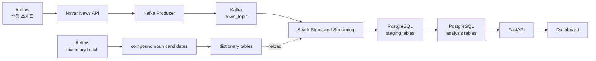

# News Trend Pipeline

뉴스 데이터를 수집하고 Kafka, Spark, PostgreSQL 기반으로 도메인별 키워드 트렌드를 분석하는 데이터 파이프라인 프로젝트입니다.

이 프로젝트의 핵심 목표는 단순한 뉴스 크롤러가 아니라, **Airflow + Kafka + Spark + PostgreSQL을 활용한 end-to-end 데이터 파이프라인 구축**입니다.

## 1. 프로젝트 목표

```text
뉴스 수집
→ 메시지 큐 적재
→ 스트리밍 처리
→ 키워드/트렌드 집계
→ DB 저장
→ API/Dashboard 제공
```

주요 설계 방향은 다음과 같습니다.

- 도메인 기반 뉴스 수집
- Kafka를 통한 수집/처리 계층 분리
- Spark Structured Streaming 기반 near real-time 처리
- PostgreSQL staging + upsert 기반 멱등 저장
- 복합명사/불용어 사전을 활용한 한국어 키워드 품질 개선
- API 및 Dashboard를 통한 조회 계층 제공

## 2. 전체 아키텍처



## 3. 단계별 설계 문서

리팩토링된 설계 문서는 `docs/design_refactor`에 있습니다.

| 단계 | 문서 | 핵심 기술 | 설명 |
| --- | --- | --- | --- |
| STEP 1 | `docs/design_refactor/STEP1_INGESTION.md` | Airflow, Kafka | 뉴스 수집, 도메인별 검색어, Kafka 발행 |
| STEP 2 | `docs/design_refactor/STEP2_PROCESSING.md` | Spark Structured Streaming | Kafka consume, 전처리, 키워드 집계 |
| STEP 3 | `docs/design_refactor/STEP3_STORAGE.md` | PostgreSQL | staging table, upsert, 도메인 기반 저장 |
| STEP 4 | `docs/design_refactor/STEP4_DICTIONARY.md` | Airflow, PostgreSQL | 복합명사/불용어 후보 관리 및 사전 반영 |
| STEP 5 | `docs/design_refactor/STEP5_ANALYTICS.md` | Spark/Batch, PostgreSQL | 트렌드 및 급상승 이벤트 분석 |
| ERD | `docs/design_refactor/ERD.md` | PostgreSQL | 현재 DB 테이블 관계 |

기존 `docs/design` 문서는 원본 reference로 유지합니다.

## 4. 단계별 구현 상태

| 단계 | 상태 | 내용 |
| --- | --- | --- |
| STEP 1. Ingestion | 구현됨 | Airflow DAG, Naver API 수집, Kafka 적재 |
| STEP 2. Processing | 구현됨 | Spark Structured Streaming, 전처리, 키워드/연관어 집계 |
| STEP 3. Storage | 구현됨 | PostgreSQL schema, staging, upsert |
| STEP 4. Dictionary | 구현됨 | 복합명사 후보 추출, 복합명사/불용어 DB 관리 |
| STEP 5. Analytics | 일부 구현 | keyword_events 기반 이벤트 저장 구조 |
| Serving | 일부 구현 | FastAPI, Dashboard 구조 |

## 5. 주요 기술 스택

| 영역 | 기술 |
| --- | --- |
| Orchestration | Airflow |
| Messaging | Kafka, Zookeeper |
| Processing | Spark Structured Streaming |
| Storage | PostgreSQL |
| API | FastAPI |
| Dashboard | Frontend app |
| Korean NLP | Kiwi / kiwipiepy |
| Runtime | Docker Compose |

## 6. 데이터 흐름 요약

### 6-1. 수집

1. Airflow가 수집 DAG를 실행합니다.
2. DB의 `query_keywords`에서 도메인별 검색어를 가져옵니다.
3. Naver API를 호출합니다.
4. URL 기준으로 중복을 제거합니다.
5. Kafka `news_topic`에 메시지를 발행합니다.

### 6-2. 처리

1. Spark가 Kafka 메시지를 읽습니다.
2. JSON을 기사 스키마로 파싱합니다.
3. `title + summary`를 기준으로 텍스트를 전처리합니다.
4. 복합명사/불용어 사전을 적용합니다.
5. 기사별 키워드, 시간대별 트렌드, 연관 키워드를 계산합니다.

### 6-3. 저장

1. Spark가 JDBC로 staging table에 append합니다.
2. PostgreSQL 내부에서 dedup/upsert를 수행합니다.
3. 최종 테이블에 `provider + domain` 기준으로 저장합니다.

### 6-4. 분석

1. `keyword_trends`를 기준으로 시간대별 변화량을 계산합니다.
2. 급상승 키워드는 `keyword_events`에 저장합니다.
3. API/Dashboard가 저장된 분석 결과를 조회합니다.

## 7. 핵심 DB 테이블

| 분류 | 테이블 |
| --- | --- |
| 도메인/검색어 | `domain_catalog`, `query_keywords` |
| 원문/키워드 | `news_raw`, `keywords` |
| 집계 | `keyword_trends`, `keyword_relations` |
| 사전 | `compound_noun_dict`, `compound_noun_candidates`, `stopword_dict`, `dictionary_versions` |
| 품질/이벤트 | `collection_metrics`, `keyword_events` |
| staging | `stg_news_raw`, `stg_keywords`, `stg_keyword_trends`, `stg_keyword_relations` |

상세 스키마는 `docs/design_refactor/ERD.md`와 `docs/design/STEP2_DATABASE.md`를 참고합니다.

## 8. 디렉토리 구조

```text
news-trend-pipeline-dev/
├─ src/
│  ├─ core/          # 설정, 도메인 정의, 공통 유틸
│  ├─ ingestion/     # 뉴스 수집, Kafka producer, replay
│  ├─ processing/    # Spark streaming, 전처리
│  ├─ analytics/     # 복합명사 후보 추출, 이벤트 분석
│  ├─ storage/       # PostgreSQL schema 및 접근 계층
│  ├─ api/           # FastAPI 조회 계층
│  └─ dashboard/     # Frontend dashboard
├─ airflow/dags/     # Airflow DAG
├─ infra/            # Docker image/config
├─ runtime/          # state, checkpoint, logs
├─ docs/
│  ├─ design/         # 기존 설계 문서 원본
│  └─ design_refactor/# 리팩토링 설계 문서
├─ scripts/
├─ tests/
└─ docker-compose.yml
```

## 9. 실행

### 9-1. 환경 파일 준비

```bash
cp .env.example .env
```

필수 값:

```text
NAVER_CLIENT_ID
NAVER_CLIENT_SECRET
```

### 9-2. Docker Compose 실행

```bash
docker compose up --build -d
```

### 9-3. 로컬 실행 예시

```bash
pip install -e .
python -m ingestion.producer
python scripts/consumer_check.py --max-messages 5
python scripts/run_processing.py
```

## 10. 문서 운영 원칙

- `README_REFACTOR.md`: 프로젝트 전체 개요
- `docs/design_refactor/STEP*.md`: 단계별 아키텍처 설명
- 세부 알고리즘/전처리/DB 상세는 별도 문서로 분리
- 기존 `docs/design` 문서는 당분간 원본 reference로 유지

## 11. 다음 개선 후보

- Serving/API 단계를 별도 STEP으로 분리
- Dashboard 문서 분리
- 이벤트 스코어 산정 방식 상세 문서화
- 전처리 상세 문서 리팩토링
- 운영/모니터링 문서 추가
