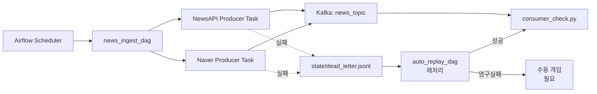

# Step 1 - Kafka Ingestion

Airflow가 뉴스 API에서 기사를 수집하고 Kafka Topic에 적재한 뒤, consumer로 적재 결과를 확인하는 1단계 제출 문서입니다.

## 1. 파이프라인 구성도



## 2. Kafka 수집 설계

### a. Producer 코드 흐름

1. Airflow `news_ingest_dag`가 주기적으로 실행됩니다.
2. `check_kafka_health`가 Kafka broker 연결 가능 여부를 먼저 확인합니다.
3. `produce_newsapi`, `produce_naver`가 병렬로 각 뉴스 API를 호출합니다.
4. `ingestion/producer.py`가 기사 데이터를 공통 스키마로 정규화합니다.
5. 정규화한 메시지에 `metadata`를 추가해 Kafka `news_topic`으로 전송합니다.
6. 실패 메시지는 `state/dead_letter.jsonl` (로컬 파일)에 기록합니다.
7. `scripts/consumer_check.py`로 적재 결과를 확인합니다.

#### 데이터 수집 로직 설명

##### NewsAPIClient

- `from_timestamp`가 있으면 증분 수집을 수행합니다.
- 없으면 1시간, 6시간, 24시간, 72시간 fallback window를 순서대로 탐색합니다.
- `sortBy=publishedAt` 기준으로 최신 기사부터 조회합니다.
- 1회 API 호출에서 최대 `100건`까지 조회합니다.
- 페이징 로직은 유지하지만 무료 플랜 기준으로 `NEWS_MAX_PAGES=1`만 사용합니다.
- 15분 주기 수집에서는 `last_timestamp`를 저장해 이전 수집 이후 기사만 다시 보도록 하여 중복 호출을 줄이면서 최신 기사 누락 가능성을 낮추도록 했습니다.
- 첫 실행이나 상태 유실 상황에서는 fallback window를 통해 초기 공백을 최대한 메우도록 했습니다.

##### NewsAPI 무료 플랜 제약

- `page` 파라미터 구조는 지원하지만 무료 플랜에서는 사실상 1페이지만 안정적으로 사용할 수 있습니다.
- 그래서 다중 페이지를 전제로 한 대량 수집 대신, `publishedAt` 최신순 + 증분 수집 + fallback window 조합으로 누락을 줄이는 방향을 선택했습니다.
- 현재 설정 기준으로는 1회 실행에서 `최대 100건`까지 수집 가능한 구조입니다.
- 특정 시간대에 기사량이 급증하면 일부 누락 가능성은 남아 있습니다.

##### NaverNewsClient

- 최신순으로 조회합니다.
- 최대 3페이지까지 조회할 수 있습니다.
- 페이지당 최대 `100건`씩 조회합니다.
- 15분 주기 수집에서는 `last_timestamp`를 저장해 이전 수집 이후 기사만 `published_at` 기준으로 필터링합니다.
- URL 기준 중복 제거를 적용합니다.
- 현재 설정 기준으로는 1회 실행에서 `최대 300건`까지 조회 후 필터링합니다.
- 15분 주기 수집에서는 API 자체 시간 조건이 없기 때문에, 최신순 다중 페이지 조회 후 `published_at` 기준 필터링으로 최근 기사 누락을 줄이도록 설계했습니다.

##### Naver API 제약

- Naver 뉴스 검색 API는 `from_timestamp` 같은 시간 조건 파라미터를 직접 지원하지 않습니다.
- 따라서 API 호출 자체를 특정 시점 이후 기사만 조회하는 방식으로 제한할 수 없습니다.
- 최신순 결과를 받은 뒤 애플리케이션에서 `published_at` 기준으로 후처리 필터링해야 합니다.
- 짧은 시간에 많은 기사가 쏟아질 경우 오래된 결과가 뒤로 밀려 누락될 수 있습니다.

##### NAVER_NEWS_MAX_PAGES=3로 둔 이유

- 이 값은 무료 플랜 제한 때문이 아니라 현재 단계에서 정한 수집 범위 설정입니다.
- 15분 주기 수집 기준으로 1페이지 100건만 보면 기사 급증 구간에서 최신 결과 뒤로 밀린 문서를 놓칠 수 있어 여유분을 두었습니다.
- 반대로 너무 많은 페이지를 조회하면 호출 수와 후처리 비용이 커집니다.
- 과제 단계에서는 `100건 x 3페이지 = 최대 300건`을 실용적인 절충안으로 선택했습니다.

##### Producer 공통 처리

- provider별 `last_timestamp`, `published_urls`를 `state/producer_state.json`에 저장합니다. 최대 1000건까지 저장합니다.
- `provider::url` 기준으로 중복 적재를 줄입니다.
- `published_urls`를 함께 저장해 같은 provider에서 동일 URL이 반복 적재되는 상황을 줄였습니다.
- Airflow 15분 주기에서는 호출량과 최신성 사이의 균형이 중요하므로, 이번 단계는 “완전 무누락 보장”보다 “제한된 호출 수 안에서 최대한 최근 데이터를 안정적으로 회수하는 구조”에 초점을 맞췄습니다.

#### 무료 API 한도와 현재 시스템 예상 호출량 비교

##### 기본 실행 횟수

- Airflow 스케줄은 `15분마다 1회`이므로 하루 기본 실행 횟수는 `96회`입니다.

##### NewsAPI

- 공식 무료 Developer 플랜 한도는 `100회/일`입니다.
- 현재 시스템 정상 운영 기준 예상 호출량은 `약 96회/일`입니다.
- 대부분 실행은 `from_timestamp` 기반 증분 수집으로 1회 호출에 끝납니다.
- 첫 실행, 상태 유실, fallback 탐색이 모두 발생하면 1회 실행에서 최대 5회 호출될 수 있어 이론상 `최대 480회/일`까지 증가할 수 있습니다.
- 따라서 NewsAPI는 현재 설계에서 무료 한도에 매우 근접한 API입니다.

##### Naver Search API

- 공식 검색 API 무료 한도는 `25,000회/일`입니다.
- 현재 시스템 정상 운영 기준 예상 호출량은 `최대 288회/일`입니다.
- 이유는 15분 주기 `96회/일` x 최대 3페이지 호출 구조이기 때문입니다.
- 따라서 Naver는 현재 설계에서 무료 한도 대비 여유가 큰 편입니다.

##### 정리

- 현재 시스템에서 호출 한도 리스크가 큰 쪽은 `NewsAPI`입니다.
- `Naver`는 상대적으로 호출 여유가 크지만, 시간 필터 부재에 따른 데이터 누락 가능성은 페이지 수와 후처리로 보완하는 구조입니다. 초기 `NewsAPI`만으로 구축을 했다가 `Naver API` 데이터 소스를 추가한 이유이기도 합니다.

#### 메시지 생성 방식

##### 공통 필드

- `provider`: 수집 API 구분
- `source`: 언론사/매체 정보
- `title`: 기사 제목
- `summary`: 기사 요약
- `url`: 원문 링크
- `published_at`: 기사 발행 시각
- `ingested_at`: 수집 시각

##### metadata 필드

- `source`
  - provider 이름

- `version`
  - 스키마 버전

- `query`
  - 수집 쿼리

#### Error handling 전략

##### 유실 방지

- `acks=all`: 모든 replica ack 확인
- `enable_idempotence=True`: 중복 없는 재전송
- `retries=5`: 일시 실패 재시도
- `max_in_flight_requests_per_connection=1`: 순서 보장

##### 중복 방지

- provider별 `last_timestamp` 기반 증분 수집
- `provider::url` 기반 중복 제거

##### 실패 처리

- 전송 실패 시 `state/dead_letter.jsonl` 파일에 기록
  - 로컬 백업 및 자동 재처리용
  - 영구 구조로 Kafka 브로커 장애 시에도 데이터 유실 방지

- Airflow 로그에서 task 단위 원인 확인 가능

##### 장애복구

`auto_replay_dag.py` 스케줄로 자동 장애 복구를 수행합니다.

**데이터 흐름 (간단 버전)**

<details>
<summary>코드</summary>

```text
API (NewsAPI/Naver)
    ↓
Kafka 전송
    ├→ 성공 → news_topic → consumer_check.py
    └→ 실패 → dead_letter.jsonl
              ↓
              auto_replay_dag (15분마다 자동 재처리)
              ├→ 성공 → dead_letter_replayed.jsonl
              └→ 3회 실패 → dead_letter_permanent.jsonl
                            ↓
                         관리자 확인 필요
```

</details>

**두 DAG의 동시 운영 (예시)**

<details>
<summary>코드</summary>

```text
14:00  news_ingest_dag          auto_replay_dag (동시 실행)
       └─ 기사 8건 수집          └─ dead_letter 2건 읽음
       └─ 2건 실패 발생          └─ 1건 성공, 1건 재실패

14:15  news_ingest_dag          auto_replay_dag
       └─ 기사 7건 수집          └─ dead_letter 1건 읽음 (attempt: 1→2)
       └─ 1건 실패              └─ 재실패

14:30  news_ingest_dag          auto_replay_dag
       └─ 기사 6건 수집          └─ dead_letter 1건 읽음 (attempt: 2→3)
                                 └─ 재실패

14:45                           auto_replay_dag
                                └─ dead_letter 1건 읽음 (attempt: 3→4: 초과)
                                └─ 영구 실패 발생 → 수동 개입 필요
```

</details>

##### 장애 상황별 대응 및 복구

Kafka 전송 실패, Kafka 브로커 다운, API 네트워크 장애, API 키 만료, Docker 네트워크 문제 등 장애 유형별 상세한 대응 및 복구 절차는 **[장애 대응 및 복구 가이드](./DISASTER_RECOVERY.md)**를 참조하세요.

주요 항목:
- [Kafka 전송 실패 (재시도 가능)](./DISASTER_RECOVERY.md#a-kafka-전송-실패-재시도-가능)
- [Kafka 브로커 다운](./DISASTER_RECOVERY.md#b-kafka-브로커-다운)
- [API 네트워크 장애](./DISASTER_RECOVERY.md#c-api-네트워크-장애-재시도-불가)
- [API 키 만료/오류](./DISASTER_RECOVERY.md#d-api-키-만료오류-재시도-불가)
- [Docker 네트워크 문제](./DISASTER_RECOVERY.md#e-docker-네트워크-문제)

##### 재처리 방식

**자동 재처리 (`auto_replay_dag`)와 수동 재처리 (`replay.py`)** 두 가지 방식이 있습니다.

상세한 실행 방법, 각 방식의 특징, 활성화 방법은 **[장애 대응 및 복구 가이드 - 자동 vs 수동 재처리](./DISASTER_RECOVERY.md#3-자동-vs-수동-재처리)** 섹션을 참조하세요.

### b. 정규화된 메시지 예시 (JSON)

<details>
<summary>코드</summary>

```json
{
  "provider": "naver",
  "source": "www.theverge.com",
  "title": "AI chip demand keeps rising despite economic slowdown",
  "summary": "Semiconductor companies are seeing record demand for AI processors as companies rush to build generative AI systems.",
  "url": "https://www.theverge.com/2026/1/8/ai-chip-demand",
  "published_at": "2026-01-08T10:30:00Z",
  "ingested_at": "2026-01-08T10:35:22Z",
  "metadata": {
    "source": "naver",
    "version": "v1",
    "query": "AI"
  }
}
```

</details>

<details>
<summary>코드</summary>

```json
{
  "provider": "naver",
  "source": "news.naver.com",
  "title": "Korean Tech Giants Invest Heavily in AI Chip Research",
  "summary": "South Korea's major technology companies announced multi-billion dollar investments in AI chip development to compete globally.",
  "url": "https://news.naver.com/main/read.naver?oid=015&aid=0004851234",
  "published_at": "2026-01-08T09:15:00Z",
  "ingested_at": "2026-01-08T10:35:22Z",
  "metadata": {
    "source": "naver",
    "version": "v1",
    "query": "인공지능 반도체"
  }
}
```

</details>

### c. Topic 구성 방식

##### Topic 이름 및 개수

- `news_topic`

총 1개입니다.

##### 각 Topic의 역할

- `news_topic`
  - 정상 수집 기사 메시지 저장

##### Partitioning 전략

- `news_topic`
  - 2 partitions

`docker-compose.yml`의 `kafka-init` 서비스가 `news_topic`을 명시적으로 생성합니다.

##### Partition Key 선택

- `provider`

##### 왜 그렇게 선택했는가

- 현재 단계는 NewsAPI와 Naver 두 공급원 중심이라 provider 단위 흐름 구분이 단순합니다.
- 같은 provider 메시지가 같은 partition으로 들어갈 가능성이 높아 순서 추적이 쉽습니다.

##### Partition Key 선택 및 개선 방향

- 현재는 개발 편의상 `provider`를 partition key로 사용하고 있으나, provider 수가 제한적이거나 트래픽이 불균형할 경우 특정 partition에 부하가 몰리는 **hot partition (partition skew)** 문제가 발생할 수 있습니다.
- 또한 본 프로젝트는 콘텐츠 순서 보장이 중요하지 않으므로 provider 기준으로 묶을 필요성이 낮습니다.
- 단순 round-robin 방식은 균등 분배는 가능하지만, 동일 콘텐츠가 서로 다른 partition으로 분산되어 중복 처리, 재처리, 디버깅이 어려워질 수 있습니다.

따라서 향후에는 다음과 같이 개선할 계획입니다.

- 기사 URL 또는 hash 기반 **고유키 사용**
  - partition 간 균등 분배
  - 동일 콘텐츠는 항상 같은 partition으로 라우팅
  - 중복 처리 및 운영 추적 용이

정리하면 `provider key → 고유키 기반 partitioning`으로 전환하는 것이 적절합니다.

##### Configuration 설정

- `acks=all`: broker 복제본까지 ack를 받아 유실 가능성을 줄이기 위해 설정
- `enable_idempotence=True`: 재시도 상황에서도 중복 전송을 줄이기 위해 설정
- `retries=5`: 일시적인 네트워크 오류를 자동 복구하기 위해 설정
- `compression_type=gzip`: 기본 이미지에서 바로 사용 가능하고 전송량 절감 효과가 있어 설정
- `KAFKA_AUTO_CREATE_TOPICS_ENABLE=true`: 개발 단계에서 토픽 미생성 상황에 대비한 보조 안전장치로 설정
- `kafka-init`로 `news_topic` 생성: 실행 시점마다 필요한 토픽을 명시적으로 보장하기 위해 설정

## 3. 실행 가능한 코드

### 필수 파일

- `ingestion/producer.py`
- `docker-compose.yml`
- `batch/dags/news_ingest_dag.py`
- `scripts/consumer_check.py`
- `common/config.py`
- `ingestion/api_client.py`
- `airflow-docker/Dockerfile.airflow`

### 실행 순서

#### 1. 환경 파일 준비

- `.env.example`을 복사해 `.env`를 생성합니다.

##### 필수 입력값

- `NEWS_API_KEY`: NewsAPI 인증 키
- `NAVER_CLIENT_ID`: Naver 검색 API Client ID
- `NAVER_CLIENT_SECRET`: Naver 검색 API Client Secret

##### 주요 설정값

- `NEWS_PROVIDERS`: 사용할 수집원 목록
- `NEWS_QUERY`: NewsAPI 검색어
- `NEWS_PAGE_SIZE`: NewsAPI 1회 호출 건수
- `NEWS_MAX_PAGES`: NewsAPI 최대 페이지 수
- `NAVER_NEWS_QUERY`: Naver 뉴스 검색어
- `NAVER_NEWS_DISPLAY`: Naver 페이지당 조회 건수
- `NAVER_NEWS_MAX_PAGES`: Naver 최대 페이지 수

##### Kafka 관련 설정

- `KAFKA_BOOTSTRAP_SERVERS`: Kafka 접속 주소
- `KAFKA_TOPIC`: 정상 메시지 topic


```powershell
Copy-Item .env.example .env
```

#### 2. API 키 입력

- `.env`에 본인 API 키를 입력합니다.

#### 3. Docker Compose 실행

- 아래 명령은 `docker-compose.yml`이 있는 `news-trend-pipeline-dev` 디렉토리에서 실행합니다.


```powershell
docker compose up --build -d
```

#### 4. Airflow UI 접속

- URL
  - `http://localhost:9080`
- 기본 계정
  - `airflow / airflow`

#### 5. DAG 실행

- `news_ingest_dag`를 활성화하고 실행합니다.
- `auto_replay_dag`를 활성화하고 실행합니다.

#### 6. Kafka 적재 결과 확인

- 아래 명령은 `docker-compose.yml`이 있는 디렉토리에서 실행합니다.

```powershell
docker compose exec airflow-scheduler python /opt/news-trend-pipeline/scripts/consumer_check.py --max-messages 5
```

- `kafka-console-consumer.sh`로 적재 데이터 확인

`consumer_check.py` 외에도 Kafka 기본 CLI인 `kafka-console-consumer.sh`를 사용해서 topic에 적재된 데이터를 직접 확인할 수 있습니다.

##### 전체 메시지 확인
```bash
kafka-console-consumer.sh \
  --bootstrap-server localhost:9092 \
  --topic news_topic \
  --from-beginning
```

##### 파티션별 메시지 확인

partition 0 조회

```bash
kafka-console-consumer.sh \
  --bootstrap-server localhost:9092 \
  --topic news_topic \
  --partition 0 \
  --from-beginning
```

partition 1 조회

```bash
kafka-console-consumer.sh \
  --bootstrap-server localhost:9092 \
  --topic news_topic \
  --partition 1 \
  --from-beginning
```