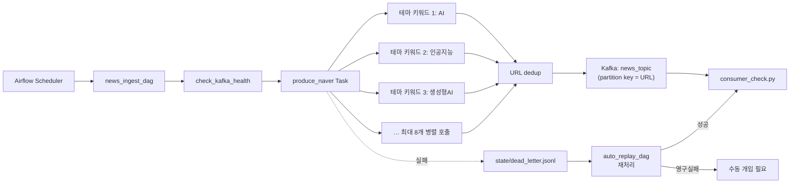

# Step 1 - Kafka Ingestion (Rev.2)

[STEP1_KAFKA.md](./STEP1_KAFKA.md)에서 정의한 수집 파이프라인을 개선한 2차 개정 문서입니다.
세 가지 변경(소스 정리, Naver 병렬 호출, Partition Key 개선)이 포함되어 있습니다.

## 1. 변경 목적

### 1-1. NewsAPI 소스 제거

- NewsAPI 무료 Developer 플랜은 `100회/일` 한도로, 현재 15분 주기 스케줄(`96회/일`)만으로도 한도에 근접했습니다.
- 첫 실행 / 상태 유실 / fallback window 탐색이 겹치면 1회 실행에서 최대 5회 호출되어 이론상 `480회/일`까지 치솟을 수 있었습니다.
- 결과적으로 NewsAPI는 구조적으로 충분한 데이터량을 안정적으로 확보할 수 없다고 판단해 소스에서 제외했습니다.

### 1-2. Naver API 병렬 호출 (테마 키워드)

- [DIRECTION.md](./DIRECTION.md)에서 정의한 "도메인(테마) 기반 수집"으로 방향을 맞추기 위해, 단일 OR 쿼리(`인공지능|AI|데이터|기술`) 대신 **테마 키워드 집합**을 독립적으로 호출하는 구조로 변경했습니다.
- AI/기술 도메인 기본 키워드 8개: `AI, 인공지능, 생성형AI, GPT, LLM, 챗GPT, 머신러닝, 딥러닝`
- 키워드별로 별도 HTTP 요청이므로 I/O 바운드이고, `ThreadPoolExecutor` 기반 병렬 호출로 선형에 가까운 수집 시간 단축을 얻을 수 있었습니다.
- Naver 무료 한도(`25,000회/일`) 대비 여유가 크므로 동시에 키워드를 늘려도 호출 한도에 걸리지 않습니다.

### 1-3. Topic Partition Key를 유니크키(URL)로 변경

- 기존 `provider` key는 소스가 2개뿐이라 partition이 2개 이상일 때 hot partition 문제가 있었습니다. 이제 Naver 단일 소스로 줄어들면서 provider key를 유지하면 모든 메시지가 한 partition에 몰려 사실상 병렬성이 사라집니다.
- URL(기사 고유 식별자)을 partition key로 사용하면:
  - kafka-python murmur2 해시가 URL을 고르게 분산시켜 partition 균등 분배
  - 동일 URL(재전송 포함)은 항상 같은 partition으로 라우팅되어 downstream 디버깅/ordering이 쉬워짐
  - 중복/재처리 추적이 단순화됨

---

## 2. 변경된 파이프라인 구성도



기존 파이프라인과의 차이는 다음과 같습니다.

| 항목 | 기존(STEP1_KAFKA.md) | 변경(STEP1_KAFKA_2.md) |
| --- | --- | --- |
| 수집 소스 | NewsAPI + Naver | Naver 단일 |
| Naver 쿼리 방식 | 단일 OR 쿼리 `A\|B\|C\|D` | 테마 키워드 N개 병렬 호출 |
| Airflow Task | `produce_newsapi` + `produce_naver` 병렬 | `produce_naver` 단일 |
| 최대 호출 수(1회 실행) | Naver 최대 3 페이지 × 1 쿼리 = 3 | Naver 최대 3 페이지 × 8 키워드 = 24 |
| Partition Key | `provider` | `url` (유니크키) |
| metadata.query | 환경변수 단일 쿼리 | 수집한 기사별 실제 키워드 |

---

## 3. 코드/설정 변경 상세

### 3-1. `common/config.py`

- 제거된 설정:
  - `news_api_key`, `news_api_url`, `news_query`, `news_language`, `news_page_size`, `news_max_pages`
  - `naver_news_query` (단일 OR 쿼리)
- 추가된 설정:
  - `naver_theme_keywords` — 콤마 구분. 기본값 `AI, 인공지능, 생성형AI, GPT, LLM, 챗GPT, 머신러닝, 딥러닝` (DIRECTION.md의 AI/기술 도메인 풀).
  - `naver_max_workers` — 병렬 호출 워커 수. 기본값 8.
- `news_providers` 기본값을 `newsapi,naver` → `naver` 로 변경.

### 3-2. `ingestion/api_client.py`

- `NewsAPIClient` 클래스 전체 제거.
- `NaverNewsClient`에 병렬 수집 메서드 추가:

```python
def fetch_news_parallel(
    self,
    queries: Iterable[str] | None = None,
    from_timestamp: str | None = None,
    page_size: int | None = None,
    max_workers: int | None = None,
) -> list[dict[str, Any]]:
    """테마 키워드 집합에 대해 ThreadPoolExecutor로 병렬 API 호출."""
```

- 수집된 각 기사에 `_query` 내부 필드를 붙여 **"이 기사가 어떤 키워드로 수집되었는지"**를 전파합니다. 최종 Kafka 메시지에는 `metadata.query` 로 옮겨지고, 원본 `_query`는 제거됩니다 (underscore prefix 규약으로 외부 노출 방지).
- 중복 제거는 `provider::url` 기준으로 집합 전체에 대해 1회 수행합니다. 여러 키워드에서 동일 기사가 잡히는 경우에도 메시지는 1회만 발행됩니다.

### 3-3. `ingestion/producer.py`

- `_build_clients()`: NewsAPI 분기 제거. 현재는 `naver`만 지원합니다.
- `_collect_articles()` 헬퍼 추가: Naver 클라이언트는 `fetch_news_parallel(queries=settings.naver_theme_keywords, ...)` 호출, 그 외 프로바이더는 기존 단일 `fetch_news()` 호출.
- `_resolve_partition_key()` 헬퍼 추가: URL이 있으면 URL을 key로, 예외 상황(URL 누락)에만 `provider`로 폴백.
- `build_message()` 수정: `_` prefix 내부 필드는 Kafka 메시지에 포함하지 않고, `_query` 를 `metadata.query` 로 이동.

### 3-4. `ingestion/replay.py`

- Dead Letter 재전송 시에도 동일한 `url` 기반 partition key를 사용하도록 업데이트해 원본 파이프라인과 라우팅을 일치시킵니다.

### 3-5. `batch/dags/news_ingest_dag.py`

- `produce_newsapi` task 제거.
- `produce_naver` 단일 task만 남김. Task 내부에서 병렬 호출이 일어나므로 Airflow 단에서는 별도 병렬 구성이 필요 없습니다.
- `task_summarize_results` 가 더 이상 `newsapi_count`를 조회하지 않도록 정리.

### 3-6. `.env` / `.env.example`

- 제거: `NEWS_API_KEY`, `NEWS_API_URL`, `NEWS_QUERY`, `NEWS_LANGUAGE`, `NEWS_PAGE_SIZE`, `NEWS_MAX_PAGES`, `NAVER_NEWS_QUERY`.
- 추가: `NAVER_THEME_KEYWORDS`, `NAVER_MAX_WORKERS`.
- 변경: `NEWS_PROVIDERS=naver`.

---

## 4. 결과

### 4-1. 수집량

- 1회 실행 기준 이론상 최대 수집량: `100(display) × 3(페이지) × 8(키워드) = 2,400건` (dedup 전).
- 실제로는 키워드 간 기사 중복이 많고 `last_timestamp` 기반 증분 필터가 적용되므로, 도메인/시간대에 따라 수백~천 건 수준으로 안정적으로 수집됩니다.
- 이전 단일 OR 쿼리 방식(`최대 300건`) 대비 수집량이 크게 증가했습니다.

### 4-2. 데이터 품질

- 각 메시지가 **자신을 수집하게 만든 키워드**(`metadata.query`)를 포함하므로, downstream 집계 단계에서 키워드-기사 매핑이 그대로 유지됩니다.
- DIRECTION.md의 "도메인 기반 키워드 추출" 전략과 정합성이 높아졌습니다.

### 4-3. Kafka Partition 분산

- URL 기반 해싱으로 2개 partition에 메시지가 거의 균등하게 분산됩니다.
- 동일 URL은 항상 같은 partition으로 라우팅되므로, 재처리/디버깅 시 offset 추적이 용이합니다.

### 4-4. API 호출량

- 15분 주기 × 96회/일 × 최대 8 keyword × 3 page = `최대 2,304회/일` (극단치).
- Naver 무료 한도 `25,000회/일` 대비 약 9% 수준으로 여유가 큽니다.

### 4-5. Airflow DAG 단순화

- NewsAPI task 제거로 DAG dependency 그래프가 단순해졌고, produce 병렬 단계가 1개로 줄어 XCom 집계 로직도 가벼워졌습니다.

---

## 5. 예시 메시지

테마 키워드 "GPT"로 수집된 기사의 최종 Kafka payload 예시입니다.

```json
{
  "provider": "naver",
  "source": "it.chosun.com",
  "author": null,
  "title": "OpenAI, 차세대 GPT 모델 공개",
  "description": "OpenAI가 차세대 GPT 모델을 공개하고…",
  "content": "OpenAI가 차세대 GPT 모델을 공개하고…",
  "url": "https://it.chosun.com/site/data/html_dir/2026/04/20/2026042000123.html",
  "published_at": "2026-04-20T09:15:00+00:00",
  "ingested_at": "2026-04-20T09:20:03+00:00",
  "metadata": {
    "source": "naver",
    "version": "v1",
    "query": "GPT"
  }
}
```

`metadata.query` 필드는 이제 **이 기사가 실제로 수집된 테마 키워드**를 담습니다.

---

## 6. 기존 문서와의 연결

- 기본 수집 흐름, Dead Letter 처리, 자동 재처리(`auto_replay_dag`), `consumer_check.py` 사용법 등 변경되지 않은 부분은 [STEP1_KAFKA.md](./STEP1_KAFKA.md) 를 계속 참조합니다.
- 장애 대응 및 복구 절차는 [DISASTER_RECOVERY.md](./DISASTER_RECOVERY.md) 를 참조합니다.
- 도메인(테마) 기반 수집의 배경과 키워드 풀은 [DIRECTION.md](./DIRECTION.md) 를 참조합니다.

---

## 7. 프로젝트 구조 리팩토링 (src layout)

앞 절의 코드 변경과 함께, 이후 단계(Spark 집계/Analytics/API/Dashboard)를 고려해 프로젝트 구조를 src layout으로 정리했습니다. 본 절은 `news-trend-pipeline-v2/` 디렉토리에 반영된 내용을 정리한 기록입니다.

### 7-1. 변경 목적

- 단일 `common/`, `ingestion/` 최상위 모듈을 유지하면 이후 `processing/`, `analytics/`, `api/`, `dashboard/` 추가 시 루트에 평평하게 쌓이게 됩니다.
- 패키지 경계를 `src/news_trend_pipeline/` 한 곳으로 모아 **import 경로를 `news_trend_pipeline.*` 로 통일**하고, 테스트/외부 스크립트에서 같은 방식으로 접근하도록 정리했습니다.
- Airflow 설정, Docker 이미지, 런타임 산출물(state/logs)이 코드와 섞여 있던 문제를 **`infra/`, `runtime/` 로 분리**해 운영 환경과 개발 환경 모두에서 파일 성격을 명확히 했습니다.
- `pyproject.toml` 을 도입해 `pip install -e .` 로 editable install이 가능하도록 했습니다.

### 7-2. 디렉토리 이동 표

| 기존 경로 | 새 경로 | 비고 |
| --- | --- | --- |
| `common/` | `src/news_trend_pipeline/core/` | import: `from news_trend_pipeline.core.config import settings` |
| `ingestion/` | `src/news_trend_pipeline/ingestion/` | import: `from news_trend_pipeline.ingestion.producer import ...` |
| — | `src/news_trend_pipeline/{processing,analytics,api,dashboard}/` | 빈 패키지 placeholder (`__init__.py`) |
| `batch/dags/` | `airflow/dags/` | `batch/` 네임스페이스 제거, Airflow 전용 최상위 디렉토리로 분리 |
| `airflow-docker/Dockerfile.airflow` | `infra/airflow/Dockerfile.airflow` | Docker 이미지 관련 산출물을 infra 아래로 이동 |
| `airflow-docker/config/` | `infra/airflow/config/` | `airflow.cfg` |
| `airflow-docker/plugins/` | `infra/airflow/plugins/` | |
| `airflow-docker/logs/` | `runtime/logs/` | 런타임 산출물은 `runtime/` 로 일원화 |
| `state/` | `runtime/state/` | dead_letter.jsonl, last_timestamp.json 등 |
| `scripts/` | `scripts/` | 경로 유지, 내부 sys.path를 `src/` 로 변경 |

### 7-3. 코드/설정 변경 포인트

- **`src/news_trend_pipeline/core/config.py`**
  - `BASE_DIR = Path(__file__).resolve().parents[3]` — src layout에 맞춰 `core → news_trend_pipeline → src → <project root>` 로 3단계 위를 가리킵니다.
  - `state_dir` 기본값을 `BASE_DIR / "runtime" / "state"` 로 변경.
- **`src/news_trend_pipeline/ingestion/*.py`**
  - 모든 `from common.*` → `from news_trend_pipeline.core.*`.
  - `from ingestion.*` → `from news_trend_pipeline.ingestion.*`.
- **`airflow/dags/news_ingest_dag.py`, `airflow/dags/auto_replay_dag.py`**
  - 각 Task 함수 안에서 `sys.path`에 **프로젝트 루트가 아닌 `<project_root>/src`** 를 추가합니다 (`_ensure_src_on_syspath` 헬퍼).
  - import를 `news_trend_pipeline.*` 로 갱신.
  - `auto_replay_dag`의 replay 호출을 `python ingestion/replay.py` 대신 **`python -m news_trend_pipeline.ingestion.replay`** 모듈 실행으로 변경하고, `PYTHONPATH`에 `src/` 를 주입합니다.
- **`scripts/consumer_check.py`**
  - `PROJECT_ROOT / "src"` 를 sys.path 앞에 삽입.
  - `from common.config` → `from news_trend_pipeline.core.config`.
- **`docker-compose.yml`**
  - `build.dockerfile: airflow-docker/...` → `infra/airflow/Dockerfile.airflow`.
  - `PYTHONPATH: /opt/news-trend-pipeline` → `/opt/news-trend-pipeline/src`.
  - `STATE_DIR=/opt/news-trend-pipeline/runtime/state` 환경변수 추가.
  - volume 매핑:
    - `./batch/dags → /opt/airflow/dags` → `./airflow/dags → /opt/airflow/dags`
    - `./airflow-docker/logs → /opt/airflow/logs` → `./runtime/logs → /opt/airflow/logs`
    - `./airflow-docker/config → /opt/airflow/config` → `./infra/airflow/config → /opt/airflow/config`
    - `./airflow-docker/plugins → /opt/airflow/plugins` → `./infra/airflow/plugins → /opt/airflow/plugins`
- **`pyproject.toml`** 신규 생성 — setuptools src layout (`where = ["src"]`, `include = ["news_trend_pipeline*"]`).
- **`.env` / `.env.example`**
  - `STATE_DIR=/opt/news-trend-pipeline/state` → `.../runtime/state`.
  - `.env.example`의 로컬 기본값도 `./runtime/state` 로 변경.
- **`.gitignore` / `.dockerignore`**
  - 기존 `state/`, `airflow-docker/logs/` 제외 규칙을 `runtime/state/*`, `runtime/logs/*` 로 교체.
  - `build/`, `dist/`, `*.egg-info/` 등 packaging 산출물 제외 규칙 추가.

### 7-4. 이후 단계 연동

- Spark 집계(`processing/`), 이벤트 분석(`analytics/`), API(`api/`), 대시보드(`dashboard/`) 모두 동일한 패키지 규약(`news_trend_pipeline.<subpackage>`) 으로 붙이기만 하면 됩니다.
- 테스트는 `tests/unit`, `tests/integration` 에 위치시키고, `pip install -e .[dev]` 로 pytest 환경을 준비합니다.
- Airflow DAG 파일을 늘릴 때도 `airflow/dags/` 한 곳에서만 관리되고, 패키지 코드와 분리되어 있어 DAG 로딩 시 무거운 import가 발생하지 않습니다.

### 7-5. 마이그레이션 메모

기존 `news-trend-pipeline-dev/` 에 있던 런타임 state 파일(`state/last_timestamp.json`, `state/dead_letter*.jsonl` 등)은 **`runtime/state/`** 아래로 그대로 옮기면 기존 증분 수집 커서와 Dead Letter 기록을 이어서 사용할 수 있습니다. `airflow-docker/logs/` 의 과거 DAG 로그를 보존하고 싶다면 `runtime/logs/` 로 옮겨주세요.

---

## 8. 키워드별 증분 체크포인트 도입 및 페이지네이션 안정화

[섹션 1-2 의 Naver 병렬 호출]으로 "키워드 N개 → 독립 쿼리"는 구축했지만, 체크포인트(`last_timestamp`)가 **프로바이더 단위 단일값**으로 남아 있어 실패 처리와 증분 경계가 어긋나는 문제가 쌓여 있었습니다. 본 절은 그 문제를 정리하고 수정한 기록입니다.

### 8-1. 발견된 문제

#### (A) 페이지 중간 실패 시에도 체크포인트가 전진해 버림

`NaverNewsClient.fetch_news()` 의 페이지네이션 루프는 `requests.HTTPError` 를 잡으면 현재까지 모은 기사만 반환하고 `break` 하는 구조였습니다. 호출자인 `producer.run_once()` 는 리턴만 받으면 "정상 종료"로 간주해 `last_timestamp = run_started_at` 으로 체크포인트를 그대로 전진시켰습니다. 결과적으로 **아직 읽지 못한 뒷페이지의 기사들이 다음 실행에서 threshold 필터에 걸려 영구 유실**될 수 있었습니다. `sort=date` 환경에서도 키워드당 한 번의 수집에서 신규 기사가 `display×max_pages` 를 초과하는 상황이면 그대로 영향받습니다.

#### (B) 키워드별 실패가 다른 키워드의 재수집에도 영향

`fetch_news_parallel()` 은 키워드별 스레드로 독립 수집했지만, **공유 `last_timestamp`** 을 반환 시점에 일괄 갱신하는 구조였습니다. 그래서 키워드 A/B/C 중 B가 부분 실패했더라도, A/C 의 성공과 묶여 `last_timestamp` 가 전진해 **B의 누락분이 threshold 로 필터링되어 사라지는 시나리오** 가 만들어졌습니다. 한 키워드의 장애가 다른 키워드 영역까지 유실을 전파하는 설계 결함이었습니다.

#### (C) HTTPError 외의 오류 처리 누락

`_request_news()` 는 `timeout=30` 을 걸고 `raise_for_status()` 로 4xx/5xx 는 `HTTPError` 로 올리지만, 다음 예외는 별도 처리 없이 상위로 전파됐습니다.

- `requests.Timeout` / `requests.ReadTimeout` (30초 타임아웃)
- `requests.ConnectionError` (네트워크 단절, DNS, TLS 오류)
- `response.json()` 파싱 실패(`ValueError`)

이런 오류는 `fetch_news_parallel()` 의 `except Exception` 까지 올라가 "해당 키워드만 조용히 skip" 되지만, skip 후에도 공유 체크포인트는 전진하므로 문제 (A)(B) 와 같은 유실이 발생했습니다.

#### (D) 페이지 간 호출 간격 없음

단일 키워드 내 페이지 요청(최대 3회)이 즉시 연속 발사되어 429(Too Many Requests)를 유발할 수 있었습니다. 병렬 호출 시에는 키워드 수만큼 동시 페이지 공격이 누적되므로 위험도가 더 커집니다.

### 8-2. 해결 방향

네 가지 문제를 한 번에 풀려면 **"수집 계약"과 "상태 모델"** 을 동시에 바꿔야 합니다. 본 개편에서는 다음 두 가지를 짝으로 도입했습니다.

1. **부분 성공 신호**: `fetch_news()` 의 반환 타입을 단순 `list` 에서 `(articles, ok: bool)` 튜플로 변경. 페이지 중 하나라도 실패하면 `ok=False`.
2. **키워드별 체크포인트**: 프로바이더 단위 단일 `last_timestamp` 대신 `keyword_timestamps: dict[str, str]` 을 도입. `ok=True` 인 키워드만 체크포인트를 전진.

추가로:

3. **예외 분류**: 페이지 루프에서 `HTTPError`, `(Timeout, ConnectionError)`, `ValueError` 를 각각 분기해 의미 있는 로그를 남기고 모두 `ok=False` 로 정규화.
4. **페이지 간 지연**: 요청 **직전** 에 `time.sleep(0.5)` 를 걸어 429 를 예방(첫 페이지는 대기 없음, `break` 이후 잔여 대기 없음).

### 8-3. 상태 파일 포맷 변경 (구 포맷 제거)

`runtime/state/producer_state.json` 의 구조는 다음과 같이 바뀝니다.

변경 전:

```json
{
  "providers": {
    "naver": {
      "last_timestamp": "2026-04-20T12:00:00+00:00",
      "published_urls": ["..."]
    }
  }
}
```

변경 후:

```json
{
  "providers": {
    "naver": {
      "keyword_timestamps": {
        "AI":       "2026-04-21T09:00:00+00:00",
        "GPT":      "2026-04-21T08:30:00+00:00",
        "LLM":      "2026-04-21T09:00:00+00:00"
      },
      "published_urls": ["..."]
    }
  }
}
```

- `last_timestamp` 필드는 **영구히 삭제**됩니다. 다음 `save_state()` 부터 구키는 파일에 존재하지 않습니다.
- `published_urls` 는 여전히 프로바이더 단위 공유입니다. 여러 키워드에서 동일 기사가 잡혀도 한 번만 발행되도록 하는 Layer 2 역할이라 유지됩니다.

### 8-4. 마이그레이션 정책

`load_state()` 는 **로드 시점 1회** 아래 규칙으로 변환하고, 이후 저장은 항상 신 포맷으로 이뤄집니다.

1. `providers` 래퍼가 없는 초기 구 포맷 파일은 먼저 `{"providers": {"naver": {...}}}` 로 감쌈.
2. 각 프로바이더 엔트리에 `last_timestamp` 가 남아 있으면:
   - `naver` 프로바이더 → 현재 설정된 `NAVER_THEME_KEYWORDS` 모든 키워드에 그 값을 **시드**. (구키의 시간 경계를 잃지 않도록)
   - 기타 프로바이더 → 프로바이더명 자체를 키로 하는 단일 엔트리로 시드.
3. 변환 후 `last_timestamp` 키는 제거. 다음 `save_state()` 부터 파일에서 완전히 사라짐.

신규 키워드가 `NAVER_THEME_KEYWORDS` 에 추가된 경우, **기존 `keyword_timestamps.values()` 의 최댓값** 을 초기값으로 사용합니다(이력 전체 재수집 방지). 완전 빈 상태 최초 실행에서만 `None` 으로 폴백합니다. ISO8601 UTC 문자열은 사전식 비교와 시간순 비교가 일치하므로 `max()` 가 안전합니다.

반대로 설정에서 제거된 "고아 키워드" 는 `run_once()` 종료 시점에 `keyword_timestamps` 에서 정리되어 파일이 비대해지지 않습니다.

### 8-5. 체크포인트 전진 정책 (키워드 단위)

`run_once()` 의 루프가 다음과 같이 바뀝니다.

```text
for keyword, (articles, ok) in results.items():
    for article in articles:
        # Layer 2: provider::url 중복 체크 후 _publish()
        ...
    if ok:
        keyword_timestamps[keyword] = run_started_at   # 전진
    else:
        # 체크포인트 유지 — 다음 실행에서 동일 from_timestamp 로 재시도
        logger.warning("[%s] 키워드 %r 부분실패/오류 — 체크포인트 유지", ...)
```

핵심은 **부분 수집분도 그대로 발행**되지만 체크포인트는 유지된다는 점입니다. 다음 실행이 같은 `from_timestamp` 로 재수집하더라도 `published_urls` Set(Layer 2) 가 이미 발행한 URL을 걸러주므로 **중복 발행이 일어나지 않습니다**. 즉, "부분 성공은 재시도하되 이중 발행은 없다" 는 멱등성이 확보됩니다.

### 8-6. 코드/설정 변경 요약

- **`ingestion/api_client.py`**
  - `BaseNewsClient.fetch_news()` 반환 타입을 `list[dict]` → `tuple[list[dict], bool]` (신규 `FetchResult` 타입).
  - `NaverNewsClient.fetch_news()` 에서 `HTTPError`, `(Timeout, ConnectionError)`, `ValueError` 를 분기 처리. 모두 `ok=False` 로 수렴.
  - `NaverNewsClient.fetch_news_parallel()` 시그니처: `from_timestamp: str | None` → `from_timestamps: Mapping[str, str | None] | None`. 반환 타입: `list[dict]` → `dict[str, FetchResult]`.
  - 페이지 루프 진입 시 `page_index > 0` 에 한해 `time.sleep(_NAVER_PAGE_REQUEST_DELAY_SECONDS = 0.5)`.

- **`ingestion/producer.py`**
  - `load_state()` 를 **신 포맷 정규화 로더** 로 재작성. 구 `last_timestamp` 는 변환 후 제거.
  - `_derive_from_timestamps()` 헬퍼 추가: 신규 키워드의 초기값을 `max(기존 체크포인트)` 로 설정.
  - `_collect_articles()` 가 `dict[str, FetchResult]` 를 반환하도록 변경. Naver 는 `fetch_news_parallel` 경로, 기타 프로바이더는 "프로바이더명을 키워드처럼 쓰는" 단일 엔트리 경로로 통일.
  - `run_once()` 의 상태 갱신을 "프로바이더 단위 일괄 전진" → "키워드 단위 조건부 전진" 으로 교체. 고아 키워드 정리 루틴 추가. 완료 로그에 `ok_keywords` / `failed_keywords` 노출.

### 8-7. 검증

로컬에서 세 가지 형태의 상태 파일을 `load_state()` 에 통과시켜 마이그레이션을 확인했습니다.

| 입력 | 결과 |
| --- | --- |
| 구 초기 포맷 (`providers` 래퍼 없음, `last_timestamp` 단일) | `providers.naver.keyword_timestamps` 에 시드, `last_timestamp` 제거 |
| 구 중간 포맷 (`providers` 있음 + `last_timestamp`) | 위와 동일, 프로바이더별로 키워드 시드 |
| 신 포맷 | 변경 없이 통과 |

`run_once()` 의 키워드별 전진 정책은 3 키워드(AI/GPT/LLM) 중 GPT 만 `ok=False` 로 반환시키는 모의 수집으로 검증했습니다. 결과:

- AI, LLM 의 `keyword_timestamps` 는 `run_started_at` 으로 전진.
- GPT 는 기존 값(T0) 그대로 유지 — 다음 실행에서 같은 범위 재시도.
- 저장된 파일에 `last_timestamp` 필드가 존재하지 않음 ("구키 제거" 정책 준수).
- `published_urls` 에 3건 모두 기록되어 다음 run 의 Layer 2 중복 방지가 보장됨.

### 8-8. 운영상 주의 사항

- **이번 배포 직후 첫 실행**: 구 포맷을 쓰던 환경이라면 `last_timestamp` 값이 모든 현행 키워드로 복사됩니다. 이로 인해 첫 run 에서는 키워드 수만큼의 체크포인트가 동일 시각에 놓이고, 정상 수집이면 다음 run 부터 키워드별로 제각각 전진합니다.
- **Naver 이외의 프로바이더를 추가할 때**: `fetch_news()` 가 반환하는 `ok` 값을 반드시 채워야 합니다(정상 완료 `True`, 일부 실패 `False`). 이를 안 지키면 문제 (A) 와 동일한 유실 경로가 재현됩니다.
- **부분 실패가 지속되는 키워드**: 체크포인트가 전진하지 않으므로 같은 범위를 매 run 재조회합니다. `published_urls` 로 중복 발행은 막히지만 API 호출량은 증가하므로, 해당 키워드의 장애 원인(키 만료, 쿼리 문법 문제 등)을 로그로 조기에 포착해야 합니다. `WARNING | [naver] 키워드 %r 부분실패/오류` 라인이 반복되면 경보 조건으로 삼는 것을 권장합니다.
- **`published_urls` 용량**: 지금은 `[-1000:]` 로 최근 1000개를 유지합니다. 키워드별 체크포인트로 재시도 주기가 짧아지므로 이 용량이 좁아 보이면 상향을 검토하세요 (예: 키워드 수 × 최근 수집량).
