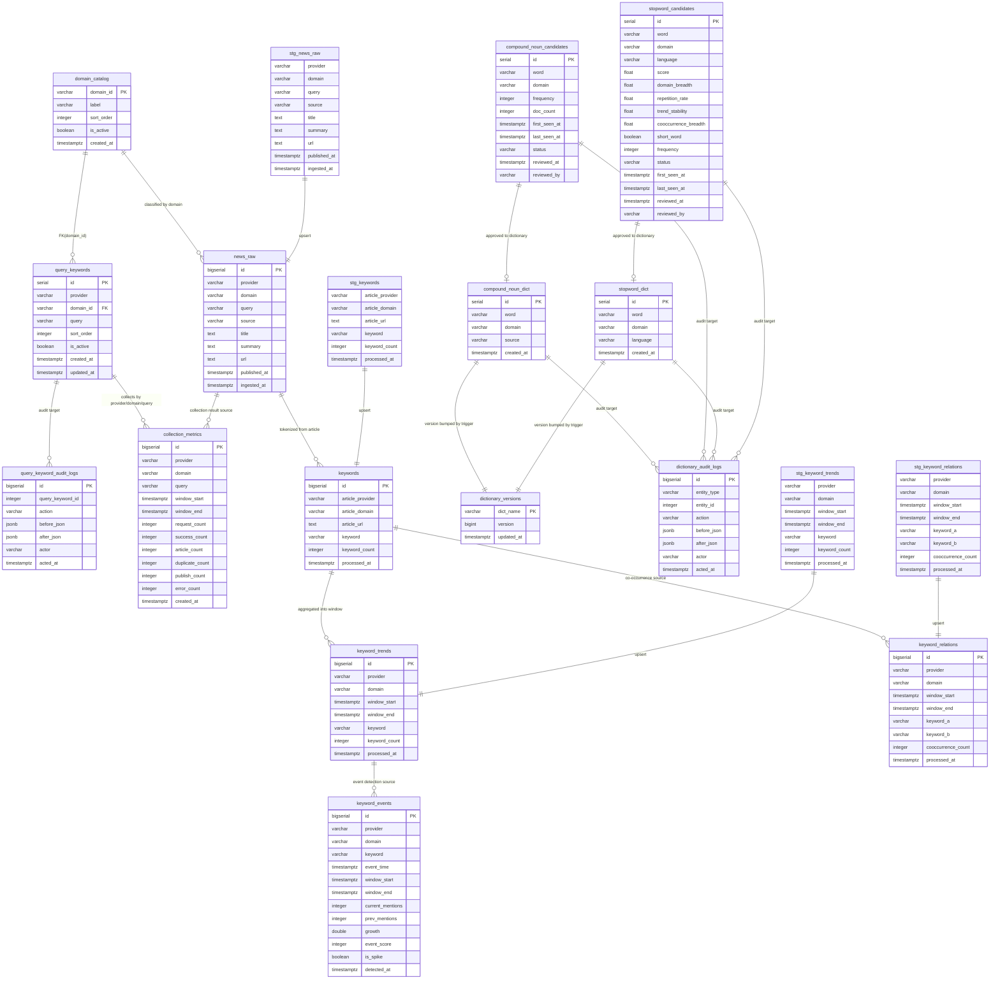

# ERD

> 기준: [`src/storage/models.sql`](/C:/Project/news-trend-pipeline-v2/src/storage/models.sql)
>
> 이 문서는 현재 구현된 PostgreSQL 스키마를 기준으로 정리한다.  
> 실제 물리 FK는 많지 않으므로, 아래 다이어그램은 `물리 관계 + 운영상 논리 관계`를 함께 표현한다.

## 1. 엔터티 관계

## 2. 핵심 구조 요약

- `domain_catalog`와 `query_keywords`가 수집 정책의 기준 테이블이다.
- `news_raw`는 원문 기사 저장소이며, `provider + domain + url` 기준으로 중복을 제어한다.
- `keywords`는 기사 단위 키워드, `keyword_trends`는 시간 윈도우 집계, `keyword_relations`는 동시 출현 집계다.
- `keyword_events`는 `keyword_trends`를 입력으로 한 이벤트 탐지 결과 저장소다.
- `collection_metrics`는 수집 성공/중복/발행 건수 등 운영 메트릭을 저장한다.
- 사전 계층은 `compound_noun_dict`, `compound_noun_candidates`, `stopword_dict`, `stopword_candidates`로 분리되어 있다.
- `dictionary_versions`는 복합명사 사전과 불용어 사전 변경 시 trigger로 버전을 증가시킨다.
- `query_keyword_audit_logs`, `dictionary_audit_logs`는 관리자 변경 이력을 남긴다.
- `stg_*` 테이블은 Spark/배치 적재 후 최종 테이블로 upsert하는 staging 계층이다.

## 3. 구현 기준으로 확인한 주의사항

- 실제 FK는 `query_keywords.domain_id -> domain_catalog.domain_id`만 선언되어 있다.
- `news_raw -> keywords`, `keyword_trends -> keyword_events`, 후보 사전 -> 확정 사전 관계는 코드와 unique key 기준의 논리 관계다.
- `dictionary_audit_logs`는 다형성 로그 테이블이라 특정 사전 테이블에 직접 FK를 두지 않는다.
- `dictionary_versions`도 사전 테이블과 FK로 묶이지 않고, trigger 함수 `bump_dictionary_version()`으로 동기화된다.

