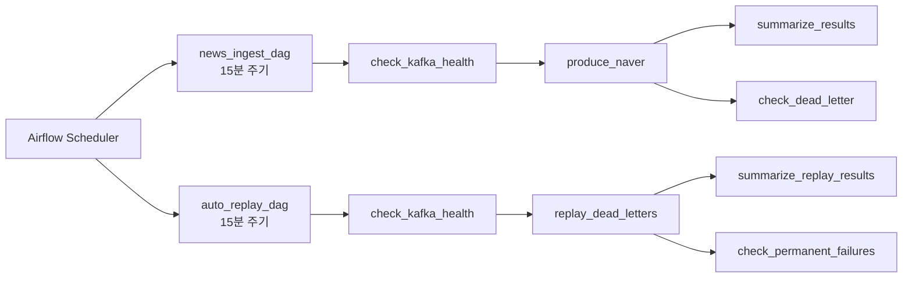

# STEP 1-1: Airflow

> 기준 구현:
> [`airflow/dags/news_ingest_dag.py`](/C:/Project/news-trend-pipeline-v2/airflow/dags/news_ingest_dag.py),
> [`airflow/dags/auto_replay_dag.py`](/C:/Project/news-trend-pipeline-v2/airflow/dags/auto_replay_dag.py),
> [`docker-compose.yml`](/C:/Project/news-trend-pipeline-v2/docker-compose.yml)

## 1. 역할

Airflow는 STEP 1에서 다음 두 가지를 담당한다.

- 정기 수집 실행
- dead letter 자동 재처리

Spark streaming은 별도 상시 실행 서비스이고, Airflow는 수집과 복구 orchestration에 집중한다.

## 2. 단계 구성도

## 3. `news_ingest_dag`

### 3-1. 목적

- Kafka 연결 가능 여부 확인
- Naver 기사 수집 실행
- 발행 결과 및 dead letter 적체 확인

### 3-2. 현재 task 구조

- `check_kafka_health`
- `produce_naver`
- `summarize_results`
- `check_dead_letter`

### 3-3. 스케줄과 실행 정책

- schedule: `*/15 * * * *`
- `catchup=False`
- `max_active_runs=1`
- retry: 3회
- exponential backoff 사용

### 3-4. 구현상 특징

- 수집 task는 `produce_naver` 하나다.
- `produce_naver` 내부에서 query 단위 병렬 수집을 수행하므로 Airflow task를 추가로 쪼개지 않았다.

## 4. `auto_replay_dag`

### 4-1. 목적

- dead letter 파일을 읽어 Kafka 재발행
- 재시도 실패 건과 영구 실패 건 분리

### 4-2. 현재 task 구조

- `check_kafka_health`
- `replay_dead_letters`
- `summarize_replay_results`
- `check_permanent_failures`

### 4-3. 스케줄과 실행 정책

- schedule: `*/15 * * * *`
- `catchup=False`
- `max_active_runs=1`
- retry: 2회

### 4-4. 구현상 특징

- DAG 내부에서 직접 재처리 로직을 쓰기보다 `python -m ingestion.replay`를 subprocess로 호출한다.
- 결과는 XCom에 요약값만 넣고, 실제 데이터는 상태 파일에 유지한다.

## 5. 운영 관점 확인 포인트

- Kafka broker 가용성
- `runtime/state/dead_letter.jsonl` 누적량
- `runtime/state/dead_letter_permanent.jsonl` 발생 여부
- 수집 DAG와 replay DAG가 동시에 15분 주기로 돌아도 `max_active_runs=1`로 중복 실행을 제한하는지

## 6. 범위

- STEP 1의 Airflow 범위는 수집 orchestration과 replay orchestration이다.
- Spark job submit은 Airflow가 직접 수행하지 않는다.
- `keyword_event_detection_dag`, `compound_dictionary_dag`는 별도 단계 문서에서 다룬다.
