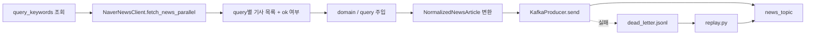

# STEP 1-2: Kafka Ingestion

> 기준 구현:
> [`src/ingestion/producer.py`](/C:/Project/news-trend-pipeline-v2/src/ingestion/producer.py),
> [`src/ingestion/api_client.py`](/C:/Project/news-trend-pipeline-v2/src/ingestion/api_client.py),
> [`src/ingestion/replay.py`](/C:/Project/news-trend-pipeline-v2/src/ingestion/replay.py),
> [`src/core/schemas.py`](/C:/Project/news-trend-pipeline-v2/src/core/schemas.py),
> [`docker-compose.yml`](/C:/Project/news-trend-pipeline-v2/docker-compose.yml)

## 1. 역할

이 문서는 STEP 1의 Kafka producer 관점 구현을 설명한다.

- DB에서 활성 쿼리 조회
- Naver API 병렬 호출
- 기사 메시지 정규화
- Kafka 발행
- dead letter 기록 및 재처리

## 2. 단계 구성도

## 3. Producer 흐름

### 3-1. 쿼리 소스

- `fetch_active_query_keywords(provider="naver")`로 DB에서 활성 쿼리를 읽는다.
- 각 row는 `domain`, `query`, `sort_order`를 가진다.
- 코드에 고정된 단일 키워드 목록을 직접 사용하는 구조가 아니다.

### 3-2. 병렬 수집

`NaverNewsClient.fetch_news_parallel()`이 query별로 병렬 호출을 수행한다.

- worker 수: `NAVER_MAX_WORKERS`
- 쿼리 시작 간격: `NAVER_QUERY_STAGGER_SECONDS`
- 동일 query 내 페이지 간 간격: `NAVER_PAGE_REQUEST_DELAY_SECONDS`

### 3-3. query별 성공 판단

각 query는 `(articles, ok)` 형태로 반환된다.

- `ok=True`: 해당 query 범위 수집 완료
- `ok=False`: 페이지 순회 중 HTTP/timeout/connection/json 파싱 오류 발생

`ok=False`인 query는 체크포인트를 전진시키지 않는다.

### 3-4. 상태 관리

producer 상태는 `producer_state.json`에 저장된다.

- `keyword_timestamps`
  - 키: `domain::query`
  - 값: 마지막 성공 체크포인트 시각
- `published_urls`
  - 최근 발행 URL 집합

새 query가 추가되면 기존 timestamp 중 최대값을 fallback으로 사용한다.

## 4. Kafka 발행

### 4-1. Topic

- topic 이름: `news_topic`
- 생성 위치: `docker-compose.yml`의 `kafka-init`
- partition 수: 2

### 4-2. Partition key

- 기본 key: `url`
- fallback key: `provider`

동일 기사 URL은 같은 partition으로 가도록 설계했다.

### 4-3. Producer 설정

현재 코드 기준 주요 설정은 다음과 같다.

- `acks=all`
- `retries=5`
- `enable_idempotence=True`
- `max_in_flight_requests_per_connection=1`
- `compression_type=gzip`

## 5. 메시지 스키마

Kafka payload는 `NormalizedNewsArticle.to_message()`를 통해 생성된다.

### 포함 필드

- `provider`
- `domain`
- `source`
- `title`
- `summary`
- `url`
- `published_at`
- `ingested_at`
- `metadata.source`
- `metadata.version`
- `metadata.query`

### 구현상 주의점

- 현재 표준 필드는 `summary`다.
- 내부 수집 중간 필드 `_query`는 Kafka 메시지에는 남기지 않고 `metadata.query`로 이동한다.

## 6. 실패 처리

### 6-1. 발행 전 실패

- 스키마 validation 실패
- 필수 필드 누락

이 경우 dead letter에 바로 기록한다.

### 6-2. 발행 중 실패

- `KafkaTimeoutError`
- `KafkaError`
- async callback delivery error

이 경우에도 dead letter에 기록한다.

### 6-3. dead letter 재처리

`replay.py`는 다음 순서로 동작한다.

1. `dead_letter.jsonl` 읽기
2. 이미 발행된 URL이면 skip
3. 재발행 성공 시 `dead_letter_replayed.jsonl` 기록
4. 재시도 초과 시 `dead_letter_permanent.jsonl` 이동

최대 재시도 횟수는 코드상 `3`이다.

## 7. 운영 특성

- 수집원은 `naver`만 사용한다.
- topic partition key는 `url` 우선, 없을 때만 `provider`를 사용한다.
- dedup 기준은 `provider + domain + url`이다.
- query 체크포인트는 `domain::query` 기준으로 유지한다.

## 8. 관련 문서

- STEP 1 개요: [STEP1_INGESTION.md](/C:/Project/news-trend-pipeline-v2/docs/design/STEP1_INGESTION.md)
- Airflow 오케스트레이션: [STEP1-1_AIRFLOW.md](/C:/Project/news-trend-pipeline-v2/docs/design/STEP1-1_AIRFLOW.md)
