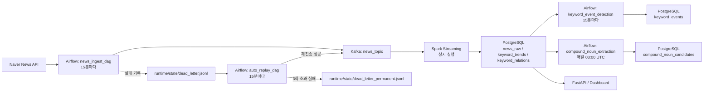
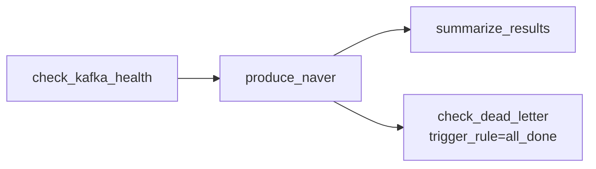
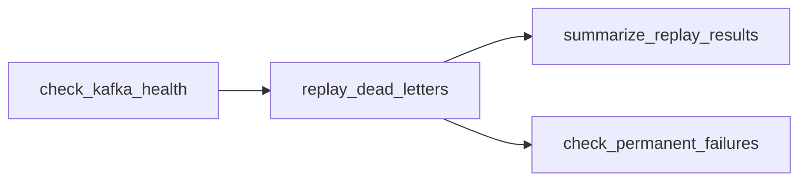
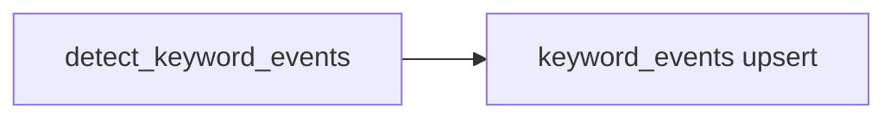
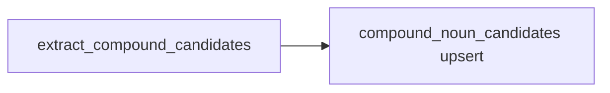

# Step 1 - Airflow DAG 설계 및 운영 문서

현재 저장소의 Airflow 구성은 `수집 orchestration`, `dead letter 자동 복구`, `배치형 분석`, `사전 후보 추출`을 담당합니다.  
스트리밍 처리는 `spark-streaming` 컨테이너가 상시 수행하고, Airflow는 주기 실행이 필요한 작업과 상태 점검/복구/후처리 배치를 맡는 구조입니다.

## 1. 파이프라인 구성도

### 전체 구성도

### Airflow 관점에서 본 역할

- `news_ingest_dag`: Kafka 연결 상태를 확인한 뒤 Naver 뉴스 수집 및 Kafka 적재를 수행합니다.
- `auto_replay_dag`: dead letter 파일을 읽어 재전송하고, 영구 실패 건을 분리합니다.
- `keyword_event_detection`: 이미 적재된 `keyword_trends`를 읽어 이벤트 후보를 계산합니다.
- `compound_noun_extraction`: 전일 기사 기반으로 복합명사 후보를 추출해 사전 후보 테이블에 누적합니다.
- `spark-streaming`: 상시 실행 서비스이며 Airflow DAG가 직접 띄우는 배치 잡은 아닙니다.

### 스트리밍/배치 구분

- 스트리밍 예시: `spark-streaming`이 Kafka를 계속 소비하며 집계/적재를 수행합니다.
- Airflow는 스트리밍 잡의 직접 실행 주체가 아니라, 수집 주기 제어, 실패 복구, 후속 배치 분석, 운영 모니터링 역할을 맡습니다.
- 배치 예시: `keyword_event_detection`, `compound_noun_extraction`은 이미 적재된 DB 데이터를 기준으로 주기 배치를 수행합니다.

## 2. Airflow DAG 설계

### a. DAG 목록

| DAG ID | 파일 | 목적 | 스케줄 |
| --- | --- | --- | --- |
| `news_ingest_dag` | `airflow/dags/news_ingest_dag.py` | 뉴스 수집 후 Kafka 적재 | `*/15 * * * *` |
| `auto_replay_dag` | `airflow/dags/auto_replay_dag.py` | dead letter 자동 재처리 | `*/15 * * * *` |
| `keyword_event_detection` | `airflow/dags/keyword_event_detection_dag.py` | 최근 24시간 이벤트 탐지 | `*/15 * * * *` |
| `compound_noun_extraction` | `airflow/dags/compound_extraction_dag.py` | 복합명사 후보 추출 | `0 3 * * *` |

### b. 공통 실행 기준

- `executor`: `LocalExecutor`
- `default_timezone`: `UTC` (`infra/airflow/config/airflow.cfg`)
- 대부분 DAG가 `catchup=False`, `max_active_runs=1`로 설정되어 중복 실행을 줄입니다.
- 현재 DAG들은 Airflow 3.x에서 모두 `PythonOperator` 기반으로 작성되어 있습니다.
- 태스크 간 대용량 데이터 전달은 하지 않고, `XCom`에는 요약 값만 저장합니다.

---

## 3. DAG별 상세 설계

### 3-1. `news_ingest_dag`

#### DAG 목적 / 실행 단위

- 목적: Naver 뉴스 API를 호출해 기사를 수집하고 Kafka `news_topic`에 적재
- 실행 단위: 15분 단위 증분 수집
- 처리 성격: 적재 전 Kafka health check + 수집 + 적재 요약 + dead letter 점검

#### 입력 / 출력

- 입력
    - Naver News API
    - 환경변수 기반 수집 설정
    - `runtime/state/producer_state.json`의 provider/query별 마지막 수집 시각
- 출력
    - Kafka `news_topic`
    - `collection_metrics` 테이블
    - 실패 시 `runtime/state/dead_letter.jsonl`
    - 상태 갱신용 `runtime/state/producer_state.json`

#### DAG 구조

- `check_kafka_health`
- `KafkaAdminClient`로 broker/topic 조회
- Kafka 연결 실패 시 이후 태스크 차단
- `produce_naver`
- `NewsKafkaProducer().run_for_provider("naver")` 실행
- 내부적으로 query별 병렬 수집, URL dedup, Kafka 전송, metric 기록 수행
- `summarize_results`
- `XCom`의 `naver_count`를 읽어 발행 건수 요약
- `check_dead_letter`
- `all_done`로 실행되어 수집 실패 여부와 무관하게 dead letter 적체량 확인

#### 태스크 간 데이터 전달 방식

- `XCom`: `produce_naver`가 `naver_count` 저장, `summarize_results`가 사용
- 파일 기반 상태: `producer_state.json`, `dead_letter.jsonl`
- 외부 시스템: Kafka topic, PostgreSQL `collection_metrics`

#### 스케줄

- `schedule`: `*/15 * * * *`
- 근거
- 무료/저비용 API 환경에서 너무 잦지 않으면서도 최신 기사 반영이 가능한 주기
- `auto_replay_dag`, `keyword_event_detection`과도 운영 주기를 맞추기 쉬움
- `start_date`: `2026-01-01`
- `timezone`: UTC

#### Retry / Backoff / Failure handling

- DAG 기본 재시도
- `retries=3`
- `retry_delay=5분`
- `retry_exponential_backoff=True`
- `max_retry_delay=30분`
- 재시도가 의미 있는 실패
- Kafka broker 일시 장애
- 네트워크 타임아웃
- 일시적인 API 응답 실패
- 재시도가 의미 없는 실패 또는 격리 우선 실패
- 스키마 변환 오류
- validation 오류
- Kafka publish 중 영구적으로 깨진 메시지
- 위 경우는 dead letter에 기록하고 후속 복구 DAG로 넘깁니다.

#### Idempotency

- `producer_state.json`에 query별 마지막 수집 시각 저장
- `provider::domain::url` 기준 중복 제거
- Kafka producer에 `enable_idempotence=True` 적용
- 같은 실행 구간을 다시 돌려도 이미 본 URL은 재적재하지 않도록 설계

---

### 3-2. `auto_replay_dag`

#### DAG 목적 / 실행 단위

- 목적: dead letter 메시지를 자동으로 재전송하고 영구 실패를 분리
- 실행 단위: 15분마다 dead letter backlog 점검/재처리
- 처리 성격: 복구용 운영 DAG

#### 입력 / 출력

- 입력
- `runtime/state/dead_letter.jsonl`
- Kafka 연결 상태
- 출력
- 재전송 성공분은 Kafka `news_topic`
- `runtime/state/dead_letter_replayed.jsonl`
- `runtime/state/dead_letter_permanent.jsonl`
- 남은 실패 건은 다시 `dead_letter.jsonl`로 rewrite

#### DAG 구조

- `replay_dead_letters`
- 내부에서 `python -m ingestion.replay`를 subprocess로 호출
- dead letter 파일을 읽고 재전송 성공/skip/재실패/영구실패를 분기

#### 태스크 간 데이터 전달 방식

- `XCom`: `replay_results` 딕셔너리 전달
- 파일: dead letter 계열 jsonl 파일들

#### 스케줄

- `schedule`: `*/15 * * * *`
- 근거
- 수집 DAG와 같은 cadence로 복구를 맞춰 backlog를 빠르게 줄임
- `start_date`: `2026-01-01`
- `timezone`: UTC

#### Retry / Failure handling

- DAG 기본 재시도
- `retries=2`
- `retry_delay=5분`
- 재시도가 의미 있는 실패
- Kafka 일시 장애
- subprocess 실행 타임아웃
- 파일 잠금/일시적 I/O 오류
- 의미 없는 실패
- 재시도 횟수 초과 메시지
- 구조적으로 깨진 payload
- 이런 건은 `dead_letter_permanent.jsonl`로 격리 후 운영자 확인 대상으로 남깁니다.

#### Idempotency

- replay 시에도 `provider::url` 기준 이미 발행된 URL은 skip
- `attempt` 카운트를 기록해 최대 3회까지만 재시도
- dead letter 파일은 남은 항목만 다시 써서 중복 replay를 줄임

---

### 3-3. `keyword_event_detection`

#### DAG 목적 / 실행 단위

- 목적: `keyword_trends`를 읽어 최근 24시간 내 급상승/증가 키워드 이벤트 탐지
- 실행 단위: 15분 단위 분석 배치
- 처리 성격: 적재 후 검증/분석형 DAG

#### 입력 / 출력

- 입력
- PostgreSQL `keyword_trends`
- Airflow `data_interval_end`
- 출력
- PostgreSQL `keyword_events`

#### DAG 구조

현재 구현은 최소 태스크 구조로 단순화되어 있습니다.

- Airflow 상 태스크는 하나지만, 내부 로직은 다음 순서로 동작합니다.
- read: `keyword_trends` 조회
- transform: growth/spike 계산
- load: `replace_keyword_events(...)`

#### 태스크 간 데이터 전달 방식

- 별도 태스크 분리는 없고 Python 함수 내부 호출로 처리
- 산출물은 PostgreSQL 테이블에 직접 기록

#### 스케줄

- `schedule`: `*/15 * * * *`
- 근거
- 스트리밍 집계 윈도우와 보조를 맞추어 이벤트 테이블을 자주 갱신
- `start_date`: `2026-01-01`
- `timezone`: UTC

#### Retry / Failure handling

- DAG 기본 재시도
- `retries=1`
- `retry_delay=5분`
- 재시도가 의미 있는 실패
- PostgreSQL 일시 연결 실패
- 의미 없는 실패
- 계산 로직 버그, 스키마 불일치

#### Idempotency

- `replace_keyword_events(rows, since, until)`가 대상 구간을 먼저 삭제 후 다시 적재
- 동일 시간 구간 재실행 시 같은 결과를 다시 계산해도 결과 테이블이 깨지지 않음

---

### 3-4. `compound_noun_extraction`

#### DAG 목적 / 실행 단위

- 목적: 최근 기사에서 복합명사 후보를 추출해 운영 검토용 후보 테이블에 누적
- 실행 단위: 일 단위 배치
- 처리 성격: 사전 후보 생성/검수 보조

#### 입력 / 출력

- 입력
- PostgreSQL `news_raw`
- 사전 설정값
- `COMPOUND_EXTRACTION_WINDOW_DAYS`
- `COMPOUND_EXTRACTION_MIN_FREQUENCY`
- `COMPOUND_EXTRACTION_MIN_CHAR_LENGTH`
- `COMPOUND_EXTRACTION_MAX_MORPHEME_COUNT`
- 출력
- PostgreSQL `compound_noun_candidates`

#### DAG 구조

- 내부 로직
- read: 대상 기간 기사 조회
- transform: Kiwi 기반 형태소 분석 + 인접 명사 조합 추출
- load: 후보 upsert

#### 태스크 간 데이터 전달 방식

- 별도 태스크 분리는 없고 Python 함수 내부 호출
- 산출물은 PostgreSQL 테이블에 직접 기록

#### 스케줄

- `schedule`: `0 3 * * *`
- 근거
- 실시간성보다 일 배치 검토 성격이 강하고, 전일 기사 누적분을 기준으로 안정적으로 추출
- `start_date`: `2025-01-01`
- `timezone`: UTC

#### Retry / Failure handling

- DAG 기본 재시도
- `retries=1`
- `retry_delay=10분`
- 재시도가 의미 있는 실패
- DB 연결 실패
- 일시적 라이브러리/리소스 문제
- 의미 없는 실패
- Kiwi 미설치
- 텍스트 파싱 로직 오류

#### Idempotency

- 신규 단어는 `INSERT ... DO NOTHING`
- 기존 `pending` 후보는 frequency/doc_count를 누적 update
- 완전한 “같은 날짜 재실행 시 동일 결과 유지”보다는 “후보 누적 운영”에 가까운 설계
- 발표 시에는 이 DAG만큼은 strict backfill 보장형이라기보다 운영 후보 적재형임을 명시하는 것이 안전합니다.

## 4. DAG 구조와 예시 템플릿의 대응

과제 예시의 최소 구조는 다음과 같습니다.

`extract(or read) → transform(spark) → load(storage) → validate → notify`

현재 저장소는 DAG별 성격에 따라 다음처럼 구현되어 있습니다.

- `news_ingest_dag`
- `check_kafka_health` = validate
- `produce_naver` = extract + transform + load
- `summarize_results`, `check_dead_letter` = notify/monitoring 성격
- `auto_replay_dag`
- `check_kafka_health` = validate
- `replay_dead_letters` = extract(dead letter read) + load(re-publish)
- `summarize_replay_results`, `check_permanent_failures` = notify/monitoring
- `keyword_event_detection`, `compound_noun_extraction`
- 현재는 단일 task 내부에서 read/transform/load를 수행

즉, 과제에서 요구한 구조적 요소는 모두 존재하지만 일부 DAG는 단일 PythonOperator에 묶여 있습니다.  
데모에서는 “현재는 동작 우선의 최소 DAG 파싱/실행 구조, 이후 태스크 세분화 가능”이라고 설명하면 자연스럽습니다.

## 5. 실행 가능한 코드

### 현재 repo 기준 핵심 파일

- DAG 정의
- `airflow/dags/news_ingest_dag.py`
- `airflow/dags/auto_replay_dag.py`
- `airflow/dags/keyword_event_detection_dag.py`
- `airflow/dags/compound_extraction_dag.py`
- Airflow 이미지
- `infra/airflow/Dockerfile.airflow`
- Compose
- `docker-compose.yml`
- 의존성
- `requirements/requirements-ingestion.txt`
- `requirements/requirements-spark.txt`
- 실행 스크립트
- `scripts/run_processing.py`
- 실제 처리 로직
- `src/ingestion/producer.py`
- `src/ingestion/replay.py`
- `src/analytics/event_detector.py`
- `src/analytics/compound_extractor.py`
- `src/processing/spark_job.py`

### Docker Compose에서 Airflow 관련 서비스

- `airflow-init`
- `airflow-apiserver`
- `airflow-scheduler`
- `airflow-dag-processor`
- `airflow-triggerer`
- `airflow-postgres`

### 의존성 반영 상태

- `infra/airflow/Dockerfile.airflow`가 `requirements/requirements-ingestion.txt`를 설치합니다.
- 현재 requirements에는 Kafka, PostgreSQL, PySpark, Kiwi 등 DAG와 처리 코드에 필요한 주요 패키지가 포함되어 있습니다.
- Spark streaming은 별도 `spark-streaming` 서비스에서 `scripts/run_processing.py`를 실행합니다.

## 6. 발표용 설명 포인트

### DAG 구조 설명

- `news_ingest_dag`: 수집 메인 DAG
- `auto_replay_dag`: 장애 복구 DAG
- `keyword_event_detection`: 적재 후 이벤트 분석 DAG
- `compound_noun_extraction`: 일 배치 사전 후보 추출 DAG

### 실행 시나리오

#### 1. 정상 실행

- `news_ingest_dag` 실행
- Kafka health check 통과
- 기사 수집 및 `news_topic` 적재
- Spark streaming이 이를 읽어 `news_raw`, `keyword_trends`, `keyword_relations` 갱신
- `keyword_event_detection`이 후속으로 `keyword_events`를 갱신

#### 2. 실패 후 retry / 복구

- Kafka publish 또는 네트워크 장애 발생 시 메시지는 `dead_letter.jsonl`로 저장
- 같은 15분 주기의 `auto_replay_dag`가 재전송 시도
- 성공 시 `dead_letter_replayed.jsonl`에 기록
- 3회 초과 실패 시 `dead_letter_permanent.jsonl`로 이동

#### 3. 같은 날짜 재실행 / backfill

- `news_ingest_dag`
- URL dedup + producer state 기반이라 같은 구간 재실행 시 중복 적재를 줄임
- `keyword_event_detection`
- 대상 구간 `replace` 방식이라 재실행 안전성이 높음
- `compound_noun_extraction`
- 누적 후보 적재형이라 strict backfill 보장보다는 운영 후보 갱신용으로 설명하는 것이 맞음

## 7. 현재 설계의 강점과 한계

### 강점

- DAG가 실제로 파싱 가능한 최소 구조를 갖추고 있음
- 수집과 복구가 분리되어 운영 설명이 쉬움
- 스트리밍과 배치를 분리해 역할이 명확함
- idempotency 전략이 DAG 성격별로 다르게 적용되어 있음

### 한계

- 일부 DAG는 `extract → transform → load → validate → notify`가 태스크로 완전히 분리되어 있지 않음
- Airflow가 Spark batch job을 직접 실행하는 구조는 아직 아니고, Spark streaming은 별도 상시 서비스
- 알림은 현재 로그/파일 기반이며 Slack, Email 같은 외부 notify 채널은 아직 미구현

### 확장 방향

- `keyword_event_detection`를 `read_trends -> detect_events -> validate_events -> notify`로 분리
- `compound_noun_extraction`를 `read_articles -> extract_candidates -> load_candidates -> report`로 분리
- Airflow에서 Spark batch submit 태스크를 별도 도입하면 과제 예시 구조와 더 직접적으로 맞출 수 있음
