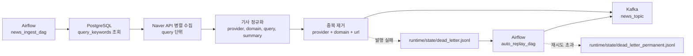

# STEP 1: Ingestion

> 기준 구현:
> [`airflow/dags/news_ingest_dag.py`](/C:/Project/news-trend-pipeline-v2/airflow/dags/news_ingest_dag.py),
> [`airflow/dags/auto_replay_dag.py`](/C:/Project/news-trend-pipeline-v2/airflow/dags/auto_replay_dag.py),
> [`src/ingestion/producer.py`](/C:/Project/news-trend-pipeline-v2/src/ingestion/producer.py),
> [`src/ingestion/api_client.py`](/C:/Project/news-trend-pipeline-v2/src/ingestion/api_client.py),
> [`src/ingestion/replay.py`](/C:/Project/news-trend-pipeline-v2/src/ingestion/replay.py)

## 1. 목적

STEP 1은 Naver 뉴스 검색 API에서 기사 데이터를 수집하고, 정규화한 메시지를 Kafka `news_topic`에 적재하는 단계다.  
이 단계의 책임은 다음 네 가지다.

- 도메인별/쿼리별 수집 정책 적용
- 기사 메시지 정규화
- Kafka 발행과 중복 제어
- dead letter 기반 재처리 준비

## 2. 단계 구성도



## 3. 현재 구현 요약

### 3-1. 수집원

- 현재 활성 수집원은 `naver` 하나다.
- `settings.news_providers` 기본값도 `naver`다.

### 3-2. 수집 단위

- 수집 쿼리는 코드 상수 대신 DB `query_keywords` 테이블에서 읽는다.
- 각 쿼리는 `domain_catalog`와 연결되어 있어 도메인별 수집이 가능하다.
- producer 상태는 `provider + domain + query` 단위 체크포인트로 관리된다.

### 3-3. 정규화 메시지

Kafka에 발행되는 메시지는 `NormalizedNewsArticle` 스키마를 따른다.

```json
{
  "provider": "naver",
  "domain": "ai_tech",
  "source": "news.naver.com",
  "title": "기사 제목",
  "summary": "기사 요약",
  "url": "https://...",
  "published_at": "2026-04-20T09:15:00+00:00",
  "ingested_at": "2026-04-20T09:20:03+00:00",
  "metadata": {
    "source": "naver",
    "version": "v1",
    "query": "GPT"
  }
}
```

### 3-4. 중복 제어

- 수집 단계 중복 기준은 `provider + domain + url`이다.
- producer 상태 파일에는 최근 발행 URL 목록 `published_urls`를 저장한다.
- Kafka partition key는 `url` 우선, 없을 때만 `provider` fallback이다.

### 3-5. 실패 처리

- validation 실패, Kafka send 실패, 재처리 실패 payload는 `dead_letter.jsonl`에 기록한다.
- `auto_replay_dag`가 dead letter를 다시 Kafka로 발행한다.
- 재시도 초과 건은 `dead_letter_permanent.jsonl`로 이동한다.

## 4. 운영 상태 파일

STEP 1에서 사용하는 주요 운영 파일은 다음과 같다.

- `runtime/state/producer_state.json`
- `runtime/state/dead_letter.jsonl`
- `runtime/state/dead_letter_replayed.jsonl`
- `runtime/state/dead_letter_permanent.jsonl`

`producer_state.json`은 현재 구현에서 대략 아래 구조를 가진다.

```json
{
  "providers": {
    "naver": {
      "keyword_timestamps": {
        "ai_tech::GPT": "2026-04-21T08:30:00+00:00"
      },
      "published_urls": [
        "naver::ai_tech::https://example.com/article"
      ]
    }
  }
}
```

## 5. 설계 포인트

- STEP 1은 DB 기반 다중 도메인/다중 쿼리 수집 구조다.
- 발행 중복 제어 기준은 `provider + domain + url`이다.
- Kafka 메시지 본문에는 `domain`과 `metadata.query`가 포함된다.
- STEP 1은 Spark 처리 자체를 수행하지 않고, Kafka까지 안정적으로 적재하는 데 집중한다.

## 6. 관련 문서

- Airflow 오케스트레이션: [STEP1-1_AIRFLOW.md](/C:/Project/news-trend-pipeline-v2/docs/design/STEP1-1_AIRFLOW.md)
- Kafka/producer 설계: [STEP1-2_KAFKA.md](/C:/Project/news-trend-pipeline-v2/docs/design/STEP1-2_KAFKA.md)
