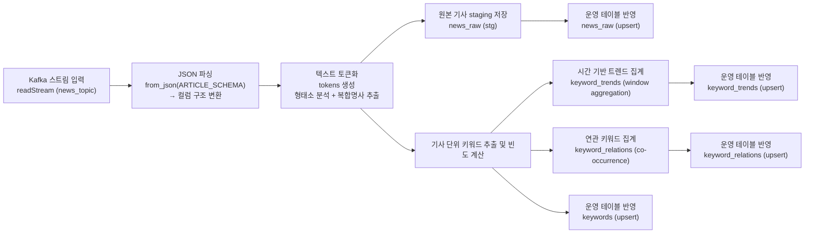

# STEP 2-1: Spark Streaming

> 기준 구현:
> [`src/processing/spark_job.py`](/C:/Project/news-trend-pipeline-v2/src/processing/spark_job.py),
> [`scripts/run_processing.py`](/C:/Project/news-trend-pipeline-v2/scripts/run_processing.py),
> [`docker-compose.yml`](/C:/Project/news-trend-pipeline-v2/docker-compose.yml)

## 1. 역할

Spark는 Kafka 메시지를 읽어 micro-batch 단위로 처리하고, 분석 결과를 PostgreSQL staging 테이블에 적재한 뒤 최종 테이블로 반영한다.

## 2. 단계 구성도



## 3. 현재 구현

### 3-1. 입력

- source: Kafka
- subscribe topic: `news_topic`
- starting offsets: `settings.spark_starting_offsets`

### 3-2. 출력

- `stg_news_raw`
- `stg_keywords`
- `stg_keyword_trends`
- `stg_keyword_relations`

그리고 각 staging 적재 후 다음 upsert 함수가 호출된다.

- `upsert_from_staging_news_raw()`
- `upsert_from_staging_keywords()`
- `upsert_from_staging_keyword_trends()`
- `upsert_from_staging_keyword_relations()`

### 3-3. 실행 방식

- `parsed.writeStream`
- `outputMode("append")`
- `foreachBatch(write_to_sinks)`
- `checkpointLocation=settings.spark_checkpoint_dir`

## 4. 집계 방식

### 4-1. 기사 원문 적재

파싱된 기사 레코드를 `news_raw`에 적재한다.

포함 필드는 다음과 같다.

- `provider`
- `domain`
- `query`
- `source`
- `title`
- `summary`
- `url`
- `published_at`
- `ingested_at`

### 4-2. 기사별 keyword 집계

`tokens`를 explode한 뒤 기사 URL 단위로 `keyword_count`를 계산한다.

### 4-3. 트렌드 집계

기사별 keyword 집계를 `window(event_time, settings.keyword_window_duration)`로 묶어 `keyword_trends`를 계산한다.

### 4-4. 연관어 집계

기사별 keyword 중 상위 rank만 남긴 뒤 self join으로 keyword pair를 만들고, 같은 window 기준 `cooccurrence_count`를 계산한다.

## 5. 현재 설정값

주요 Spark 설정은 다음 값을 사용한다.

- `SPARK_MASTER`
- `SPARK_APP_NAME`
- `SPARK_CHECKPOINT_DIR`
- `SPARK_SHUFFLE_PARTITIONS`
- `SPARK_STARTING_OFFSETS`
- `KEYWORD_WINDOW_DURATION`
- `RELATION_KEYWORD_LIMIT`

## 6. 실행 경로

로컬 실행:

```bash
python scripts/run_processing.py
```

Docker Compose 실행:

- `spark-streaming` 서비스가 `spark-submit`으로 실행한다.

## 7. 운영 특성

- Kafka offset과 streaming state는 checkpoint 디렉터리에 저장된다.
- 빈 batch는 `batch_df.isEmpty()`로 바로 종료한다.
- JDBC write는 append 모드로 수행하고, 충돌 처리와 dedup은 PostgreSQL이 담당한다.
