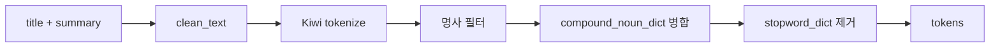

# STEP 2-2: Preprocessing

> 기준 구현:
> [`src/processing/preprocessing.py`](/C:/Project/news-trend-pipeline-v2/src/processing/preprocessing.py),
> [`tests/unit/test_processing_preprocessing.py`](/C:/Project/news-trend-pipeline-v2/tests/unit/test_processing_preprocessing.py)

## 1. 역할

전처리는 기사 텍스트를 분석용 토큰 목록으로 변환하는 단계다.

출력은 Spark 집계에 바로 사용되는 `list[str]` 형태의 tokens다.

## 2. 단계 구성도

## 3. `clean_text()`

`clean_text()`는 텍스트를 정규화하고 노이즈를 제거한다.

현재 구현 순서는 다음과 같다.

1. Unicode NFC 정규화
2. URL 제거
3. HTML 태그 제거
4. `"[+123 chars]"` 형식 문자열 제거
5. 소문자 변환
6. 한글과 공백만 남기기
7. 연속 공백 정리

결과적으로 영문, 숫자, 특수문자는 제거된다.

## 4. `tokenize()`

`tokenize(text, domain)`는 전처리 전체를 묶는 함수다.

현재 구현 순서는 다음과 같다.

1. 사전 버전 갱신 필요 여부 확인
2. `clean_text()` 수행
3. domain별 stopword 로드
4. domain별 Kiwi 인스턴스 로드
5. Kiwi 형태소 분석
6. `NNG`, `NNP`만 추출
7. 복합명사 병합
8. stopword 제거
9. 길이 1 이하 토큰 제거

Kiwi를 사용할 수 없으면 공백 분리 fallback 경로를 사용한다.

## 5. 복합명사 병합

`merge_compound_nouns()`는 인접 토큰을 결합해 사전에 등록된 복합명사로 복원한다.

현재 구현 특징은 다음과 같다.

- 사전은 `compound_noun_dict`를 사용한다.
- 가장 긴 후보부터 우선 매칭한다.
- Kiwi span 정보가 있으면 실제로 붙어 있는 토큰만 병합한다.
- 최대 병합 길이는 사전 길이를 기준으로 계산하되 2~6 범위로 제한한다.

## 6. 불용어 처리

불용어는 `stopword_dict`를 사용한다.

현재 필터 조건은 다음과 같다.

- stopword 집합에 포함되지 않을 것
- 길이 1 초과일 것
- 한글 패턴에 맞을 것

DB 접근이 실패하면 코드 내 기본 stopword 집합을 fallback으로 사용한다.

## 7. 사전 캐시

전처리 모듈은 사전 로딩 비용을 줄이기 위해 캐시를 사용한다.

캐시 대상은 다음과 같다.

- `get_user_dictionary()`
- `get_user_dictionary_set()`
- `_get_max_compound_len()`
- `get_kiwi()`
- `_get_stopwords()`

또한 `dictionary_versions`를 확인해 사전 변경이 감지되면 캐시를 비운다.

## 8. 테스트로 확인되는 동작

현재 단위 테스트는 다음 동작을 확인한다.

- `clean_text()`가 HTML과 비한글 문자를 제거하는지
- `merge_compound_nouns()`가 가장 긴 매치를 우선하는지
