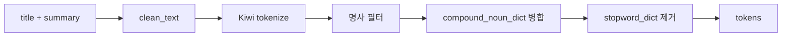

# STEP 2-2: Preprocessing

> 기준 구현:
> [`src/processing/preprocessing.py`](/C:/Project/news-trend-pipeline-v2/src/processing/preprocessing.py),
> [`tests/unit/test_processing_preprocessing.py`](/C:/Project/news-trend-pipeline-v2/tests/unit/test_processing_preprocessing.py)

## 1. 역할

전처리는 기사 텍스트를 분석용 토큰 목록으로 변환하는 단계다.

출력은 Spark 집계에 바로 사용되는 `list[str]` 형태의 tokens다.

## 2. 단계 구성도



## 3. `clean_text()`
**파일**: `preprocessing.py`

### 정제 단계

| 순서 | 처리 | 정규식/방법 |
|------|------|------------|
| 1 | Unicode NFC 정규화 | `unicodedata.normalize("NFC", text)` |
| 2 | URL 제거 | `http\S+` → 공백 |
| 3 | HTML 태그 제거 | `<[^>]+>` → 공백 |
| 4 | 잔여 문자열 제거 | `\[\+\d+\s+chars\]` → 공백 |
| 5 | 소문자 변환 | `text.lower()` |
| 6 | 한글 외 문자 제거 | `[^\uAC00-\uD7A3\s]` → 공백 |
| 7 | 연속 공백 정리 | `\s+` → 단일 공백 |

### 케이스별 예시

| 입력 | 출력 |
|------|------|
| `<b>AI</b> 2026 혁신!` | `혁신` |
| `[+1500 chars]...더 읽기` | `` (빈 문자열) |
| `인공지능 반도체 https://t.co/abc` | `인공지능 반도체` |
| `<p>GPT 기반 챗봇</p>` | `기반 챗봇` |

> 숫자·영문이 모두 제거된다.

## 4. `tokenize()`

**파일**: `preprocessing.py`

`clean_text()` 호출 후 Kiwi 형태소 분석으로 명사를 추출한다.

<details>
<summary>코드</summary>

```
cleaned text
    └─ _get_stopwords()         ← DB에서 불용어 로드 (lru_cache)
    └─ get_kiwi()               ← DB 복합명사 사전이 등록된 Kiwi 인스턴스 (lru_cache)
        └─ kiwi.tokenize()
            └─ 명사 태그 필터 (NNG, NNP)
                └─ 한글 전용 패턴 매칭
                    └─ merge_compound_nouns()   ← DB 사전 기반 병합
                        └─ 길이 > 1 + 불용어 제거
```

</details>

- **Kiwi** 형태소 분석기로 명사(NNG=일반명사, NNP=고유명사)만 추출한다.
- 추출된 명사 시퀀스에 대해 `compound_noun_dict` 기반 복합명사 병합을 수행한다.
- Kiwi가 없으면 공백 분리 fallback으로 동작한다.

