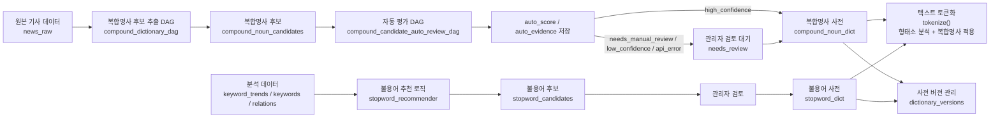

# STEP 2-3: Dictionary

> 기준 구현:
> [`src/processing/preprocessing.py`](/C:/Project/news-trend-pipeline-v2/src/processing/preprocessing.py),
> [`src/analytics/compound_extractor.py`](/C:/Project/news-trend-pipeline-v2/src/analytics/compound_extractor.py),
> [`src/analytics/compound_auto_reviewer.py`](/C:/Project/news-trend-pipeline-v2/src/analytics/compound_auto_reviewer.py),
> [`src/analytics/stopword_recommender.py`](/C:/Project/news-trend-pipeline-v2/src/analytics/stopword_recommender.py),
> [`airflow/dags/compound_dictionary_dag.py`](/C:/Project/news-trend-pipeline-v2/airflow/dags/compound_dictionary_dag.py),
> [`airflow/dags/compound_candidate_auto_review_dag.py`](/C:/Project/news-trend-pipeline-v2/airflow/dags/compound_candidate_auto_review_dag.py)

## 1. 역할

사전 계층은 STEP 2 전처리 품질을 유지하기 위해 복합명사와 불용어를 관리한다.

현재 구현 범위는 다음과 같다.

- 복합명사 사전 적용
- 불용어 사전 적용
- 복합명사 후보 자동 추출
- 복합명사 후보 자동 평가 및 보수적 자동승인
- 불용어 후보 추천
- 사전 버전 증가와 캐시 갱신

## 2. 단계 구성도



## 3. 현재 사전 테이블

주요 테이블은 다음과 같다.

- `compound_noun_dict`
- `compound_noun_candidates`
- `stopword_dict`
- `stopword_candidates`
- `dictionary_versions`

`compound_noun_candidates`는 자동 평가 결과를 함께 보존한다.

| 컬럼 | 역할 |
| --- | --- |
| `auto_score` | 자동승인 가능성 점수 |
| `auto_evidence` | 판단 근거 JSON |
| `auto_checked_at` | 자동 평가 시각 |
| `auto_decision` | `high_confidence`, `needs_manual_review`, `low_confidence`, `api_error` |

## 4. 복합명사 사전

### 4-1. 적용 방식

- `get_user_dictionary(domain)`으로 domain별 사전을 로드한다.
- Kiwi 인스턴스를 만들 때 사전 단어를 `add_user_word()`로 주입한다.
- 이후 `merge_compound_nouns()`가 토큰 배열을 다시 병합한다.

### 4-2. 후보 추출

`compound_dictionary_dag`는 `news_raw` 기사에서 복합명사 후보를 추출해 `compound_noun_candidates`에 누적한다.

처리 흐름은 다음과 같다.

```text
news_raw(title, summary, domain)
    ↓
복합명사 후보 추출
    ↓
compound_noun_candidates(word, domain, frequency, doc_count)
```

후보 추출 결과는 `compound_noun_candidates`에 저장되며, 동일 `(word, domain)` 후보가 다시 발견되면 새 row를 추가하기보다 기존 row의 `frequency`, `doc_count`, `last_seen_at`을 누적 갱신한다.
따라서 같은 기간을 다시 처리하더라도 후보 테이블은 후보 단위로 관리되고, 후속 자동평가나 관리자 검토의 입력 queue 역할을 한다.

추출 기준은 다음 설정을 사용한다.

- `COMPOUND_EXTRACTION_WINDOW_DAYS`
- `COMPOUND_EXTRACTION_MIN_FREQUENCY`
- `COMPOUND_EXTRACTION_MIN_CHAR_LENGTH`
- `COMPOUND_EXTRACTION_MAX_MORPHEME_COUNT`

후보 추출은 사용자 사전을 주입하지 않은 Kiwi 분석 결과를 기반으로 한다. 이미 `compound_noun_dict`에 승인되어 있는 단어는 후보에서 제외한다.

`compound_dictionary_dag`는 후보 생성과 빈도 누적까지만 담당한다.
`approved` 또는 `rejected` 상태의 후보는 후보 추출 재실행으로 상태를 바꾸지 않는다.
또한 이 DAG는 자동승인을 수행하지 않는다. 자동평가와 자동승인은 `compound_candidate_auto_review_dag`가 별도로 담당한다.

### 4-3. Domain-aware 후보 관리

복합명사 후보 추출은 `news_raw.domain`을 기준으로 domain별로 분리해 수행한다.

#### 핵심 원칙

- `(word, domain)`은 독립적인 후보 엔티티로 취급한다.
- 동일한 `word`라도 여러 domain에서 등장하면 domain별 row를 각각 유지한다.
- 자동 추출 후보는 기사 domain을 그대로 사용한다.
- `domain = 'all'`은 자동 추출 결과에 사용하지 않고, 수동 등록된 공통 사전 또는 fallback 용도로만 사용한다.

#### 처리 흐름

```text
news_raw(title, summary, domain)
    ↓
domain별 복합명사 후보 추출
    ↓
compound_noun_candidates(word, domain, frequency, doc_count)
```

### 4-4. 자동 평가 및 보수적 자동승인

`compound_auto_reviewer.py`는 `needs_review` 상태의 복합명사 후보를 평가하고, 판단 근거와 점수를 `compound_noun_candidates`에 저장한다.

#### 처리 대상

```sql
WHERE status = 'needs_review'
  AND (
    auto_checked_at IS NULL
    OR auto_checked_at < NOW() - INTERVAL '7 days'
    OR last_seen_at > auto_checked_at
  )
ORDER BY frequency DESC, doc_count DESC, last_seen_at DESC
LIMIT 2000
```

- `approved` 후보는 재검증하지 않는다.
- `rejected` 후보는 재검증하지 않는다.
- `needs_review` 후보만 자동 평가 대상이다.
- Naver API 호출 결과는 `auto_checked_at` 기준으로 7일 캐시한다.
- 후보가 마지막 평가 이후 다시 등장하면 재평가한다.

#### Evidence 저장

자동 평가 결과는 후보 row에 저장한다.

```json
{
  "stats": {
    "frequency": 42,
    "doc_count": 11,
    "frequency_per_doc": 3.8,
    "last_seen_at": "2026-04-26T09:00:00Z"
  },
  "naver_encyc": {
    "ok": true,
    "error": null,
    "total": 8,
    "title_match": true,
    "description_match": true,
    "matched_title": "생성형 AI"
  },
  "score_breakdown": {
    "frequency": 20,
    "doc_count": 20,
    "recent_activity": 5,
    "external_evidence": 35,
    "penalty": -3
  },
  "review_policy": {
    "threshold": 85,
    "frequency_min": 5,
    "doc_count_min": 3,
    "frequency_per_doc_max": 8
  }
}
```

#### Decision 값

| auto_decision | 처리 |
| --- | --- |
| `high_confidence` | 자동승인 |
| `needs_manual_review` | `needs_review` 유지 |
| `low_confidence` | `needs_review` 유지 |
| `api_error` | `needs_review` 유지 |

#### 자동승인 조건

`high_confidence`는 다음 조건을 모두 만족할 때만 부여한다.

```text
auto_score >= 85
AND doc_count >= 3
AND frequency >= 5
AND Naver title 또는 description match 있음
AND frequency_per_doc <= 8
```

#### 승인 시 반영 내용

자동승인 후보는 다음과 같이 반영한다.

```text
compound_noun_candidates.status = 'approved'
compound_noun_candidates.reviewed_by = 'auto-reviewer'
compound_noun_candidates.reviewed_at = NOW()
compound_noun_candidates.auto_score = 계산 점수
compound_noun_candidates.auto_evidence = 판단 근거 JSON
compound_noun_candidates.auto_checked_at = NOW()
compound_noun_candidates.auto_decision = 'high_confidence'
```

`compound_noun_dict`에는 다음 값으로 삽입한다.

```text
word = candidate.word
domain = candidate.domain
source = 'auto-approved'
```

`compound_noun_candidates`의 approved row는 삭제하지 않는다.

## 5. 불용어 사전

### 5-1. 적용 방식

- `tokenize()`가 domain별 stopword 집합을 조회한다.
- 토큰이 stopword에 포함되면 제거한다.

### 5-2. 후보 추천

`stopword_recommender.py`는 최근 7일간의 `keyword_trends`, `keywords`, `keyword_relations`를 바탕으로 `stopword_candidates`를 계산한다.

추천 점수 구성 요소는 다음과 같다.

- domain_breadth
- repetition_rate
- trend_stability
- cooccurrence_breadth
- short_word

## 6. 사전 버전 관리

`compound_noun_dict`와 `stopword_dict`에 변경이 생기면 trigger가 `dictionary_versions`를 증가시킨다.

전처리 모듈은 주기적으로 이 값을 확인하고, 버전이 바뀌면 사전 캐시를 비운다.

## 7. 운영 특성

- 사전 조회는 DB 우선, 실패 시 파일 또는 기본값 fallback이 있다.
- `compound_dictionary_dag`는 복합명사 후보 추출만 담당한다.
- `compound_candidate_auto_review_dag`는 후보 자동 평가, evidence 저장, high confidence 자동승인을 담당한다.
- 복합명사 후보 추출은 기사 domain 기준으로 후보를 분리해 `(word, domain)` 단위로 누적한다.
- 자동 추출 후보는 `all` domain으로 저장하지 않는다.
- 자동 평가 대상은 `needs_review` 후보뿐이다.
- `approved`와 `rejected` 후보는 자동으로 다시 내리지 않는다.
- 자동승인은 `high_confidence` 후보에만 수행한다.
- 검색 결과가 없거나 API 호출에 실패한 후보는 관리자가 검토한다.
- 불용어 후보 추천은 코드로 구현되어 있으며 관리자 기능과 연결된다.
