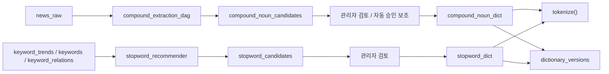

# STEP 2-3: Dictionary

> 기준 구현:
> [`src/processing/preprocessing.py`](/C:/Project/news-trend-pipeline-v2/src/processing/preprocessing.py),
> [`src/analytics/compound_extractor.py`](/C:/Project/news-trend-pipeline-v2/src/analytics/compound_extractor.py),
> [`src/analytics/compound_auto_approver.py`](/C:/Project/news-trend-pipeline-v2/src/analytics/compound_auto_approver.py),
> [`src/analytics/stopword_recommender.py`](/C:/Project/news-trend-pipeline-v2/src/analytics/stopword_recommender.py),
> [`airflow/dags/compound_extraction_dag.py`](/C:/Project/news-trend-pipeline-v2/airflow/dags/compound_extraction_dag.py)

## 1. 역할

사전 계층은 STEP 2 전처리 품질을 유지하기 위해 복합명사와 불용어를 관리한다.

현재 구현 범위는 다음과 같다.

- 복합명사 사전 적용
- 불용어 사전 적용
- 복합명사 후보 자동 추출
- 복합명사 후보 자동 승인 보조
- 불용어 후보 추천
- 사전 버전 증가와 캐시 갱신

## 2. 단계 구성도

## 3. 현재 사전 테이블

주요 테이블은 다음과 같다.

- `compound_noun_dict`
- `compound_noun_candidates`
- `stopword_dict`
- `stopword_candidates`
- `dictionary_versions`

## 4. 복합명사 사전

### 4-1. 적용 방식

- `get_user_dictionary(domain)`으로 domain별 사전을 로드한다.
- Kiwi 인스턴스를 만들 때 사전 단어를 `add_user_word()`로 주입한다.
- 이후 `merge_compound_nouns()`가 토큰 배열을 다시 병합한다.

### 4-2. 후보 추출

`compound_extraction_dag`는 하루 1회 실행되어 `news_raw` 기사에서 복합명사 후보를 뽑아 `compound_noun_candidates`에 누적한다.

추출 기준은 다음 설정을 사용한다.

- `COMPOUND_EXTRACTION_WINDOW_DAYS`
- `COMPOUND_EXTRACTION_MIN_FREQUENCY`
- `COMPOUND_EXTRACTION_MIN_CHAR_LENGTH`
- `COMPOUND_EXTRACTION_MAX_MORPHEME_COUNT`

### 4-3. 자동 승인 보조

`compound_auto_approver.py`는 `needs_review` 후보를 대상으로 Naver 백과 API를 조회해 자동 승인 가능한 후보를 `compound_noun_dict`에 반영한다.

## 5. 불용어 사전

### 5-1. 적용 방식

- `tokenize()`가 domain별 stopword 집합을 조회한다.
- 토큰이 stopword에 포함되면 제거한다.

### 5-2. 후보 추천

`stopword_recommender.py`는 최근 7일간의 `keyword_trends`, `keywords`, `keyword_relations`를 바탕으로 `stopword_candidates`를 계산한다.

추천 점수 구성 요소는 다음과 같다.

- `domain_breadth`
- `repetition_rate`
- `trend_stability`
- `cooccurrence_breadth`
- `short_word`

## 6. 사전 버전 관리

`compound_noun_dict`와 `stopword_dict`에 변경이 생기면 trigger가 `dictionary_versions`를 증가시킨다.

전처리 모듈은 주기적으로 이 값을 확인하고, 버전이 바뀌면 사전 캐시를 비운다.

## 7. 운영 특성

- 사전 조회는 DB 우선, 실패 시 파일 또는 기본값 fallback이 있다.
- 복합명사 후보 추출은 Airflow DAG로 실행된다.
- 자동 승인 보조와 불용어 후보 추천은 코드로 구현되어 있으며 관리자 기능과 연결된다.
