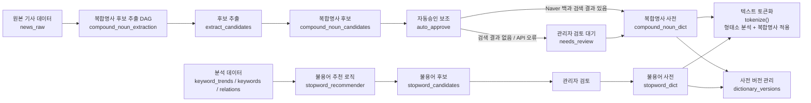

# STEP 2-3: Dictionary

> 기준 구현:
> [`src/processing/preprocessing.py`](/C:/Project/news-trend-pipeline-v2/src/processing/preprocessing.py),
> [`src/analytics/compound_extractor.py`](/C:/Project/news-trend-pipeline-v2/src/analytics/compound_extractor.py),
> [`src/analytics/compound_auto_approver.py`](/C:/Project/news-trend-pipeline-v2/src/analytics/compound_auto_approver.py),
> [`src/analytics/stopword_recommender.py`](/C:/Project/news-trend-pipeline-v2/src/analytics/stopword_recommender.py),
> [`airflow/dags/compound_noun_extraction_dag.py`](/C:/Project/news-trend-pipeline-v2/airflow/dags/compound_noun_extraction_dag.py)

## 1. 역할

사전 계층은 STEP 2 전처리 품질을 유지하기 위해 복합명사와 불용어를 관리한다.

현재 구현 범위는 다음과 같다.

- 복합명사 사전 적용
- 불용어 사전 적용
- 복합명사 후보 자동 추출
- 복합명사 후보 자동승인 보조
- 불용어 후보 추천
- 사전 버전 증가와 캐시 갱신

## 2. 단계 구성도



## 3. 현재 사전 테이블

주요 테이블은 다음과 같다.

- `compound_noun_dict`
- `compound_noun_candidates`
- `stopword_dict`
- `stopword_candidates`
- `dictionary_versions`

## 4. 복합명사 사전

### 4-1. 적용 방식

- `get_user_dictionary(domain)`으로 domain별 사전을 로드한다.
- Kiwi 인스턴스를 만들 때 사전 단어를 `add_user_word()`로 주입한다.
- 이후 `merge_compound_nouns()`가 토큰 배열을 다시 병합한다.

### 4-2. 후보 추출

`compound_noun_extraction` DAG는 `news_raw` 기사에서 복합명사 후보를 뽑아 `compound_noun_candidates`에 누적한다.

추출 기준은 다음 설정을 사용한다.

- `COMPOUND_EXTRACTION_WINDOW_DAYS`
- `COMPOUND_EXTRACTION_MIN_FREQUENCY`
- `COMPOUND_EXTRACTION_MIN_CHAR_LENGTH`
- `COMPOUND_EXTRACTION_MAX_MORPHEME_COUNT`

후보 추출은 사용자 사전을 주입하지 않은 Kiwi 분석 결과를 기반으로 한다. 이미 `compound_noun_dict`에 승인되어 있는 단어는 후보에서 제외한다.

### 4-3. 자동승인 보조

`compound_noun_extraction` DAG는 후보 추출 이후 `auto_approve` task를 이어서 실행한다.

`compound_auto_approver.py`는 복합명사 후보를 무조건 승인하지 않는다. 검토 대기 상태의 후보 중 외부 지식 기반으로 확인 가능한 일부 후보만 사전에 반영하는 보조 로직이다.

#### 처리 대상

현재 코드 기준 자동승인 보조 대상은 다음 조건을 만족하는 후보이다.

```text
compound_noun_candidates.status IN ('needs_review', 'pending')
ORDER BY frequency DESC
LIMIT 200
```

- 표준 검토 대기 상태는 `needs_review`이다.
- `pending`은 과거 DB에 남아 있을 수 있는 legacy 상태를 처리하기 위해 함께 조회한다.
- 후보는 빈도(`frequency`)가 높은 순서로 최대 200개만 처리한다.
- `approved` 또는 `rejected` 상태의 후보는 자동승인 보조 대상이 아니다.

#### 승인 판단 기준

각 후보 단어에 대해 Naver 백과사전 API를 호출한다.

```text
GET https://openapi.naver.com/v1/search/encyc.json
query = 후보 단어
display = 1
```

판단 기준은 다음과 같다.

| 조건 | 처리 |
| --- | --- |
| API 응답이 200이고 `total > 0` | 후보를 `approved`로 변경하고 `compound_noun_dict`에 반영 |
| 검색 결과 없음 | 후보를 `needs_review`로 유지 |
| API credential 없음 | 자동승인 불가, 후보는 검토 대기 유지 |
| API 오류 또는 timeout | 자동승인하지 않고 검토 대기 유지 |

#### 승인 시 반영 내용

검색 결과가 확인된 후보는 다음과 같이 반영한다.

```text
compound_noun_candidates.status = 'approved'
compound_noun_candidates.reviewed_by = 'auto-approver'
compound_noun_dict.source = 'auto-approved'
```

`compound_noun_dict`에는 `(word, domain)` unique 기준으로 삽입되며, 이미 같은 단어가 등록되어 있으면 중복 삽입하지 않는다.

#### 미승인 후보 처리

검색 결과가 없거나 API 오류가 발생한 후보는 자동으로 반려하지 않는다.

- `needs_review` 후보는 그대로 유지한다.
- legacy `pending` 후보는 `needs_review`로 정리한다.
- 이후 관리자가 후보 목록에서 직접 승인 또는 반려한다.

#### 설계 의도

자동승인 보조는 최종 판단을 완전히 대체하는 기능이 아니다.

외부 백과사전에 검색 결과가 존재하는 후보는 사전에 먼저 반영해 운영 부담을 줄이고, 판단 근거가 부족한 후보는 관리자가 검토하도록 남겨둔다.

또한 외부 API 호출은 느리고 실패 가능성이 있으므로 Spark streaming 처리 경로에 포함하지 않고 Airflow DAG의 비동기 batch task로 분리한다.

## 5. 불용어 사전

### 5-1. 적용 방식

- `tokenize()`가 domain별 stopword 집합을 조회한다.
- 토큰이 stopword에 포함되면 제거한다.

### 5-2. 후보 추천

`stopword_recommender.py`는 최근 7일간의 `keyword_trends`, `keywords`, `keyword_relations`를 바탕으로 `stopword_candidates`를 계산한다.

불용어 후보는 “의미 없이 자주 등장하는 단어”를 찾기 위해 아래 기준을 조합하여 판단한다.

- `domain_breadth`: 여러 도메인에서 공통적으로 등장할수록 일반적인 단어일 가능성이 높다.
- `repetition_rate`: 동일 문서 안에서 반복적으로 등장할수록 정보성이 낮을 가능성이 높다.
- `trend_stability`: 시간에 따라 변화 없이 일정하게 등장하면 핵심 키워드가 아닐 가능성이 높다.
- `cooccurrence_breadth`: 다양한 단어와 함께 등장할수록 문장 연결용 일반 표현일 가능성이 높다.
- `short_word`: 단어가 짧을수록 의미 밀도가 낮은 일반 표현일 가능성이 높다.

정리하면 여러 도메인에서, 항상 비슷한 빈도로, 다양한 단어와 함께 반복적으로 등장하는 짧은 단어일수록 불용어일 가능성이 높다.

## 6. 사전 버전 관리

`compound_noun_dict`와 `stopword_dict`에 변경이 생기면 trigger가 `dictionary_versions`를 증가시킨다.

전처리 모듈은 주기적으로 이 값을 확인하고, 버전이 바뀌면 사전 캐시를 비운다.

## 7. 운영 특성

- 사전 조회는 DB 우선, 실패 시 파일 또는 기본값 fallback이 있다.
- 복합명사 후보 추출과 자동승인 보조는 `compound_noun_extraction` Airflow DAG에서 순차 실행된다.
- 자동승인 보조는 `needs_review` 후보를 대상으로 하며, legacy `pending` 후보는 `needs_review`로 정리한다.
- 자동승인 보조는 Naver 백과 검색 결과가 있는 후보만 `approved`로 전환한다.
- 검색 결과가 없거나 API 호출에 실패한 후보는 관리자가 검토한다.
- 불용어 후보 추천은 코드로 구현되어 있으며 관리자 기능과 연결된다.
