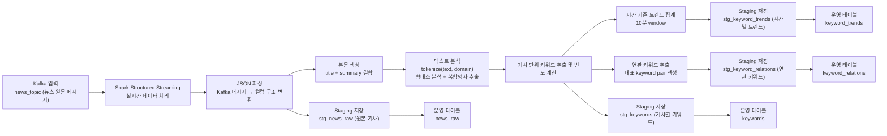

# STEP 2: Processing

> 기준 구현:
> [`src/processing/spark_job.py`](/C:/Project/news-trend-pipeline-v2/src/processing/spark_job.py),
> [`src/processing/preprocessing.py`](/C:/Project/news-trend-pipeline-v2/src/processing/preprocessing.py),
> [`scripts/run_processing.py`](/C:/Project/news-trend-pipeline-v2/scripts/run_processing.py),
> [`airflow/dags/compound_dictionary_dag.py`](/C:/Project/news-trend-pipeline-v2/airflow/dags/compound_dictionary_dag.py)

## 1. 목적

STEP 2는 Kafka `news_topic`에 적재된 기사 메시지를 읽어 분석 가능한 형태로 변환하고, 집계 결과를 PostgreSQL에 반영하는 단계다.

주요 책임은 다음과 같다.

- Kafka 메시지 파싱
- 기사 텍스트 전처리와 토큰화
- 기사별 키워드 추출
- 시간 윈도우 기반 트렌드/연관어 집계
- staging 테이블 적재 후 최종 upsert

## 2. 단계 구성도



## 3. 현재 구현 요약

### 3-1. 처리 엔진

- Spark Structured Streaming
- 입력 topic: `news_topic`
- 실행 진입점: `scripts/run_processing.py`
- checkpoint 위치: `settings.spark_checkpoint_dir`

### 3-2. 입력 스키마

Spark는 Kafka 메시지를 `NormalizedNewsArticle` 스키마로 파싱한다.

주요 입력 필드는 다음과 같다.

- `provider`
- `domain`
- `source`
- `title`
- `summary`
- `url`
- `published_at`
- `ingested_at`
- `metadata.query`

`summary`가 비어 있는 경우에는 하위 호환 입력을 위해 `description`, `content`를 fallback으로 사용한다.

### 3-3. 생성 결과

STEP 2는 다음 최종 테이블을 채운다.

- `news_raw`
- `keywords`
- `keyword_trends`
- `keyword_relations`

## 4. 처리 흐름

### 4-1. Kafka 메시지 파싱

Spark는 Kafka value를 문자열로 읽고 JSON으로 파싱한 뒤, `published_at`, `ingested_at`를 timestamp로 변환한다.

집계 기준 시각은 `published_at`이며, 이 값이 `event_time`으로 사용된다.

### 4-2. 기사 텍스트 구성

전처리 입력 텍스트는 다음 방식으로 만든다.

```text
article_text = title + " " + summary
```

### 4-3. 토큰화

`tokenize(text, domain)`이 호출되어 domain별 사전을 반영한 토큰 목록을 생성한다.

이 단계에는 다음이 포함된다.

- `clean_text()` 실행
- Kiwi 형태소 분석
- 명사(`NNG`, `NNP`) 추출
- `compound_noun_dict` 기반 복합명사 병합
- `stopword_dict` 기반 불용어 제거

### 4-4. 기사별 키워드

`tokens` 배열을 `explode()`하여 기사 URL 단위 keyword 빈도를 계산하고 `keywords`에 반영한다.

### 4-5. 트렌드 집계

기사별 keyword 빈도를 `KEYWORD_WINDOW_DURATION` 기준으로 집계해 `keyword_trends`를 만든다.

현재 기본 window는 `10 minutes`다.

### 4-6. 연관어 집계

기사별 상위 keyword를 추려 같은 기사 안에서 함께 등장한 keyword pair를 만들고, 이를 window 기준으로 집계해 `keyword_relations`를 만든다.

대표 keyword 수 제한은 `RELATION_KEYWORD_LIMIT`를 사용한다.

## 5. 저장 방식

Spark는 최종 테이블에 직접 쓰지 않고 먼저 staging 테이블에 append한 뒤, DB 내부 upsert 함수를 호출한다.

사용되는 staging 테이블은 다음과 같다.

- `stg_news_raw`
- `stg_keywords`
- `stg_keyword_trends`
- `stg_keyword_relations`

upsert 후 staging 테이블은 비워진다.

## 6. 운영 특성

- checkpoint 기반으로 Kafka offset을 복구한다.
- malformed record 전용 DLQ는 없고, `url` 또는 `event_time`이 없는 레코드는 처리 대상에서 제외한다.
- DB 스키마 초기화는 `safe_initialize_database()`로 수행한다.
- Structured Streaming 출력은 `foreachBatch` 기반이다.

## 7. 관련 문서

- Spark 처리 상세: [STEP2-1_SPARK.md](/C:/Project/news-trend-pipeline-v2/docs/design/STEP2-1_SPARK.md)
- 전처리 상세: [STEP2-2_PREPROCESSING.md](/C:/Project/news-trend-pipeline-v2/docs/design/STEP2-2_PREPROCESSING.md)
- 사전 처리 상세: [STEP2-3_DICTIONARY.md](/C:/Project/news-trend-pipeline-v2/docs/design/STEP2-3_DICTIONARY.md)
