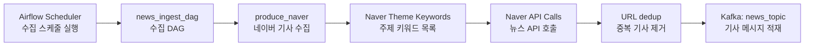
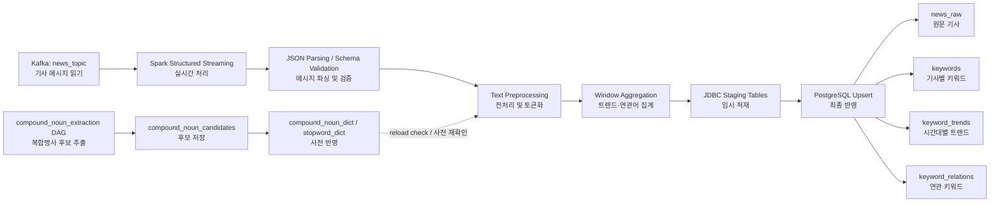

# Step 2 처리 계층 구현 정리

> Step 1에서 Kafka로 적재된 뉴스 메시지를 Spark로 전처리하고 PostgreSQL에 저장하는 Step 2 구현 문서이다.

## 1. 파이프라인 구성도

### 1-1. Step 1 파이프라인

`Kafka` 적재 전까지의 Step 1 수집 흐름은 아래와 같다.




### 1-2. Step 2 파이프라인

`Kafka` 이후 Step 2 처리 및 저장 흐름은 아래와 같다.



### 1-3. 단계별 책임

| 단계 | 역할 |
| --- | --- |
| Step 1 Ingestion | Naver 기사 수집, URL 기준 dedup, Kafka 발행 |
| Step 2 Processing | Kafka 메시지 파싱, 전처리, 키워드/연관어 집계 |
| Storage | PostgreSQL에 원문/집계 결과 저장 |
| Dictionary Batch | 복합명사 후보 추출 및 사전 반영 |

## 2. Spark 전처리 설계

### 2-a. 처리 방식 선택 및 이유

#### 선택: Streaming

현재 구현은 `spark.readStream(...).foreachBatch(...)` 기반의 **Spark Structured Streaming**이다.

<details>
<summary>코드</summary>

```python
raw_stream = (
    spark.readStream.format("kafka")
    .option("kafka.bootstrap.servers", settings.kafka_bootstrap_servers)
    .option("subscribe", settings.kafka_topic)
    .option("startingOffsets", settings.spark_starting_offsets)
    .load()
)
```

</details>

#### Streaming을 선택한 이유

1. Step 1이 Kafka로 지속적으로 메시지를 발행하므로 소비 계층도 이벤트 기반으로 바로 이어지는 구조가 자연스럽다.
2. 키워드 트렌드와 연관 키워드는 시계열 집계이므로 배치보다 near real-time 집계가 더 적합하다.
3. Spark 체크포인트를 통해 오프셋과 상태를 관리할 수 있어 재시작 시 복구가 쉽다.
4. `foreachBatch`를 사용하면 스트리밍 입력과 관계형 DB upsert를 함께 가져갈 수 있다.

#### 처리 주기

- 처리 모델: 연속 실행되는 micro-batch
- 트리거: 코드에서 별도 `trigger(processingTime=...)`를 지정하지 않았으므로 Spark 기본 micro-batch 주기를 사용
- 집계 윈도우: `KEYWORD_WINDOW_DURATION=10 minutes`
- 사전 갱신 확인 주기: `DICTIONARY_REFRESH_INTERVAL_SECONDS=60`

즉, 실행 단위는 스트리밍이지만 집계 결과는 10분 윈도우 기준으로 누적 저장한다.

### 2-b. 데이터 처리 흐름

#### 1. Kafka에서 데이터를 읽어오는 방식

Spark는 Kafka 토픽 `news_topic`을 구독하고, 각 메시지의 `value`를 JSON 문자열로 읽어 기사 스키마로 파싱한다.

<details>
<summary>코드</summary>

```python
parsed = (
    raw_stream.selectExpr("CAST(value AS STRING) AS json_string")
    .select(from_json(col("json_string"), ARTICLE_SCHEMA).alias("data"))
    .select("data.*")
    .withColumn("summary", coalesce(col("summary"), col("description"), col("content")))
    .withColumn("published_at", to_timestamp("published_at"))
    .withColumn("ingested_at", to_timestamp("ingested_at"))
    .withColumn("event_time", col("published_at"))
)
```

</details>

읽기 방식의 특징은 다음과 같다.

- Kafka 원문 payload를 Spark 쪽에서 다시 스키마 검증한다.
- `summary`가 비어 있으면 `description`, `content`를 fallback으로 사용한다.
- 집계 기준 시각은 `published_at`을 `event_time`으로 사용한다.
- `url`, `event_time`이 없는 레코드는 이후 `dropna`로 제외한다.

#### 2. 전처리/변환 로직

전처리는 `title + summary`를 하나의 분석 문자열로 합친 뒤 `tokenize()` UDF를 적용하는 방식이다.

<details>
<summary>코드</summary>

```python
.withColumn("article_text", expr("concat_ws(' ', title, summary)"))
.withColumn("tokens", tokenize_udf(col("article_text")))
.dropna(subset=["event_time", "url"])
```

</details>

`tokenize()` 내부 흐름은 아래와 같다.

1. `clean_text()`
2. Kiwi 형태소 분석
3. 명사(`NNG`, `NNP`)만 추출
4. `compound_noun_dict` 기반 복합명사 병합
5. `stopword_dict` 기반 불용어 제거
6. 길이 1 이하 토큰 제거

그 결과를 바탕으로 Spark는 세 종류의 결과를 만든다.

| 결과 | 설명 |
| --- | --- |
| `news_raw` | 기사 원문 저장 |
| `keywords` | 기사별 키워드 빈도 |
| `keyword_trends` | 10분 윈도우 기준 키워드 트렌드 |
| `keyword_relations` | 기사 내 상위 키워드 동시 출현 관계 |

#### 3. Error handling 전략

현재 구현의 예외/복구 전략은 다음과 같다.

| 구간 | 전략 |
| --- | --- |
| DB 초기화 | `safe_initialize_database()`로 시도 후 실패 시 경고 로그만 남김 |
| 스트리밍 재시작 | `checkpointLocation` 기반으로 Kafka offset 복구 |
| DB write | Spark executor가 staging table에 append 후 DB 내부 upsert 실행 |
| 중복 데이터 | `ON CONFLICT`와 unique index로 방지 |
| 사전 조회 실패 | DB 실패 시 파일/기본 불용어로 fallback |
| 비정상 메시지 | 스키마 파싱 후 `url` 또는 `event_time`이 없으면 drop |

추가로 저장 단계는 모두 **staging table → upsert → truncate** 순서로 처리한다.

<details>
<summary>코드</summary>

```text
Spark batch
  -> stg_news_raw / stg_keywords / stg_keyword_trends / stg_keyword_relations
  -> INSERT ... ON CONFLICT ...
  -> TRUNCATE staging table
```

</details>

이 방식을 택한 이유는 다음과 같다.

1. `collect()` 없이 executor가 직접 JDBC write를 수행해 driver 메모리 병목을 줄인다.
2. upsert를 DB 내부에서 수행하므로 재처리 시 멱등성 확보가 쉽다.
3. window 집계 결과는 `DO UPDATE SET count = old + excluded` 방식으로 누적 가능하다.

단, 현재 Spark 처리 단계에는 별도 DLQ나 malformed JSON 전용 저장소는 없다. 잘못된 메시지는 사실상 집계 대상에서 제외되는 구조다.

### 2-c. 처리 전/후 데이터 예시

#### 처리 전: Kafka 메시지 예시

<details>
<summary>코드</summary>

```json
{
  "provider": "naver",
  "source": "it.chosun.com",
  "title": "네이버, 생성형 AI 기반 검색 고도화",
  "summary": "네이버가 생성형 AI와 LLM 기술을 활용해 검색 품질을 높인다.",
  "url": "https://example.com/news/1",
  "published_at": "2026-04-22T01:10:00+00:00",
  "ingested_at": "2026-04-22T01:10:30+00:00",
  "metadata": {
    "source": "naver",
    "version": "v1",
    "query": "생성형AI"
  }
}
```

</details>

#### 전처리 중간 결과 예시
```text
article_text
= "네이버, 생성형 AI 기반 검색 고도화 네이버가 생성형 AI와 LLM 기술을 활용해 검색 품질을 높인다."

clean_text(article_text)
= "네이버 생성형 기반 검색 고도화 네이버가 생성형 와 기술을 활용해 검색 품질을 높인다"

tokenize(article_text)
= ["네이버", "생성형", "기반", "검색", "고도화", "네이버", "생성형", "기술", "활용", "검색", "품질"]
```

주의할 점은 현재 `clean_text()`가 영문과 숫자를 제거하므로 `AI`, `LLM`, `GPT` 같은 영문 토큰은 직접 남지 않는다.

#### 처리 후: 기사별 키워드 예시

<details>
<summary>코드</summary>

```json
{
  "article_provider": "naver",
  "article_url": "https://example.com/news/1",
  "keyword": "검색",
  "keyword_count": 2,
  "processed_at": "2026-04-22T01:11:00+00:00"
}
```

</details>

#### 처리 후: 10분 윈도우 트렌드 예시

<details>
<summary>코드</summary>

```json
{
  "provider": "naver",
  "window_start": "2026-04-22T01:10:00+00:00",
  "window_end": "2026-04-22T01:20:00+00:00",
  "keyword": "검색",
  "keyword_count": 17,
  "processed_at": "2026-04-22T01:11:00+00:00"
}
```

</details>

#### 처리 후: 연관 키워드 예시

<details>
<summary>코드</summary>

```json
{
  "provider": "naver",
  "window_start": "2026-04-22T01:10:00+00:00",
  "window_end": "2026-04-22T01:20:00+00:00",
  "keyword_a": "네이버",
  "keyword_b": "검색",
  "cooccurrence_count": 6,
  "processed_at": "2026-04-22T01:11:00+00:00"
}
```

</details>

## 3. 저장소 설계

### 3-a. 저장소 선택

#### 선택: PostgreSQL

저장소는 PostgreSQL을 사용한다.

선택 이유는 다음과 같다.

1. 원문 기사와 집계 결과를 함께 관리하기 쉽다.
2. `INSERT ... ON CONFLICT` 기반 upsert가 안정적이다.
3. Spark JDBC 연동이 단순하고 운영 부담이 낮다.
4. 사전 테이블(`compound_noun_dict`, `stopword_dict`)과 분석 결과를 같은 저장소에서 관리할 수 있다.

#### 저장 주기 및 방식

| 대상 | 저장 주기 | 저장 방식 |
| --- | --- | --- |
| `news_raw` | Spark micro-batch마다 | `stg_news_raw` append 후 upsert |
| `keywords` | Spark micro-batch마다 | `stg_keywords` append 후 upsert |
| `keyword_trends` | Spark micro-batch마다 | `stg_keyword_trends` append 후 누적 upsert |
| `keyword_relations` | Spark micro-batch마다 | `stg_keyword_relations` append 후 누적 upsert |
| 사전 후보 | 매일 03:00 UTC | Airflow 배치로 upsert |

### 3-b. 테이블 스키마

#### 핵심 테이블

| 테이블 | 목적 | 주요 컬럼 |
| --- | --- | --- |
| `news_raw` | 기사 원문 저장 | `provider`, `source`, `title`, `summary`, `url`, `published_at`, `ingested_at` |
| `keywords` | 기사별 키워드 빈도 | `article_provider`, `article_url`, `keyword`, `keyword_count`, `processed_at` |
| `keyword_trends` | 10분 윈도우 키워드 집계 | `provider`, `window_start`, `window_end`, `keyword`, `keyword_count` |
| `keyword_relations` | 10분 윈도우 연관 키워드 집계 | `provider`, `window_start`, `window_end`, `keyword_a`, `keyword_b`, `cooccurrence_count` |

#### 인덱스 설계와 이유

| 인덱스 | 이유 |
| --- | --- |
| `idx_news_raw_provider_url` unique | 동일 기사 중복 저장 방지 |
| `idx_news_raw_provider_published_at` | 기간별 기사 조회 최적화 |
| `idx_keywords_unique` unique | 기사별 동일 키워드 upsert 보장 |
| `idx_keywords_keyword` | 특정 키워드 조회 성능 보완 |
| `idx_keyword_trends_unique` unique | 윈도우별 키워드 누적 upsert 기준 |
| `idx_keyword_trends_window` | 시간대별 트렌드 조회 최적화 |
| `idx_keyword_trends_provider_window` | provider + window 조건 조회 최적화 |
| `idx_keyword_relations_unique` unique | 윈도우별 연관 키워드 누적 upsert 기준 |
| `idx_keyword_relations_window` | 시간대별 관계 조회 최적화 |
| `idx_keyword_relations_provider_window` | provider + 시간 조건 조회 최적화 |
| `idx_keyword_relations_keywords` | 특정 키워드 쌍 검색 보완 |

핵심 원칙은 다음 두 가지다.

1. **upsert 기준 컬럼은 반드시 unique index로 보장한다.**
2. **조회 패턴은 시간(window)과 provider 중심으로 맞춘다.**

#### 테이블 파티셔닝 적용 여부

현재 구현에는 **PostgreSQL table partitioning을 적용하지 않았다.**

적용하지 않은 이유는 다음과 같다.

1. 현재 데이터 규모에서는 일반 인덱스만으로도 운영 복잡도 대비 효익이 크지 않다.
2. upsert와 staging truncate 구조를 먼저 안정화하는 것이 우선이었다.
3. 파티셔닝을 도입하면 DDL, 인덱스, 유지보수 전략이 함께 복잡해진다.

#### 향후 파티셔닝을 적용한다면

가장 유력한 후보는 아래와 같다.

| 테이블 | 후보 파티션 키 |
| --- | --- |
| `news_raw` | `published_at` 월 단위 range partition |
| `keyword_trends` | `window_start` 일/월 단위 range partition |
| `keyword_relations` | `window_start` 일/월 단위 range partition |

즉, 현재는 미적용이지만 시간 기반 시계열 테이블이므로 추후 `published_at`, `window_start`가 파티션 키 후보가 된다.

### 3-c. Spark Configuration 설명

현재 코드와 실행 환경에서 중요한 Spark 관련 설정은 아래와 같다.

| 설정 | 현재 값 | 선택 이유 |
| --- | --- | --- |
| `SPARK_MASTER` | `local[*]` 또는 `spark://spark-master:7077` | 로컬 개발과 compose 클러스터 실행을 모두 지원 |
| `SPARK_APP_NAME` | `news-trend-pipeline` | Spark UI와 로그에서 잡 식별 용이 |
| `SPARK_CHECKPOINT_DIR` | `./runtime/checkpoints` | 스트리밍 offset/state 복구용 |
| `SPARK_SHUFFLE_PARTITIONS` | `2` | 현재 Kafka 토픽 partition 수와 작은 개발 클러스터 규모에 맞춘 최소 수준 |
| `SPARK_STARTING_OFFSETS` | `latest` | 새로 유입되는 메시지부터 처리해 초기 적재 부담 축소 |
| `KEYWORD_WINDOW_DURATION` | `10 minutes` | 너무 짧지 않게 트렌드 변화를 보면서도 near real-time 성격 유지 |
| `RELATION_KEYWORD_LIMIT` | `8` | 기사당 상위 키워드만 사용해 조합 폭발 방지 |
| `DICTIONARY_REFRESH_INTERVAL_SECONDS` | `60` | 매 토큰화 호출마다 DB를 보지 않으면서 사전 변경을 비교적 빠르게 반영 |

#### 추가 런타임 설정

Spark 실행 시 아래 패키지를 함께 로드한다.

<details>
<summary>코드</summary>

```bash
--packages org.apache.spark:spark-sql-kafka-0-10_2.12:3.5.7,org.postgresql:postgresql:42.7.4
```

</details>

- Kafka connector: Spark Structured Streaming이 Kafka를 직접 읽기 위해 필요
- PostgreSQL JDBC driver: staging table write를 위해 필요

또한 Spark 런타임 이미지는 다음 기준으로 구성했다.

| 항목 | 이유 |
| --- | --- |
| Java 17 | Spark 3.5 실행 환경 |
| Spark 3.5.7 | 최신 구조 유지와 Kafka connector 호환성 |
| Python 3.12 | 프로젝트 Python 런타임 통일 |
| `kiwipiepy`, `psycopg2` 등 | 전처리와 PostgreSQL 연동에 필요 |

## 5. 실행 가능 코드

### 5-1. 엔트리포인트

Spark 처리 잡 실행 엔트리포인트는 [`scripts/run_processing.py`](../scripts/run_processing.py) 이다.

<details>
<summary>코드</summary>

```python
from processing.spark_job import run_streaming_job

if __name__ == "__main__":
    run_streaming_job()
```

</details>

### 5-2. 로컬/단일 노드 실행 예시

```bash
python scripts/run_processing.py
```

이 경우 `SPARK_MASTER=local[*]` 설정으로 로컬 Spark에서 동작한다.

### 5-3. Docker Compose 기반 실행 예시


```bash
docker compose up -d
```

`spark-streaming` 서비스가 자동으로 아래 명령을 수행한다.

```bash
/opt/spark/bin/spark-submit \
  --master spark://spark-master:7077 \
  --conf spark.jars.ivy=/tmp/.ivy2 \
  --packages org.apache.spark:spark-sql-kafka-0-10_2.12:3.5.7,org.postgresql:postgresql:42.7.4 \
  /opt/news-trend-pipeline/scripts/run_processing.py
```

### 5-4. 핵심 실행 코드

#### Kafka 읽기 + 전처리

```python
parsed = (
    raw_stream.selectExpr("CAST(value AS STRING) AS json_string")
    .select(from_json(col("json_string"), ARTICLE_SCHEMA).alias("data"))
    .select("data.*")
    .withColumn("summary", coalesce(col("summary"), col("description"), col("content")))
    .withColumn("published_at", to_timestamp("published_at"))
    .withColumn("ingested_at", to_timestamp("ingested_at"))
    .withColumn("event_time", col("published_at"))
    .withColumn("article_text", expr("concat_ws(' ', title, summary)"))
    .withColumn("tokens", tokenize_udf(col("article_text")))
    .dropna(subset=["event_time", "url"])
)
```

#### JDBC staging write

<details>
<summary>코드</summary>

```python
def _jdbc_write(df, table: str, jdbc_url: str, jdbc_props: dict) -> None:
    df.write.jdbc(url=jdbc_url, table=table, mode="append", properties=jdbc_props)
```

</details>

#### 기사 원문 upsert

<details>
<summary>코드</summary>

```python
_jdbc_write(
    batch_df.select("provider", "source", "title", "summary", "url", "published_at", "ingested_at"),
    "stg_news_raw",
    jdbc_url,
    jdbc_props,
)
upsert_from_staging_news_raw()
```

</details>

#### 키워드 트렌드 집계

<details>
<summary>코드</summary>

```python
keyword_trends = (
    article_keywords.groupBy(
        col("provider"),
        window(col("event_time"), settings.keyword_window_duration),
        col("keyword"),
    )
    .agg(expr("sum(keyword_count) as keyword_count"))
)
```

</details>

#### 연관 키워드 집계

<details>
<summary>코드</summary>

```python
representative_keywords = (
    article_keywords.withColumn("keyword_rank", row_number().over(article_window))
    .filter(col("keyword_rank") <= settings.relation_keyword_limit)
)
```

</details>

## 6. 구현 파일 목록

- `src/processing/spark_job.py`
- `src/processing/preprocessing.py`
- `src/storage/db.py`
- `src/storage/models.sql`
- `src/core/config.py`
- `scripts/run_processing.py`
- `infra/spark/Dockerfile.spark`
- `docker-compose.yml`
- `airflow/dags/compound_extraction_dag.py`
- `src/analytics/compound_extractor.py`

## 7. 관련 문서

- [Step 1 Kafka 수집 구조](./STEP1_KAFKA_2.md)
- [Step 2 전처리 상세](./STEP2_PREPROCESSING.md)
