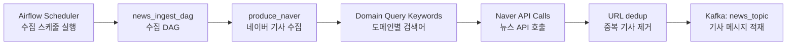
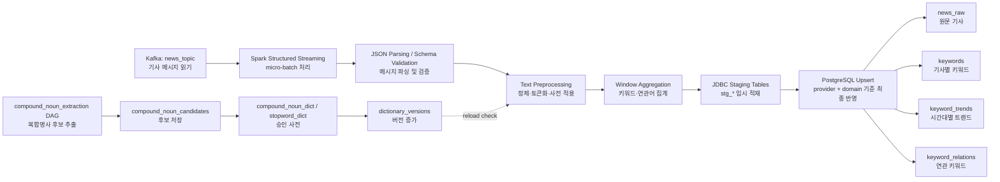

# Step 2 Spark 처리 계층 구현 정리

> Step 1에서 Kafka로 적재된 뉴스 메시지를 Spark Structured Streaming으로 전처리하고, PostgreSQL staging 테이블을 거쳐 최종 분석 테이블에 반영하는 Step 2 처리 계층 문서이다.
>
> PostgreSQL 테이블 상세, 인덱스, 사전/도메인/이벤트/수집 지표 스키마는 [Step 2 Database 설계](./STEP2_DATABASE.md)를 기준으로 관리한다.

## 1. 파이프라인 구성도

### 1-1. Step 1 수집 흐름



### 1-2. Step 2 처리/저장 흐름



### 1-3. 단계별 책임

| 단계 | 역할 |
| --- | --- |
| Step 1 Ingestion | 도메인별 Naver 검색어를 기반으로 기사 수집, URL dedup, Kafka 발행 |
| Step 2 Processing | Kafka 메시지 파싱, 텍스트 전처리, 기사별 키워드/윈도우 트렌드/연관어 집계 |
| Storage | staging 테이블 적재 후 `provider + domain` 기준 upsert |
| Dictionary Batch | 복합명사 후보 추출, 관리자 승인 사전 반영, 사전 버전 관리 |

## 2. Spark 전처리 설계

### 2-1. 처리 방식

현재 구현은 `spark.readStream(...).foreachBatch(...)` 기반의 Spark Structured Streaming이다.

```python
raw_stream = (
    spark.readStream.format("kafka")
    .option("kafka.bootstrap.servers", settings.kafka_bootstrap_servers)
    .option("subscribe", settings.kafka_topic)
    .option("startingOffsets", settings.spark_starting_offsets)
    .load()
)
```

Streaming을 선택한 이유는 다음과 같다.

1. Step 1이 Kafka에 지속적으로 메시지를 발행하므로 소비 계층도 이벤트 기반으로 이어지는 구조가 자연스럽다.
2. 키워드 트렌드와 연관 키워드는 시계열 집계이므로 near real-time 집계가 적합하다.
3. Spark checkpoint를 통해 offset과 상태를 복구할 수 있다.
4. `foreachBatch`를 사용하면 스트리밍 입력과 PostgreSQL upsert를 함께 처리할 수 있다.

### 2-2. 처리 주기

| 항목 | 값 |
| --- | --- |
| 처리 모델 | 연속 실행 micro-batch |
| Spark trigger | 별도 `trigger(processingTime=...)` 미지정, Spark 기본 micro-batch |
| 집계 윈도우 | `KEYWORD_WINDOW_DURATION=10 minutes` |
| 사전 갱신 확인 | `DICTIONARY_REFRESH_INTERVAL_SECONDS=60` |

즉 실행 단위는 streaming이지만 저장되는 트렌드 결과는 10분 window 기준이다.

## 3. 데이터 처리 흐름

### 3-1. Kafka 메시지 파싱

Spark는 Kafka 토픽 `news_topic`을 구독하고, 각 메시지의 `value`를 JSON 문자열로 읽어 기사 스키마로 파싱한다.

```python
parsed = (
    raw_stream.selectExpr("CAST(value AS STRING) AS json_string")
    .select(from_json(col("json_string"), ARTICLE_SCHEMA).alias("data"))
    .select("data.*")
    .withColumn("summary", coalesce(col("summary"), col("description"), col("content")))
    .withColumn("published_at", to_timestamp("published_at"))
    .withColumn("ingested_at", to_timestamp("ingested_at"))
    .withColumn("event_time", col("published_at"))
)
```

처리 특징은 다음과 같다.

- Kafka payload를 Spark에서 다시 스키마 검증한다.
- `summary`가 비어 있으면 과거 payload 호환을 위해 `description`, `content`를 fallback으로 사용한다.
- 집계 기준 시각은 `published_at`을 `event_time`으로 사용한다.
- `url`, `event_time`이 없는 레코드는 집계 대상에서 제외한다.
- 현재 DB 최종 저장 컬럼은 `summary` 중심이며, `author`, `content`, `description`은 최종 테이블 컬럼이 아니다.

### 3-2. 전처리/토큰화

전처리는 `title + summary`를 하나의 분석 문자열로 합친 뒤 `tokenize()` UDF를 적용한다.

```python
.withColumn("article_text", expr("concat_ws(' ', title, summary)"))
.withColumn("tokens", tokenize_udf(col("article_text")))
.dropna(subset=["event_time", "url"])
```

`tokenize()`의 개념적 흐름은 다음과 같다.

1. `clean_text()`
2. Kiwi 형태소 분석
3. 명사(`NNG`, `NNP`) 중심 추출
4. `compound_noun_dict` 기반 복합명사 병합
5. `stopword_dict` 기반 불용어 제거
6. 길이 1 이하 토큰 제거

사전은 DB에서 관리되며, `dictionary_versions` 변경을 기준으로 캐시 갱신 여부를 판단한다. 이 때문에 복합명사/불용어 변경은 이후 처리되는 micro-batch부터 반영된다. 과거 집계 결과까지 바꾸려면 재처리가 필요하다.

### 3-3. Spark 산출물

| 산출물 | 설명 | 최종 테이블 |
| --- | --- | --- |
| 원문 기사 | provider, domain, query, source, title, summary, url, published_at, ingested_at | `news_raw` |
| 기사별 키워드 | 기사 URL별 토큰 빈도 | `keywords` |
| 키워드 트렌드 | 10분 window별 키워드 빈도 | `keyword_trends` |
| 연관 키워드 | 기사 내 대표 키워드 동시 출현 관계 | `keyword_relations` |

모든 핵심 산출물은 `provider + domain` 기준으로 저장된다.

## 4. 저장 방식 요약

DB 상세는 [STEP2_DATABASE.md](./STEP2_DATABASE.md)에 분리한다. 이 문서에서는 Spark 관점의 적재 흐름만 다룬다.

```text
Spark micro-batch
  -> stg_news_raw / stg_keywords / stg_keyword_trends / stg_keyword_relations
  -> INSERT ... ON CONFLICT ... DO UPDATE
  -> TRUNCATE staging table
```

### 4-1. staging 테이블을 쓰는 이유

1. Spark executor가 JDBC append를 수행하므로 driver `collect()` 병목을 줄인다.
2. PostgreSQL 내부에서 dedup과 upsert를 처리해 재처리 멱등성을 확보한다.
3. 최종 테이블의 unique index를 기준으로 중복을 제어한다.
4. Spark 처리 로직과 DB conflict 처리 로직을 분리할 수 있다.

### 4-2. 현재 upsert 기준

| 최종 테이블 | conflict 기준 |
| --- | --- |
| `news_raw` | `provider, domain, url` |
| `keywords` | `article_provider, article_domain, article_url, keyword` |
| `keyword_trends` | `provider, domain, window_start, window_end, keyword` |
| `keyword_relations` | `provider, domain, window_start, window_end, keyword_a, keyword_b` |

과거 문서의 `provider + url` 또는 `provider + window` 중심 설명은 현재 스키마와 맞지 않는다. 도메인 기반 분석으로 전환되면서 모든 핵심 저장/조회 기준에 `domain`이 포함된다.

## 5. 예외/복구 전략

| 구간 | 전략 |
| --- | --- |
| DB 초기화 | `safe_initialize_database()`로 schema 초기화 시도, 실패 시 warning log |
| 스트리밍 재시작 | `checkpointLocation` 기반 Kafka offset 복구 |
| DB write | staging table append 후 DB 내부 upsert 실행 |
| 중복 데이터 | `ON CONFLICT`와 unique index로 방지 |
| 사전 조회 실패 | DB 실패 시 파일/기본 불용어 fallback |
| 비정상 메시지 | 스키마 파싱 후 `url` 또는 `event_time`이 없으면 drop |

현재 Step 2 Spark 처리에는 malformed JSON 전용 DLQ 테이블이 없다. 잘못된 메시지는 집계 대상에서 제외되는 구조다.

## 6. 처리 전/후 데이터 예시

### 6-1. Kafka 메시지 예시

```json
{
  "provider": "naver",
  "domain": "ai_tech",
  "query": "생성형AI",
  "source": "it.chosun.com",
  "title": "네이버, 생성형 AI 기반 검색 고도화",
  "summary": "네이버가 생성형 AI와 LLM 기술을 활용해 검색 품질을 높인다.",
  "url": "https://example.com/news/1",
  "published_at": "2026-04-22T01:10:00+00:00",
  "ingested_at": "2026-04-22T01:10:30+00:00"
}
```

### 6-2. 전처리 중간 결과 예시

```text
article_text
= "네이버, 생성형 AI 기반 검색 고도화 네이버가 생성형 AI와 LLM 기술을 활용해 검색 품질을 높인다."

clean_text(article_text)
= "네이버 생성형 기반 검색 고도화 네이버가 생성형 와 기술을 활용해 검색 품질을 높인다"

tokenize(article_text)
= ["네이버", "생성형", "기반", "검색", "고도화", "네이버", "생성형", "기술", "활용", "검색", "품질"]
```

현재 정제 규칙상 영문/숫자 토큰은 직접 남지 않을 수 있다. 따라서 `AI`, `LLM`, `GPT` 등 영문 약어는 복합명사 사전이나 정제 정책과 함께 별도 검토가 필요하다.

### 6-3. 저장 결과 예시

```json
{
  "article_provider": "naver",
  "article_domain": "ai_tech",
  "article_url": "https://example.com/news/1",
  "keyword": "검색",
  "keyword_count": 2,
  "processed_at": "2026-04-22T01:11:00+00:00"
}
```

```json
{
  "provider": "naver",
  "domain": "ai_tech",
  "window_start": "2026-04-22T01:10:00+00:00",
  "window_end": "2026-04-22T01:20:00+00:00",
  "keyword": "검색",
  "keyword_count": 17,
  "processed_at": "2026-04-22T01:11:00+00:00"
}
```

```json
{
  "provider": "naver",
  "domain": "ai_tech",
  "window_start": "2026-04-22T01:10:00+00:00",
  "window_end": "2026-04-22T01:20:00+00:00",
  "keyword_a": "네이버",
  "keyword_b": "검색",
  "cooccurrence_count": 6,
  "processed_at": "2026-04-22T01:11:00+00:00"
}
```

## 7. Spark Configuration

| 설정 | 현재 값 | 선택 이유 |
| --- | --- | --- |
| `SPARK_MASTER` | `local[*]` 또는 `spark://spark-master:7077` | 로컬 개발과 compose 클러스터 실행 지원 |
| `SPARK_APP_NAME` | `news-trend-pipeline` | Spark UI와 로그에서 잡 식별 용이 |
| `SPARK_CHECKPOINT_DIR` | `./runtime/checkpoints` | 스트리밍 offset/state 복구용 |
| `SPARK_SHUFFLE_PARTITIONS` | `2` | 작은 개발 클러스터와 Kafka partition 규모에 맞춘 기본값 |
| `SPARK_STARTING_OFFSETS` | `latest` | 새로 유입되는 메시지부터 처리해 초기 적재 부담 축소 |
| `KEYWORD_WINDOW_DURATION` | `10 minutes` | near real-time 성격과 집계 안정성 균형 |
| `RELATION_KEYWORD_LIMIT` | `8` | 기사당 대표 키워드만 사용해 조합 폭발 방지 |
| `DICTIONARY_REFRESH_INTERVAL_SECONDS` | `60` | DB 사전을 매 호출마다 조회하지 않으면서 변경을 빠르게 반영 |

Spark 실행 시 아래 패키지를 함께 로드한다.

```bash
--packages org.apache.spark:spark-sql-kafka-0-10_2.12:3.5.7,org.postgresql:postgresql:42.7.4
```

## 8. 실행 방법

### 8-1. 엔트리포인트

Spark 처리 잡 실행 엔트리포인트는 [`scripts/run_processing.py`](../../scripts/run_processing.py) 이다.

```python
from processing.spark_job import run_streaming_job

if __name__ == "__main__":
    run_streaming_job()
```

### 8-2. 로컬 실행

```bash
python scripts/run_processing.py
```

`SPARK_MASTER=local[*]` 설정이면 로컬 Spark에서 동작한다.

### 8-3. Docker Compose 실행

```bash
docker compose up -d
```

`spark-streaming` 서비스가 자동으로 아래 명령을 수행한다.

```bash
/opt/spark/bin/spark-submit \
  --master spark://spark-master:7077 \
  --conf spark.jars.ivy=/tmp/.ivy2 \
  --packages org.apache.spark:spark-sql-kafka-0-10_2.12:3.5.7,org.postgresql:postgresql:42.7.4 \
  /opt/news-trend-pipeline/scripts/run_processing.py
```

## 9. 구현 파일 목록

- `src/processing/spark_job.py`
- `src/processing/preprocessing.py`
- `src/storage/db.py`
- `src/storage/models.sql`
- `src/core/config.py`
- `scripts/run_processing.py`
- `infra/spark/Dockerfile.spark`
- `docker-compose.yml`
- `airflow/dags/compound_extraction_dag.py`
- `src/analytics/compound_extractor.py`

## 10. 관련 문서

- [Step 1 Kafka 수집 구조](./STEP1_KAFKA_2.md)
- [Step 2 전처리 상세](./STEP2_PREPROCESSING.md)
- [Step 2 Database 설계](./STEP2_DATABASE.md)
