# STEP 3-1: Database

> 기준 구현:
> [`src/storage/models.sql`](/C:/Project/news-trend-pipeline-v2/src/storage/models.sql),
> [`src/storage/db.py`](/C:/Project/news-trend-pipeline-v2/src/storage/db.py)

## 1. 역할

데이터베이스 계층은 파이프라인의 기준 데이터, 기사 원문, 분석 결과, 사전 데이터, 운영 지표를 PostgreSQL 스키마로 관리한다.

현재 구현 범위는 다음과 같다.

- 기준 테이블과 검색어 관리
- 기사 원문과 분석 결과 저장
- 사전 및 후보 테이블 관리
- 운영 지표와 이벤트 저장
- staging upsert
- 일 단위 재처리 유틸

## 2. 단계 구성도

```mermaid
flowchart LR
    A["DB 초기화<br/>safe_initialize_database()"] --> B["스키마 생성<br/>models.sql 실행"]
    B --> C["기본 데이터 적재<br/>domain / query seed"]

    C --> QC["수집 기준 테이블<br/>domain_catalog / query_keywords"]

    AF["Airflow Scheduler"] --> NI["news_ingest_dag<br/>뉴스 수집 / Kafka 발행"]
    AF --> RP["auto_replay_dag<br/>dead letter 재처리"]
    AF --> CD["compound_dictionary_dag<br/>복합명사 후보 추출"]
    AF --> AR["compound_candidate_auto_review_dag<br/>후보 자동 평가 / 보수적 승인"]
    AF --> KE["keyword_event_detection<br/>급상승 이벤트 탐지"]

    QC --> NI
    NI --> KF["Kafka<br/>news_topic"]
    RP --> KF
    NI --> CM["수집 메트릭 저장<br/>collection_metrics"]

    KF --> SS["Spark Streaming<br/>뉴스 consume / 분석 처리"]
    SS --> STG["Staging Tables<br/>stg_news_raw / stg_keywords / stg_keyword_trends / stg_keyword_relations"]
    STG --> UPS["Staging → 운영 테이블 반영<br/>upsert_from_staging_*"]

    UPS --> NR["원본 기사<br/>news_raw"]
    UPS --> KW["기사별 키워드<br/>keywords"]
    UPS --> KT["트렌드 집계<br/>keyword_trends"]
    UPS --> KR["연관어 분석<br/>keyword_relations"]

    NR --> CD
    CD --> CAND["복합명사 후보<br/>compound_noun_candidates<br/>status=needs_review"]

    CAND --> AR
    AR --> CAND
    AR --> DICT["복합명사 사전<br/>compound_noun_dict<br/>source=auto-approved"]
    DICT --> DV["사전 버전<br/>dictionary_versions"]
    DV -. "Spark 사전 캐시 갱신 기준" .-> SS

    KT --> KE
    KW --> KE
    NR --> KE
    KE --> EV["급상승 이벤트<br/>keyword_events"]

    MG["관리/API"] --> QC
    MG --> DICT
    MG --> SW["불용어 사전<br/>stopword_dict / stopword_candidates"]
    MG --> AUD["변경 이력<br/>query_keyword_audit_logs / dictionary_audit_logs"]

    style AF fill:#ffffde,stroke:#333,stroke-width:2px,color:black
    style NI fill:#ffffde,stroke:#333,stroke-width:2px,color:black
    style RP fill:#ffffde,stroke:#333,stroke-width:2px,color:black
    style CD fill:#ffffde,stroke:#333,stroke-width:2px,color:black
    style AR fill:#ffffde,stroke:#333,stroke-width:2px,color:black
    style KE fill:#ffffde,stroke:#333,stroke-width:2px,color:black
    style STG fill:#e8f4ff,stroke:#333,stroke-width:1px,color:black
    style UPS fill:#e8f4ff,stroke:#333,stroke-width:1px,color:black
    style CAND fill:#fff4de,stroke:#333,stroke-width:1px,color:black
    style DICT fill:#e6ffed,stroke:#333,stroke-width:1px,color:black
    style EV fill:#e6ffed,stroke:#333,stroke-width:1px,color:black
```

위 구성도는 Airflow DAG 문서의 실행 흐름을 DB 관점으로 다시 표현한 것이다.
`news_ingest_dag`는 DB의 `query_keywords`와 `domain_catalog`를 읽어 수집 대상을 정하고, 수집 결과는 Kafka로 발행하며 수집 통계는 `collection_metrics`에 저장한다.
Kafka 메시지는 Spark Streaming이 처리한 뒤 `stg_*` staging 테이블에 먼저 적재되고, `upsert_from_staging_*()` 함수가 `news_raw`, `keywords`, `keyword_trends`, `keyword_relations` 운영 테이블로 반영한다.

이후 Airflow의 후속 DAG들은 PostgreSQL 분석 테이블을 입력으로 사용한다.
`compound_dictionary_dag`는 `news_raw`에서 복합명사 후보를 추출해 `compound_noun_candidates`에 저장하고, `compound_candidate_auto_review_dag`는 후보를 자동 평가해 신뢰도가 높은 항목만 `compound_noun_dict`에 자동 승인한다.
사전이 변경되면 `dictionary_versions`가 증가하며, Spark는 이 값을 기준으로 사전 캐시 갱신 여부를 판단한다.
`keyword_event_detection`은 `keyword_trends`, `keywords`, `news_raw`를 읽어 급상승 이벤트를 계산하고 `keyword_events`에 저장한다.

따라서 DB 계층은 단순 저장소가 아니라 Airflow, Kafka, Spark, 관리/API를 연결하는 상태 저장소 역할을 한다.
수집 기준, staging 적재, 분석 결과, 후보 검토 상태, 사전 버전, 이벤트 결과가 모두 PostgreSQL에 남기 때문에 각 단계는 대량 payload를 XCom으로 넘기지 않고 DB row와 Kafka 메시지를 통해 느슨하게 연결된다.

## 3. 현재 스키마 구성

### 3-1. 기준 테이블

`domain_catalog`와 `query_keywords`는 수집 대상을 정의한다.

- `domain_catalog`
  - `domain_id`, `label`, `sort_order`, `is_active`
- `query_keywords`
  - `provider`, `domain_id`, `query`, `sort_order`, `is_active`
- `query_keyword_audit_logs`
  - 검색어 변경 이력 저장

실제 FK는 `query_keywords.domain_id -> domain_catalog.domain_id`다.

### 3-2. 기사 및 분석 테이블

- `news_raw`
  - 기사 원문 저장
  - 주요 컬럼: `provider`, `domain`, `query`, `source`, `title`, `summary`, `url`, `published_at`, `ingested_at`
- `keywords`
  - 기사별 키워드 저장
- `keyword_trends`
  - 시간 윈도우별 키워드 빈도 저장
- `keyword_relations`
  - 시간 윈도우별 키워드 동시 출현 저장
- `keyword_events`
  - 트렌드 기반 이벤트 탐지 결과 저장

### 3-3. 사전 테이블

- `compound_noun_dict`
- `compound_noun_candidates`
- `stopword_dict`
- `stopword_candidates`
- `dictionary_versions`
- `dictionary_audit_logs`

사전 테이블은 모두 domain 축을 포함하며, 기본값은 `all`이다.

### 3-4. 운영 테이블

- `collection_metrics`
  - 수집 요청 수, 성공 수, 발행 수, 중복 수, 오류 수 집계

### 3-5. staging 테이블

- `stg_news_raw`
- `stg_keywords`
- `stg_keyword_trends`
- `stg_keyword_relations`

## 4. 인덱스와 유니크 키

현재 구현의 핵심 unique 기준은 다음과 같다.

- `news_raw`: `idx_news_raw_provider_domain_url`
- `keywords`: `idx_keywords_unique`
- `keyword_trends`: `idx_keyword_trends_unique`
- `keyword_relations`: `idx_keyword_relations_unique`
- `keyword_events`: `idx_keyword_events_unique`

주요 조회 인덱스는 다음 목적을 가진다.

- 기사 시간 조회: `news_raw`의 `published_at`, `COALESCE(published_at, ingested_at)`
- 키워드 조회: `keywords.keyword`, `keywords(article_domain, keyword)`
- 트렌드 조회: `keyword_trends(provider, domain, window_start, window_end)`
- 연관어 조회: `keyword_relations(provider, domain, window_start, window_end)`
- 수집 지표 조회: `collection_metrics(provider, domain, window_start DESC, query)`

## 5. 초기화와 seed

### 5-1. 스키마 초기화

`safe_initialize_database()`는 advisory lock을 사용해 중복 초기화를 방지하면서 `models.sql`을 실행한다.

### 5-2. 초기 데이터

초기화 이후 다음 seed가 수행된다.

- `domain_catalog`
- `query_keywords`
- 복합명사 파일 seed
- 기본 stopword seed

## 6. staging upsert

Spark 처리 결과는 `upsert_from_staging_*()` 함수가 최종 테이블에 반영한다.

Staging 테이블은 Spark 처리 결과를 최종 운영 테이블에 바로 반영하지 않고, 먼저 `stg_*` 테이블에 append 방식으로 적재하기 위한 중간 테이블이다.
외부 수집 데이터와 Spark 처리 결과에는 중복, 필드 누락, 포맷 오류, 일부 row 실패가 포함될 수 있으므로 최종 테이블 반영 전에 staging 단계에서 검증·정제·중복 제거를 수행한다.

이 구조의 목적은 다음과 같다.

- 최종 테이블을 오염시키기 전에 중간 결과를 안전하게 보관한다.
- DAG 또는 Spark job 재실행 시 동일 데이터가 최종 테이블에 중복 적재되지 않도록 한다.
- `provider + domain + url`, 기사/키워드, window 기준 unique key와 upsert 로직을 통해 멱등성을 확보한다.
- 장애 발생 시 staging 데이터와 최종 반영 로직을 분리해 원인 추적과 재처리를 쉽게 한다.
- Spark output schema와 최종 분석 테이블 schema 사이의 완충 계층을 둔다.

Spark 병렬처리 관점에서 staging 테이블은 병렬 처리 병목을 직접 해결하는 장치는 아니다.
partition 수 부족, data skew, shuffle 과다, JDBC connection 수, batch size, PostgreSQL index/lock 경합, executor 리소스 부족 같은 병목은 Spark와 DB 쓰기 설정에서 별도로 튜닝해야 한다.

다만 staging 테이블은 병렬 처리 결과를 최종 테이블에 반영하는 방식을 제어 가능한 단계로 분리한다.
Spark executor들이 최종 테이블에 동시에 upsert하면 unique index lock 경합이나 deadlock 가능성이 커질 수 있다.
현재 구조는 Spark 결과를 staging 테이블에 append한 뒤 DB 내부의 `upsert_from_staging_*()` 함수가 최종 테이블에 반영하므로, 최종 테이블의 upsert 경합을 줄이고 재실행 시 중복 적재 위험을 낮추는 완충 장치 역할을 한다.

정리하면 staging 테이블의 주 목적은 Spark 성능 최적화가 아니라 데이터 품질 검증, 멱등성 확보, 장애 추적, 최종 테이블 반영 안정성이다.
Spark 병렬처리 병목은 staging 구조와 별도로 partition, shuffle, JDBC write, DB index/lock 기준으로 관찰하고 튜닝한다.

### 6-1. `upsert_from_staging_news_raw()`

- `provider + domain + url` 기준으로 랭킹 후 최신 1건만 선택
- 최종 `news_raw`에 upsert
- 처리 후 `stg_news_raw` 비움

### 6-2. `upsert_from_staging_keywords()`

- 기사/키워드 기준으로 dedup
- `keyword_count`, `processed_at` 갱신
- 처리 후 `stg_keywords` 비움

### 6-3. `upsert_from_staging_keyword_trends()`

- window 기준으로 `keyword_count` 합산
- 최종 `keyword_trends`에 upsert
- 처리 후 `stg_keyword_trends` 비움

### 6-4. `upsert_from_staging_keyword_relations()`

- window 기준으로 `cooccurrence_count` 합산
- 최종 `keyword_relations`에 upsert
- 처리 후 `stg_keyword_relations` 비움

## 7. 사전 버전 관리

`bump_dictionary_version()` trigger 함수는 `compound_noun_dict`, `stopword_dict` 변경 시 `dictionary_versions`를 증가시킨다.

이 값은 전처리 모듈이 읽어 캐시 갱신 여부를 판단한다.

## 8. 재처리 및 대체 적재 유틸

`db.py`에는 실시간 upsert 외에도 운영용 유틸이 구현되어 있다.

- `insert_news_raw()`
  - 기사 원문 직접 적재
- `insert_collection_metric()`
  - 수집 지표 적재
- `replace_keyword_events()`
  - 기간 단위 이벤트 결과 대체 저장
- `rebuild_keywords_for_date()`
  - `news_raw` 기준 일 단위 키워드 재생성
- `rebuild_keyword_trends_for_date()`
  - 일 단위 트렌드 재생성
- `rebuild_keyword_relations_for_date()`
  - 일 단위 연관어 재생성

## 9. 운영 특성

- 스키마 SQL은 기존 배포 환경을 위한 idempotent migration을 포함한다.
- 과거 컬럼 정리와 제약 변경도 `models.sql` 안에서 함께 처리한다.
- DB 함수는 API, 배치, Spark가 공통으로 재사용한다.
- 감사 로그는 `query_keyword_audit_logs`, `dictionary_audit_logs`에 분리 저장한다.
