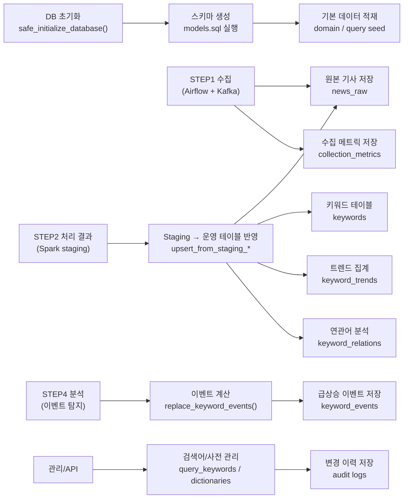

# STEP 3-1: Database

> 기준 구현:
> [`src/storage/models.sql`](/C:/Project/news-trend-pipeline-v2/src/storage/models.sql),
> [`src/storage/db.py`](/C:/Project/news-trend-pipeline-v2/src/storage/db.py)

## 1. 역할

데이터베이스 계층은 파이프라인의 기준 데이터, 기사 원문, 분석 결과, 사전 데이터, 운영 지표를 PostgreSQL 스키마로 관리한다.

현재 구현 범위는 다음과 같다.

- 기준 테이블과 검색어 관리
- 기사 원문과 분석 결과 저장
- 사전 및 후보 테이블 관리
- 운영 지표와 이벤트 저장
- staging upsert
- 일 단위 재처리 유틸

## 2. 단계 구성도

## 3. 현재 스키마 구성

### 3-1. 기준 테이블

`domain_catalog`와 `query_keywords`는 수집 대상을 정의한다.

- `domain_catalog`
  - `domain_id`, `label`, `sort_order`, `is_active`
- `query_keywords`
  - `provider`, `domain_id`, `query`, `sort_order`, `is_active`
- `query_keyword_audit_logs`
  - 검색어 변경 이력 저장

실제 FK는 `query_keywords.domain_id -> domain_catalog.domain_id`다.

### 3-2. 기사 및 분석 테이블

- `news_raw`
  - 기사 원문 저장
  - 주요 컬럼: `provider`, `domain`, `query`, `source`, `title`, `summary`, `url`, `published_at`, `ingested_at`
- `keywords`
  - 기사별 키워드 저장
- `keyword_trends`
  - 시간 윈도우별 키워드 빈도 저장
- `keyword_relations`
  - 시간 윈도우별 키워드 동시 출현 저장
- `keyword_events`
  - 트렌드 기반 이벤트 탐지 결과 저장

### 3-3. 사전 테이블

- `compound_noun_dict`
- `compound_noun_candidates`
- `stopword_dict`
- `stopword_candidates`
- `dictionary_versions`
- `dictionary_audit_logs`

사전 테이블은 모두 domain 축을 포함하며, 기본값은 `all`이다.

### 3-4. 운영 테이블

- `collection_metrics`
  - 수집 요청 수, 성공 수, 발행 수, 중복 수, 오류 수 집계

### 3-5. staging 테이블

- `stg_news_raw`
- `stg_keywords`
- `stg_keyword_trends`
- `stg_keyword_relations`

## 4. 인덱스와 유니크 키

현재 구현의 핵심 unique 기준은 다음과 같다.

- `news_raw`: `idx_news_raw_provider_domain_url`
- `keywords`: `idx_keywords_unique`
- `keyword_trends`: `idx_keyword_trends_unique`
- `keyword_relations`: `idx_keyword_relations_unique`
- `keyword_events`: `idx_keyword_events_unique`

주요 조회 인덱스는 다음 목적을 가진다.

- 기사 시간 조회: `news_raw`의 `published_at`, `COALESCE(published_at, ingested_at)`
- 키워드 조회: `keywords.keyword`, `keywords(article_domain, keyword)`
- 트렌드 조회: `keyword_trends(provider, domain, window_start, window_end)`
- 연관어 조회: `keyword_relations(provider, domain, window_start, window_end)`
- 수집 지표 조회: `collection_metrics(provider, domain, window_start DESC, query)`

## 5. 초기화와 seed

### 5-1. 스키마 초기화

`safe_initialize_database()`는 advisory lock을 사용해 중복 초기화를 방지하면서 `models.sql`을 실행한다.

### 5-2. 초기 데이터

초기화 이후 다음 seed가 수행된다.

- `domain_catalog`
- `query_keywords`
- 복합명사 파일 seed
- 기본 stopword seed

## 6. staging upsert

Spark 처리 결과는 `upsert_from_staging_*()` 함수가 최종 테이블에 반영한다.

### 6-1. `upsert_from_staging_news_raw()`

- `provider + domain + url` 기준으로 랭킹 후 최신 1건만 선택
- 최종 `news_raw`에 upsert
- 처리 후 `stg_news_raw` 비움

### 6-2. `upsert_from_staging_keywords()`

- 기사/키워드 기준으로 dedup
- `keyword_count`, `processed_at` 갱신
- 처리 후 `stg_keywords` 비움

### 6-3. `upsert_from_staging_keyword_trends()`

- window 기준으로 `keyword_count` 합산
- 최종 `keyword_trends`에 upsert
- 처리 후 `stg_keyword_trends` 비움

### 6-4. `upsert_from_staging_keyword_relations()`

- window 기준으로 `cooccurrence_count` 합산
- 최종 `keyword_relations`에 upsert
- 처리 후 `stg_keyword_relations` 비움

## 7. 사전 버전 관리

`bump_dictionary_version()` trigger 함수는 `compound_noun_dict`, `stopword_dict` 변경 시 `dictionary_versions`를 증가시킨다.

이 값은 전처리 모듈이 읽어 캐시 갱신 여부를 판단한다.

## 8. 재처리 및 대체 적재 유틸

`db.py`에는 실시간 upsert 외에도 운영용 유틸이 구현되어 있다.

- `insert_news_raw()`
  - 기사 원문 직접 적재
- `insert_collection_metric()`
  - 수집 지표 적재
- `replace_keyword_events()`
  - 기간 단위 이벤트 결과 대체 저장
- `rebuild_keywords_for_date()`
  - `news_raw` 기준 일 단위 키워드 재생성
- `rebuild_keyword_trends_for_date()`
  - 일 단위 트렌드 재생성
- `rebuild_keyword_relations_for_date()`
  - 일 단위 연관어 재생성

## 9. 운영 특성

- 스키마 SQL은 기존 배포 환경을 위한 idempotent migration을 포함한다.
- 과거 컬럼 정리와 제약 변경도 `models.sql` 안에서 함께 처리한다.
- DB 함수는 API, 배치, Spark가 공통으로 재사용한다.
- 감사 로그는 `query_keyword_audit_logs`, `dictionary_audit_logs`에 분리 저장한다.
