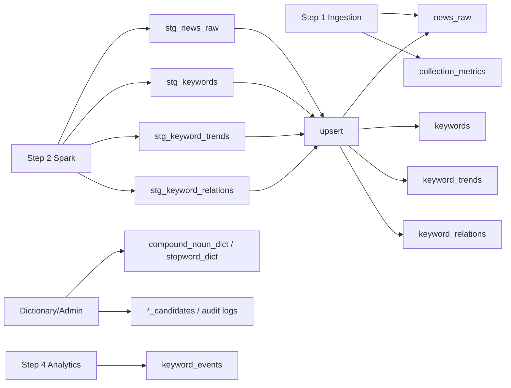

# STEP 3: Storage

> 기준 구현:
> [`src/storage/models.sql`](/C:/Project/news-trend-pipeline-v2/src/storage/models.sql),
> [`src/storage/db.py`](/C:/Project/news-trend-pipeline-v2/src/storage/db.py)

## 1. 목적

STEP 3는 수집과 처리 결과를 PostgreSQL에 안정적으로 저장하고, 이후 분석·서빙 단계가 재사용할 수 있는 데이터 구조를 제공하는 단계다.

주요 책임은 다음과 같다.

- 파이프라인 공용 스키마 초기화
- 원문 기사, 키워드, 트렌드, 연관어 저장
- 수집 운영 데이터와 이벤트 데이터 저장
- 사전과 감사 로그 저장
- staging 기반 upsert와 재처리 지원

## 2. 단계 구성도

## 3. 현재 저장 범위

### 3-1. 기준 데이터

- `domain_catalog`
- `query_keywords`
- `query_keyword_audit_logs`

### 3-2. 기사 및 분석 데이터

- `news_raw`
- `keywords`
- `keyword_trends`
- `keyword_relations`
- `keyword_events`

### 3-3. 운영 및 사전 데이터

- `collection_metrics`
- `compound_noun_dict`
- `compound_noun_candidates`
- `stopword_dict`
- `stopword_candidates`
- `dictionary_versions`
- `dictionary_audit_logs`

### 3-4. staging 테이블

- `stg_news_raw`
- `stg_keywords`
- `stg_keyword_trends`
- `stg_keyword_relations`

## 4. 저장 방식

### 4-1. 스키마 초기화

애플리케이션은 `safe_initialize_database()`를 통해 `models.sql`을 실행하고, 초기 도메인/검색어/사전 seed를 반영한다.

### 4-2. 실시간 적재

Spark는 최종 테이블에 직접 쓰지 않고 staging 테이블에 append한 뒤, DB 내부 upsert 함수로 최종 반영한다.

### 4-3. 멱등성 기준

주요 저장 키는 모두 `provider + domain` 축을 포함한다.

- `news_raw`: `(provider, domain, url)`
- `keywords`: `(article_provider, article_domain, article_url, keyword)`
- `keyword_trends`: `(provider, domain, window_start, window_end, keyword)`
- `keyword_relations`: `(provider, domain, window_start, window_end, keyword_a, keyword_b)`
- `keyword_events`: `(provider, domain, keyword, window_start)`

## 5. 운영 특성

- 인덱스와 unique key는 조회 성능과 upsert 충돌 제어를 함께 담당한다.
- 사전 테이블 변경 시 trigger가 `dictionary_versions`를 증가시켜 전처리 캐시 갱신을 유도한다.
- 재처리 유틸은 `news_raw`를 기준으로 `keywords`, `keyword_trends`, `keyword_relations`를 다시 계산할 수 있다.
- 감사 로그는 검색어와 사전 변경 이력을 별도 테이블에 남긴다.

## 6. 관련 문서

- 데이터베이스 상세: [STEP3-1_DATABASE.md](/C:/Project/news-trend-pipeline-v2/docs/design/STEP3-1_DATABASE.md)
