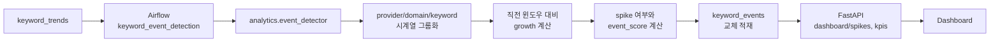

# STEP 4: Analytics

## 1. 목적

STEP4의 목적은 STEP2/STEP3에서 생성된 키워드 집계 데이터를 기반으로 급상승 이벤트를 탐지하고, 대시보드와 API가 바로 조회할 수 있는 분석 결과를 만드는 것이다.

이 단계는 새로운 원문 데이터를 수집하거나 토큰화하지 않는다. 이미 저장된 `keyword_trends`를 읽어 시간 구간별 변화량을 계산하고, 의미 있는 이벤트만 `keyword_events`에 저장한다.

## 2. 파이프라인 구성도



## 3. 입력 데이터

### 3.1 `keyword_trends`

이벤트 탐지의 기준 입력이다.

사용 컬럼:

- `provider`
- `domain`
- `keyword`
- `window_start`
- `window_end`
- `keyword_count`

`provider + domain + keyword` 단위로 시계열을 구성한다. STEP4에서는 `keyword_trends` 자체의 생성 방식은 다루지 않고, 이미 저장된 집계 결과를 분석 입력으로 사용한다.

### 3.2 `keyword_relations`

현재 STEP4 이벤트 탐지 배치의 직접 입력은 아니다.

연관 키워드 조회는 Serving 단계에서 `keyword_relations`를 사용하며, 이벤트 탐지 로직은 `keyword_trends` 기반으로 동작한다. 따라서 STEP4의 최종 구현 설명에서는 `keyword_relations`를 보조 분석 데이터로만 취급한다.

## 4. 처리 흐름

1. Airflow `keyword_event_detection` DAG가 15분 주기로 실행된다.
2. DAG는 `analytics.event_detector.run_event_detection_job()`을 호출한다.
3. 기본 `lookback_hours=24` 기준으로 최근 24시간의 `keyword_trends`를 조회한다.
4. 조회 결과를 `(provider, domain, keyword)` 단위로 그룹화한다.
5. 각 그룹 안에서 `window_start` 오름차순으로 순회한다.
6. 현재 윈도우 언급량과 직전 윈도우 언급량을 비교해 growth를 계산한다.
7. spike 여부와 event score를 계산한다.
8. 이벤트 후보 조건을 만족하는 row만 `keyword_events`에 저장한다.
9. 같은 lookback 범위의 기존 `keyword_events`를 삭제한 뒤 새 결과를 적재한다.
10. FastAPI는 `keyword_events`를 우선 조회하고, 필요한 경우 `keyword_trends` 기반 계산을 보조적으로 사용한다.

## 5. 이벤트 계산 로직

### 5.1 Growth 계산

현재 구현의 growth 계산은 다음과 같다.

```text
previous <= 0 and current > 0  -> growth = 1.0
previous <= 0 and current = 0  -> growth = 0.0
otherwise                     -> growth = (current - previous) / previous
```

직전 윈도우가 0인 상태에서 현재 언급량이 발생하면 신규 상승으로 보고 growth를 1.0으로 둔다.

### 5.2 Spike 판단

현재 구현의 spike 조건은 다음과 같다.

```text
current_mentions >= 5
and growth >= 0.4
```

이 조건을 만족하면 `is_spike = true`로 저장한다.

### 5.3 Event row 저장 조건

모든 keyword trend row를 저장하지 않는다. 현재 구현은 아래 조건 중 하나라도 만족할 때만 `keyword_events`에 저장한다.

```text
current_mentions > 0
and (
    is_spike
    or current_mentions >= 5
    or growth >= 0.15
)
```

즉, spike가 아니더라도 일정 언급량 이상이거나 낮은 수준의 증가 추세가 있으면 이벤트 후보로 저장한다.

### 5.4 Event score 계산

현재 score는 휴리스틱 기반으로 계산한다.

```text
score = min(
    100,
    round(
        growth * 45
        + sqrt(current_mentions) * 6
        + spike_bonus
    )
)

spike_bonus = 20 if is_spike else 0
```

최종 `event_score`는 0 이상 100 이하의 정수로 저장된다.

## 6. 저장 구조

이벤트 탐지 결과는 `keyword_events`에 저장한다.

주요 컬럼:

| 컬럼 | 설명 |
| --- | --- |
| `provider` | 뉴스 제공자. 현재 기본 수집 provider는 `naver` |
| `domain` | 도메인 ID |
| `keyword` | 이벤트 대상 키워드 |
| `event_time` | 이벤트 기준 시각. 현재는 `window_end` |
| `window_start` | 계산 대상 윈도우 시작 |
| `window_end` | 계산 대상 윈도우 종료 |
| `current_mentions` | 현재 윈도우 언급량 |
| `prev_mentions` | 직전 윈도우 언급량 |
| `growth` | 직전 윈도우 대비 증가율 |
| `event_score` | 이벤트 중요도 점수 |
| `is_spike` | 급상승 여부 |
| `detected_at` | 이벤트 탐지 실행 시각 |

`provider + domain + keyword + window_start` 조합은 unique index로 관리된다. 재실행 시 같은 윈도우의 결과는 upsert된다.

## 7. 재처리와 멱등성

`replace_keyword_events()`는 재계산 범위의 기존 이벤트를 먼저 삭제하고 새 이벤트 row를 적재한다.

삭제 범위:

```text
event_time >= since
and event_time < until
```

따라서 같은 `until`과 `lookback_hours`로 재실행하면 해당 범위의 이벤트 결과를 다시 만들 수 있다. 이 구조는 Airflow 재시도나 수동 재실행 시 중복 누적을 방지한다.

## 8. Airflow 실행

DAG 파일:

- `airflow/dags/keyword_event_detection_dag.py`

DAG 설정:

| 항목 | 값 |
| --- | --- |
| DAG ID | `keyword_event_detection` |
| schedule | `*/15 * * * *` |
| lookback | 24시간 |
| task | `detect_keyword_events` |
| max active runs | 1 |
| retry | 1회, 5분 후 재시도 |

DAG는 Airflow `data_interval_end`를 `until`로 넘긴다. 이벤트 탐지 작업은 `until - 24h`부터 `until` 직전까지의 `keyword_trends`를 기준으로 계산한다.

## 9. API 연계

STEP4 결과는 Serving 단계에서 다음 API에 사용된다.

| API | 사용 방식 |
| --- | --- |
| `GET /api/v1/dashboard/spikes` | 급상승 이벤트 목록과 히트맵 데이터 조회 |
| `GET /api/v1/dashboard/kpis` | `keyword_events`의 `is_spike = true` 기준 spike count 계산 |
| `GET /api/v1/dashboard/overview-window` | 대시보드 통합 조회 시 spike 정보를 함께 구성 |

FastAPI는 저장된 `keyword_events`를 우선 사용한다. 단, 대시보드 조회 조건이나 캐시/집계 상황에 따라 `keyword_trends` 기반 보조 계산이 함께 사용될 수 있다.

## 10. 설계 포인트

- 이벤트 탐지는 수집/전처리와 분리된 배치 분석 단계다.
- 분석 단위는 `provider + domain + keyword`다.
- domain별 트렌드를 독립적으로 계산해 서로 다른 도메인의 키워드 노이즈가 섞이지 않도록 한다.
- 15분 주기 Airflow DAG로 near real-time 수준의 이벤트 탐지를 제공한다.
- 최근 24시간을 재계산하는 방식이라 지연 도착 데이터가 일부 보정될 수 있다.
- `keyword_events`는 Dashboard 조회 성능을 위한 분석 결과 테이블이다.

## 11. 현재 구현 기준 메모

- STEP4의 최종 구현 설명은 `keyword_trends -> keyword_events` 분석 흐름만 다룬다.
- 이벤트 임계치와 score 공식의 튜닝 과정은 `docs/develop/STEP4_ANALYTICS_history.md`에 기록한다.
- `keyword_relations` 기반 고급 이벤트 해석, 알림/배너 연동, 도메인별 threshold 분리는 아직 별도 고도화 영역이다.
