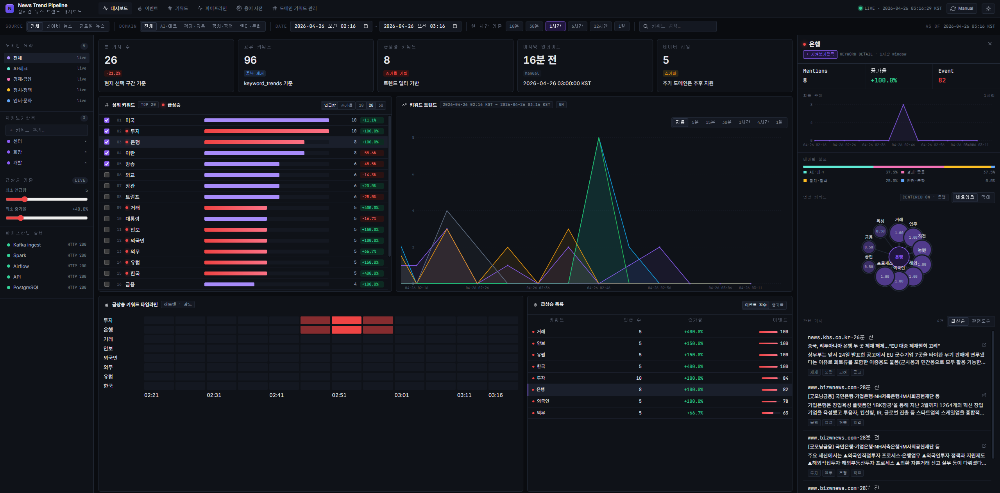

# STEP5-2: Dashboard 기능 정의서

## 1. 목적

Dashboard는 뉴스 트렌드 파이프라인의 분석 결과를 시각화하고, 사용자가 도메인/기간/키워드를 빠르게 탐색할 수 있도록 제공하는 프론트엔드 UI이다.

이 문서는 현재 구현된 화면과 동작 방식을 기준으로 작성한다.

## 2. 구현 위치

```text
src/dashboard/src/app.tsx      # 화면 상태, API 호출, cache 재집계, interaction 제어
src/dashboard/src/data.ts      # API client와 response type 정의
src/dashboard/src/charts.tsx   # trend line, spike heatmap, related network chart
src/dashboard/src/ui.tsx       # 공통 UI 컴포넌트
```

## 3. 화면 예시



## 4. 화면 구성

### 4.1 상단 헤더

역할:

- 서비스명 표시
- 주요 메뉴 진입점 제공
- 현재 시스템 시간 및 live 상태 표시
- manual refresh / theme toggle 제공

주요 메뉴:

- Dashboard
- Event
- Keyword
- Pipeline
- 용어 사전
- 도메인 키워드 관리

### 4.2 상단 필터 바

사용자가 조회 범위를 조정하는 영역이다.

입력 요소:

| 요소 | 설명 |
| --- | --- |
| `source` | 전체 / 네이버 뉴스 / 글로벌 뉴스 |
| `domain` | 전체 / AI·테크 / 경제·금융 / 정치·정책 / 엔터·문화 |
| `date range` | custom start/end datetime |
| preset range | 10분, 30분, 1시간, 6시간, 12시간, 1일 |
| keyword search | 키워드 검색 및 typeahead |

영향 범위:

- KPI
- 상위 키워드
- 트렌드 차트
- 급상승 heatmap
- 급상승 목록
- 우측 keyword detail
- 관련 기사

### 4.3 좌측 사이드바

#### 도메인 요약

- domain 목록 표시
- 각 domain의 live 상태 표시
- 선택된 domain 강조

#### 지켜보기 항목

- 사용자가 관심 키워드를 watchlist로 관리
- 선택 키워드와 연동

#### 급상승 기준

- 최소 언급량
- 최소 증가율

프론트 표시 기준으로 spike 판정을 조정하는 UI이다. 서버의 원본 이벤트와 별개로 화면 표시용 threshold에 영향을 준다.

#### 파이프라인 상태

- Kafka Ingest
- Spark
- Airflow
- API
- PostgreSQL

각 서비스 상태를 health/status API 응답 기반으로 표시한다.

### 4.4 KPI 카드

화면 상단 요약 카드이다.

표시 항목:

| 카드 | 의미 |
| --- | --- |
| 총 기사 수 | 현재 window 기준 기사 수 |
| 고유 키워드 | 현재 window 기준 unique keyword 수 |
| 급상승 키워드 | 현재 threshold 기준 spike keyword 수 |
| 마지막 업데이트 | 최신 데이터 시각 |
| 데이터 지연 | 추가 도메인/상태 지원용 지표 |

데이터 소스:

```text
overview.kpis
```

cache 범위 안에서 기간만 바뀌면 `deriveOverviewFromCache()`가 KPI를 재계산한다.

### 4.5 상위 키워드 패널

현재 window의 주요 키워드를 보여준다.

기능:

- mentions 기준 정렬
- growth 기준 정렬
- TOP 10 / 20 / 30 limit 변경
- keyword 선택
- trend 표시 여부 checkbox
- spike keyword 강조

데이터 소스:

```text
overview.keywords
```

선택 결과:

- `selectedKeyword` 변경
- trend chart series 선택에 반영
- 우측 keyword detail 갱신
- related keywords / articles 재조회 또는 갱신

### 4.6 키워드 트렌드 차트

시간대별 키워드 언급량을 line chart로 표시한다.

기능:

- 다중 키워드 series 표시
- hover tooltip
- bucket 선택
  - auto
  - 5분
  - 15분
  - 30분
  - 1시간
  - 4시간
  - 1일
- series show/hide
- 기간 drag / pan / zoom 기반 조회 window 변경

데이터 소스:

```text
GET /api/v1/dashboard/trend-window
```

최적화:

- trend chart도 실제 표시 window보다 넓은 fetch window를 사용한다.
- cache 범위 안에서는 기존 trend response를 재사용한다.

### 4.7 급상승 키워드 타임라인

시간 bucket별 spike intensity를 heatmap 형태로 표시한다.

기능:

- keyword row + time bucket grid
- intensity 기반 색상 표시
- heatmap cell click 시 keyword 선택
- selected keyword와 우측 detail panel 연동

데이터 소스:

```text
overview.spikes.events
```

cache 범위 안에서는 API 재호출 없이 현재 window 기준 spike event를 다시 계산한다.

### 4.8 급상승 목록

현재 window에서 spike 또는 이벤트성이 높은 키워드를 목록으로 표시한다.

컬럼:

- keyword
- mentions
- growth
- event score

정렬:

- event score
- growth

데이터 소스:

```text
overview.spikes.events
overview.keywords
```

### 4.9 우측 키워드 상세 패널

`selectedKeyword` 기준 상세 정보를 표시한다.

표시 항목:

- mentions
- 증가율
- event score
- 미니 트렌드
- 테마/도메인 분포
- 연관 키워드 network
- 관련 기사 목록

관련 API:

```text
GET /api/v1/dashboard/related
GET /api/v1/dashboard/theme-distribution
GET /api/v1/dashboard/articles
```

### 4.10 관련 기사 패널

선택 키워드와 연결된 기사 목록을 표시한다.

기능:

- 최신순 정렬
- 관련도순 정렬
- 기사 외부 링크 이동
- 기사 keyword tag 표시

데이터 소스:

```text
GET /api/v1/dashboard/articles
```

### 4.11 용어 사전 / 도메인 키워드 관리

별도 modal을 통해 운영성 기능을 제공한다.

기능:

- 복합명사 사전 조회/등록/삭제
- 불용어 사전 조회/등록/삭제
- 후보 승인/반려
- query keyword 관리
- collection metrics 확인

## 5. 상태 모델

### 5.1 UI 상태

```text
theme
selectedKeyword
selectedBucket
selectedArticle
articleSort
relatedView
topSort
topLimit
spikeSort
spikeMinMentions
spikeMinGrowth
watchlist
autoRefresh
dictionaryOpen
queryKeywordOpen
```

### 5.2 Query 상태

```text
source
domain
rangePreset
trendWindow
search
effectiveTrendBucket
```

### 5.3 Cache 상태

```text
overviewFetchWindow
overview cache
trendFetchWindow
trend cache
```

Cache 상태는 차트 drag/pan/zoom 시 API 호출을 줄이는 핵심이다.

## 6. 핵심 인터랙션 정의

### 6.1 키워드 선택

```text
Top Keywords click
or Spike Heatmap click
or Related Keyword click
or Search select
→ selectedKeyword 변경
→ trend / detail / articles / related 영역 갱신
```

### 6.2 기간 이동 / 확대 / 축소

```text
chart drag / zoom
→ trendWindow 변경
→ committedWindow 반영
→ overview cache 범위 확인
```

분기:

```text
cache 범위 안
→ API 호출 없음
→ deriveOverviewFromCache() 실행
→ KPI / keywords / spikes 즉시 갱신

cache 범위 밖 또는 가장자리 접근
→ overview-window API 재호출
→ cache 갱신
```

### 6.3 검색

```text
keyword search 입력
→ overview-window search parameter 반영
→ candidate keyword 범위 축소
→ keyword list / spike / chart 갱신
```

### 6.4 자동 새로고침

```text
autoRefresh = true
→ 일정 tick마다 현재 range 기준 window 갱신
→ 필요한 경우 overview/trend fetch window 재조회
```

### 6.5 Spike 기준 조정

```text
min mentions / min growth 조정
→ 화면 표시용 spike 판정 재계산
→ top keyword / spike 표시 갱신
```

## 7. overview-window 기반 최적화

### 7.1 문제

키워드 트렌드 차트의 drag, pan, zoom, 기간 재설정 기능을 개발하면서 다음 문제가 발생했다.

- 기간 변경마다 API를 반복 호출
- API 응답 대기 중 UI 조작성이 저하
- KPI / keywords / spikes가 각각 재조회되어 backend 부하 증가

### 7.2 해결 구조

```text
FastAPI overview-window
→ 넓은 fetch window의 bucket data 반환
→ Dashboard cache 저장
→ 현재 표시 window 기준 frontend 재집계
```

### 7.3 핵심 함수

```text
deriveOverviewFromCache()
```

역할:

- KPI 재계산
- top keywords 재계산
- spike events 재계산
- 현재 window 기준 growth / eventScore 재계산

### 7.4 backend / frontend 역할 분리

| 계층 | 역할 |
| --- | --- |
| FastAPI | 넓은 범위의 bucket data와 1차 summary 제공 |
| Dashboard | cache 범위 안에서 현재 표시 window 기준 2차 재집계 |

즉, backend 집계를 완전히 frontend로 이전한 구조가 아니다. 서버는 cache-friendly raw bucket 데이터를 제공하고, frontend는 interaction 응답성을 위해 표시 window 단위 집계를 수행한다.

## 8. API 연동

주요 API client는 `src/dashboard/src/data.ts`에 정의되어 있다.

| 프론트 함수 | API |
| --- | --- |
| `api.filters()` | `GET /api/v1/meta/filters` |
| `api.overviewWindow()` | `GET /api/v1/dashboard/overview-window` |
| `api.trendWindow()` | `GET /api/v1/dashboard/trend-window` |
| `api.related()` | `GET /api/v1/dashboard/related` |
| `api.themeDistribution()` | `GET /api/v1/dashboard/theme-distribution` |
| `api.articles()` | `GET /api/v1/dashboard/articles` |
| `api.system()` | `GET /api/v1/dashboard/system` |

## 9. 현재 구현 기준 메모

- Dashboard는 React + Vite 기반이다.
- FastAPI 응답을 `data.ts` 타입으로 받아 사용한다.
- overview cache와 trend cache는 별도로 관리한다.
- `overview-window`는 KPI / keywords / spikes 최적화용이다.
- `trend-window`는 line chart series 조회용이다.
- screenshot은 `docs/design/STEP5-1_Screenshot.png`를 기준으로 한다.

## 10. 한 줄 정리

```text
Dashboard는 FastAPI가 제공하는 bucket 데이터를 cache하고, 현재 표시 window 기준으로 재집계하여 drag/pan/zoom interaction에서도 즉시 반응하는 UI를 제공한다.
```
