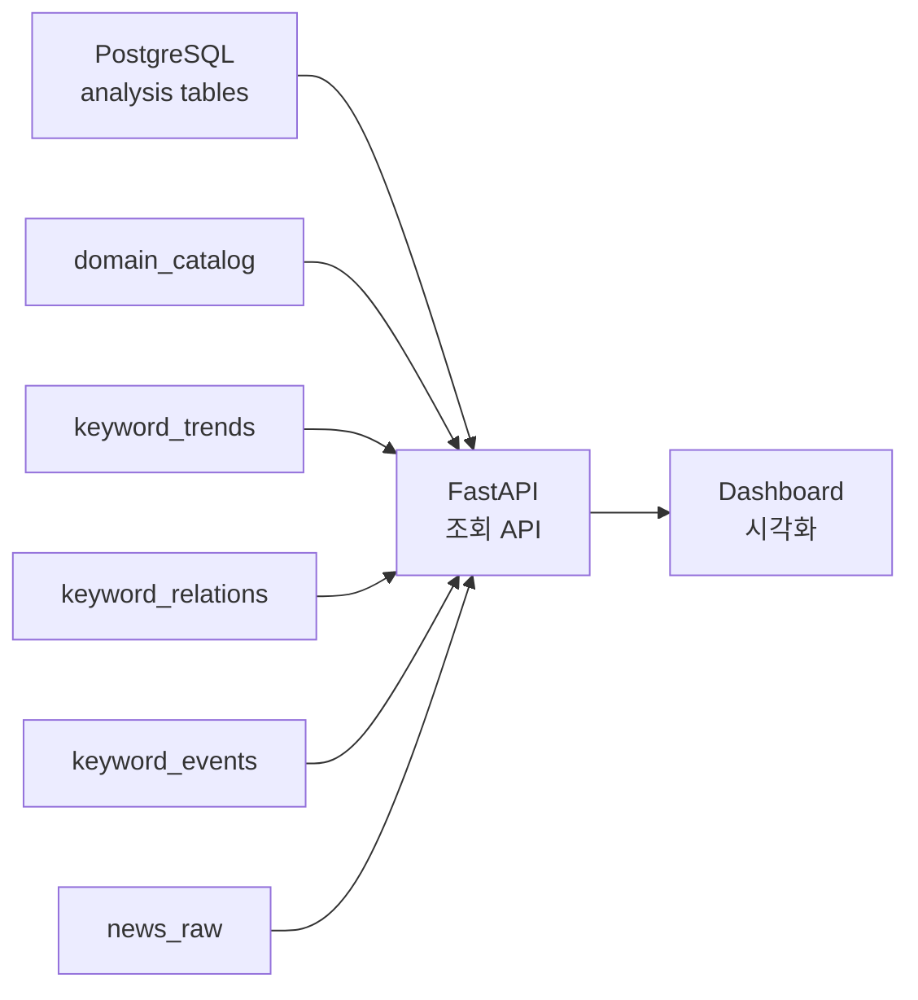

# STEP 6: Serving (FastAPI + Dashboard)

## 목적
PostgreSQL에 저장된 분석 결과를 API와 Dashboard에서 조회 가능한 형태로 제공한다.

이 단계의 핵심은 데이터 처리 자체가 아니라, **저장된 분석 결과를 사용자에게 안정적으로 전달하는 조회 계층**을 구성하는 것이다.

## 핵심 스택

- FastAPI
- PostgreSQL
- Frontend Dashboard

## 전체 흐름



## 주요 조회 대상

| 조회 대상 | 사용 테이블 | 설명 |
| --- | --- | --- |
| 필터/도메인 | `domain_catalog`, `query_keywords` | 지원 도메인과 검색어 설정 |
| 키워드 랭킹 | `keyword_trends` | 특정 기간/도메인 기준 상위 키워드 |
| 키워드 추이 | `keyword_trends` | 시간대별 키워드 변화 |
| 연관 키워드 | `keyword_relations` | 함께 등장한 키워드 관계 |
| 급상승 이벤트 | `keyword_events` | spike로 판단된 키워드 이벤트 |
| 관련 기사 | `news_raw`, `keywords` | 특정 키워드와 연결된 기사 목록 |
| 수집 지표 | `collection_metrics` | 수집 성공/중복/오류 현황 |

## 설계 포인트

### 1. API는 원천 데이터를 다시 계산하지 않는다

Spark와 batch layer가 계산한 결과를 PostgreSQL에서 조회한다.

```text
좋은 구조:
Spark / Batch -> 계산
FastAPI -> 조회
```

API 계층에서 무거운 집계를 반복하지 않아야 응답 시간이 안정적이다.

### 2. provider + domain 기준 조회

현재 데이터 모델은 `provider + domain` 기준이다.

```text
provider = naver
domain = ai_tech
```

따라서 API 파라미터도 provider, domain, time range를 기본 축으로 삼는다.

### 3. 시간 범위는 API에서 명시적으로 받는다

대시보드는 기간 필터를 자주 사용하므로, API는 다음 기준을 명확히 받아야 한다.

```text
start_at
end_at
provider
domain
keyword(optional)
```

### 4. Dashboard는 KPI와 차트를 분리한다

Dashboard는 조회 결과를 다음 영역으로 나눠 표시한다.

| 영역 | 예시 |
| --- | --- |
| KPI | 지원 도메인 수, 최근 기사 수, 이벤트 수 |
| Ranking | 상위 키워드 |
| Time-series | 키워드 트렌드 |
| Network/List | 연관 키워드 |
| Event | 급상승 키워드 |
| Articles | 관련 기사 |

## API 설계 예시

```text
GET /api/v1/meta/filters
GET /api/v1/trends/keywords
GET /api/v1/trends/series
GET /api/v1/relations
GET /api/v1/events
GET /api/v1/articles
GET /api/v1/metrics/collection
```

## 처리 범위

Serving 계층은 다음을 담당한다.

1. 요청 파라미터 검증
2. PostgreSQL 조회
3. Dashboard 친화적인 응답 모델 변환
4. 정렬/limit/pagination 처리
5. 오류 응답 표준화

Serving 계층은 다음을 담당하지 않는다.

1. 뉴스 수집
2. Kafka 메시지 처리
3. Spark 집계
4. 복합명사 후보 추출
5. 이벤트 스코어 계산

## 관련 구현 위치

```text
src/api/
src/dashboard/
src/storage/db.py
```

## 한 줄 정리

```text
STEP 6은 계산된 분석 결과를 API와 Dashboard로 전달하는 조회 계층이다.
```
