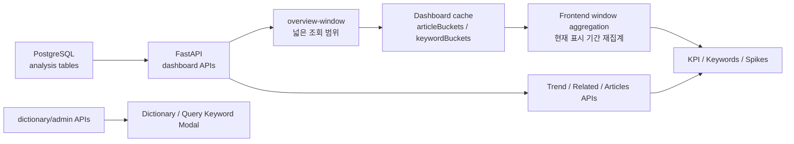

# STEP 5: Serving

## 1. 목적

STEP5의 목적은 PostgreSQL에 저장된 분석 결과를 FastAPI와 Dashboard에서 조회 가능한 형태로 제공하는 것이다.

이 단계는 뉴스 수집, Kafka 처리, Spark 집계, 이벤트 탐지 자체를 수행하지 않는다. 대신 저장된 결과를 화면에서 빠르게 탐색할 수 있도록 API 계약, 조회 최적화, 프론트 상태 관리를 담당한다.

## 2. 전체 흐름



## 3. 주요 조회 대상

| 조회 대상 | 사용 테이블 | 설명 |
| --- | --- | --- |
| 필터/도메인 | `domain_catalog`, `query_keywords` | 지원 도메인과 검색어 설정 |
| KPI | `news_raw`, `keyword_trends`, `keyword_events` | 기사 수, 키워드 수, 이벤트 수 |
| 키워드 랭킹 | `keyword_trends`, `keywords`, `news_raw` | 특정 기간/도메인 기준 상위 키워드 |
| 키워드 추이 | `keyword_trends` | 시간대별 키워드 변화 |
| 급상승 이벤트 | `keyword_events`, `keyword_trends` | spike 이벤트와 heatmap |
| 연관 키워드 | `keyword_relations` | 함께 등장한 키워드 관계 |
| 관련 기사 | `news_raw`, `keywords` | 특정 키워드와 연결된 기사 목록 |
| 수집 지표 | `collection_metrics` | 수집 성공/중복/오류 현황 |
| 사전/관리 | dictionary/query keyword tables | 사전, 후보, 검색어 관리 |

## 4. API 구성

### 4.1 Dashboard API

| API | 역할 |
| --- | --- |
| `GET /api/v1/meta/filters` | source/domain/range 필터 메타 조회 |
| `GET /api/v1/dashboard/overview-window` | KPI, 키워드, 스파이크 통합 조회 및 프론트 캐시용 버킷 데이터 제공 |
| `GET /api/v1/dashboard/kpis` | 개별 KPI 조회 |
| `GET /api/v1/dashboard/keywords` | 상위 키워드 조회 |
| `GET /api/v1/dashboard/trend` | preset range 기반 트렌드 조회 |
| `GET /api/v1/dashboard/trend-window` | custom window 기반 트렌드 조회 |
| `GET /api/v1/dashboard/spikes` | 급상승 이벤트 조회 |
| `GET /api/v1/dashboard/related` | 연관 키워드 조회 |
| `GET /api/v1/dashboard/theme-distribution` | 키워드의 도메인/테마 분포 조회 |
| `GET /api/v1/dashboard/articles` | 관련 기사 조회 |
| `GET /api/v1/dashboard/system` | DB/Kafka/Spark/Airflow/API 상태 조회 |

### 4.2 Dictionary/Admin API

| API | 역할 |
| --- | --- |
| `GET /api/v1/dictionary` | 사전 메타 조회 |
| `GET /api/v1/dictionary/compound-nouns` | 복합명사 사전 페이징 조회 |
| `POST /api/v1/dictionary/compound-nouns` | 복합명사 등록 |
| `PATCH /api/v1/dictionary/compound-nouns/{id}/domain` | 복합명사 도메인 변경 |
| `DELETE /api/v1/dictionary/compound-nouns/{id}` | 복합명사 삭제 |
| `GET /api/v1/dictionary/candidates` | 복합명사 후보 조회 |
| `POST /api/v1/dictionary/compound-candidates/{id}/approve` | 복합명사 후보 승인 |
| `POST /api/v1/dictionary/compound-candidates/{id}/reject` | 복합명사 후보 반려 |
| `GET /api/v1/dictionary/stopwords` | 불용어 조회 |
| `GET /api/v1/dictionary/stopword-candidates` | 불용어 후보 조회 |
| `GET /api/v1/dictionary/history` | 사전 변경 이력 조회 |
| `GET /api/v1/admin/query-keywords` | 검색어 관리 현황 조회 |
| `POST/PATCH/DELETE /api/v1/admin/query-keywords` | 검색어 생성/수정/삭제 |
| `GET /api/v1/admin/collection-metrics` | 수집 지표 조회 |
| `POST /api/v1/admin/run-compound-auto-approve` | 복합명사 자동승인 실행 |
| `POST /api/v1/admin/run-stopword-recommender` | 불용어 후보 추천 실행 |

## 5. `overview-window` 최적화 구조

### 5.1 도입 목적

Dashboard에서 키워드 트렌드 차트의 드래그 패닝, 확대/축소, 조회 기간 조정을 지원하면서 다음 문제가 발생했다.

- 기간이 조금만 바뀌어도 KPI, 키워드, 스파이크 API를 반복 호출함
- API 응답 대기 중 화면 상호작용이 느려짐
- backend 집계 요청이 짧은 간격으로 반복됨

이를 줄이기 위해 `overview-window` 통합 API와 프론트 캐시 재집계 구조를 도입했다.

### 5.2 요청 방식

Dashboard는 현재 화면에 보이는 기간보다 넓은 `overviewFetchWindow`를 계산해 API에 전달한다.

주요 query parameter:

```text
source
domain
range
startAt
endAt
fetchStartAt
fetchEndAt
bucket
search
limit
```

- `startAt/endAt`: 현재 화면에 표시되는 기간
- `fetchStartAt/fetchEndAt`: 서버에서 미리 가져올 더 넓은 기간
- `bucket`: 프론트와 서버가 공유하는 집계 bucket 크기

### 5.3 응답 구조

`overview-window` 응답은 즉시 화면에 표시할 요약 결과와, 프론트 재집계용 cache payload를 함께 포함한다.

```text
{
  kpis,
  keywords,
  spikes,
  cache: {
    requestedStartAt,
    requestedEndAt,
    fetchStartAt,
    fetchEndAt,
    dataStartAt,
    dataEndAt,
    bucket,
    bucketMin,
    buckets,
    candidateKeywords,
    articleBuckets,
    keywordBuckets,
    range
  }
}
```

### 5.4 프론트 재집계 방식

Dashboard는 `cache.articleBuckets`, `cache.keywordBuckets`, `cache.candidateKeywords`를 보관한다.

현재 표시 기간이 cache 범위 안에 있으면 서버를 다시 호출하지 않고 `deriveOverviewFromCache()`에서 다음 값을 다시 계산한다.

- KPI
  - total articles
  - unique keywords
  - spike count
  - growth
  - last update
- top keywords
  - mentions
  - prevMentions
  - growth
  - eventScore
  - articleCount
- spikes
  - top keywords
  - heatmap events
  - range metadata

즉, 백엔드 집계를 완전히 프론트로 이전한 것은 아니다. 서버는 넓은 범위의 원시 bucket 데이터를 제공하고, 프론트는 그 cache 안에서 현재 표시 윈도우만 잘라 재집계한다.

### 5.5 재호출 조건

다음 경우에는 서버를 다시 호출한다.

- `source` 변경
- `domain` 변경
- `search` 변경
- bucket 변경
- 현재 표시 기간이 기존 `overviewFetchWindow`의 가장자리로 접근하거나 벗어남
- auto refresh tick에 따라 새 데이터가 필요함

기간을 조금 이동하거나 확대/축소하는 경우에는 기존 cache를 재사용해 화면을 즉시 갱신한다.

## 6. Trend API와 overview API의 역할 차이

| 구분 | API | 역할 |
| --- | --- | --- |
| Dashboard overview | `overview-window` | KPI/키워드/스파이크를 통합 조회하고 프론트 재집계 cache 제공 |
| Trend chart | `trend-window` | 선택/프리로드 키워드의 시계열 라인 차트 데이터 제공 |
| Legacy/preset trend | `trend` | preset range 기반 트렌드 조회 |

`overview-window`는 dashboard summary 최적화용이고, `trend-window`는 라인 차트용 시계열 데이터에 집중한다.

## 7. 설계 포인트

- API는 저장된 분석 결과를 조회하고 화면 친화적인 응답으로 변환한다.
- Dashboard는 기간 이동/확대/축소 중 cache 범위 안에서는 서버를 다시 호출하지 않는다.
- 프론트 재집계는 사용자 상호작용 응답성을 높이기 위한 표시 윈도우 단위 집계다.
- 서버는 `fetchStartAt/fetchEndAt` 기준으로 넓은 bucket 데이터를 한 번에 제공한다.
- `overview-window` 내부에서는 중복 키워드 집계를 줄이고, 불필요한 sample series 계산을 제거해 응답 비용을 낮춘다.
- 데이터 생성 책임은 여전히 Processing/Analytics 단계에 있다. Serving 단계는 조회, 변환, cache-friendly 응답 구성이 책임이다.

## 8. 관련 구현 위치

```text
src/api/app.py              # FastAPI route 정의
src/api/service.py          # SQL 조회와 overview-window 구성
src/api/schemas.py          # 요청/응답 schema 일부
src/dashboard/src/data.ts   # Dashboard API client와 타입 정의
src/dashboard/src/app.tsx   # overview cache, deriveOverviewFromCache, chart/window 상태 관리
src/dashboard/src/charts.tsx
src/storage/db.py
```

## 9. 한 줄 정리

```text
STEP5는 저장된 분석 결과를 FastAPI로 제공하고, Dashboard가 넓은 overview cache를 활용해 조회 기간 변화에 즉시 반응하도록 만드는 Serving 계층이다.
```
