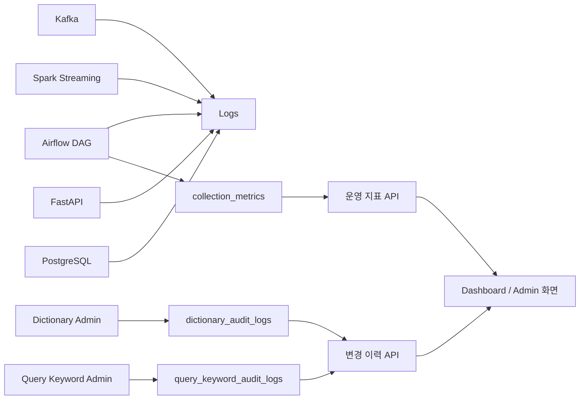

# STEP 6: Monitoring (Observability & Data Quality)

## 1. 목적

STEP6의 목적은 데이터 파이프라인의 안정성과 품질을 지속적으로 확인하고, 이상 상황이 발생했을 때 원인을 빠르게 추적할 수 있도록 하는 것이다.

이 단계의 핵심은 다음 두 가지다.

```text
1. 시스템이 정상 동작하는지 확인한다.
2. 데이터 결과가 왜 바뀌었는지 추적한다.
```

---

## 2. 모니터링 영역 구분

STEP6은 크게 세 영역으로 나눈다.

| 영역 | 목적 | 예시 |
| --- | --- | --- |
| 시스템 모니터링 | 서비스/잡이 정상 동작하는지 확인 | Airflow, Kafka, Spark, API, DB |
| 데이터 파이프라인 모니터링 | 수집/처리 결과가 정상적으로 쌓이는지 확인 | `collection_metrics`, row count, error count |
| 운영 변경 추적 | 운영자가 변경한 설정이 결과에 어떤 영향을 줬는지 추적 | `dictionary_audit_logs`, `query_keyword_audit_logs` |

---

## 3. 전체 흐름



설명:

- Airflow/Kafka/Spark/API/DB는 로그와 상태 API로 시스템 상태를 확인한다.
- `collection_metrics`는 수집 품질과 수집량을 확인하는 운영 지표다.
- `dictionary_audit_logs`와 `query_keyword_audit_logs`는 운영 변경 이력을 추적한다.
- Dashboard/Admin 화면은 이 지표와 로그를 통해 수집 상태와 운영 변경 내역을 확인한다.

---

## 4. 시스템 모니터링

### 4.1 Airflow

| 항목 | 체크 내용 |
| --- | --- |
| DAG 실행 여부 | 정상 실행 / 실패 여부 |
| 실행 시간 | 지연 여부 |
| retry 발생 | 외부 API, Kafka, DB 문제 가능성 |
| dead letter 확인 | 메시지 발행 실패 누적 여부 |

### 4.2 Kafka

| 항목 | 체크 내용 |
| --- | --- |
| 메시지 적재량 | 정상 수집 여부 |
| consumer lag | Spark 처리 지연 여부 |
| broker 연결 | producer/consumer 연결 가능 여부 |

### 4.3 Spark

| 항목 | 체크 내용 |
| --- | --- |
| micro-batch 실행 | Streaming 정상 동작 여부 |
| 처리 시간 | batch 지연 여부 |
| checkpoint | 상태 유지 여부 |
| 처리 row 수 | Kafka 메시지가 실제 처리되는지 확인 |

### 4.4 FastAPI / Dashboard

| 항목 | 체크 내용 |
| --- | --- |
| `/health` | API 프로세스 상태 |
| `/api/v1/dashboard/system` | 주요 서비스 상태 요약 |
| API 응답 시간 | 대시보드 조회 지연 여부 |
| error response | DB 연결 또는 쿼리 오류 여부 |

### 4.5 PostgreSQL

| 항목 | 체크 내용 |
| --- | --- |
| DB 연결 | API/Spark/Airflow에서 접속 가능 여부 |
| 주요 테이블 row 증가 | 데이터 적재 정상 여부 |
| upsert 결과 | 중복 누적 여부 |
| 인덱스 기반 조회 성능 | Dashboard 응답 지연 여부 |

---

## 5. 데이터 파이프라인 모니터링

### 5.1 `collection_metrics`

`collection_metrics`는 수집 단계의 품질과 상태를 확인하기 위한 운영 지표 테이블이다.

#### 용도

- Naver API 호출이 정상적으로 수행되는지 확인한다.
- 도메인/검색어별 수집량을 추적한다.
- 중복 기사 비율과 publish 실패 여부를 확인한다.
- 수집 결과가 급감했을 때 원인을 추적한다.

#### 주요 지표

```text
request_count
success_count
article_count
duplicate_count
publish_count
error_count
last_seen_at
```

#### 활용처

| 활용처 | 설명 |
| --- | --- |
| 수집 상태 확인 | 특정 query가 정상적으로 기사를 가져오는지 확인 |
| API 문제 탐지 | success_count 급감 또는 error_count 증가 확인 |
| 검색어 품질 점검 | article_count가 지속적으로 낮은 query 확인 |
| 중복률 점검 | duplicate_count가 높은 query/domain 확인 |
| Dashboard/Admin | 수집 지표 화면 또는 운영 현황 표시 |

#### 예시 지표

```text
success_rate = success_count / request_count
error_rate   = error_count / request_count
duplicate_rate = duplicate_count / article_count
```

예시 해석:

- `success_rate`가 급격히 떨어지면 API credential, 외부 API, 네트워크 문제 가능성이 있다.
- `article_count`가 특정 domain에서만 0이면 query keyword 설정 문제일 수 있다.
- `duplicate_count`가 높으면 검색어가 너무 넓거나 같은 기사를 반복 수집하는 상태일 수 있다.

### 5.2 운영 지표 API

`collection_metrics`는 관리자 API를 통해 조회된다.

```text
GET /api/v1/admin/collection-metrics
```

이 API는 Dashboard 또는 Admin 화면에서 수집 상태를 확인하는 데 사용한다.

---

## 6. 운영 변경 추적

운영자가 검색어 또는 사전을 변경하면 이후 수집량, 키워드 추출 결과, 트렌드 결과가 달라질 수 있다.

따라서 변경 이력은 단순 로그가 아니라 **결과 변화의 원인을 추적하기 위한 관측 데이터**다.

### 6.1 `dictionary_audit_logs`

`dictionary_audit_logs`는 복합명사 사전과 불용어 사전 변경 이력을 저장한다.

#### 용도

- 누가 어떤 단어를 추가/삭제/수정했는지 추적한다.
- 사전 변경 이후 키워드 추출 결과가 바뀐 원인을 확인한다.
- 잘못된 사전 변경을 되돌리기 위한 근거를 제공한다.

#### 추적 대상

- `compound_noun_dict` 등록/삭제/도메인 변경
- `stopword_dict` 등록/삭제/도메인 변경
- 후보 승인/반려
- 자동 승인/추천 결과 반영

#### 활용처

| 활용처 | 설명 |
| --- | --- |
| 키워드 품질 원인 분석 | 특정 키워드가 갑자기 늘거나 사라진 원인 확인 |
| 운영 감사 | 관리자 변경 이력 확인 |
| 롤백 판단 | 잘못 추가된 사전 항목을 식별 |
| 사전 버전 관리 | `dictionary_versions` 변화와 함께 분석 결과 변화 추적 |

#### API

```text
GET /api/v1/dictionary/history
```

### 6.2 `query_keyword_audit_logs`

`query_keyword_audit_logs`는 수집 대상 검색어 변경 이력을 저장한다.

#### 용도

- 어떤 검색어가 언제 추가/수정/삭제/비활성화되었는지 추적한다.
- 수집량 변화의 원인을 확인한다.
- 과거 수집 기준을 재현하거나 backfill 범위를 판단하는 근거로 사용한다.

#### 추적 대상

- query keyword 추가
- query keyword 수정
- domain 변경
- sort order 변경
- 활성/비활성 변경
- 삭제

#### 활용처

| 활용처 | 설명 |
| --- | --- |
| 수집량 변화 분석 | 특정 시점 이후 기사 수가 증가/감소한 이유 확인 |
| 도메인별 수집 범위 확인 | domain별 어떤 query가 활성화되어 있었는지 추적 |
| 운영 실수 추적 | 잘못된 query 삭제/비활성화 확인 |
| backfill 기준 확인 | 과거 기간 재처리 시 당시 query 설정 참고 |

#### API

```text
GET /api/v1/admin/query-keywords
```

`query_keyword_audit_logs`는 query keyword 목록과 함께 관리자 화면에서 확인할 수 있다.

---

## 7. 분석 결과 품질 모니터링

| 항목 | 체크 내용 |
| --- | --- |
| `news_raw` 증가량 | 수집 데이터가 정상적으로 쌓이는지 확인 |
| `keywords` 증가량 | 전처리/토큰화가 정상인지 확인 |
| `keyword_trends` 증가량 | window 집계가 정상인지 확인 |
| `keyword_relations` 증가량 | 연관어 집계가 정상인지 확인 |
| `keyword_events` 개수 | 이벤트 탐지 결과 급증/급감 확인 |
| 도메인별 row 수 | 특정 도메인만 비어있는지 확인 |

예시:

```text
news_raw는 증가하지만 keywords가 증가하지 않음
→ Spark 전처리, 사전, 토큰화 로직 문제 가능성

keyword_trends는 증가하지만 keyword_events가 0건
→ 이벤트 threshold 또는 event detection DAG 확인 필요
```

---

## 8. 설계 포인트

### 8.1 로그와 메트릭을 분리한다

```text
로그: 문제 원인 분석
메트릭: 문제 감지
```

### 8.2 시스템 상태와 데이터 상태를 함께 본다

```text
시스템은 정상인데 데이터가 0건일 수 있다.
데이터는 쌓이지만 결과 품질이 나쁠 수 있다.
```

따라서 STEP6은 서비스 health check뿐 아니라 collection metrics와 audit logs를 함께 확인한다.

### 8.3 domain 단위 모니터링

현재 시스템은 domain 기반이므로 문제도 domain 단위로 발생한다.

```text
ai_tech → 정상
finance → 0건 → query keyword 또는 API 문제 가능성
```

### 8.4 운영 변경과 결과 변화를 연결한다

```text
query keyword 변경 → 수집량 변화
사전 변경 → keyword 추출 결과 변화
threshold 변경 → spike 개수 변화
```

변경 이력을 남기지 않으면 결과 변화의 원인을 추적하기 어렵다.

---

## 9. 확장 가능 영역

향후 다음 기능을 추가할 수 있다.

- Slack / Email Alert
- Prometheus + Grafana
- Kafka lag exporter
- Spark metrics integration
- audit log 기반 변경 diff viewer
- collection_metrics 기반 anomaly detection

---

## 10. 한 줄 정리

```text
STEP6은 시스템 상태, 데이터 수집 품질, 운영 변경 이력을 함께 관측해 파이프라인 문제와 결과 변화의 원인을 빠르게 찾는 단계이다.
```
