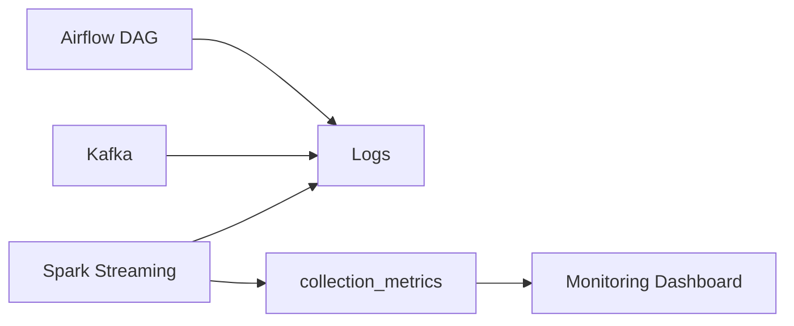

# STEP 7: Monitoring (Observability & Data Quality)

## 목적
데이터 파이프라인의 안정성과 품질을 지속적으로 확인하고 이상 상황을 빠르게 감지한다.

이 단계의 핵심은 **"문제가 발생했는지 빠르게 알 수 있는 구조"를 만드는 것**이다.

## 핵심 스택

- Airflow (DAG 상태)
- Spark (Streaming 상태)
- PostgreSQL (데이터 품질 지표)
- Logging

## 전체 흐름



## 모니터링 영역

### 1. 수집 단계 (Airflow)

| 항목 | 체크 내용 |
| --- | --- |
| DAG 실행 여부 | 정상 실행 / 실패 여부 |
| 실행 시간 | 지연 여부 |
| API 호출 성공률 | success / error |

---

### 2. 메시지 큐 (Kafka)

| 항목 | 체크 내용 |
| --- | --- |
| 메시지 적재량 | 정상 수집 여부 |
| lag | consumer 지연 |

---

### 3. 처리 단계 (Spark)

| 항목 | 체크 내용 |
| --- | --- |
| micro-batch 실행 | 정상 동작 여부 |
| 처리 시간 | batch 지연 여부 |
| checkpoint | 상태 유지 여부 |

---

### 4. 데이터 품질 (PostgreSQL)

`collection_metrics` 테이블을 통해 수집 품질을 추적한다.

```text
request_count
success_count
article_count
duplicate_count
error_count
```

#### 예시 분석

```text
success_rate = success_count / request_count
```

이 값이 급격히 떨어지면 API 또는 수집 로직 문제 가능성

---

### 5. 분석 결과 품질

| 항목 | 체크 내용 |
| --- | --- |
| 키워드 수 | 너무 적거나 많은 경우 |
| 이벤트 수 | 급증/급감 |
| 도메인별 데이터 | 특정 도메인만 비어있는 경우 |

---

## 설계 포인트

### 1. 로그와 메트릭을 분리한다

```text
로그: 문제 원인 분석
메트릭: 문제 감지
```

---

### 2. "정상 상태"를 정의한다

예:

```text
- 분당 기사 수 >= X
- error_rate < Y
- keyword_trends row 증가
```

이 기준을 벗어나면 alert 대상

---

### 3. domain 단위 모니터링

현재 시스템은 domain 기반이므로 문제도 domain 단위로 발생한다.

```text
ai_tech → 정상
finance → 0건 → 문제
```

---

## 확장 가능 영역

향후 다음 기능을 추가할 수 있다.

- Slack / Email Alert
- Prometheus + Grafana
- Kafka lag exporter
- Spark metrics integration

---

## 한 줄 정리

```text
STEP 7은 파이프라인이 정상적으로 동작하는지 감시하고 문제를 빠르게 발견하는 단계이다.
```
