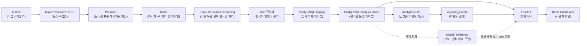
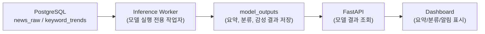

# 최종 데모 및 설계 회고

이 문서는 News Trend Pipeline v2를 발표하거나 시연할 때 사용할 수 있는 최종 요약 문서입니다.

목표는 구현 세부사항을 모두 나열하는 것이 아니라, **왜 이 프로젝트를 만들었고, 데이터가 어떤 흐름으로 이동하며, 어떤 설계 판단과 시행착오가 있었는지**를 한눈에 설명하는 것입니다.

---

## 1. 전체 흐름 데모

### 1.1 프로젝트 개요 및 목적

News Trend Pipeline는 도메인별 뉴스 데이터를 수집해 한국어 키워드, 시간대별 트렌드, 연관어, 급상승 이벤트를 분석하고 대시보드로 제공하는 데이터 파이프라인입니다.

단순히 뉴스를 모으는 것이 아니라 다음 질문에 답하는 것이 목적입니다.

- 지금 특정 분야에서 어떤 키워드가 많이 언급되는가?
- 직전 시간대보다 갑자기 증가한 키워드는 무엇인가?
- 특정 키워드와 함께 자주 등장하는 연관어는 무엇인가?
- 관련기사는 무엇인가?

이 프로젝트는 수집, 처리, 저장, 분석, API 제공, 대시보드까지 이어지는 end-to-end pipeline(처음부터 끝까지 연결된 데이터 흐름)을 구현합니다.

### 1.2  시나리오

1. Airflow UI에서 뉴스 수집 DAG가 실행되는 것을 확인한다.
2. Kafka에 뉴스 메시지가 적재되는 것을 확인한다.
3. Spark UI에서 streaming job이 Kafka 메시지를 micro-batch(작은 처리 묶음) 단위로 처리하는 것을 확인한다.
4. PostgreSQL에 원문 기사, 키워드, 트렌드, 연관어가 저장되는 것을 확인한다.
5. Airflow 분석 DAG가 급상승 이벤트를 계산하는 것을 확인한다.
6. FastAPI 문서와 React Dashboard에서 결과가 조회되는 것을 확인한다.

### 1.3 전체 데이터 흐름

현재 구현의 기본 흐름은 `데이터 수집 -> 처리 -> 저장 -> API -> 대시보드`입니다. 모델 추론(Model / Inference)은 필수 단계가 아니라 확장 지점입니다. 예를 들어 기사 요약, 감성 분석, 주제 분류, 이상 탐지 모델을 붙일 경우 PostgreSQL에 저장된 기사와 키워드 데이터를 입력으로 사용할 수 있습니다.

### 1.4 단계별 설명

| 단계 | 주요 컴포넌트 | 설명 |
| --- | --- | --- |
| 수집 | Airflow, Naver API, RSS, Producer | 정해진 주기마다 도메인별 검색어로 뉴스를 수집하고 표준 메시지로 변환합니다. |
| 버퍼링 | Kafka | 수집 속도와 처리 속도가 달라도 데이터가 바로 유실되지 않도록 중간 대기열을 둡니다. |
| 처리 | Spark Structured Streaming, Kiwi | 뉴스 본문을 정리하고 한국어 키워드, 시간대별 트렌드, 연관어를 계산합니다. |
| 저장 | PostgreSQL staging, 운영 테이블 | Spark 결과를 임시 테이블에 먼저 쌓고, upsert(있으면 수정, 없으면 삽입)로 최종 반영합니다. |
| 분석 | Airflow Analytics DAG | 저장된 트렌드 데이터를 다시 읽어 급상승 이벤트를 계산합니다. |
| 제공 | FastAPI, React Dashboard | API로 분석 결과를 조회하고 대시보드에서 시각화합니다. |

---

## 2. 주요 설계 이유

### 2.1 Kafka를 사용한 이유

Kafka는 수집과 처리를 분리하기 위해 사용했습니다.

뉴스 수집은 외부 API 응답 속도와 네트워크 상태에 영향을 받습니다. 반면 Spark 처리는 토큰화, 집계, DB 저장 때문에 상대적으로 무겁습니다. 두 단계를 직접 연결하면 한쪽이 느려졌을 때 전체 파이프라인이 함께 흔들립니다.

Kafka를 중간에 두면 Producer(데이터를 넣는 쪽)는 빠르게 메시지를 넣고, Spark Consumer(데이터를 읽는 쪽)는 처리 가능한 속도로 가져갈 수 있습니다.

트레이드오프:

- 장점: 장애 시 재처리 가능, 처리 속도 차이 흡수, Spark와 자연스럽게 연동
- 단점: Kafka broker 운영 비용 증가, topic/offset(메시지 위치) 관리 필요

### 2.2 News API 단독 수집을 포기하고 RSS를 추가한 이유

초기에는 News API(뉴스 검색 API)를 중심으로 데이터를 수집하려고 했습니다. 하지만 무료 API는 호출량, 조회 가능한 기간, 응답 개수, 검색 정확도 측면에서 한계가 있었습니다.

특히 트렌드 분석은 일정 시간 동안 충분한 기사량이 쌓여야 의미가 있는데, 무료 API만으로는 도메인별 데이터가 부족하거나 특정 검색어에 편중되는 문제가 있었습니다. 또한 검색 API는 기본적으로 `검색어에 걸리는 기사`를 가져오는 방식이라, 검색어에 포함되지 않은 중요한 최신 이슈를 놓칠 수 있었습니다.

그래서 News API 단독 수집은 포기하고, NAVER API와 RSS(언론사가 제공하는 최신 기사 피드)를 추가했습니다. RSS는 언론사에서 직접 발행하는 최신 기사 목록이므로 검색어 의존도를 줄이고, 도메인별 데이터 부족을 보완할 수 있습니다.

트레이드오프:

- 장점: 무료 API 호출 제한 부담 감소, 최신 기사 커버리지 보완, 검색어 편향 완화
- 단점: RSS 포맷이 언론사마다 달라 파싱 로직이 복잡해짐, 기사 본문 품질과 메타데이터가 제공처마다 다름

### 2.3 Spark Structured Streaming을 사용한 이유

Spark Structured Streaming은 시간 구간별 집계에 적합합니다.

이 프로젝트는 단순히 기사 목록을 저장하는 것이 아니라 `10분 단위로 어떤 키워드가 얼마나 등장했는가`를 계산해야 합니다. Spark는 window(시간 구간), watermark(늦게 도착한 데이터를 허용하는 시간), checkpoint(재시작 위치 기록)를 기본적으로 제공합니다.

또한 PySpark(Python에서 Spark를 사용하는 방식)를 사용하면 Kiwi 같은 Python 기반 한국어 처리 도구와 결합하기 쉽습니다.

트레이드오프:

- 장점: Kafka 연동, 시간 구간 집계, 대량 데이터 처리에 강함
- 단점: 로컬 PC에서는 메모리와 CPU 부담이 큼, Python UDF(Spark에서 Python 함수를 호출하는 방식)가 병목이 될 수 있음

### 2.4 PostgreSQL staging 구조를 선택한 이유

Spark 결과를 운영 테이블에 바로 쓰지 않고 staging table(임시 적재 테이블)을 거치도록 설계했습니다.

Spark worker(작업자)가 여러 개의 task(작업 조각)를 동시에 실행하면서 운영 테이블에 직접 upsert하면 DB index(조회와 중복 방지를 위한 색인)에 잠금 경합이 생길 수 있습니다. 그래서 Spark는 staging에 append(추가 저장)만 하고, PostgreSQL 함수가 한 번에 정리해 운영 테이블로 반영합니다.

트레이드오프:

- 장점: DB 잠금 경합 감소, 재처리 용이, 멱등성(idempotency, 같은 입력을 여러 번 넣어도 결과가 같은 성질) 확보
- 단점: staging 테이블과 upsert 함수가 추가되어 구조가 복잡해짐

### 2.5 한국어 사전을 DB로 관리한 이유

한국어 키워드 품질은 복합명사와 불용어 처리에 크게 영향을 받습니다.

예를 들어 `인공지능`이 `인공`, `지능`으로 쪼개지거나, 분석에 의미 없는 단어가 계속 상위 키워드에 오르면 대시보드 품질이 떨어집니다. 그래서 복합명사 사전과 불용어 사전을 운영자가 관리할 수 있게 했습니다.

사전을 파일이 아니라 DB에 둔 이유는 재배포 없이 대시보드에서 수정하고, 변경 이력을 남기기 위해서입니다.

트레이드오프:

- 장점: 운영 중 즉시 수정 가능, 변경 이력 추적 가능, 도메인별 품질 개선 가능
- 단점: Spark가 사전 변경을 감지하고 캐시를 갱신하는 로직이 필요함, 자원이 충분하지 않을경우 비용이 많이든다. 파일 스냅샷관리 필요.

### 2.6 급상승 이벤트를 별도 배치로 계산한 이유

급상승 이벤트는 Spark streaming 안에서 바로 확정하지 않고 Airflow 배치에서 계산합니다.

이유는 늦게 도착한 기사 때문입니다. 특정 기사들이 실제 발행 시간보다 늦게 들어오면 과거 시간 구간의 키워드 빈도가 바뀝니다. Spark 안에서 즉시 spike(급상승)를 확정하면 결과가 자주 흔들릴 수 있습니다.

현재 구조는 `keyword_trends`를 먼저 안정적으로 쌓고, Airflow가 최근 구간을 다시 읽어 이벤트를 계산합니다.

트레이드오프:

- 장점: 늦게 도착한 데이터 보정 가능, 이벤트 로직 변경 시 재계산 쉬움
- 단점: 이벤트 반영이 배치 주기만큼 지연됨

### 2.7 FastAPI와 React Dashboard를 선택한 이유

FastAPI는 Python 기반 분석 코드와 같은 생태계에서 API를 빠르게 만들 수 있고, OpenAPI 문서가 자동 생성됩니다.

React Dashboard는 차트, 필터, 드래그, 확대 같은 인터랙션이 많은 화면에 적합합니다. 특히 `overview-window` API로 넓은 시간 범위를 한 번에 받아오고 프론트엔드에서 재집계해, 차트를 움직일 때 API 호출을 줄였습니다.

트레이드오프:

- 장점: API 개발 속도 빠름, 프론트엔드 인터랙션 구현 유연함
- 단점: 프론트엔드 캐시 범위와 서버 데이터 범위를 맞추는 상태 관리가 필요함

---

## 3. 회고

### 3.1 잘된 점

- 전체 파이프라인을 수집, 처리, 저장, 분석, 제공 단계로 분리해 장애 원인을 추적하기 쉬워졌습니다.
- Kafka를 둔 덕분에 수집과 처리를 느슨하게 연결할 수 있었습니다.
- staging upsert 구조로 중복 데이터와 재처리를 비교적 안전하게 다룰 수 있었습니다.
- 복합명사와 불용어를 DB로 관리해 한국어 키워드 품질을 운영 중에도 개선할 수 있게 되었습니다.
- FastAPI와 Dashboard를 분리해 분석 결과를 API와 화면 양쪽에서 재사용할 수 있게 되었습니다.

### 3.2 어려웠던 점

- Spark, Kafka, PostgreSQL, Airflow, API, Dashboard를 모두 로컬 PC에서 실행하면서 자원 한계가 자주 드러났습니다.
- News API 무료 사용량과 조회 한계 때문에 충분한 데이터를 안정적으로 확보하기 어려웠습니다.
- News API& Naver API는 검색어 기반이라 데이터가 특정 키워드에 편중되고, 검색어에 걸리지 않는 최신 이슈가 누락될 수 있었습니다.
- 이를 보완하기 위해 RSS를 추가했지만, 언론사마다 RSS 포맷과 제공 필드가 달라 정규화 작업이 필요했습니다.
- 한국어 토큰화는 Python UDF 비용이 크기 때문에 Spark task 하나가 오래 걸리거나 실패하는 상황이 발생했습니다.
- Kafka backlog(아직 처리하지 못한 메시지)가 커지면 Spark batch가 무거워지고, 하나의 처리 단계가 오래 끝나지 않는 문제가 생겼습니다.
- 연관어 조합은 키워드 수가 늘어날수록 조합 수가 빠르게 증가하므로 제한값이 필요했습니다.
- 대시보드의 차트 상호작용을 부드럽게 만들기 위해 API 응답 구조와 프론트엔드 캐시 전략을 함께 조정해야 했습니다.

### 3.3 다시 한다면 다르게 할 부분

- 처음부터 로컬 개발용 설정과 운영용 설정을 더 명확히 분리할 것입니다.
- 데이터 수집 단계에서는 News API만 먼저 구현하기보다, 초기에 RSS와 공개 데이터 소스를 함께 검토해 데이터 부족 위험을 줄일 것입니다.
- 무료 API 한계가 명확한 경우, 호출량 중심 설계보다 `데이터 소스 다변화`를 먼저 설계할 것입니다.
- Spark 작업 단위를 작게 가져가는 기본값을 먼저 적용하고, 처리량이 필요할 때 점진적으로 키울 것입니다.
- Python UDF 기반 토큰화는 초기에 성능 테스트를 더 강하게 수행해 병목을 빠르게 확인할 것입니다.
- 데이터 품질 검증용 샘플 대시보드나 테스트 쿼리를 먼저 만들어, 키워드 품질을 더 자주 확인할 것입니다.
- 모델 추론 단계가 필요하다면 Spark job 안에 직접 넣기보다 별도 worker 또는 batch로 분리해 운영 안정성을 높일 것입니다.

---

## 4. 확장 가능성 및 후속 아이디어

### 4.1 프로덕션 환경이라면 개선할 부분

| 영역 | 개선 방향 |
| --- | --- |
| 인프라 | Spark, Kafka, PostgreSQL을 분리된 서버 또는 Kubernetes(컨테이너 오케스트레이션 도구) 환경으로 배치합니다. |
| 처리 안정성 | Spark executor 수와 메모리를 늘리고, checkpoint와 backfill(과거 데이터 재처리) 정책을 명확히 분리합니다. |
| 모니터링 | Prometheus/Grafana(지표 수집과 시각화 도구), alerting(알림)을 추가합니다. |
| 데이터 품질 | 수집량 급감, 중복률 급증, 키워드 품질 저하를 자동 감지합니다. |
| 저장소 | 트렌드 조회가 커지면 TimescaleDB(시계열 확장 PostgreSQL) 또는 ClickHouse(분석형 DB)를 검토합니다. |
| 보안 | API 인증, 관리자 권한 분리, secret 관리, 접근 로그 감사를 추가합니다. |
| 배포 | CI/CD(자동 테스트와 배포 파이프라인)를 구성합니다. |

### 4.2 추가하고 싶은 기능

- 기사 요약 모델: 급상승 키워드와 관련된 기사 묶음을 짧게 요약합니다.
- 감성 분석: 키워드가 긍정/부정/중립 맥락에서 언급되는지 분석합니다.
- 주제 클러스터링: 비슷한 기사와 키워드를 자동으로 묶어 이슈 단위로 보여줍니다.
- 이상 탐지: 평소와 다른 수집량, 키워드 급증, 특정 도메인 편향을 자동 탐지합니다.
- 사용자 알림: 특정 키워드가 급상승하면 Slack, Email, Webhook으로 알립니다.
- 도메인별 사전 추천: 대시보드에서 복합명사와 불용어 후보를 더 쉽게 검토하고 승인합니다.
- 모델 추론 worker: FastAPI 요청 중 직접 모델을 실행하지 않고, 별도 worker가 결과를 계산해 DB에 저장하도록 분리합니다.

### 4.3 모델을 붙인다면..

모델 추론은 API 요청 안에서 바로 실행할 수도 있지만, 프로덕션에서는 별도 worker로 분리하는 편이 안정적입니다. 모델 실행 시간이 길어져도 API 응답 지연을 줄일 수 있고, 실패한 추론만 재시도하기 쉽기 때문입니다.

---

## 5. 요약

이 프로젝트는 뉴스 데이터를 `수집 -> Kafka 버퍼 -> Spark 처리 -> PostgreSQL 저장 -> Airflow 분석 -> FastAPI 제공 -> Dashboard 시각화`로 연결한 한국어 뉴스 트렌드 분석 파이프라인입니다.

가장 중요한 설계 포인트는 세 가지입니다.

1. Kafka로 수집과 처리를 분리해 장애와 속도 차이를 흡수했습니다.
2. Spark와 PostgreSQL staging 구조로 대량 처리와 안정적인 저장을 분리했습니다.
3. 한국어 키워드 품질을 위해 Kiwi 토큰화와 DB 기반 사전 관리를 도입했습니다.

가장 큰 어려움은 로컬 PC 자원 한계에서 Spark와 Python UDF 병목을 다루는 것이었습니다. 이를 해결하기 위해 Kafka에서 한 번에 가져오는 데이터량과 Spark 파티션 수를 조절하고, 병목 내용을 별도 튜닝 문서로 정리했습니다.

후속 개선 방향은 프로덕션 인프라 분리, 모니터링 강화, 모델 추론 worker 추가, 알림 기능 확장입니다.
