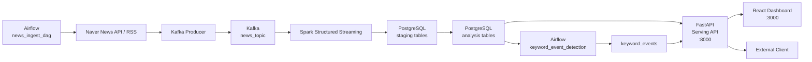
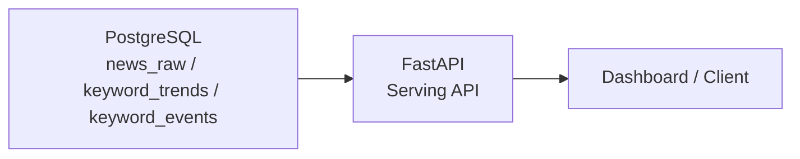

# Q5 Serving 설계

## 1. 파이프라인 구성도 업데이트

### 목적

기존 뉴스 트렌드 파이프라인에 API Serving 계층과 선택적 Inference 계층을 명확히 추가한다.

현재 파이프라인은 다음 흐름을 기준으로 동작한다.

```text
Airflow
-> Naver News API / RSS
-> Kafka
-> Spark Structured Streaming
-> PostgreSQL
-> FastAPI
-> Dashboard
```

Serving 단계에서는 저장소에 적재된 집계 데이터를 API가 읽어 Dashboard 또는 외부 클라이언트에 제공한다.

Inference를 구현하는 경우에는 저장소의 집계/기사 데이터를 모델 입력으로 사용하고, 추론 결과를 다시 저장소에 적재하거나 API 응답에 포함한다.

### 업데이트 대상

- Excalidraw 또는 Notion 구성도
- 기존 구성도에 아래 컴포넌트 추가
  - API Server
  - Inference Worker 또는 Model Service
  - API Consumer
    - Dashboard
    - 외부 클라이언트
    - 운영/관리 도구

### 업데이트된 데이터 흐름

#### 기본 Serving 흐름



#### Inference 포함 흐름



#### 데이터 흐름 요약

| 흐름 | 설명 |
| --- | --- |
| 저장소 → API | PostgreSQL에 저장된 기사, 키워드, 트렌드, 이벤트 데이터를 FastAPI가 조회해 응답한다. |
| 저장소 → 모델 → API | PostgreSQL 데이터를 모델 입력으로 사용하고, 추론 결과를 API에서 제공한다. |
| 저장소 → 모델 → 저장소 → API | 배치 inference 결과를 별도 테이블에 저장한 뒤 API가 조회한다. 운영 안정성과 응답 속도 측면에서 권장된다. |

---

## 2. API 서빙 설계

## 2.1 API 구조

### 프레임워크 선택

API 프레임워크는 **FastAPI**를 사용한다.

### 선택 이유

| 항목 | 이유 |
| --- | --- |
| 타입 기반 개발 | Pydantic 모델을 통해 요청/응답 스키마를 명확히 정의할 수 있다. |
| 자동 문서화 | OpenAPI/Swagger UI를 자동 제공하므로 API 명세 확인이 쉽다. |
| 비동기 처리 지원 | 추후 외부 API 호출, 캐시, 모델 서버 연동 시 async 기반 확장이 가능하다. |
| 현재 프로젝트와의 일관성 | 레포의 현재 서빙 계층이 FastAPI 기준으로 구성되어 있다. |
| Dashboard 연동 용이성 | React Dashboard가 HTTP JSON API를 호출하는 구조와 잘 맞는다. |

### 실제 디렉터리 구조

```text
src/
├── api/                        # FastAPI 진입점 + 라우터
│   ├── app.py                  # FastAPI 앱 생성, CORS, 라우터 등록
│   ├── schemas.py              # Pydantic 요청/응답 스키마 전체
│   ├── service.py              # services/ 패키지에 대한 re-export 파사드
│   └── routers/                # 그룹별 엔드포인트 정의
│       ├── meta.py             # /health, /api/v1/meta/filters
│       ├── dashboard.py        # /api/v1/dashboard/*
│       ├── dictionary.py       # /api/v1/dictionary/*
│       └── admin.py            # /api/v1/admin/*
│
├── services/                   # 비즈니스 로직 레이어 (라우터와 DB 쿼리 분리)
│   ├── _utils.py               # 상수(RANGES·SOURCES·TREND_BUCKETS), 시간 범위 계산, 공통 헬퍼
│   ├── dashboard.py            # 대시보드 조회 서비스 (KPI, 키워드, 트렌드, 스파이크 등)
│   ├── dictionary.py           # 복합명사·불용어·후보 CRUD 서비스
│   └── admin.py                # 쿼리키워드 관리, DAG 트리거 서비스
│
└── storage/                    # DB 접근 레이어
    ├── db.py                   # DB 연결(get_connection), fetch_domain_catalog, 분할 모듈 re-export
    ├── dict_db.py              # 사전(복합명사·불용어·후보) CRUD 쿼리
    ├── news_db.py              # 뉴스 기사·키워드·이벤트 삽입/집계/정리 쿼리
    └── admin_db.py             # 쿼리 키워드·수집 메트릭·감사 로그 쿼리
```

> `api/service.py`와 `storage/db.py`는 하위 호환성을 위한 파사드다.
> 실제 로직은 `services/`와 `storage/*_db.py`에 구현되어 있으며, 기존 코드는 수정 없이 동작한다.

### 레이어 의존 구조

```text
routers/          (HTTP 요청·응답 처리)
    └── services/ (비즈니스 로직, 집계 계산)
            └── storage/db.py → storage/*_db.py (SQL 쿼리)
                                      └── PostgreSQL
```

---

## 2.2 Endpoint 목록 및 역할

### Health / Meta

| Method | Path | 역할 |
| --- | --- | --- |
| GET | `/health` | API 서버 상태 확인 |
| GET | `/api/v1/meta/filters` | 도메인·소스·범위(range) 선택지 조회 |

### Dashboard

| Method | Path | 역할 |
| --- | --- | --- |
| GET | `/api/v1/dashboard/kpis` | 기간 내 총 기사·고유 키워드·스파이크 수·성장률 |
| GET | `/api/v1/dashboard/keywords` | 언급 횟수 기준 상위 키워드 목록 |
| GET | `/api/v1/dashboard/overview-window` | KPI·키워드·스파이크·기사 통합 개요 (윈도우 기반) |
| GET | `/api/v1/dashboard/trend` | 비교 키워드(최대 5개) 시계열 추이 |
| GET | `/api/v1/dashboard/trend-window` | 커스텀 기간·bucket 단위 키워드 시계열 |
| GET | `/api/v1/dashboard/spikes` | 급상승 키워드 이벤트 목록 |
| GET | `/api/v1/dashboard/related` | 특정 키워드의 연관 키워드 목록 |
| GET | `/api/v1/dashboard/theme-distribution` | 특정 키워드의 도메인별 언급 비율 |
| GET | `/api/v1/dashboard/articles` | 조건에 맞는 뉴스 기사 목록 |
| GET | `/api/v1/dashboard/system` | Kafka·Spark·Airflow·DB 헬스 상태 |

### Dictionary (사전 관리)

| Method | Path | 역할 |
| --- | --- | --- |
| GET | `/api/v1/dictionary` | 복합명사·불용어·후보 통합 개요 |
| GET | `/api/v1/dictionary/history` | 사전 변경 감사 로그 |
| GET | `/api/v1/dictionary/compound-nouns` | 복합명사 목록 페이지네이션 |
| POST | `/api/v1/dictionary/compound-nouns` | 복합명사 등록 |
| PATCH | `/api/v1/dictionary/compound-nouns/{item_id}/domain` | 복합명사 도메인 수정 |
| DELETE | `/api/v1/dictionary/compound-nouns/{item_id}` | 복합명사 삭제 |
| GET | `/api/v1/dictionary/candidates` | 복합명사 후보 목록 |
| POST | `/api/v1/dictionary/compound-candidates/{candidate_id}/approve` | 복합명사 후보 승인 |
| POST | `/api/v1/dictionary/compound-candidates/{candidate_id}/reject` | 복합명사 후보 반려 |
| GET | `/api/v1/dictionary/stopwords` | 불용어 목록 페이지네이션 |
| POST | `/api/v1/dictionary/stopwords` | 불용어 등록 |
| PATCH | `/api/v1/dictionary/stopwords/{item_id}/domain` | 불용어 도메인 수정 |
| DELETE | `/api/v1/dictionary/stopwords/{item_id}` | 불용어 삭제 |
| GET | `/api/v1/dictionary/stopword-candidates` | 불용어 후보 목록 |
| POST | `/api/v1/dictionary/stopword-candidates/{candidate_id}/approve` | 불용어 후보 승인 |
| POST | `/api/v1/dictionary/stopword-candidates/{candidate_id}/reject` | 불용어 후보 반려 |

### Admin (관리자)

| Method | Path | 역할 |
| --- | --- | --- |
| GET | `/api/v1/admin/query-keywords` | 도메인별 검색 키워드 목록 및 감사 로그 |
| POST | `/api/v1/admin/query-keywords` | 검색 키워드 등록 |
| PATCH | `/api/v1/admin/query-keywords/{item_id}` | 검색 키워드 수정 |
| DELETE | `/api/v1/admin/query-keywords/{item_id}` | 검색 키워드 삭제 |
| GET | `/api/v1/admin/collection-metrics` | 소스별 뉴스 수집 메트릭 |
| POST | `/api/v1/admin/run-compound-auto-approve` | 복합명사 후보 자동 승인 실행 |
| POST | `/api/v1/admin/run-stopword-recommender` | 불용어 추천 DAG 실행 |
| POST | `/api/v1/admin/compound-keyword-backfill` | 복합명사 키워드 백필 DAG 트리거 |

---

## 2.3 요청/응답 포맷

### 공통 Query Parameter

대부분의 대시보드 API는 아래 파라미터를 공유한다.

| 파라미터 | 타입 | 기본값 | 설명 |
| --- | --- | --- | --- |
| `source` | string | `all` | 뉴스 소스 필터. `all` \| `naver` \| `<publisher>` |
| `domain` | string | `all` | 도메인 필터. `all` 또는 domain_id |
| `range` | string | `1h` | 조회 범위. `10m` \| `30m` \| `1h` \| `6h` \| `12h` \| `1d` |
| `startAt` | datetime | — | 커스텀 시작 시각 (ISO-8601 UTC) |
| `endAt` | datetime | — | 커스텀 종료 시각 (ISO-8601 UTC) |

`range`와 `startAt`/`endAt`은 배타적이다. `startAt`/`endAt`이 있으면 `range`는 무시된다.

---

### GET `/api/v1/dashboard/kpis`

#### 설명

기간 내 총 기사 수·고유 키워드 수·급상승 수·성장률·마지막 갱신 시각을 반환한다.

#### Query Parameter

| 이름 | 타입 | 필수 | 설명 |
| --- | --- | --- | --- |
| `source` | string | N | 뉴스 소스 (기본: `all`) |
| `domain` | string | N | 도메인 (기본: `all`) |
| `range` | string | N | 조회 범위 (기본: `1h`) |
| `startAt` | datetime | N | 커스텀 시작 시각 |
| `endAt` | datetime | N | 커스텀 종료 시각 |

#### 요청 예시

```http
GET /api/v1/dashboard/kpis?source=all&domain=all&range=1h
```

#### 응답 예시

```json
{
  "totalArticles": 1243,
  "uniqueKeywords": 387,
  "spikeCount": 12,
  "growth": 0.23,
  "lastUpdateRelative": "3분 전",
  "lastUpdateAbsolute": "2026-05-04 09:12:33 UTC"
}
```

#### 응답 필드

| 필드 | 타입 | 설명 |
| --- | --- | --- |
| `totalArticles` | integer | 기간 내 총 기사 수 |
| `uniqueKeywords` | integer | 고유 키워드 수 |
| `spikeCount` | integer | 급상승으로 탐지된 키워드 수 |
| `growth` | float | 직전 동일 기간 대비 기사 수 성장률 |
| `lastUpdateRelative` | string | 마지막 갱신 상대 시각 (예: "3분 전") |
| `lastUpdateAbsolute` | string | 마지막 갱신 절대 시각 |

---

### GET `/api/v1/dashboard/keywords`

#### 설명

언급 횟수 기준 상위 키워드 목록을 반환한다. 각 키워드의 성장률·스파이크 여부·기사 수를 포함한다.

#### Query Parameter

| 이름 | 타입 | 필수 | 설명 |
| --- | --- | --- | --- |
| `source` | string | N | 뉴스 소스 |
| `domain` | string | N | 도메인 |
| `range` | string | N | 조회 범위 |
| `limit` | integer | N | 반환 개수 (기본: 30, 최대: 100) |
| `search` | string | N | 키워드 검색 필터 |
| `startAt` | datetime | N | 커스텀 시작 시각 |
| `endAt` | datetime | N | 커스텀 종료 시각 |

#### 응답 예시

```json
[
  {
    "keyword": "삼성전자",
    "mentions": 412,
    "prevMentions": 289,
    "growth": 0.426,
    "delta": 123,
    "spike": true,
    "eventScore": 78,
    "articleCount": 87,
    "sourceShareNaver": 0.72,
    "sourceShareRss": 0.28
  }
]
```

---

### GET `/api/v1/dashboard/trend`

#### 설명

단일 키워드 또는 비교 키워드(최대 5개)의 시간대별 언급 추이를 시계열로 반환한다.

#### Query Parameter

| 이름 | 타입 | 필수 | 설명 |
| --- | --- | --- | --- |
| `keyword` | string | N | 단일 키워드 (비교 모드 기준 키워드) |
| `keywords` | string | N | 쉼표 구분 키워드 목록 (예: `삼성전자,LG전자`) |
| `source` | string | N | 뉴스 소스 |
| `domain` | string | N | 도메인 |
| `range` | string | N | 조회 범위 (기본: `1h`) |
| `compareLimit` | integer | N | 비교 키워드 최대 수 (기본: 4, 최대: 5) |

#### 응답 예시

```json
{
  "series": [
    {
      "name": "삼성전자",
      "color": "#8b5cf6",
      "spike": true,
      "points": [
        { "bucket": 0, "timestamp": "2026-05-04T08:00:00+00:00", "value": 42 },
        { "bucket": 1, "timestamp": "2026-05-04T08:05:00+00:00", "value": 67 }
      ]
    }
  ],
  "range": {
    "id": "1h",
    "label": "1시간",
    "bucketMin": 5,
    "buckets": 12
  }
}
```

---

### GET `/api/v1/dashboard/spikes`

#### 설명

급격히 언급량이 증가한 키워드 이벤트를 강도·점수 순으로 반환한다.

#### 응답 예시

```json
{
  "topKeywords": ["반도체", "삼성전자", "AI"],
  "events": [
    {
      "bucket": 3,
      "keyword": "반도체",
      "intensity": 0.82,
      "source": "naver",
      "currentMentions": 95,
      "prevMentions": 12,
      "growth": 6.92,
      "score": 91
    }
  ],
  "range": { "id": "1h", "label": "1시간", "bucketMin": 5, "buckets": 12 }
}
```

---

### GET `/api/v1/dashboard/related`

#### 설명

특정 키워드와 함께 자주 등장하는 연관 키워드를 가중치 순으로 반환한다.

#### Query Parameter

| 이름 | 타입 | 필수 | 설명 |
| --- | --- | --- | --- |
| `keyword` | string | **Y** | 기준 키워드 |
| `source` | string | N | 뉴스 소스 |
| `domain` | string | N | 도메인 |
| `range` | string | N | 조회 범위 |
| `limit` | integer | N | 반환 개수 (기본: 10, 최대: 50) |

#### 응답 예시

```json
[
  { "keyword": "HBM", "weight": 1.0 },
  { "keyword": "엔비디아", "weight": 0.73 },
  { "keyword": "파운드리", "weight": 0.61 }
]
```

---

### GET `/api/v1/dashboard/articles`

#### 설명

조건에 맞는 뉴스 기사 목록을 최신순 또는 관련도 순으로 반환한다.

#### Query Parameter

| 이름 | 타입 | 필수 | 설명 |
| --- | --- | --- | --- |
| `source` | string | N | 뉴스 소스 |
| `domain` | string | N | 도메인 |
| `range` | string | N | 조회 범위 |
| `keyword` | string | N | 특정 키워드 포함 기사만 필터 |
| `limit` | integer | N | 반환 개수 (기본: 30, 최대: 100) |
| `sort` | string | N | 정렬 기준. `latest` \| `relevance` |

#### 응답 예시

```json
[
  {
    "id": "naver:economy:https://news.example.com/...",
    "title": "삼성전자, 3분기 반도체 실적 발표",
    "summary": "삼성전자가 3분기...",
    "publisher": "연합뉴스",
    "source": "naver",
    "domain": "economy",
    "publishedAt": "2026-05-04T08:31:00+00:00",
    "minutesAgo": 12,
    "keywords": ["삼성전자", "반도체", "HBM"],
    "primaryKeyword": "삼성전자",
    "duplicates": 0,
    "url": "https://news.example.com/..."
  }
]
```

---

### POST `/api/v1/dictionary/compound-nouns`

#### 설명

새 복합명사를 사전에 등록한다. 등록 즉시 Spark 전처리 사전에 반영된다.

#### Request Body

```json
{
  "word": "인공지능",
  "domain": "all",
  "source": "manual",
  "actor": "dashboard-admin"
}
```

#### 요청 필드

| 필드 | 타입 | 필수 | 설명 |
| --- | --- | --- | --- |
| `word` | string | **Y** | 등록할 복합명사 |
| `domain` | string | N | 적용 도메인 (기본: `all`) |
| `source` | string | N | 등록 출처 (기본: `manual`) |
| `actor` | string | N | 등록 주체 (기본: `dashboard-admin`) |

#### 응답

```json
{ "status": "ok" }
```

---

### POST `/api/v1/admin/compound-keyword-backfill`

#### 설명

Airflow `compound_keyword_backfill` DAG를 트리거하여 특정 복합명사에 대한 과거 기간의 키워드 집계를 재처리한다.

#### Request Body

```json
{
  "word": "인공지능",
  "domain": "all",
  "since": "2026-05-01T00:00:00Z",
  "until": "2026-05-04T00:00:00Z",
  "dry_run": false
}
```

#### 응답 예시

```json
{
  "status": "triggered",
  "dagId": "compound_keyword_backfill",
  "dagRunId": "compound-backfill-1746345600-_a3b1c2d4",
  "conf": {
    "word": "인공지능",
    "domain": "all",
    "since": "2026-05-01T00:00:00Z",
    "until": "2026-05-04T00:00:00Z",
    "dry_run": false
  }
}
```

---

## 2.4 데이터 소스

### API가 읽는 데이터

API는 기본적으로 PostgreSQL의 분석 테이블을 조회한다.

| 데이터 | 저장 테이블 | 사용 엔드포인트 |
| --- | --- | --- |
| 원천 기사 | `news_raw` | `/dashboard/articles`, `/dashboard/kpis` |
| 키워드 마스터 | `keywords` | `/dashboard/articles` |
| 키워드 집계 | `keyword_trends` | `/dashboard/kpis`, `/dashboard/keywords`, `/dashboard/trend` |
| 연관어 | `keyword_relations` | `/dashboard/related` |
| 이벤트 탐지 결과 | `keyword_events` | `/dashboard/spikes`, `/dashboard/kpis` |
| 도메인 카탈로그 | `domain_catalog` | `/meta/filters`, 모든 도메인 필터 |
| 운영 지표 | `collection_metrics` | `/admin/collection-metrics` |
| 복합명사 사전 | `compound_noun_dict`, `compound_noun_candidates` | `/dictionary/*` |
| 불용어 사전 | `stopword_dict`, `stopword_candidates` | `/dictionary/*` |
| 검색 키워드 | `query_keywords`, `query_keyword_audit_logs` | `/admin/query-keywords` |

### 실시간 데이터 vs 배치 집계 데이터

| 구분 | 설명 | API 제공 방식 |
| --- | --- | --- |
| 실시간성 데이터 | Spark Structured Streaming이 Kafka 메시지를 처리해 PostgreSQL에 반영하는 최신 집계 | API는 DB의 최신 window 데이터를 조회 |
| 배치 집계 데이터 | Airflow 배치가 이벤트 탐지, 후보 추천, 운영 지표 계산을 수행한 결과 | API는 저장된 결과 테이블을 조회 |
| 추론 결과 | 모델 inference 결과 | 실시간 응답 또는 별도 테이블 저장 후 조회 |

### 권장 방식

API는 Kafka나 Spark에서 직접 데이터를 읽지 않고 PostgreSQL을 기준으로 조회한다.

이유:

- API 응답 구조를 안정적으로 유지할 수 있다.
- 장애 시 Kafka/Spark와 API 장애 범위를 분리할 수 있다.
- Dashboard에서 필요한 pagination, filtering, aggregation 처리가 단순해진다.
- 추후 Redis 캐시를 추가하기 쉽다.

---

## 3. 모델 Inference 연동

> 추후 구현

---

## 4. 실행 가능한 코드

### 4.1 의존성

`pyproject.toml` 기준 API 서버 관련 의존성은 다음과 같다.

```toml
# pyproject.toml (발췌)
dependencies = [
    "fastapi==0.116.1",
    "uvicorn[standard]==0.35.0",
    "psycopg2-binary==2.9.9",
    "requests==2.32.4",
    "python-dotenv==1.0.1",
]
```

### 4.2 `src/api/app.py` — FastAPI 앱 진입점

```python
from fastapi import FastAPI
from fastapi.middleware.cors import CORSMiddleware
from api.routers import admin, dashboard, dictionary, meta

app = FastAPI(title="News Trend Pipeline API", version="0.1.0")
app.add_middleware(
    CORSMiddleware,
    allow_origins=["*"],
    allow_credentials=True,
    allow_methods=["*"],
    allow_headers=["*"],
)
app.include_router(meta.router)
app.include_router(dashboard.router)
app.include_router(dictionary.router)
app.include_router(admin.router)
```

### 4.3 `src/api/routers/dashboard.py` — Dashboard 라우터 (발췌)

```python
from fastapi import APIRouter, Query
from datetime import datetime
from api.service import get_kpis, get_top_keywords, get_trend_series

router = APIRouter(prefix="/api/v1/dashboard")

@router.get("/kpis")
def dashboard_kpis(
    source: str = Query(default="all"),
    domain: str = Query(default="all"),
    range_id: str = Query(default="1h", alias="range"),
    start_at: datetime | None = Query(default=None, alias="startAt"),
    end_at: datetime | None = Query(default=None, alias="endAt"),
) -> dict:
    """대시보드 KPI 요약 반환 — 기간 내 총 기사 수·고유 키워드 수·급상승 수·성장률 등을 제공한다."""
    return get_kpis(source=source, domain=domain, range_id=range_id, start_at=start_at, end_at=end_at)
```

### 4.4 `src/api/schemas.py` — Pydantic 스키마 (발췌)

```python
from pydantic import BaseModel
from datetime import datetime
from typing import Literal

RangeId = Literal["10m", "30m", "1h", "6h", "12h", "1d"]

class KeywordSummary(BaseModel):
    keyword: str
    mentions: int
    prev_mentions: int
    growth: float
    delta: int
    spike: bool
    event_score: int
    article_count: int
    source_share_naver: float
    source_share_rss: float

class UpsertCompoundNounRequest(BaseModel):
    word: str
    domain: str = "all"
    source: str = "manual"
    actor: str = "dashboard-admin"
```

### 4.5 `src/services/dashboard.py` — 비즈니스 로직 (발췌)

```python
from storage.db import get_connection
from services._utils import _window_bounds, _provider_filter, _domain_filter, _safe_growth

def get_kpis(source, domain, range_id=None, *, start_at=None, end_at=None):
    """기간 내 KPI (총 기사·고유 키워드·스파이크 수·성장률) 반환."""
    _, start_at, end_at, prev_start_at = _window_bounds(
        range_id=range_id, start_at=start_at, end_at=end_at
    )
    provider = _provider_filter(source)
    domain_filter = _domain_filter(domain)
    # PostgreSQL 쿼리 실행 ...
    return {
        "totalArticles": ...,
        "uniqueKeywords": ...,
        "spikeCount": ...,
        "growth": ...,
    }
```

### 4.6 `src/storage/db.py` — DB 연결

```python
from contextlib import contextmanager
import psycopg2
from core.config import settings

@contextmanager
def get_connection():
    conn = psycopg2.connect(settings.postgres_dsn)
    try:
        yield conn
        conn.commit()
    finally:
        conn.close()
```

### 4.7 `infra/api/Dockerfile.api` — Docker 이미지

```dockerfile
FROM python:3.12-slim

ENV PYTHONDONTWRITEBYTECODE=1 \
    PYTHONUNBUFFERED=1

WORKDIR /app

COPY pyproject.toml ./
COPY src ./src
COPY requirements ./requirements

RUN pip install --no-cache-dir --upgrade pip && \
    pip install --no-cache-dir .

EXPOSE 8000

CMD ["uvicorn", "api.app:app", "--host", "0.0.0.0", "--port", "8000"]
```

### 4.8 `docker-compose.yml` — api-server 서비스

```yaml
api-server:
  build:
    context: .
    dockerfile: infra/api/Dockerfile.api
  restart: unless-stopped
  env_file:
    - ./.env
  environment:
    POSTGRES_HOST: app-postgres
    POSTGRES_PORT: 5432
    POSTGRES_DB: ${POSTGRES_DB:-news_pipeline}
    POSTGRES_USER: ${POSTGRES_USER:-postgres}
    POSTGRES_PASSWORD: ${POSTGRES_PASSWORD:-postgres}
    PYTHONPATH: /app/src
  depends_on:
    app-postgres:
      condition: service_healthy
    flyway:
      condition: service_completed_successfully
  ports:
    - "8000:8000"
  volumes:
    - ./src:/app/src
```

### 4.9 로컬 실행

```bash
# 의존성 설치
pip install -e .

# API 서버 단독 실행
PYTHONPATH=src uvicorn api.app:app --reload --port 8000

# 전체 스택 실행
docker compose up --build -d

# 헬스 체크
curl http://localhost:8000/health
# {"status": "ok"}

# Swagger UI
open http://localhost:8000/docs
```
