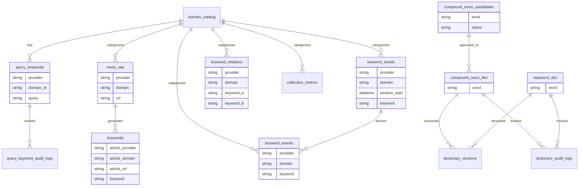

# ERD (Entity Relationship Diagram)

> `models.sql` 기준 현재 데이터베이스 구조



## 핵심 관계 요약

- `domain_catalog`은 모든 분석 테이블의 기준 축이다
- `news_raw` → `keywords` → `keyword_trends` → `keyword_events` 흐름
- `compound_noun_candidates` → 승인 → `compound_noun_dict`
- 사전 변경은 `dictionary_versions`로 관리

## 설계 핵심

```text
이 시스템은
도메인 기반 분석 + 사전 기반 NLP + 스트리밍 집계 구조로 설계됨
```
