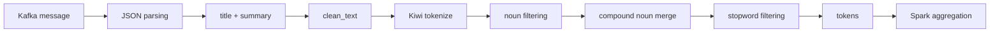
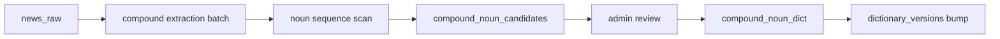

# STEP 2 Detail: Preprocessing

> 이 문서는 Spark 처리 단계 안에서 수행되는 텍스트 전처리 흐름을 설명한다.
>
> `STEP2_PROCESSING.md`가 Spark 처리 계층의 전체 흐름을 설명한다면, 이 문서는 그중 `title + summary -> tokens` 변환 과정을 다룬다.

## 1. 전처리의 목적

전처리의 목적은 뉴스 기사 텍스트를 키워드 집계에 적합한 토큰 리스트로 변환하는 것이다.

```text
기사 텍스트
-> 정제
-> 형태소 분석
-> 명사 추출
-> 복합명사 병합
-> 불용어 제거
-> keyword list
```

전처리 결과는 이후 Spark 집계의 입력이 된다.

```text
tokens
-> keywords
-> keyword_trends
-> keyword_relations
```

## 2. 전체 위치



## 3. 입력과 출력

### 입력

전처리는 기사에서 다음 필드를 사용한다.

```text
title
summary
```

Spark 처리에서는 두 값을 합쳐 분석 문자열을 만든다.

```text
article_text = concat_ws(' ', title, summary)
```

### 출력

출력은 문자열 배열이다.

```text
["네이버", "생성형", "검색", "품질"]
```

이 배열은 Spark에서 `explode()`되어 기사별 키워드 빈도와 window 집계에 사용된다.

## 4. 처리 순서

### 4-1. 텍스트 정제

`clean_text()`는 분석에 방해되는 문자를 제거한다.

주요 처리:

1. Unicode 정규화
2. URL 제거
3. HTML 태그 제거
4. 불필요한 기사 잔여 문자열 제거
5. 소문자 변환
6. 한글 외 문자 제거
7. 공백 정리

예시:

```text
입력: <b>AI</b> 기반 검색 고도화 https://example.com
출력: 기반 검색 고도화
```

현재 정제 정책은 한글 중심이다. 따라서 `AI`, `GPT`, `LLM` 같은 영문 약어는 제거될 수 있다.

## 5. 형태소 분석

정제된 문자열은 Kiwi 형태소 분석기를 통해 토큰화한다.

현재 핵심 기준은 다음과 같다.

| 기준 | 내용 |
| --- | --- |
| 분석기 | Kiwi / kiwipiepy |
| 사용 품사 | `NNG`, `NNP` |
| 제외 품사 | 동사, 형용사, 조사, 어미 등 |
| fallback | Kiwi 사용 불가 시 공백 분리 |

즉, 전처리의 기본 단위는 명사다.

```text
"네이버가 생성형 검색 품질을 높인다"
-> 네이버, 생성형, 검색, 품질
```

## 6. 복합명사 처리

복합명사는 여러 명사가 결합되어 하나의 의미를 갖는 단어다.

예:

```text
인공 + 지능 -> 인공지능
생성형 + 검색 -> 생성형검색
기준 + 금리 -> 기준금리
```

### 처리 방식

복합명사는 DB의 `compound_noun_dict`를 기준으로 처리한다.

```text
형태소 분석 결과
-> 인접 명사 조합 확인
-> compound_noun_dict에 있으면 병합
```

예시:

```text
등록 전:
["기준", "금리", "인하"]

compound_noun_dict에 "기준금리" 등록 후:
["기준금리", "인하"]
```

### 중요한 특징

복합명사 등록은 과거 처리 결과를 자동으로 바꾸지 않는다.

```text
등록 전 처리된 기사 -> 기존 토큰 유지
등록 후 처리되는 기사 -> 새 사전 적용
```

과거 데이터까지 반영하려면 재처리 작업이 필요하다.

## 7. 불용어 처리

불용어는 트렌드 분석에 의미가 약하거나 모든 기사에 너무 자주 등장하는 단어다.

예:

```text
기자
뉴스
이번
관련
사진
제공
```

### 처리 방식

DB의 `stopword_dict`를 기준으로 제거한다.

```text
tokens
-> stopword_dict와 비교
-> 일치하는 단어 제거
```

예시:

```text
입력: ["네이버", "기자", "검색", "관련"]
출력: ["네이버", "검색"]
```

## 8. 사전 로딩과 버전 관리

복합명사와 불용어는 DB에서 관리한다.

| 테이블 | 역할 |
| --- | --- |
| `compound_noun_dict` | 승인된 복합명사 |
| `compound_noun_candidates` | 자동 추출된 후보 |
| `stopword_dict` | 불용어 사전 |
| `dictionary_versions` | 사전 변경 감지 |

사전 테이블이 변경되면 `dictionary_versions`의 version이 증가한다.

Spark 전처리 코드는 일정 주기로 version을 확인해 캐시를 갱신한다.

```text
사전 변경
-> dictionary_versions 증가
-> Spark가 version 변경 감지
-> 사전 캐시 갱신
-> 이후 micro-batch부터 반영
```

## 9. 복합명사 후보 추출 흐름

복합명사 후보 추출은 전처리와 별도 배치로 동작한다.



### 핵심 의도

후보 추출에서는 승인된 사용자 사전을 일부러 강하게 적용하지 않는다.

이유는 다음과 같다.

```text
전처리: 이미 아는 복합명사를 하나로 묶기 위함
후보 추출: 아직 모르는 복합명사 후보를 찾기 위함
```

## 10. 불용어 후보 확장 방향

불용어도 복합명사와 유사하게 후보 추천 구조로 확장할 수 있다.

```text
토큰 통계 수집
-> 불용어 후보 점수화
-> 관리자 검토
-> stopword_dict 등록
```

후보 점수 예시:

```text
불용어 점수 =
    전체 도메인에 넓게 등장하는 정도
  + 본문 말미/출처 문구에 자주 등장하는 정도
  + 트렌드 변동성이 낮은 정도
  + 의미 정보량이 낮은 정도
  + 관리자 제외 이력
```

단, 자동 등록보다는 관리자 검토 후 등록하는 방식이 안전하다.

## 11. Spark 연결 방식

Spark에서는 Python UDF로 전처리를 호출한다.

```text
article_text column
-> tokenize_udf
-> tokens column
```

이후 처리:

```text
tokens explode
-> article keyword count
-> window aggregation
-> relation aggregation
```

### 주의점

Python UDF는 JVM과 Python 간 직렬화 비용이 있다.

따라서 다음 최적화가 중요하다.

1. 사전은 매 row마다 DB 조회하지 않는다.
2. worker process 단위로 cache한다.
3. version 변경 시에만 reload한다.

## 12. 전처리 결과가 영향을 주는 영역

| 영역 | 영향 |
| --- | --- |
| `keywords` | 기사별 키워드 빈도 변경 |
| `keyword_trends` | 트렌드 순위 변경 |
| `keyword_relations` | 연관 키워드 관계 변경 |
| `keyword_events` | 급상승 이벤트 탐지 결과 변경 |
| Dashboard | KPI, chart, ranking 표시 변경 |

즉, 전처리는 단순 텍스트 정리가 아니라 전체 분석 품질을 결정하는 핵심 단계다.

## 13. 현재 한계

### 13-1. 영문/숫자 토큰 손실

현재 정제 정책은 한글 중심이므로 다음 단어가 손실될 수 있다.

```text
AI
GPT
LLM
HBM
5G
```

개선 방향:

```text
한글 + 영문 약어 허용
도메인별 영문 사전 추가
복합명사 사전에서 영문 포함 허용
```

### 13-2. 사전 변경 전 과거 데이터 불일치

사전 등록 이후 새 데이터부터 토큰화 결과가 바뀐다.

과거 데이터까지 맞추려면 다음이 필요하다.

```text
특정 기간 재처리
또는 keyword 재집계 batch
```

### 13-3. 도메인별 사전 분리 미구현 가능성

향후 복합명사/불용어는 전역 사전과 도메인별 사전으로 분리할 수 있다.

```text
global dictionary
+ domain specific dictionary
```

## 14. 개선 방향

우선순위가 높은 개선은 다음과 같다.

1. 영문 약어 보존 정책 추가
2. 전역/도메인별 복합명사 구분
3. 전역/도메인별 불용어 구분
4. 불용어 후보 추천 테이블 추가
5. 사전 변경 후 선택적 재처리 기능 추가
6. 전처리 품질 모니터링 지표 추가

## 15. 관련 파일

```text
src/processing/preprocessing.py
src/processing/spark_job.py
src/analytics/compound_extractor.py
src/storage/db.py
src/storage/models.sql
airflow/dags/compound_extraction_dag.py
```

## 한 줄 정리

```text
전처리는 뉴스 텍스트를 분석 가능한 키워드 배열로 바꾸는 단계이며,
복합명사와 불용어 사전 품질이 전체 트렌드 분석 품질을 좌우한다.
```
