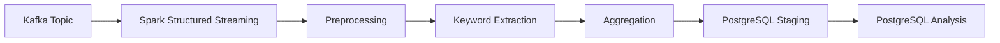

# STEP2: Spark Processing 설계

## 1. 개요

본 문서는 Kafka → Spark → 저장소로 이어지는 데이터 처리(Processing) 단계의 설계를 정의한다.

Spark의 역할:

- Kafka 메시지 consume
- 텍스트 전처리
- 키워드 추출 및 집계
- 분석 테이블 생성

---

## 2. 파이프라인 구성도



설명:

- Kafka에서 데이터를 읽어 Spark에서 처리
- 전처리 및 집계 수행
- PostgreSQL에 저장

---

## 3. 처리 방식 선택

### 3.1 Streaming 선택

```text
Spark Structured Streaming 사용
```

선택 이유:

- 실시간 뉴스 트렌드 분석 요구
- Kafka 기반 메시지 처리와 자연스럽게 연결
- 마이크로배치 기반 안정성 확보

---

### 3.2 처리 주기

```text
Micro-batch (약 1~5초)
```

이유:

- 실시간성과 안정성 균형
- local 환경 리소스 제약 고려

---

## 4. 데이터 처리 흐름

### 4.1 Kafka Read

```python
spark.readStream
    .format("kafka")
```

- topic: news_topic
- value: JSON string

---

### 4.2 전처리

- JSON parsing
- null 제거
- 문자열 정규화
- 불필요 필드 제거

---

### 4.3 변환 로직

- title + summary 결합
- 형태소 분석 (Kiwi)
- 복합명사 추출
- 불용어 제거

---

### 4.4 집계

- keyword count
- window aggregation
- keyword_trends 생성
- keyword_relations 생성

---

### 4.5 Error Handling

전략:

- parsing 실패 → drop
- malformed 데이터 → 로그 기록
- 처리 실패 batch → 재시도

---

## 5. 데이터 예시

### 입력 (Kafka)

```json
{
  "title": "AI 기술 발전",
  "summary": "인공지능 기술이 빠르게 발전하고 있다",
  "domain": "tech",
  "timestamp": "2026-01-08T10:30:00Z"
}
```

---

### 출력 (집계 후)

```json
{
  "keyword": "인공지능",
  "count": 120,
  "window_start": "2026-01-08T10:00:00Z",
  "window_end": "2026-01-08T11:00:00Z",
  "processed_at": "2026-01-08T11:00:05Z"
}
```

---

## 6. 저장소 설계

### 6.1 저장소 선택

```text
PostgreSQL
```

선택 이유:

- transactional 보장
- upsert 지원
- Dashboard 조회 용이

---

### 6.2 저장 방식

- Spark → staging table append
- DB 내부 upsert → analysis table

---

### 6.3 주요 테이블

- stg_news_raw
- stg_keywords
- keyword_trends
- keyword_relations

---

### 6.4 인덱스 전략

- keyword_trends(provider, domain, window_start)
- keyword_events(event_time DESC)

이유:

- 시간 기반 조회 최적화
- domain 필터링

---

## 7. Spark Configuration

```python
spark_config = {
    "spark.sql.shuffle.partitions": "10",
    "spark.streaming.kafka.maxRatePerPartition": "1000",
    "spark.sql.streaming.checkpointLocation": "/tmp/checkpoint",
}
```

설정 이유:

- shuffle partition 축소 (local 환경)
- Kafka 처리량 제한
- checkpoint로 fault tolerance 확보

---

## 8. 코드 구조

```text
src/processing/
├─ spark_streaming.py
├─ transform.py
├─ aggregation.py
```

---

## 9. 실행 예시

```bash
python src/processing/spark_streaming.py
```

---

## 10. 요약

Spark는 Kafka 데이터를 실시간으로 처리하고, 키워드 기반 분석 데이터를 생성하여 저장소에 전달하는 핵심 처리 계층이다.
