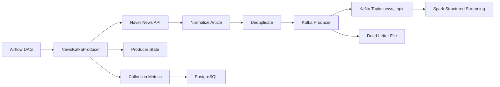
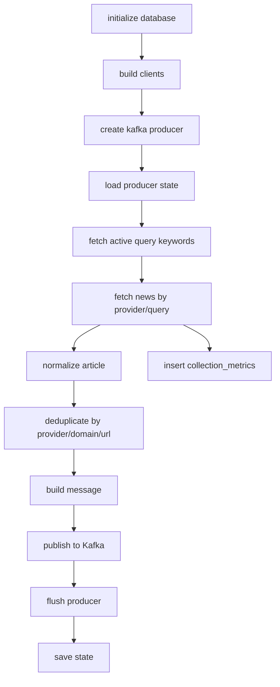

# STEP1: Kafka 수집 설계

## 1. 개요

본 문서는 뉴스 수집 결과를 Kafka에 적재하는 producer 설계와 topic 구성 방식을 정의한다.

Kafka의 역할:

- 수집 계층과 처리 계층 분리
- Spark Structured Streaming 입력 제공
- 수집 실패/처리 지연 상황에서 buffer 역할 수행

---

## 2. 파이프라인 구성도



설명:

- Airflow가 수집 producer 실행을 트리거한다.
- Producer는 Naver API에서 도메인/키워드별 뉴스를 수집한다.
- 메시지를 표준 스키마로 변환한 뒤 Kafka `news_topic`에 발행한다.
- Spark는 `news_topic`을 consume하여 STEP2 Processing을 수행한다.

---

## 3. Producer 코드 흐름

구현 위치:

```text
src/ingestion/producer.py
```

주요 클래스:

```text
NewsKafkaProducer
```

처리 흐름:



### 3.1 데이터 수집 로직

- `query_keywords` 테이블에서 활성화된 도메인별 검색어를 읽는다.
- 현재 provider는 `naver` 기준이다.
- Naver News API를 query 단위로 호출한다.
- 기사에는 `domain`, `query`, `provider` 메타데이터를 포함한다.

### 3.2 메시지 생성 방식

- 원본 기사를 `NormalizedNewsArticle`로 정규화한다.
- `build_message()`에서 schema version을 포함한 Kafka 메시지 payload를 만든다.
- `json.dumps(..., ensure_ascii=False)`로 UTF-8 JSON 직렬화한다.

### 3.3 Partition Key

현재 partition key:

```text
article.url 우선
없으면 provider
```

선택 이유:

- URL은 기사 단위로 가장 안정적인 식별자다.
- 같은 URL은 같은 partition으로 갈 가능성이 높아 중복 처리와 순서 추적이 쉽다.
- URL이 없는 예외 상황에서는 provider를 fallback key로 사용한다.

---

## 4. 메시지 예시

현재 프로젝트의 Kafka 메시지는 뉴스 기사 기준이다.

```json
{
  "schema_version": "v1",
  "provider": "naver",
  "domain": "ai_tech",
  "query": "인공지능",
  "source": "언론사명",
  "title": "AI 기술 발전 관련 뉴스 제목",
  "summary": "뉴스 요약 본문",
  "url": "https://example.com/news/123",
  "published_at": "2026-01-08T10:30:00Z",
  "ingested_at": "2026-01-08T10:31:05Z",
  "metadata": {
    "source": "naver_news_api",
    "version": "v1"
  }
}
```

---

## 5. Topic 구성 방식

### 5.1 Topic

| Topic | 역할 |
| --- | --- |
| `news_topic` | 수집된 뉴스 기사 메시지 저장 |

현재는 단일 topic 구조다.

선택 이유:

- provider/domain 정보가 message payload에 포함되어 있다.
- Spark에서 domain/provider 기준 필터링 및 집계 가능하다.
- 초기 구현 복잡도를 낮춘다.

### 5.2 Topic 확장 후보

향후 다음과 같이 topic을 분리할 수 있다.

| Topic | 역할 |
| --- | --- |
| `news_raw_topic` | 원본 기사 수집 메시지 |
| `news_dead_letter_topic` | Kafka publish 또는 schema 실패 메시지 |
| `news_replay_topic` | 재처리 대상 메시지 |

현재 구현에서는 dead letter를 파일(`runtime/state/dead_letter.jsonl`)로 관리한다.

---

## 6. Partitioning 전략

### 현재 전략

```text
partition key = url
```

### 선택 이유

- 기사 URL은 중복 판단 기준과 일치한다.
- 동일 기사의 재전송이 같은 key를 사용한다.
- Spark 처리 시 provider/domain/url 기준 dedup과 연결된다.

### 대안 검토

| 후보 | 장점 | 단점 |
| --- | --- | --- |
| domain | 도메인별 처리 분리 쉬움 | 특정 도메인 쏠림 가능 |
| timestamp | 시간 순 처리에 유리 | 중복 판단과 직접 연결 약함 |
| random | partition 분산 좋음 | 동일 기사 추적 어려움 |
| url | 중복/추적에 유리 | 인기 기사 쏠림 가능성 |

현재는 중복 제어와 추적 가능성을 우선해 `url`을 선택한다.

---

## 7. Configuration

구현 기준 Kafka 설정:

```python
KafkaProducer(
    bootstrap_servers=settings.kafka_bootstrap_servers,
    acks=settings.kafka_acks,
    retries=settings.kafka_retries,
    enable_idempotence=True,
    max_in_flight_requests_per_connection=settings.kafka_max_in_flight,
    request_timeout_ms=settings.kafka_request_timeout_ms,
    max_block_ms=settings.kafka_max_block_ms,
    linger_ms=50,
    compression_type=settings.kafka_compression_type,
)
```

환경 변수 기본값:

| 설정 | 기본값 | 이유 |
| --- | --- | --- |
| `KAFKA_TOPIC` | `news_topic` | 단일 raw news topic |
| `KAFKA_ACKS` | `all` | 메시지 유실 가능성 감소 |
| `KAFKA_RETRIES` | `5` | 일시적 broker/network 실패 대응 |
| `KAFKA_MAX_IN_FLIGHT` | `1` | idempotence와 순서 안정성 고려 |
| `KAFKA_REQUEST_TIMEOUT_MS` | `30000` | broker 응답 대기 |
| `KAFKA_MAX_BLOCK_MS` | `60000` | metadata/buffer 대기 제한 |
| `KAFKA_COMPRESSION_TYPE` | `gzip` | 메시지 압축으로 전송량 감소 |

---

## 8. Error Handling

### 8.1 Validation Error

메시지 생성 전 schema validation에 실패하면 Kafka로 보내지 않는다.

처리:

- dead letter 파일에 기록
- 다음 기사 처리 계속 진행

### 8.2 Kafka Timeout / Kafka Error

처리:

- dead letter 파일에 기록
- producer cycle은 계속 진행
- flush 단계에서 남은 delivery error를 확인한다.

### 8.3 Delivery Callback Error

Kafka `send()` 이후 callback에서 error가 발생하면 `_send_errors`에 저장하고 flush 이후 dead letter에 기록한다.

### 8.4 Deduplication

중복 기준:

```text
provider + domain + url
```

중복이면 publish하지 않는다.

---

## 9. 유실 / 중복 대응

### 유실 대응

- `acks=all`
- producer retry
- idempotent producer 활성화
- dead letter 파일 기록
- replay DAG/스크립트로 재처리 가능

### 중복 대응

- producer state에 최근 발행 URL 보관
- `provider + domain + url` 기준 skip
- storage 단계에서도 unique/upsert로 중복 방지

---

## 10. 실행 가능한 코드

관련 파일:

```text
src/ingestion/producer.py
src/ingestion/api_client.py
src/core/config.py
docker-compose.yml
```

실행 예시:

```bash
python -m ingestion.producer
```

Kafka 확인 예시:

```bash
python scripts/consumer_check.py --max-messages 5
```

---

## 11. docker-compose 구성 요소

Kafka 수집 실행에 필요한 주요 서비스:

- Kafka
- Zookeeper
- Airflow
- PostgreSQL
- API/Spark 처리 계층

Producer는 `KAFKA_BOOTSTRAP_SERVERS`, `KAFKA_TOPIC`, Naver API credential을 환경 변수로 사용한다.

---

## 12. 요약

Kafka 수집 단계는 Naver News API에서 수집한 뉴스를 표준 JSON 메시지로 변환해 `news_topic`에 적재한다.

`url` 기반 partition key, idempotent producer, dead letter 기록, state 기반 dedup을 통해 유실과 중복을 최소화한다.
