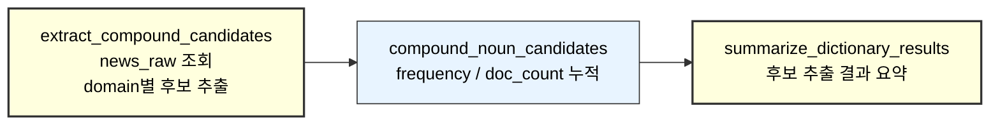
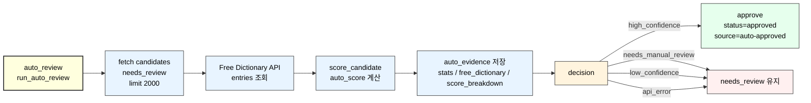

# STEP1: Airflow DAG 설계

## 1. 개요

Airflow의 역할:

- 뉴스 수집 작업 스케줄링
- 실패 메시지 재처리
- 복합명사 후보 추출 배치 실행
- 복합명사 후보 자동 평가 및 자동승인 배치 실행
- 키워드 이벤트 탐지 배치 실행

---

## 2. Airflow DAG 전체 구성

```mermaid
flowchart LR
    A["Airflow Scheduler"] --> B["news_ingest_dag<br/>뉴스 수집 / Kafka 발행"]
    A --> C["auto_replay_dag<br/>dead letter 재처리"]
    A --> D["compound_dictionary_dag<br/>복합명사 후보 추출"]
    A --> E["compound_candidate_auto_review_dag<br/>복합명사 후보 자동 평가 / 보수적 승인"]
    A --> F["keyword_event_detection<br/>급상승 이벤트 탐지"]

    B --> K["Kafka<br/>news_topic"]
    C --> K

    K --> S["Spark Streaming<br/>상시 실행"]
    S --> DB["PostgreSQL<br/>analysis tables"]

    DB --> D
    D --> CAND["compound_noun_candidates<br/>status=needs_review<br/>frequency / doc_count 누적"]

    CAND --> E
    E --> FETCH["평가 대상 조회<br/>needs_review<br/>auto_checked_at 7일 캐시<br/>limit 2000"]
    FETCH --> EXT["외부 사전 근거 조회<br/>Free Dictionary API<br/>/api/v1/entries/ko/{word}"]
    EXT --> SCORE["자동 평가<br/>auto_score 계산<br/>auto_evidence JSON 생성"]
    SCORE --> DECISION["auto_decision 분기"]

    DECISION -->|"high_confidence"| APPROVE["자동승인<br/>candidate.status=approved<br/>reviewed_by=auto-reviewer"]
    APPROVE --> DICT["compound_noun_dict<br/>source=auto-approved"]

    DECISION -->|"needs_manual_review"| REVIEW["관리자 검토 대기<br/>needs_review 유지"]
    DECISION -->|"low_confidence"| REVIEW
    DECISION -->|"api_error"| REVIEW

    DICT -. "dictionary_versions 증가<br/>Spark 사전 캐시 reload" .-> S

    DB --> F
    F --> EV["keyword_events"]

    style B fill:#ffffde,stroke:#333,stroke-width:2px,color:black
    style C fill:#ffffde,stroke:#333,stroke-width:2px,color:black
    style D fill:#ffffde,stroke:#333,stroke-width:2px,color:black
    style E fill:#ffffde,stroke:#333,stroke-width:2px,color:black
    style F fill:#ffffde,stroke:#333,stroke-width:2px,color:black
    style CAND fill:#e8f4ff,stroke:#333,stroke-width:1px,color:black
    style FETCH fill:#e8f4ff,stroke:#333,stroke-width:1px,color:black
    style EXT fill:#e8f4ff,stroke:#333,stroke-width:1px,color:black
    style SCORE fill:#e8f4ff,stroke:#333,stroke-width:1px,color:black
    style DECISION fill:#fff4de,stroke:#333,stroke-width:1px,color:black
    style APPROVE fill:#e6ffed,stroke:#333,stroke-width:1px,color:black
    style DICT fill:#e6ffed,stroke:#333,stroke-width:1px,color:black
    style REVIEW fill:#fff0f0,stroke:#333,stroke-width:1px,color:black
```



### 구성 설명

- `news_ingest_dag`는 Naver 뉴스를 수집해 Kafka `news_topic`으로 발행한다.
- `auto_replay_dag`는 dead letter 메시지를 재처리해 Kafka로 다시 발행한다.
- Spark Streaming은 Kafka 메시지를 상시 consume하고 PostgreSQL 분석 테이블을 갱신한다.
- `compound_dictionary_dag`는 `news_raw` 기반으로 복합명사 후보만 추출하고, `compound_noun_candidates`에 `needs_review` 상태로 누적한다.
- `compound_candidate_auto_review_dag`는 `needs_review` 후보를 대상으로 외부 사전 근거를 조회하고 `auto_score`, `auto_evidence`, `auto_decision`을 저장한다.
- 자동승인은 `auto_decision = high_confidence`인 후보에만 수행한다.
- 자동승인된 후보는 `compound_noun_dict`에 `source=auto-approved`로 반영된다.
- `compound_noun_dict`가 변경되면 `dictionary_versions`가 증가하고 Spark 전처리 캐시가 갱신 대상이 된다.
- `keyword_event_detection`은 PostgreSQL 분석 테이블을 기반으로 급상승 이벤트를 계산해 `keyword_events`에 저장한다.

### DAG 목록

| DAG | 역할 | 주기 |
| --- | --- | --- |
| news_ingest_dag | 뉴스 수집 | 15분 |
| auto_replay_dag | dead letter 재처리 | 15분 |
| compound_dictionary_dag | 복합명사 후보 추출 | 1시간 |
| compound_candidate_auto_review_dag | 자동 평가 및 승인 | 6시간 |
| keyword_event_detection | 이벤트 탐지 | 15분 |

---

## 3. compound_dictionary_dag

목적:

- news_raw 기반 복합명사 후보 추출

구조:



특징:

- 자동승인 로직 없음
- 후보 생성만 수행

---

## 4. compound_candidate_auto_review_dag

목적:

- needs_review 후보 자동 평가
- evidence 저장
- high_confidence 자동승인

구조:



처리 흐름:

```text
needs_review 조회 (max 2000)
→ Free Dictionary API entries 조회
→ score 계산
→ auto_evidence 저장
→ decision 분기
→ high_confidence만 승인
```

---

## 5. 스케줄

| DAG | schedule |
| --- | --- |
| compound_dictionary_dag | 1시간 |
| compound_candidate_auto_review_dag | 6시간 |

---

## 6. 핵심 정책

- extract와 approve 분리
- 많이 평가하고 적게 승인
- approved 재검증 없음
- evidence 항상 저장
