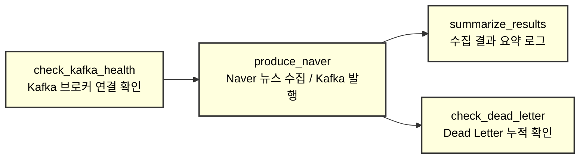
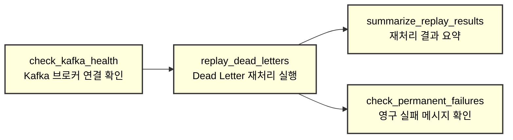
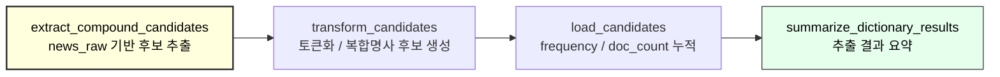
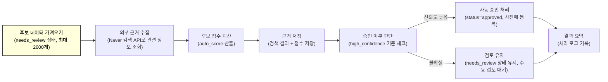
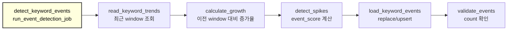

# Q3: Airflow DAG 설계 및 구현

## 1. 문서 목적

이 문서는 뉴스 트렌드 파이프라인에서 Airflow가 담당하는 DAG의 목적, 실행 단위, 입력/출력, 태스크 의존성, 스케줄, 실패 처리, 재실행 안전성을 설명한다.

---

## 2. Airflow의 전체 역할

Airflow는 배치성 작업과 운영 보조 작업을 스케줄링한다.

- 뉴스 수집 작업 실행
- dead letter 재처리
- PostgreSQL 기반 복합명사 후보 추출
- 복합명사 후보 자동 평가 및 보수적 자동승인
- 키워드 급상승 이벤트 탐지

Airflow DAG는 데이터 수집과 Spark가 적재한 PostgreSQL 분석 테이블을 읽어 후속 배치 작업을 수행한다.

---

## 3. DAG 전체 구성


---

## 4. DAG 목록 요약

| DAG | 목적 | 실행 단위 | 입력 | 출력 | 스케줄 |
| --- | --- | --- | --- | --- | --- |
| `news_ingest_dag` | Naver 뉴스 수집 및 Kafka 발행 | query/domain 단위 수집 배치 | `query_keywords`, Naver News API | Kafka `news_topic`, 수집 metric | 15분 |
| `auto_replay_dag` | dead letter 메시지 재처리 | 실패 메시지 batch replay | dead letter 저장소/토픽 | Kafka `news_topic` 재발행 | 15분 |
| `compound_dictionary_dag` | 복합명사 후보 추출 | 최근 기사 window batch | PostgreSQL `news_raw` | `compound_noun_candidates` | 1시간 |
| `compound_candidate_auto_review_dag` | 후보 자동 평가 및 high confidence 자동승인 | 후보 batch review | `compound_noun_candidates`, Naver Web Search API | `auto_score`, `auto_evidence`, `compound_noun_dict` | 2시간 |
| `keyword_event_detection` | 급상승 키워드 이벤트 탐지 | 최근 window 집계 batch | `keyword_trends`, `keywords`, `news_raw` | `keyword_events` | 15분 |

---

## 5. 공통 DAG 옵션
```
default_args = {
    "owner": "ymyu",  
    "depends_on_past": False,  
    # 이전 실행(task instance)의 성공 여부에 의존할지 여부
    # False: 이전 실행 실패와 관계없이 현재 실행 진행
    # True: 이전 실행이 성공해야 현재 실행 수행 (순차 데이터 처리에 사용)

    "retries": 3,  
    # 태스크 실패 시 재시도 횟수 (총 3번까지 재시도)
    # 특정 작업에선 override (데이터 파싱 오류 재시도)
    
    "retry_delay": timedelta(minutes=5),  
    # 재시도 간 기본 대기 시간 (최소 5분 후 재시도)

    "retry_exponential_backoff": True,  
    # 재시도 간격을 지수적으로 증가시킴
    # 예: 5분 → 10분 → 20분 → ... (점점 간격 증가)

    "max_retry_delay": timedelta(minutes=30),  
    # 지수 백오프 적용 시 최대 대기 시간 제한
    # 아무리 증가해도 30분을 넘지 않음

    "max_active_runs" : 1
    # 동시 처리 방지

    "execution_timeout": timedelta(minutes=30)
    # TimeOut 설정, 특정 작업에선 override

    "catchup" : False
    # 과거 누락 실행 스킵
}
```

## 6. `news_ingest_dag`

### 6.1 목적 / 실행 단위

`news_ingest_dag`는 활성 query keyword를 기준으로 Naver News API를 호출하고, 수집한 기사를 Kafka `news_topic`으로 발행한다.

실행 단위:

```text
15분마다 provider/domain/query 조합 단위 수집
```

### 6.2 입력 / 출력

| 구분 | 내용 | 설명 |
| --- | --- | --- |
| 입력 | PostgreSQL `query_keywords`, domain catalog, Naver News API | 활성화된 수집 키워드와 도메인 기준으로 Naver News API를 호출한다. |
| 출력 | Kafka `news_topic`, collection metric row | 수집한 뉴스는 Spark Streaming이 consume할 Kafka 메시지로 발행하고, 수집 성공/실패 통계는 metric으로 저장한다. |
| 주요 파라미터 | Airflow logical date, 현재 수집 window | 실행 시점과 수집 구간을 로그/metric 기준으로 남긴다. |

### 6.3 태스크 구조



| task_id              | Operator         | 역할                                                                                                                |
| -------------------- | ---------------- | ----------------------------------------------------------------------------------------------------------------- |
| `check_kafka_health` | `PythonOperator` | Kafka broker에 연결 가능한지 먼저 확인한다. 실패하면 후속 수집 task를 실행하지 않는다.                                                         |
| `produce_naver`      | `PythonOperator` | `NewsKafkaProducer().run_for_provider("naver")`를 실행해 Naver 뉴스를 수집하고 Kafka로 발행한다. 발행 건수는 XCom `naver_count`로 저장한다. |
| `summarize_results`  | `PythonOperator` | `produce_naver`가 저장한 XCom 값을 읽어 이번 실행의 수집 건수를 로그로 남긴다.                                                            |
| `check_dead_letter`  | `PythonOperator` | `dead_letter.jsonl` 누적 건수를 확인한다. `trigger_rule="all_done"`이므로 `produce_naver` 실패 여부와 무관하게 실행된다.  Dead Letter 누적 감시                 |

- 의존성
```
check_kafka_health >> produce_naver
produce_naver >> summarize_results
produce_naver >> check_dead_letter
```
    - 의존성은 check_kafka_health가 통과해야 produce_naver가 실행되고, 수집 이후 summarize_results와 check_dead_letter가 병렬로 실행되는 구조다. check_dead_letter는 실패 감시 목적이므로 수집 task 실패 여부와 관계없이 실행된다.

- 데이터 전달

- query 목록은 DB에서 읽는다.
- 기사 payload는 Kafka 메시지로 전달한다.
- 수집량과 실패량은 PostgreSQL metric 테이블에 저장한다.

### 6.4 스케줄

| 항목 | 값 |
| --- | --- |
| schedule interval | `*/15 * * * *` |
| 근거 | 뉴스 트렌드 탐지를 위해 15분 단위 신선도 유지 |
| timezone | `Asia/Seoul` 권장 |
| start_date | 고정 과거일. 예: `2026-01-01` |
| catchup | 운영에서는 `False` 권장 |

### 6.5 Retry / Failure handling

| 실패 유형 | 처리 |
| --- | --- |
| Naver API 일시 오류, network timeout | retry 의미 있음 |
| Kafka broker 일시 장애 | retry 의미 있음 |
| 인증키 누락, query 설정 오류 | retry 의미 낮음. 설정 수정 필요 |
| 응답 schema 파싱 실패 | 해당 query 격리 후 metric 기록 |

권장값:

```text
retries = 2
retry_delay = 5분
retry_exponential_backoff = True
```

### 6.6 멱등성(Idempotency)

- 같은 URL은 downstream `news_raw`에서 `(provider, domain, url)` 기준 중복 제거한다.
- 수집 metric은 window/provider/domain/query 기준으로 집계 또는 upsert한다.
- 같은 query를 재실행해도 동일 기사 URL은 중복 적재되지 않는다.

---

## 7. `auto_replay_dag`

### 7.1 목적 / 실행 단위

`auto_replay_dag`는 dead letter로 분리된 실패 메시지를 다시 Kafka로 발행한다.

실행 단위:

```text
15분마다 dead letter batch 재처리
```

### 7.2 입력 / 출력

| 구분 | 내용 | 설명 |
| --- | --- | --- |
| 입력 | dead letter topic 또는 dead letter 저장 테이블 | Kafka 발행, Spark 처리, payload 파싱 중 실패한 메시지를 다시 처리하기 위해 읽는다. |
| 출력 | Kafka `news_topic` 재발행 | 재처리 가능한 메시지를 정상 Kafka topic으로 다시 발행해 Spark Streaming이 다시 처리할 수 있게 한다. |
| 보조 출력 | replay 성공/실패 metric | 어떤 메시지가 재처리됐고, 어떤 메시지가 계속 실패했는지 추적하기 위한 운영 지표를 남긴다. |

### 7.3 태스크 구조


| task_id                    | Operator         | 역할                                                                                                             |
| -------------------------- | ---------------- | -------------------------------------------------------------------------------------------------------------- |
| `check_kafka_health`       | `PythonOperator` | Kafka broker 연결 상태를 확인한다. 연결 실패 시 재처리 task를 실행하지 않는다.                                                          |
| `replay_dead_letters`      | `PythonOperator` | `python -m ingestion.replay`를 subprocess로 실행해 `dead_letter.jsonl` 메시지를 재처리한다. 결과는 XCom `replay_results`에 저장한다. |
| `summarize_replay_results` | `PythonOperator` | XCom의 `replay_results`를 읽어 성공, skip, 재실패, 영구실패 건수를 요약 로그로 남긴다.                                                 |
| `check_permanent_failures` | `PythonOperator` | `dead_letter_permanent.jsonl`을 확인해 수동 개입이 필요한 영구 실패 메시지를 감시한다.                                                 |

- 의존성
```
check_kafka_health >> replay_dead_letters
replay_dead_letters >> [summarize_replay_results, check_permanent_failures]
```

- 데이터 전달:
    - 실패 메시지 payload는 dead letter 저장소에서 읽고 Kafka로 재발행한다.
    - Airflow XCom에는 처리 count 정도만 남긴다.

### 7.4 스케줄

| 항목 | 값 |
| --- | --- |
| schedule interval | `*/15 * * * *` |
| 근거 | 수집 지연을 오래 방치하지 않고 자동 복구 |
| timezone | `Asia/Seoul` |
| catchup | `False` |

### 7.5 Retry / Failure handling

| 실패 유형 | 처리 |
| --- | --- |
| Kafka 연결 실패 | retry |
| dead letter 저장소 연결 실패 | retry |
| payload 자체가 깨진 경우 | retry하지 않고 unreplayable로 격리 |

### 7.6 멱등성(Idempotency)

- 메시지 key 또는 원문 URL 기준으로 downstream에서 중복 제거한다.
- replay 완료 상태를 기록해 같은 dead letter를 반복 발행하지 않는다.

---

## 8. `compound_dictionary_dag`

### 8.1 목적 / 실행 단위

`compound_dictionary_dag`는 `news_raw`에 적재된 기사 제목/요약에서 복합명사 후보를 추출한다.

이 DAG는 자동승인을 수행하지 않는다. 후보 생성과 frequency/doc_count 누적까지만 담당한다.

실행 단위:

```text
최근 기사 window 기준 시간당 후보 추출 batch
```

### 8.2 입력 / 출력

| 구분 | 내용 | 설명 |
| --- | --- | --- |
| 입력 | PostgreSQL `news_raw`, domain 정보, 기존 dictionary/stopword | Spark Streaming이 적재한 뉴스 원문을 읽어 복합명사 후보를 추출한다. 기존 승인 사전과 불용어 사전은 이미 알려진 단어 또는 제외 대상 단어를 걸러내는 기준으로 사용한다. |
| 출력 | PostgreSQL `compound_noun_candidates` | 아직 승인되지 않은 복합명사 후보를 저장한다. 이 테이블은 관리자 검토와 자동리뷰 DAG의 입력 queue 역할을 한다. |
| 주요 출력 컬럼 | `word`, `domain`, `frequency`, `doc_count`, `first_seen_at`, `last_seen_at`, `status` | 후보어, 도메인, 등장 빈도, 등장 문서 수, 최초/최종 발견 시각, 검토 상태를 저장해 이후 자동평가와 수동검토의 판단 근거로 사용한다. |

### 8.3 태스크 구조


| task_id                        | Operator         | 역할                                                                                                                                                             |
| ------------------------------ | ---------------- | -------------------------------------------------------------------------------------------------------------------------------------------------------------- |
| `extract_compound_candidates`  | `PythonOperator` | `analytics.compound_extractor.run_extraction_job()`을 실행해 `news_raw` 기반 복합명사 후보를 추출하고 `compound_noun_candidates`에 upsert한다. 결과는 XCom `extraction_result`로 저장한다. |
| `summarize_dictionary_results` | `PythonOperator` | XCom의 `extraction_result`를 읽어 후보 추출 결과를 로그로 요약한다. 후보 수가 0이면 새 후보가 없다는 로그를 남긴다.                                                                                 |

- 의존성
```
extract_compound_candidates >> summarize_dictionary_results
```
의존성은 후보 추출이 먼저 실행되고, 그 결과를 XCom으로 받아 요약 task가 실행되는 단순 2단계 구조다. 자동평가와 자동승인은 이 DAG에서 수행하지 않고 compound_candidate_auto_review_dag가 별도로 담당한다.

- 데이터 전달:
    - 원문과 후보는 DB row를 통해 전달한다.
    - 태스크 간 대량 후보 리스트를 XCom으로 넘기지 않는다.
    - 최종 count만 로그 또는 작은 dict로 반환한다.

### 8.4 스케줄

| 항목 | 값 |
| --- | --- |
| schedule interval | `0 * * * *` |
| 근거 | 후보 추출은 실시간성이 낮고, 시간당 누적으로 충분함 |
| timezone | `Asia/Seoul` |
| start_date | 예: `2026-01-01` |
| catchup | `False` 권장 |

### 8.5 Retry / Failure handling

| 실패 유형 | 처리 |
| --- | --- |
| DB 연결 실패 | retry |
| 일시적 lock timeout | retry |
| 토큰화 코드 오류 | retry 의미 낮음. 코드 수정 필요 |
| 특정 기사 parsing 실패 | 해당 기사 skip 후 로그 기록 |

권장값:

```text
retries = 1~2
retry_delay = 5분
```

### 8.6 멱등성(Idempotency)

- 신규 후보는 `(word, domain)` 충돌 시 중복 insert하지 않는다.
- 기존 `needs_review` 후보만 frequency/doc_count를 증가시킨다.
- `approved` 또는 `rejected` 후보는 후보 추출 재실행으로 상태를 바꾸지 않는다.

---

## 9. `compound_candidate_auto_review_dag`

### 9.1 목적 / 실행 단위

`compound_candidate_auto_review_dag`는 `needs_review` 상태의 복합명사 후보를 많이 평가하고, `high_confidence` 후보만 보수적으로 자동승인한다.

실행 단위:

```text
needs_review 후보 queue batch review
```

핵심 정책:

```text
많이 평가하고, 적게 승인한다.
```

### 9.2 입력 / 출력

| 구분 | 내용 | 설명 |
| --- | --- | --- |
| 입력 | PostgreSQL `compound_noun_candidates` | `status = needs_review`인 복합명사 후보를 자동평가 대상으로 조회한다. |
| 외부 입력 | Naver Web Search API `/v1/search/webkr.json` | 후보어가 실제 웹 문서 제목/설명에서 명확히 사용되는지 확인하는 외부 근거다. |
| 출력 1 | `compound_noun_candidates.auto_score` | 내부 통계와 외부 근거를 합산한 자동평가 점수다. |
| 출력 2 | `compound_noun_candidates.auto_evidence` JSONB | frequency/doc_count, Naver 검색 결과, score breakdown 등 판단 근거를 저장한다. |
| 출력 3 | `compound_noun_candidates.auto_checked_at` | 마지막 자동평가 시각이며, API 7일 캐시 기준으로 사용한다. |
| 출력 4 | `compound_noun_candidates.auto_decision` | high_confidence, needs_manual_review, low_confidence, api_error 중 하나를 저장한다. |
| 출력 5 | high confidence인 경우 `compound_noun_dict` insert | 자동승인된 후보만 실제 복합명사 사전에 반영한다. |

### 9.3 태스크 구조



현재 구현은 Airflow task 하나에서 `run_auto_review()`를 호출하지만, 내부 처리 흐름은 위 단계로 분리되어 있다.

데이터 전달:

- 평가 대상은 DB에서 직접 조회합니다.
- 외부 API 응답과 점수 계산 결과 `auto_evidence` JSONB에 저장한다.
- 판단 결과에 따라 저장 위치가 나뉩니다. `compound_noun_candidates`(후보)와 `compound_noun_dict`(실제사전)에 저장한다.
- 상세 데이터는 DB에 저장하고, XCom에는 결과 요약만 보낸다(로그용).

### 9.4 자동평가 기준

외부 근거 수집:

```text
Naver Web Search API(웹페이지검색)
https://openapi.naver.com/v1/search/webkr.json
```

매칭 기준:

```text
items.title 또는 items.description에서 HTML 제거
→ 공백 제거
→ 후보 단어도 공백 제거
→ 후보 단어가 title/description에 포함되면 has_exact_compact_match = true (완벽일치 판단)
```

`high_confidence` 조건:

```text
auto_score >= 85
AND doc_count >= 3 → 출현 뉴스 기사 수
AND frequency >= 5 → 전체 출현 빈도
AND has_exact_compact_match = true → 완벽일치 웹문서 검색(실제 존재하는 단어인지 검증하는 강력한 조건)
AND frequency_per_doc <= 8 → 기사당 평균 등장 횟수 8 이하(특정 기사에서만 과하게 반복되는 케이스 제거 (노이즈 방지))
```

### 9.5 스케줄

| 항목 | 값 |
| --- | --- |
| schedule interval | `0 */2 * * *` |
| 근거 | 외부 API rate limit을 고려하면서 후보 queue를 주기적으로 소화 |
| timezone | `Asia/Seoul` |
| start_date | 예: `2026-01-01` |
| catchup | `False` |

### 9.6 Retry / Failure handling

| 실패 유형 | 처리 |
| --- | --- |
| Naver API timeout, 5xx | 후보별 `api_error` 기록 또는 task retry |
| DB 연결 실패 | task retry |
| API credential 누락 | retry 의미 낮음. 설정 수정 필요 |
| 특정 후보에서 파싱 오류 | 해당 후보 `api_error` 처리 후 다음 후보 계속 진행 |
| score 로직 버그 | retry 의미 낮음. 코드 수정 필요 |

권장값:

```text
retries = 1
retry_delay = 10분
retry_exponential_backoff = True
```

API rate limit 보호:

- `auto_checked_at` 기준 7일 캐시를 사용한다.
- `last_seen_at > auto_checked_at`인 후보는 새로 등장한 근거가 있으므로 재평가할 수 있다.
- 평가 대상은 최대 2000개로 제한한다.

### 9.7 멱등성(Idempotency)

- `approved` 또는 `rejected` 후보는 자동리뷰 대상에서 제외한다.
- 이미 approved 된 복합명사는 자동으로 다시 내리지 않는다.
- `compound_noun_dict` insert는 `(word, domain)` 충돌 시 중복 insert하지 않는다.
- 자동승인된 candidate row는 삭제하지 않아 승인 근거를 추적할 수 있다.
- 같은 후보를 다시 평가해도 `auto_score`, `auto_evidence`, `auto_checked_at`, `auto_decision`이 갱신될 뿐 중복 사전 row가 생기지 않는다.

---

## 10. `keyword_event_detection`

### 10.1 목적 / 실행 단위

`keyword_event_detection`은 최근 window의 키워드 언급량과 이전 window를 비교해 급상승 이벤트를 감지한다.

실행 단위:

```text
15분 단위 최근 window event detection batch
```

### 10.2 입력 / 출력

| 구분 | 내용 | 설명 |
| --- | --- | --- |
| 입력 | PostgreSQL `keyword_trends`, `keywords`, `news_raw` | Spark Streaming이 만든 키워드 집계와 원문 기사 정보를 읽어 현재 window와 이전 window의 언급량을 비교한다. |
| 출력 | PostgreSQL `keyword_events` | 급상승으로 판단된 키워드 이벤트를 저장한다. 대시보드의 spike marker, heatmap, 급상승 키워드 목록에서 사용된다. |
| 산출물 | keyword별 current_mentions, prev_mentions, growth, event_score, is_spike | 현재 언급량, 이전 언급량, 증가율, 이벤트 점수, spike 여부를 저장해 이벤트 강도와 표시 여부를 판단할 수 있게 한다. |

### 10.3 태스크 구조


| task_id                 | Operator         | 역할                                                                                                                                                                    |
| ----------------------- | ---------------- | --------------------------------------------------------------------------------------------------------------------------------------------------------------------- |
| `detect_keyword_events` | `PythonOperator` | `analytics.event_detector.run_event_detection_job(until=data_interval_end, lookback_hours=24)`를 호출해 최근 24시간의 keyword trend를 기반으로 이벤트 후보를 계산하고 `keyword_events`에 적재한다. |


데이터 전달:

- input/output 모두 PostgreSQL table을 사용한다.
- event 결과는 `keyword_events`에 저장한다.
- count/summary만 task return 또는 log로 남긴다.

### 10.4 스케줄

| 항목 | 값 |
| --- | --- |
| schedule interval | `*/15 * * * *` |
| 근거 | 대시보드 급상승 이벤트를 15분 단위로 갱신 |
| timezone | `Asia/Seoul` |
| catchup | `False` |

### 10.5 Retry / Failure handling

| 실패 유형 | 처리 |
| --- | --- |
| DB 연결 실패 | retry |
| 일시적 lock timeout | retry |
| 데이터 품질 문제 | 해당 window 결과 격리 또는 알림 |
| 계산 로직 오류 | retry 의미 낮음. 코드 수정 필요 |

### 10.6 멱등성(Idempotency)

- 동일 window를 다시 계산할 때 기존 `keyword_events`를 삭제 후 재삽입하거나 unique key 기반 upsert를 사용한다.
- 같은 window를 여러 번 돌려도 이벤트 row가 중복되지 않는다.

---

## 11. 실행 가능한 코드 구성

아래 파일/폴더가 repo에 포함되어 있어야 한다.

| 경로 | 역할 |
| --- | --- |
| `airflow/dags/news_ingest_dag.py` | 뉴스 수집 DAG 정의 |
| `airflow/dags/auto_replay_dag.py` | dead letter replay DAG 정의 |
| `airflow/dags/compound_dictionary_dag.py` | 복합명사 후보 추출 DAG 정의 |
| `airflow/dags/compound_candidate_auto_review_dag.py` | 복합명사 후보 자동평가 DAG 정의 |
| `airflow/dags/keyword_event_detection_dag.py` 또는 유사 파일 | 급상승 이벤트 탐지 DAG 정의 |
| `docker-compose.yml` | Airflow scheduler/webserver/worker 및 의존 서비스 구성 |
| `requirements.txt` | Airflow task에서 사용하는 Python 의존성 |
| `src/analytics/compound_auto_reviewer.py` | 자동평가 실행 로직 |
| `src/analytics/compound_dictionary_builder.py` 또는 유사 모듈 | 후보 추출 실행 로직 |
| `scripts/` 선택 | Spark job 실행, validate query, 샘플 데이터 생성 스크립트 |

최소 구현 기준:

```text
Airflow UI에서 DAG가 import error 없이 파싱된다.
DAG graph에 태스크 구조가 보인다.
수동 실행 시 각 task 로그가 출력된다.
```

---

## 12. DAG 코드 예시

```python
from __future__ import annotations

from datetime import datetime, timedelta

import pendulum
from airflow.decorators import dag, task

KST = pendulum.timezone("Asia/Seoul")

DEFAULT_ARGS = {
    "owner": "news-trend-pipeline",
    "retries": 1,
    "retry_delay": timedelta(minutes=10),
    "retry_exponential_backoff": True,
}

@dag(
    dag_id="compound_candidate_auto_review_dag",
    start_date=datetime(2026, 1, 1, tzinfo=KST),
    schedule="0 */2 * * *",
    catchup=False,
    default_args=DEFAULT_ARGS,
    tags=["dictionary", "compound-noun", "auto-review"],
)
def compound_candidate_auto_review_dag():
    @task
    def auto_review() -> dict[str, int]:
        from analytics.compound_auto_reviewer import run_auto_review

        return run_auto_review(limit=2000, threshold=85)

    auto_review()

compound_candidate_auto_review_dag()
```

실제 repo의 DAG 파일은 환경에 맞게 `src` path를 추가하거나 Docker image의 PYTHONPATH 설정을 사용한다.

---

## 13. 운영 검증 방법

### 13.1 DAG import 확인

```bash
docker compose exec airflow-scheduler airflow dags list-import-errors
```

기대 결과:

```text
No data found
```

### 13.2 DAG 목록 확인

```bash
docker compose exec airflow-scheduler airflow dags list | grep compound
```

### 13.3 Task 단독 테스트

```bash
docker compose exec airflow-scheduler airflow tasks test compound_candidate_auto_review_dag auto_review 2026-04-27
```

### 13.4 API 결과 확인

자동평가 실행 후 후보 API에서 근거 필드를 확인한다.

```bash
curl "http://localhost:<API_PORT>/api/v1/dictionary/candidates?page=1&limit=1" | jq '.items[0]'
```

확인 필드:

```text
auto_score
auto_decision
auto_checked_at
auto_evidence
auto_evidence_summary
```


## 한 줄 요약

```text
Airflow는 뉴스 수집, 재처리, 후보 추출, 자동리뷰, 이벤트 탐지를 스케줄링하고,
대량 데이터 전달은 Kafka/PostgreSQL이 담당하며,
각 DAG는 재실행해도 결과가 깨지지 않도록 설계한다.
```
