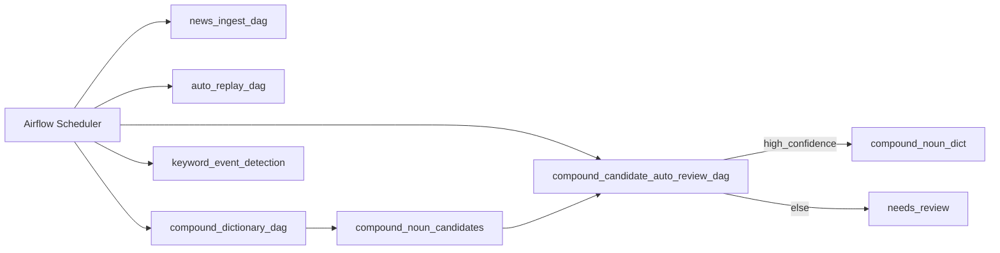
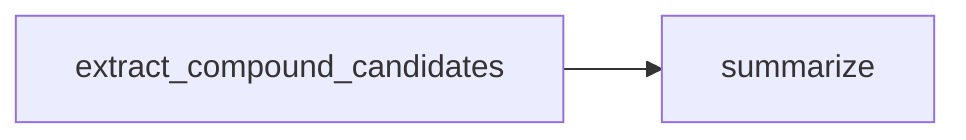
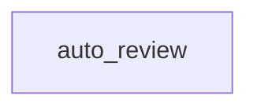

# STEP1: Airflow DAG 설계

## 1. 개요

Airflow의 역할:

- 뉴스 수집 작업 스케줄링
- 실패 메시지 재처리
- 복합명사 후보 추출 배치 실행
- 복합명사 후보 자동 평가 및 자동승인 배치 실행
- 키워드 이벤트 탐지 배치 실행

---

## 2. Airflow DAG 전체 구성



### DAG 목록

| DAG | 역할 | 주기 |
| --- | --- | --- |
| news_ingest_dag | 뉴스 수집 | 15분 |
| auto_replay_dag | dead letter 재처리 | 15분 |
| compound_dictionary_dag | 복합명사 후보 추출 | 1시간 |
| compound_candidate_auto_review_dag | 자동 평가 및 승인 | 6시간 |
| keyword_event_detection | 이벤트 탐지 | 15분 |

---

## 3. compound_dictionary_dag

목적:

- news_raw 기반 복합명사 후보 추출

구조:



특징:

- 자동승인 로직 없음
- 후보 생성만 수행

---

## 4. compound_candidate_auto_review_dag

목적:

- needs_review 후보 자동 평가
- evidence 저장
- high_confidence 자동승인

구조:



처리 흐름:

```text
needs_review 조회 (max 2000)
→ Naver API 호출
→ score 계산
→ auto_evidence 저장
→ decision 분기
→ high_confidence만 승인
```

---

## 5. 스케줄

| DAG | schedule |
| --- | --- |
| compound_dictionary_dag | 1시간 |
| compound_candidate_auto_review_dag | 6시간 |

---

## 6. 핵심 정책

- extract와 approve 분리
- 많이 평가하고 적게 승인
- approved 재검증 없음
- evidence 항상 저장
