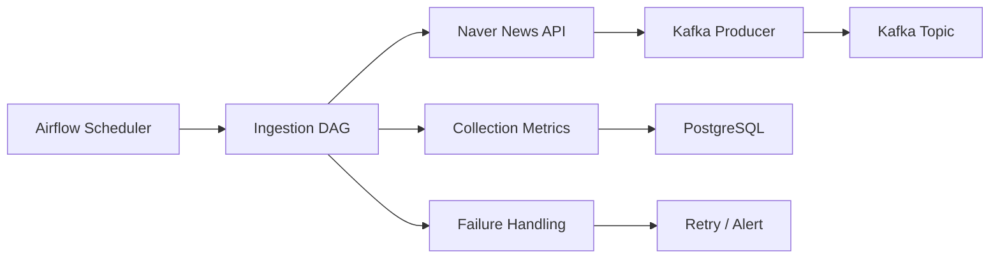
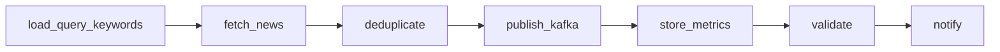

# STEP1: Airflow DAG 설계

## 1. 개요

본 문서는 뉴스 수집(Ingestion) 단계에서 Airflow DAG의 설계와 실행 구조를 정의한다.

Airflow의 역할:

- 수집 작업 스케줄링
- 파이프라인 실행 제어
- 실패 시 재시도 및 복구
- 수집 상태 기록 및 모니터링

---

## 2. 파이프라인 구성도



설명:

- Airflow가 DAG를 주기적으로 실행
- API 호출 결과를 Kafka로 전달
- 수집 결과를 DB에 기록
- 실패 시 재시도 또는 알림 수행

---

## 3. DAG 설계

### 3.1 목적

- 도메인별 뉴스 수집 수행
- Kafka 메시지 적재
- 수집 상태 저장

### 3.2 실행 단위

- execution unit: time window
- 파라미터: execution_date (ds)
- domain 단위 반복 처리

---

## 3.3 입력 / 출력

### 입력

- query_keywords (DB)
- execution_date (Airflow context)
- domain 목록

### 출력

- Kafka topic: news_topic
- PostgreSQL: collection_metrics

---

## 3.4 DAG 구조



### 태스크 설명

| Task | 설명 |
|------|------|
| load_query_keywords | DB에서 키워드 로딩 |
| fetch_news | API 호출 |
| deduplicate | 중복 제거 |
| publish_kafka | Kafka 전송 |
| store_metrics | 수집 결과 저장 |
| validate | 데이터 검증 |
| notify | 상태 알림 |

---

## 3.5 데이터 전달 방식

- Python 객체 (in-memory)
- Kafka 메시지
- PostgreSQL 저장
- Airflow XCom (최소 사용)

---

## 4. 스케줄

- schedule: */5 * * * *
- timezone: Asia/Seoul
- start_date: 2026-01-01
- catchup: false

설계 근거:

- near real-time 수집 요구
- API rate limit 고려
- 처리 지연과 균형

---

## 5. Retry / Failure Handling

### 재시도 정책

- retries: 2
- retry_delay: 2 minutes
- exponential_backoff: true

### 실패 유형

재시도 대상:

- 네트워크 오류
- API 요청 실패
- Kafka 전송 실패
- DB 연결 실패

재시도 제외:

- 데이터 파싱 오류
- 스키마 오류

처리 방식:

- 오류 레코드 제외
- 로그 기록
- 알림 전송

---

## 6. Idempotency

전략:

- URL 기반 중복 제거
- 동일 execution_date 재실행 시 중복 방지
- DB upsert 구조 사용

보장:

- 동일 ds 재실행 시 결과 일관성 유지

---

## 7. 코드 구조

DAG 파일:

- airflow/dags/news_ingestion_dag.py

예시 코드:

```python
from airflow import DAG
from airflow.operators.python import PythonOperator
from datetime import datetime, timedelta


def fetch_news(**context):
    pass


def publish_kafka(**context):
    pass


default_args = {
    "retries": 2,
    "retry_delay": timedelta(minutes=2),
}

with DAG(
    dag_id="news_ingestion",
    schedule_interval="*/5 * * * *",
    start_date=datetime(2026, 1, 1),
    catchup=False,
    default_args=default_args,
) as dag:

    t1 = PythonOperator(
        task_id="fetch_news",
        python_callable=fetch_news,
    )

    t2 = PythonOperator(
        task_id="publish_kafka",
        python_callable=publish_kafka,
    )

    t1 >> t2
```

---

## 8. 실행 환경

### docker-compose

```yaml
airflow:
  image: apache/airflow:2.9.0
  environment:
    AIRFLOW__CORE__EXECUTOR: LocalExecutor
  ports:
    - "8080:8080"
```

### requirements.txt

```text
apache-airflow
kafka-python
psycopg2
```

---

## 9. 실행 시나리오

### 정상 실행

- DAG 트리거
- 키워드 로딩
- API 호출
- Kafka 적재
- metrics 저장

### 실패 후 재시도

- API 실패 시 retry 수행
- retry 성공 시 정상 종료
- 지속 실패 시 알림 발생

### 재실행

- 동일 날짜(ds)로 실행
- 중복 제거 로직 적용
- 동일 결과 유지

---

## 10. 요약

Airflow DAG는 뉴스 수집의 시작 지점이며, Kafka 기반 파이프라인으로 데이터를 전달하는 orchestration 계층이다.
