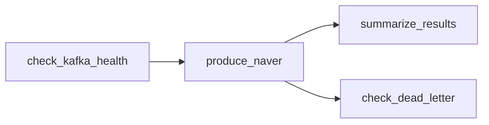

# STEP1: Airflow DAG 설계

## 1. 개요

본 문서는 뉴스 수집(Ingestion) 단계에서 Airflow DAG의 설계와 실행 구조를 정의한다.

Airflow의 역할:

- 뉴스 수집 작업 스케줄링
- Kafka 발행 전 사전 상태 확인
- 수집 producer 실행 제어
- 실패 시 재시도 및 dead letter 확인
- 수집 결과 요약 로그 기록

---

## 2. 파이프라인 구성도

```mermaid
flowchart LR
    S["Airflow Scheduler<br/>schedule: */15 * * * *<br/>catchup=false<br/>max_active_runs=1"] --> D["DAG: news_ingest_dag<br/>15분 단위 수집 cycle"]

    D --> H["Task: check_kafka_health<br/>실행 조건: DAG 시작<br/>검증: Kafka broker 연결 / topic 조회"]
    H -->|"Kafka 정상"| P["Task: produce_naver<br/>실행 조건: check_kafka_health 성공"]
    H -.->|"Kafka 비정상"| R["Airflow Retry<br/>retries=3<br/>5m → 10m → 20m"]

    P --> Q["query_keywords 조회<br/>provider/domain/query 단위"]
    Q --> N["Naver News API 호출"]
    N --> M["메시지 정규화<br/>schema_version 포함"]
    M --> V["Producer 내부 검증<br/>schema validation<br/>provider+domain+url dedup"]
    V -->|"정상 메시지"| K["Kafka Producer<br/>key=url<br/>acks=all<br/>enable_idempotence=true"]
    V -.->|"validation 실패 / publish 실패"| DL["dead_letter.jsonl"]

    K --> T["Kafka Topic: news_topic"]
    P --> CM["collection_metrics 저장<br/>request/success/article/duplicate/publish/error count"]
    CM --> DB1["PostgreSQL<br/>운영 지표"]

    P --> X["XCom: naver_count"]
    X --> SUM["Task: summarize_results<br/>발행 건수 요약"]
    P --> CDL["Task: check_dead_letter<br/>trigger_rule=all_done"]
    CDL --> DL

    T --> SP["Spark Structured Streaming<br/>상시 실행 / Kafka consume"]
    SP --> PP["전처리 / 키워드 추출<br/>복합명사 사전 + 불용어 적용"]
    PP --> STG["PostgreSQL Staging<br/>stg_news_raw<br/>stg_keywords<br/>stg_keyword_trends<br/>stg_keyword_relations"]
    STG --> UPS["Storage Upsert<br/>dedup / merge"]
    UPS --> DB2["PostgreSQL Analysis Tables<br/>news_raw<br/>keywords<br/>keyword_trends<br/>keyword_relations"]
```



설명:

- `news_ingest_dag`는 Airflow Scheduler에 의해 15분마다 실행된다.
- `catchup=false`이므로 과거 누락 구간을 자동으로 몰아서 실행하지 않는다.
- `max_active_runs=1`로 동시에 여러 수집 cycle이 실행되지 않게 한다.
- DAG는 먼저 `check_kafka_health`로 Kafka broker 연결과 topic 조회 가능 여부를 확인한다.
- Kafka가 정상일 때만 `produce_naver`가 실행된다.
- `produce_naver`는 `query_keywords`를 읽고 Naver News API를 호출한 뒤, schema validation과 `provider + domain + url` 중복 검증을 거쳐 Kafka `news_topic`에 발행한다.
- 발행 실패 또는 validation 실패 메시지는 `dead_letter.jsonl`에 기록한다.
- `summarize_results`는 XCom의 `naver_count`를 읽어 발행 건수를 요약한다.
- `check_dead_letter`는 `trigger_rule=all_done`이므로 producer 성공/실패와 관계없이 실행되어 dead letter 누적 상태를 확인한다.
- Spark Structured Streaming은 Airflow가 매번 실행하는 batch task가 아니라 상시 실행되는 consume/processing 계층이다.
- Spark는 Kafka `news_topic`을 읽어 전처리, 키워드 추출, window 집계를 수행하고 PostgreSQL staging table에 적재한다.
- Storage 계층은 staging 데이터를 dedup/upsert하여 최종 analysis table에 반영한다.

---

## 3. DAG 설계

### 3.1 목적

- Naver 뉴스 수집 producer 실행
- Kafka `news_topic`에 뉴스 메시지 발행
- 수집 결과를 `collection_metrics`에 기록
- Kafka 또는 발행 실패 상황을 조기에 감지

### 3.2 실행 단위

- DAG 실행 단위: 15분 주기 수집 cycle
- Producer 내부 처리 단위: provider + domain + query
- 현재 provider: `naver`

Airflow의 `ds`는 실행 context로 제공되지만, 현재 producer는 `ds`별 파티션 적재 방식이 아니라 실행 시각 기준의 incremental 수집 상태를 사용한다.

---

## 3.3 입력 / 출력

### 입력

- `query_keywords` 테이블의 활성 수집 키워드
- Naver News API credential
- producer state (`runtime/state/producer_state.json`)
- Kafka broker 상태

### 출력

- Kafka topic: `news_topic`
- PostgreSQL: `collection_metrics`
- producer state: `producer_state.json`
- 실패 메시지: `dead_letter.jsonl`
- Airflow XCom: `naver_count`

---

## 3.4 실제 DAG 구조

현재 구현 파일:

```text
airflow/dags/news_ingest_dag.py
```

실제 태스크 구조:



`check_dead_letter`는 `trigger_rule=all_done`으로 설정되어 있어 `produce_naver` 성공/실패와 관계없이 실행된다.

### 태스크 설명

| Task | 설명 | 실패 시 영향 |
|------|------|--------------|
| `check_kafka_health` | Kafka broker 연결과 topic 조회 가능 여부 확인 | 실패하면 `produce_naver` 실행 차단 |
| `produce_naver` | Naver API 수집, 메시지 정규화, 중복 제거, Kafka 발행, metrics 저장 | Airflow retry 대상 |
| `summarize_results` | XCom의 `naver_count`를 읽어 발행 결과 요약 | 요약 로그 실패만 해당 |
| `check_dead_letter` | `dead_letter.jsonl` 누적 건수 확인 및 임계치 초과 경고 | producer 실패 여부와 무관하게 실행 |

---

## 3.5 `validate`의 의미

현재 DAG에는 `validate`라는 별도 Airflow task가 없다.

문서상 `validate`는 다음 검증 행위들을 포괄하는 개념으로 해석한다.

### 1) 실행 전 검증

담당 task:

```text
check_kafka_health
```

검증 내용:

- Kafka broker 연결 가능 여부
- KafkaAdminClient로 topic list 조회 가능 여부

목적:

- Kafka가 비정상인 상태에서 API 수집을 진행하지 않도록 차단
- 불필요한 API 호출과 메시지 유실 위험 방지

### 2) 메시지 검증

담당 위치:

```text
src/ingestion/producer.py
build_message()
NormalizedNewsArticle
```

검증 내용:

- 수집 기사 payload가 표준 메시지 스키마로 변환 가능한지 확인
- 필수 필드 누락 또는 잘못된 값이 있으면 Kafka로 발행하지 않음

실패 처리:

- 해당 레코드는 `dead_letter.jsonl`에 기록
- producer 전체는 계속 진행

### 3) 중복 검증

담당 위치:

```text
NewsKafkaProducer.run_once()
```

검증 내용:

- `provider + domain + url` 기준으로 이미 발행한 기사인지 확인

실패 처리:

- 중복이면 Kafka에 발행하지 않고 skip
- query별 duplicate count를 `collection_metrics`에 기록

### 4) 실행 후 검증

담당 task:

```text
check_dead_letter
summarize_results
```

검증 내용:

- 발행 건수 확인
- dead letter 누적 건수 확인
- dead letter가 100건 이상이면 경고 로그 출력

목적:

- producer 실행은 성공했지만 일부 메시지가 실패한 경우를 확인
- replay 필요 여부를 판단

---

## 3.6 데이터 전달 방식

- XCom: `produce_naver` → `summarize_results` 발행 건수 전달
- Kafka: producer → Spark 처리 계층 메시지 전달
- PostgreSQL: 수집 지표 저장
- 파일: producer state와 dead letter 저장

---

## 4. 스케줄

실제 구현 기준:

- schedule: `*/15 * * * *`
- start_date: `2026-01-01`
- catchup: `false`
- max_active_runs: `1`

설계 근거:

- 15분 단위 near real-time 수집
- API 호출량과 처리 안정성 균형
- 동시 실행을 막아 중복 수집 위험 감소

---

## 5. Retry / Failure Handling

### 재시도 정책

실제 구현 기준:

- retries: 3
- retry_delay: 5 minutes
- retry_exponential_backoff: true
- max_retry_delay: 30 minutes

### 재시도 대상

- Kafka broker 일시 장애
- Naver API 일시 오류
- Kafka 발행 오류
- DB 연결 오류

### 재시도 제외 또는 격리 대상

- 개별 기사 schema validation 실패
- 개별 메시지 발행 실패
- 중복 기사

처리 방식:

- validation 실패 또는 발행 실패는 dead letter 기록
- 중복 기사는 skip
- producer cycle 전체 실패는 Airflow retry

---

## 6. Idempotency

전략:

- `max_active_runs=1`로 DAG 동시 실행 차단
- producer state에 최근 발행 URL 유지
- `provider + domain + url` 기준 중복 제거
- Kafka producer idempotence 활성화
- storage 단계에서 unique/upsert로 중복 방지

보장:

- 동일 기사가 재수집되어도 Kafka 발행과 DB 저장에서 중복 가능성을 줄인다.
- DAG 재시도 시 이미 발행된 URL은 producer state 기준으로 skip된다.

---

## 7. 코드 구조

DAG 파일:

```text
airflow/dags/news_ingest_dag.py
```

관련 구현:

```text
src/ingestion/producer.py
src/ingestion/api_client.py
src/core/config.py
src/storage/db.py
```

---

## 8. 실행 환경

필수 구성:

- Airflow scheduler / webserver
- Kafka broker
- PostgreSQL
- Naver API credential

주요 환경 변수:

```text
NAVER_CLIENT_ID
NAVER_CLIENT_SECRET
KAFKA_BOOTSTRAP_SERVERS
KAFKA_TOPIC
POSTGRES_HOST
POSTGRES_DB
POSTGRES_USER
POSTGRES_PASSWORD
STATE_DIR
```

---

## 9. 실행 시나리오

### 정상 실행

```text
check_kafka_health
→ produce_naver
→ summarize_results
→ check_dead_letter
→ Kafka news_topic
→ Spark Structured Streaming
→ PostgreSQL staging
→ PostgreSQL analysis tables
```

결과:

- Kafka `news_topic`에 메시지 발행
- `collection_metrics` 저장
- producer state 갱신
- Spark가 메시지를 consume해 처리 결과를 PostgreSQL에 저장

### Kafka 장애

```text
check_kafka_health 실패
→ produce_naver 실행 안 됨
→ Airflow retry
```

### 일부 메시지 실패

```text
produce_naver 내부에서 validation/publish 실패
→ dead_letter.jsonl 기록
→ 나머지 메시지 처리 계속
→ check_dead_letter에서 누적 건수 확인
```

### 재실행

```text
동일 실행 구간 재시도
→ producer state와 URL 중복 기준 적용
→ 이미 발행한 기사는 skip
→ storage upsert로 최종 테이블 중복 방지
```

---

## 10. 요약

현재 Airflow DAG의 핵심 구조는 `check_kafka_health → produce_naver → summarize_results / check_dead_letter`이다.

`news_ingest_dag`는 Kafka로 메시지를 발행하는 수집 entry point이며, 이후 Spark Structured Streaming과 PostgreSQL 저장 계층으로 이어지는 전체 파이프라인의 시작점이다.

`validate`는 별도 task가 아니라 Kafka 사전 검증, 메시지 schema 검증, 중복 검증, dead letter 사후 확인으로 나뉘어 구현되어 있다.
