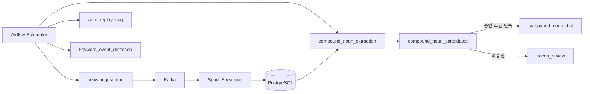
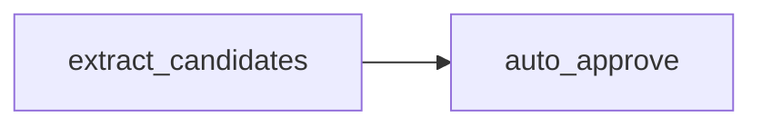

# STEP1: Airflow DAG 설계

## 1. 개요

본 문서는 프로젝트에서 사용하는 Airflow DAG 전체와, 그중 수집(Ingestion) DAG의 상세 실행 구조를 정의한다.

Airflow의 역할:

- 뉴스 수집 작업 스케줄링
- 실패 메시지 재처리
- 복합명사 후보 추출 및 자동승인 보조 배치 실행
- 키워드 이벤트 탐지 배치 실행

---

## 2. Airflow DAG 전체 구성

---

## 3. compound_noun_extraction DAG

목적:

- 복합명사 후보 추출
- 자동승인 보조 수행

구조:

특징:

- 후보 추출 + 자동승인 보조 통합 DAG
- 외부 API 호출은 streaming 경로에서 분리
- 자동승인 보조는 일부 후보만 승인

---

## 4. 핵심 포인트

- 자동승인은 완전 자동이 아니라 "보조" 역할
- 후보 생성과 승인 흐름이 하나의 DAG로 통합됨
- Spark 처리와 독립적으로 batch 실행

---

## 5. 스케줄

| DAG | 주기 |
|-----|------|
| news_ingest_dag | 15분 |
| auto_replay_dag | 15분 |
| compound_noun_extraction | 1시간 |
| keyword_event_detection | 15분 |

---

## 6. 요약

복합명사 처리 로직은 별도 DAG가 아닌 `compound_noun_extraction` DAG 내부에서

"후보 추출 → 자동승인 보조"

흐름으로 통합되어 실행된다.
