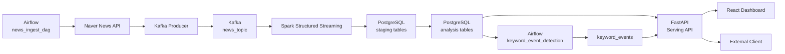
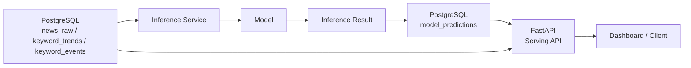

# Q5 Serving 설계

## 1. 파이프라인 구성도 업데이트

### 목적

기존 뉴스 트렌드 파이프라인에 API Serving 계층과 선택적 Inference 계층을 명확히 추가한다.

현재 파이프라인은 다음 흐름을 기준으로 동작한다.

```text
Airflow
-> Naver News API
-> Kafka
-> Spark Structured Streaming
-> PostgreSQL
-> FastAPI
-> Dashboard
```

Serving 단계에서는 저장소에 적재된 집계 데이터를 API가 읽어 Dashboard 또는 외부 클라이언트에 제공한다.

Inference를 구현하는 경우에는 저장소의 집계/기사 데이터를 모델 입력으로 사용하고, 추론 결과를 다시 저장소에 적재하거나 API 응답에 포함한다.

### 업데이트 대상

- Excalidraw 또는 Notion 구성도
- 기존 구성도에 아래 컴포넌트 추가
  - API Server
  - Inference Worker 또는 Model Service
  - API Consumer
    - Dashboard
    - 외부 클라이언트
    - 운영/관리 도구

### 업데이트된 데이터 흐름

#### 기본 Serving 흐름



#### Inference 포함 흐름



#### 데이터 흐름 요약

| 흐름 | 설명 |
| --- | --- |
| 저장소 → API | PostgreSQL에 저장된 기사, 키워드, 트렌드, 이벤트 데이터를 FastAPI가 조회해 응답한다. |
| 저장소 → 모델 → API | PostgreSQL 데이터를 모델 입력으로 사용하고, 추론 결과를 API에서 제공한다. |
| 저장소 → 모델 → 저장소 → API | 배치 inference 결과를 별도 테이블에 저장한 뒤 API가 조회한다. 운영 안정성과 응답 속도 측면에서 권장된다. |

---

## 2. API 서빙 설계

## 2.1 API 구조

### 프레임워크 선택

API 프레임워크는 **FastAPI**를 사용한다.

### 선택 이유

| 항목 | 이유 |
| --- | --- |
| 타입 기반 개발 | Pydantic 모델을 통해 요청/응답 스키마를 명확히 정의할 수 있다. |
| 자동 문서화 | OpenAPI/Swagger UI를 자동 제공하므로 API 명세 확인이 쉽다. |
| 비동기 처리 지원 | 추후 외부 API 호출, 캐시, 모델 서버 연동 시 async 기반 확장이 가능하다. |
| 현재 프로젝트와의 일관성 | 레포의 현재 서빙 계층이 FastAPI 기준으로 구성되어 있다. |
| Dashboard 연동 용이성 | React Dashboard가 HTTP JSON API를 호출하는 구조와 잘 맞는다. |

### 권장 디렉터리 구조

현재 레포 구조를 고려하면 API 코드는 `src/api` 아래에 두는 것이 적절하다.

```text
src/
├─ api/
│  ├─ main.py
│  ├─ routes/
│  │  ├─ health.py
│  │  ├─ stocks.py
│  │  ├─ trends.py
│  │  ├─ keywords.py
│  │  └─ inference.py
│  ├─ models/
│  │  ├─ stock.py
│  │  ├─ trend.py
│  │  └─ inference.py
│  └─ services/
│     ├─ stock_service.py
│     ├─ trend_service.py
│     └─ inference_service.py
├─ inference/
│  └─ model.py
└─ storage/
   └─ db.py
```

> 현재 프로젝트가 뉴스 트렌드 분석 프로젝트이므로 실제 구현에서는 `stocks` 대신 `keywords`, `trends`, `events`, `articles` 중심 endpoint가 더 자연스럽다.
> 다만 과제 예시가 `/stocks/{symbol}` 형태이므로 아래에는 주식 집계 API 예시와 뉴스 트렌드 프로젝트에 맞춘 대체 API를 함께 정리한다.

---

## 2.2 Endpoint 목록 및 역할

### 공통 Endpoint

| Method | Path | 역할 |
| --- | --- | --- |
| GET | `/health` | API 서버 상태 확인 |
| GET | `/api/v1/meta/filters` | Dashboard 필터 옵션 조회 |
| GET | `/api/v1/dashboard/overview-window` | Dashboard 주요 KPI 조회 |
| GET | `/api/v1/dashboard/system` | 시스템 상태 조회 |

### 주식 집계 API 예시

| Method | Path | 역할 |
| --- | --- | --- |
| GET | `/stocks/{symbol}` | 특정 종목의 최신 집계 데이터 조회 |
| GET | `/stocks/{symbol}/history` | 특정 종목의 과거 집계 데이터 조회 |
| GET | `/stocks` | 종목 목록 또는 검색 결과 조회 |

### 뉴스 트렌드 프로젝트 기준 API

| Method | Path | 역할 |
| --- | --- | --- |
| GET | `/api/v1/keywords/top` | 도메인별 상위 키워드 조회 |
| GET | `/api/v1/keywords/{keyword}/history` | 특정 키워드의 기간별 트렌드 조회 |
| GET | `/api/v1/events/rising` | 급상승 키워드 이벤트 조회 |
| GET | `/api/v1/relations/{keyword}` | 특정 키워드의 연관어 조회 |
| GET | `/api/v1/articles` | 기사 목록 조회 |
| GET | `/api/v1/inference/{keyword}` | 특정 키워드에 대한 추론 결과 조회 |

---

## 2.3 요청/응답 포맷

### GET `/stocks/{symbol}`

#### 설명

특정 종목의 최신 집계 데이터를 조회한다.

#### Path Parameter

| 이름 | 타입 | 필수 | 설명 |
| --- | --- | --- | --- |
| `symbol` | string | Y | 종목 심볼. 예: `AAPL` |

#### 응답 예시

```json
{
  "symbol": "AAPL",
  "avg_price": 151.32,
  "total_volume": 5000000,
  "window_start": "2026-01-08T10:00:00Z",
  "window_end": "2026-01-08T11:00:00Z"
}
```

#### 응답 필드

| 필드 | 타입 | 설명 |
| --- | --- | --- |
| `symbol` | string | 종목 심볼 |
| `avg_price` | number | 집계 구간 평균 가격 |
| `total_volume` | integer | 집계 구간 총 거래량 |
| `window_start` | datetime | 집계 시작 시각 |
| `window_end` | datetime | 집계 종료 시각 |

---

### GET `/stocks/{symbol}/history`

#### 설명

특정 종목의 과거 집계 데이터를 조회한다.

#### Path Parameter

| 이름 | 타입 | 필수 | 설명 |
| --- | --- | --- | --- |
| `symbol` | string | Y | 종목 심볼 |

#### Query Parameter

| 이름 | 타입 | 필수 | 설명 |
| --- | --- | --- | --- |
| `start_date` | date/datetime | Y | 조회 시작 시각 |
| `end_date` | date/datetime | Y | 조회 종료 시각 |

#### 요청 예시

```http
GET /stocks/AAPL/history?start_date=2026-01-08T00:00:00Z&end_date=2026-01-09T00:00:00Z
```

#### 응답 예시

```json
{
  "symbol": "AAPL",
  "items": [
    {
      "avg_price": 151.32,
      "total_volume": 5000000,
      "window_start": "2026-01-08T10:00:00Z",
      "window_end": "2026-01-08T11:00:00Z"
    },
    {
      "avg_price": 152.10,
      "total_volume": 4200000,
      "window_start": "2026-01-08T11:00:00Z",
      "window_end": "2026-01-08T12:00:00Z"
    }
  ]
}
```

---

## 2.4 뉴스 트렌드 프로젝트 기준 Endpoint 예시

### GET `/api/v1/keywords/{keyword}/history`

#### 설명

특정 키워드의 기간별 집계 추이를 조회한다.

#### Query Parameter

| 이름 | 타입 | 필수 | 설명 |
| --- | --- | --- | --- |
| `domain` | string | N | 뉴스 도메인 |
| `start_date` | datetime | Y | 조회 시작 시각 |
| `end_date` | datetime | Y | 조회 종료 시각 |
| `interval` | string | N | 집계 단위. 예: `hour`, `day` |

#### 응답 예시

```json
{
  "keyword": "AI",
  "domain": "tech",
  "items": [
    {
      "count": 125,
      "window_start": "2026-01-08T10:00:00Z",
      "window_end": "2026-01-08T11:00:00Z"
    }
  ]
}
```

### GET `/api/v1/events/rising`

#### 설명

급상승 키워드 이벤트를 조회한다.

#### 응답 예시

```json
{
  "items": [
    {
      "keyword": "반도체",
      "domain": "economy",
      "score": 8.7,
      "event_type": "spike",
      "detected_at": "2026-01-08T11:05:00Z"
    }
  ]
}
```

---

## 2.5 데이터 소스

### API가 읽는 데이터

API는 기본적으로 PostgreSQL의 분석 테이블을 조회한다.

| 데이터 | 저장 위치 | API 사용 방식 |
| --- | --- | --- |
| 원천 기사 | `news_raw` | 기사 목록, 키워드 상세 drill-down |
| 키워드 마스터/집계 | `keywords`, `keyword_trends` | 상위 키워드, 트렌드 차트 |
| 연관어 | `keyword_relations` | 키워드 네트워크, 관련 키워드 |
| 이벤트 탐지 결과 | `keyword_events` | 급상승 키워드, 이상 변화 탐지 |
| 운영 지표 | `collection_metrics` | 수집 상태, 운영 Dashboard |
| 사전/관리 데이터 | `compound_noun_dict`, `stopword_dict`, `query_keywords` | 관리자 API |

### 실시간 데이터 vs 배치 집계 데이터

| 구분 | 설명 | API 제공 방식 |
| --- | --- | --- |
| 실시간성 데이터 | Spark Structured Streaming이 Kafka 메시지를 처리해 PostgreSQL에 반영하는 최신 집계 | API는 DB의 최신 window 데이터를 조회 |
| 배치 집계 데이터 | Airflow 배치가 이벤트 탐지, 후보 추천, 운영 지표 계산을 수행한 결과 | API는 저장된 결과 테이블을 조회 |
| 추론 결과 | 모델 inference 결과 | 실시간 응답 또는 별도 테이블 저장 후 조회 |

### 권장 방식

API는 Kafka나 Spark에서 직접 데이터를 읽지 않고 PostgreSQL을 기준으로 조회한다.

이유:

- API 응답 구조를 안정적으로 유지할 수 있다.
- 장애 시 Kafka/Spark와 API 장애 범위를 분리할 수 있다.
- Dashboard에서 필요한 pagination, filtering, aggregation 처리가 단순해진다.
- 추후 Redis 캐시를 추가하기 쉽다.

---

## 3. 모델 Inference 연동

> 모델 inference는 선택 구현 항목이다.
> 현재 프로젝트에서는 키워드 이벤트 탐지와 후보 추천 로직이 이미 분석 계층 역할을 수행하므로, 별도 ML 모델이 필요한 경우에만 `src/inference` 또는 `src/analytics` 아래에 추가한다.

## 3.1 모델 선택

### 후보 모델

| 모델 | 용도 | 선택 이유 |
| --- | --- | --- |
| Rule-based scoring | 급상승 키워드 탐지 | 구현이 단순하고 결과 해석이 쉽다. |
| Statistical anomaly detection | 트렌드 이상 감지 | 과거 window 대비 변화량을 점수화하기 좋다. |
| Lightweight ML model | 키워드 중요도/카테고리 예측 | API 요청 시 빠르게 추론 가능하다. |
| Transformer 기반 NLP 모델 | 기사 분류, 감성 분석, 요약 | 정확도는 높지만 리소스 요구량이 크다. |

### 1차 권장안

초기 Serving 단계에서는 **Rule-based 또는 Statistical anomaly detection** 방식을 사용한다.

선택 이유:

- 현재 데이터 구조인 `keyword_trends`, `keyword_events`와 잘 맞는다.
- 모델 로딩 비용이 낮다.
- 결과 설명이 쉽다.
- API 응답 지연을 최소화할 수 있다.

---

## 3.2 입력/출력 형태

### 입력 예시

```json
{
  "keyword": "AI",
  "domain": "tech",
  "history": [
    {
      "count": 80,
      "window_start": "2026-01-08T09:00:00Z",
      "window_end": "2026-01-08T10:00:00Z"
    },
    {
      "count": 125,
      "window_start": "2026-01-08T10:00:00Z",
      "window_end": "2026-01-08T11:00:00Z"
    }
  ]
}
```

### 출력 예시

```json
{
  "keyword": "AI",
  "domain": "tech",
  "prediction": "rising",
  "score": 0.87,
  "reason": "최근 1시간 언급량이 이전 평균 대비 2.1배 증가했습니다.",
  "inferred_at": "2026-01-08T11:05:00Z"
}
```

---

## 3.3 연동 방식

### 실시간 inference

API 요청 시 모델을 호출해 즉시 결과를 반환한다.

| 장점 | 단점 |
| --- | --- |
| 항상 최신 데이터를 기준으로 추론 가능 | API 응답 시간이 길어질 수 있음 |
| 별도 결과 저장 테이블이 없어도 됨 | 트래픽 증가 시 모델 부하 증가 |

적합한 경우:

- 모델이 매우 가볍다.
- 요청량이 적다.
- 실시간성이 중요하다.

### 배치 inference

Airflow 또는 별도 worker가 주기적으로 inference를 수행하고 결과를 DB에 저장한다. API는 저장된 결과만 조회한다.

| 장점 | 단점 |
| --- | --- |
| API 응답이 빠르고 안정적 | 추론 주기만큼 지연 발생 |
| 모델 장애가 API 장애로 직접 전파되지 않음 | 결과 저장 테이블 관리 필요 |

적합한 경우:

- Dashboard 조회가 중심이다.
- 모델 계산 비용이 있다.
- 운영 안정성이 중요하다.

### 권장 방식

초기 구현에서는 **배치 inference**를 권장한다.

```text
PostgreSQL keyword_trends
-> Inference Batch
-> PostgreSQL model_predictions 또는 keyword_events
-> FastAPI
-> Dashboard
```

---

## 3.4 모델 로딩 방식

| 방식 | 설명 | 권장 여부 |
| --- | --- | --- |
| 시작 시 로드 | API 또는 inference worker 시작 시 모델을 메모리에 로드 | 권장 |
| 요청마다 로드 | 매 요청마다 모델 파일을 로드 | 비권장 |
| 외부 모델 서버 호출 | 별도 모델 서버에서 inference 수행 | 대규모 확장 시 고려 |

초기 구현에서는 inference worker 또는 API 서버 시작 시 모델을 한 번만 로드한다.

---

## 3.5 추론 결과 저장 위치

### 저장 테이블 예시

```sql
CREATE TABLE IF NOT EXISTS model_predictions (
    id BIGSERIAL PRIMARY KEY,
    target_type VARCHAR(50) NOT NULL,
    target_key VARCHAR(255) NOT NULL,
    domain VARCHAR(100),
    prediction VARCHAR(100) NOT NULL,
    score DOUBLE PRECISION,
    reason TEXT,
    input_window_start TIMESTAMPTZ,
    input_window_end TIMESTAMPTZ,
    inferred_at TIMESTAMPTZ NOT NULL DEFAULT NOW()
);
```

### 저장 정책

| 항목 | 정책 |
| --- | --- |
| 저장 단위 | keyword + domain + window |
| 보존 기간 | 운영 정책에 따라 30일 또는 90일 |
| 중복 처리 | `target_type`, `target_key`, `domain`, `input_window_start`, `input_window_end` 기준 upsert |
| API 조회 | 최신 `inferred_at` 기준 또는 window 기준 조회 |

---

## 4. 실행 가능한 코드 예시

## 4.1 `src/api/main.py`

```python
from fastapi import FastAPI

from api.routes import health, stocks, trends, inference

app = FastAPI(
    title="News Trend Serving API",
    version="1.0.0",
    description="News trend aggregation and inference serving API",
)

app.include_router(health.router)
app.include_router(stocks.router, prefix="/stocks", tags=["stocks"])
app.include_router(trends.router, prefix="/api/v1/trends", tags=["trends"])
app.include_router(inference.router, prefix="/api/v1/inference", tags=["inference"])
```

---

## 4.2 `src/api/routes/health.py`

```python
from fastapi import APIRouter

router = APIRouter()


@router.get("/health")
def health_check() -> dict:
    return {"status": "ok"}
```

---

## 4.3 `src/api/models/stock.py`

```python
from datetime import datetime
from pydantic import BaseModel


class StockAggregateResponse(BaseModel):
    symbol: str
    avg_price: float
    total_volume: int
    window_start: datetime
    window_end: datetime


class StockHistoryItem(BaseModel):
    avg_price: float
    total_volume: int
    window_start: datetime
    window_end: datetime


class StockHistoryResponse(BaseModel):
    symbol: str
    items: list[StockHistoryItem]
```

---

## 4.4 `src/api/routes/stocks.py`

```python
from datetime import datetime
from fastapi import APIRouter, Query

from api.models.stock import StockAggregateResponse, StockHistoryResponse, StockHistoryItem

router = APIRouter()


@router.get("/{symbol}", response_model=StockAggregateResponse)
def get_latest_stock_aggregate(symbol: str) -> StockAggregateResponse:
    # TODO: PostgreSQL에서 symbol 기준 최신 window 집계 조회
    return StockAggregateResponse(
        symbol=symbol.upper(),
        avg_price=151.32,
        total_volume=5000000,
        window_start=datetime.fromisoformat("2026-01-08T10:00:00+00:00"),
        window_end=datetime.fromisoformat("2026-01-08T11:00:00+00:00"),
    )


@router.get("/{symbol}/history", response_model=StockHistoryResponse)
def get_stock_history(
    symbol: str,
    start_date: datetime = Query(...),
    end_date: datetime = Query(...),
) -> StockHistoryResponse:
    # TODO: PostgreSQL에서 symbol, start_date, end_date 기준 과거 집계 조회
    return StockHistoryResponse(
        symbol=symbol.upper(),
        items=[
            StockHistoryItem(
                avg_price=151.32,
                total_volume=5000000,
                window_start=datetime.fromisoformat("2026-01-08T10:00:00+00:00"),
                window_end=datetime.fromisoformat("2026-01-08T11:00:00+00:00"),
            )
        ],
    )
```

---

## 4.5 `src/inference/model.py`

```python
from dataclasses import dataclass


@dataclass
class TrendInferenceInput:
    keyword: str
    domain: str
    current_count: int
    baseline_count: float


@dataclass
class TrendInferenceOutput:
    keyword: str
    domain: str
    prediction: str
    score: float
    reason: str


class TrendInferenceModel:
    def __init__(self, threshold: float = 1.5) -> None:
        self.threshold = threshold

    def predict(self, item: TrendInferenceInput) -> TrendInferenceOutput:
        if item.baseline_count <= 0:
            ratio = float("inf")
        else:
            ratio = item.current_count / item.baseline_count

        prediction = "rising" if ratio >= self.threshold else "normal"

        return TrendInferenceOutput(
            keyword=item.keyword,
            domain=item.domain,
            prediction=prediction,
            score=min(ratio / self.threshold, 1.0),
            reason=f"current_count={item.current_count}, baseline_count={item.baseline_count:.2f}, ratio={ratio:.2f}",
        )
```

---

## 4.6 `src/api/routes/inference.py`

```python
from fastapi import APIRouter

from inference.model import TrendInferenceInput, TrendInferenceModel

router = APIRouter()
model = TrendInferenceModel(threshold=1.5)


@router.get("/{keyword}")
def get_keyword_inference(keyword: str, domain: str = "all") -> dict:
    # TODO: PostgreSQL에서 keyword/domain 기준 최근 count와 baseline count 조회
    inference_input = TrendInferenceInput(
        keyword=keyword,
        domain=domain,
        current_count=125,
        baseline_count=80.0,
    )

    result = model.predict(inference_input)

    return {
        "keyword": result.keyword,
        "domain": result.domain,
        "prediction": result.prediction,
        "score": result.score,
        "reason": result.reason,
    }
```

---

## 4.7 `docker-compose.yml` API 서버 추가 예시

```yaml
services:
  api:
    build:
      context: .
      dockerfile: infra/api/Dockerfile.api
    container_name: news-trend-api
    environment:
      POSTGRES_HOST: postgres
      POSTGRES_PORT: 5432
      POSTGRES_DB: ${POSTGRES_DB}
      POSTGRES_USER: ${POSTGRES_USER}
      POSTGRES_PASSWORD: ${POSTGRES_PASSWORD}
    ports:
      - "8000:8000"
    depends_on:
      - postgres
    command: >
      uvicorn api.main:app
      --host 0.0.0.0
      --port 8000
      --reload
```

---

## 4.8 `requirements.txt` 의존성 예시

```txt
fastapi
uvicorn[standard]
pydantic
psycopg2-binary
SQLAlchemy
python-dotenv
```

선택적으로 inference 기능을 구현하는 경우:

```txt
scikit-learn
numpy
pandas
joblib
```

---

## 5. 구현 우선순위

| 우선순위 | 작업 | 설명 |
| --- | --- | --- |
| P0 | API 기본 서버 구성 | `src/api/main.py`, `/health` |
| P0 | DB 조회 서비스 구성 | PostgreSQL connection, repository/service layer |
| P1 | 주요 조회 API | 키워드, 트렌드, 이벤트, 기사 목록 |
| P1 | 응답 스키마 정리 | Pydantic response model |
| P2 | Docker Compose API 서비스 정리 | API 컨테이너 실행 |
| P2 | Inference batch 설계 | 필요 시 `src/inference` 또는 `src/analytics` 확장 |
| P3 | 캐시 적용 | Redis 등 선택 적용 |
| P3 | 인증/권한 | 관리자 API 분리 시 적용 |

---

## 6. 정리

Q5 Serving 단계의 핵심은 저장소에 적재된 분석 결과를 안정적으로 API로 제공하는 것이다.

기본 데이터 흐름은 다음과 같다.

```text
PostgreSQL
-> FastAPI
-> Dashboard / Client
```

Inference를 포함하는 경우 권장 흐름은 다음과 같다.

```text
PostgreSQL
-> Batch Inference
-> PostgreSQL
-> FastAPI
-> Dashboard / Client
```

초기 구현에서는 FastAPI + PostgreSQL 조회 API를 우선 완성하고, 모델 inference는 이벤트 탐지 또는 키워드 점수화 기능을 확장하는 방식으로 단계적으로 추가한다.
