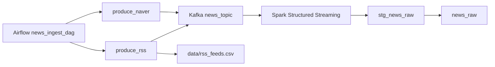

# RSS 수집 구조 변경 작업계획 및 결과

작성일: 2026-05-02

## 1. 목표

기존 Naver News API 키워드 수집 외에 언론사 RSS 피드를 추가 수집한다. RSS 피드는 언론사별, 섹션별 주소를 CSV로 관리하고, 각 RSS item을 기존 Kafka 메시지 스키마로 일반화해 downstream Spark 저장 경로를 재사용한다.

기존 데이터 백업 및 마이그레이션은 고려하지 않는다.

## 2. 대상 언론사

CSV 카탈로그 위치:

```text
data/rss_feeds.csv
```

수집 대상:

- 연합뉴스
- 조선일보
- 중앙일보
- 동아일보
- 한겨레
- 경향신문
- 매일경제
- 한국경제
- SBS 뉴스

제외:

- YTN: 사용자 요청에 따라 카탈로그에서 제거했다.

비활성:

- 중앙일보: 2026-05-02 확인 기준 기존 RSS 후보 URL이 XML 대신 서비스 종료 안내 HTML을 반환해 `is_active=false`로 보관했다. 정상 RSS URL이 확인되면 CSV의 URL과 `is_active`만 수정하면 된다.

## 3. 도메인 재구성

언론사 RSS 섹션을 기준으로 기존 4개 도메인을 더 세분화했다.

| domain_id | label | 용도 |
| --- | --- | --- |
| politics | 정치 | 정치, 외교, 안보, 행정 |
| economy | 경제 | 거시경제, 산업, 기업, 무역 |
| finance_realestate | 금융·부동산 | 증권, 금융, 부동산 |
| society | 사회 | 사건사고, 교육, 노동, 의료, 복지 |
| local | 지역 | 지역 뉴스 |
| international | 국제 | 국제, 해외, 북한 관련 국제 이슈 |
| tech_science | IT·과학 | IT, 과학, AI, 반도체, 바이오 |
| culture_life | 문화·생활 | 문화, 생활, 건강, 여행 |
| entertainment | 연예 | 방송, 영화, K팝, OTT |
| sports | 스포츠 | 스포츠 전반 |
| opinion | 오피니언 | 사설, 칼럼, 기고 |

도메인 그룹은 `domain_catalog`에 함께 저장한다.

| group_id | group_label | 포함 domain |
| --- | --- | --- |
| news_core | 주요뉴스 | politics, society, local |
| business | 경제·산업 | economy, finance_realestate |
| global | 국제 | international |
| tech | IT·과학 | tech_science |
| culture | 문화·생활 | culture_life, entertainment, sports |
| opinion | 오피니언 | opinion |

## 4. NAVER API 키워드 재구성

도메인별 `query_keywords` seed는 `src/core/domains.py`에 정의한다. Naver 수집은 기존과 동일하게 DB `query_keywords`를 읽으며, 기본 환경변수 `NAVER_THEME_KEYWORDS`도 넓은 뉴스 도메인에 맞춰 다음 대표 키워드로 변경했다.

```text
대통령,국회,경제,금리,코스피,사건사고,교육,미국,중국,AI,반도체,문화,연예,축구
```

## 5. 구현 결과

변경 파일:

- `data/rss_feeds.csv`: 언론사 RSS 카탈로그 추가
- `src/ingestion/api_client.py`: `RssNewsClient` 추가
- `src/ingestion/producer.py`: `rss` provider 등록 및 RSS feed 단위 증분 state 처리
- `airflow/dags/news_ingest_dag.py`: `produce_rss` task 추가
- `src/core/domains.py`: 도메인 및 NAVER seed keyword 재정의
- `src/core/config.py`: RSS 설정 추가, 프로젝트 루트 경로 보정
- `.env.example`: `NEWS_PROVIDERS=naver,rss` 및 RSS 설정 추가
- `docker-compose.yml`: Airflow 컨테이너에 RSS CSV 마운트 및 RSS 환경변수 추가, `app-postgres-init`에서 `models.sql` 실행
- `tests/unit/test_ingestion_rss_client.py`: RSS normalization 단위 테스트 추가

추가 정리:

- API, producer, Spark job에서 실행하던 `safe_initialize_database()` 호출을 제거했다.
- `models.sql` 실행과 기본 `domain_catalog/query_keywords` seed는 `app-postgres-init`에서만 수행한다.
- `query_keywords` seed는 기존 row를 먼저 UPDATE하고 없는 row만 INSERT하도록 구성해 `ON CONFLICT` 반복 실행에 따른 SERIAL sequence 소모를 줄였다.

## 6. 수집 흐름



RSS 수집 state는 기존 `producer_state.json`의 provider state를 재사용한다. key는 `publisher::domain::feed_name` 형식이다.

## 7. 검증

수행:

- 활성 RSS URL XML 응답 검증: `bad_count 0`
- Python compile 검증:

```text
python -m py_compile src\ingestion\api_client.py src\ingestion\producer.py src\core\config.py src\core\domains.py airflow\dags\news_ingest_dag.py tests\unit\test_ingestion_rss_client.py
```

제한:

- 현재 로컬 Python 환경에 `pytest`, `python-dotenv`가 설치되어 있지 않아 pytest 실행과 실제 client import smoke test는 수행하지 못했다.

## 8. 운영 방법

`.env`에서 다음처럼 설정한다.

```text
NEWS_PROVIDERS=naver,rss
RSS_FEED_CATALOG_PATH=./data/rss_feeds.csv
RSS_REQUEST_TIMEOUT_SECONDS=20
RSS_MAX_WORKERS=8
```

RSS 주소 변경은 코드 수정 없이 `data/rss_feeds.csv`에서 처리한다.

- `is_active=true`: 수집
- `is_active=false`: 보관만 하고 수집 제외
- `domain`: downstream `news_raw.domain`으로 적재
- `feed_name`: `news_raw.query` 및 Kafka metadata query로 전달
