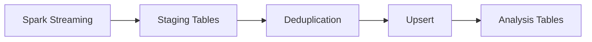

# STEP3: Storage 설계

## 1. 개요

본 문서는 Spark 처리 결과를 저장하는 Storage 계층의 설계를 정의한다.

Storage의 역할:

- 처리 결과 저장
- 중복 제거 및 upsert
- 분석용 테이블 제공

---

## 2. 파이프라인 구성도



---

## 3. 저장 방식

### 3.1 Staging

- append 방식 저장
- raw processing 결과 보관

### 3.2 Analysis

- upsert 기반 저장
- 최신 상태 유지

---

## 4. 테이블 구조

### Staging

- stg_news_raw
- stg_keywords
- stg_keyword_trends

### Analysis

- news_raw
- keywords
- keyword_trends
- keyword_relations

---

## 5. Upsert 전략

```text
- primary key 기반 merge
- 중복 데이터 제거
- 최신 데이터 유지
```

---

## 6. Idempotency

- 동일 데이터 재처리 시 결과 동일
- staging → analysis merge 구조

---

## 7. 인덱스

- keyword_trends(domain, window_start)
- keywords(keyword)

---

## 8. 파티셔닝

- window_start 기준
- 날짜 기반 분할

---

## 9. 요약

Storage는 staging → upsert → analysis 구조로 데이터 일관성과 조회 성능을 보장한다.
