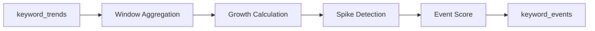

# STEP4: Analytics 설계

## 1. 개요

본 문서는 키워드 트렌드 기반 이벤트 분석(Analytics) 단계의 설계를 정의한다.

Analytics의 역할:

- 시간 기반 트렌드 분석
- 키워드 증가율 계산
- 급상승 이벤트 탐지

---

## 2. 파이프라인 구성도



---

## 3. 처리 방식

- batch 기반 처리
- Airflow DAG로 주기 실행

---

## 4. 데이터 흐름

### 입력

- keyword_trends

### 처리

- window grouping
- 이전 window 대비 변화량 계산
- spike 여부 판단

### 출력

- keyword_events

---

## 5. 핵심 로직

### 5.1 Growth 계산

```text
(current - previous) / previous
```

---

### 5.2 Spike 조건

```text
mentions >= threshold
and growth >= threshold
```

---

### 5.3 Score 계산

```text
growth + count 기반 계산
```

---

## 6. 데이터 예시

### 입력

```json
{
  "keyword": "AI",
  "count": 50,
  "window_start": "2026-01-08T10:00:00Z"
}
```

---

### 출력

```json
{
  "keyword": "AI",
  "growth": 0.5,
  "event_score": 80,
  "is_spike": true
}
```

---

## 7. 저장 구조

- keyword_events 테이블

---

## 8. Idempotency

- 동일 window 재처리 시 overwrite

---

## 9. 요약

Analytics 단계는 트렌드 데이터를 기반으로 이벤트를 생성하는 분석 계층이다.
